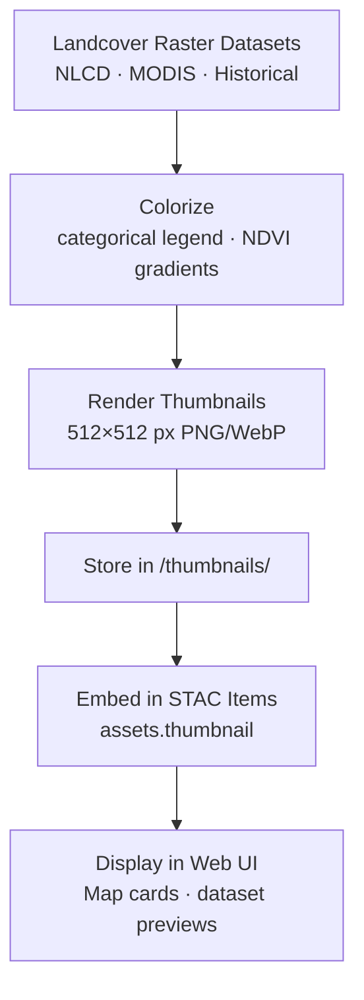

<div align="center">

# 🖼️ Kansas Frontier Matrix — Landcover Thumbnails  
`data/tiles/landcover/thumbnails/`

**Mission:** Store and document **thumbnail preview images** for all Kansas landcover datasets —  
including **NLCD**, **MODIS**, and **historical land-use reconstructions** — providing fast,  
visual overviews for documentation, STAC integration, and AI-driven data exploration within  
the **Kansas Frontier Matrix (KFM)**.

[](../../../../../.github/workflows/site.yml)
[](../../../../../.github/workflows/stac-validate.yml)
[](../../../../../.github/workflows/codeql.yml)
[](../../../../../.github/workflows/trivy.yml)
[](../../../../../docs/)
[](../../../../../LICENSE)

</div>

---

## 📚 Overview

This directory contains **thumbnail images (PNG & WebP)** summarizing Kansas landcover datasets stored in  
`data/tiles/landcover/`.  
Each image provides a small-scale visual summary used across the KFM ecosystem — in the **STAC catalog**,  
**web viewer**, and **metadata documentation** — to represent vegetation and land-use characteristics visually.

**Purpose:**
- Enable quick visual previews of landcover rasters  
- Embed images in STAC metadata (`assets.thumbnail`)  
- Facilitate AI-based visual QA and feature detection  
- Support environmental storytelling in Kansas ecological history  

---

## 📂 Directory Layout

```bash
data/
└── tiles/
    └── landcover/
        └── thumbnails/
            ├── nlcd_2021_ks_preview.png
            ├── modis_vegcover_2020_preview.png
            ├── landuse_historical_1900_ks_preview.png
            ├── nlcd_2021_ks_preview.webp
            ├── modis_vegcover_2020_preview.webp
            └── landuse_historical_1900_ks_preview.webp
````

---

## ⚙️ Thumbnail Generation Workflow



**Example Command:**

```bash
gdal_translate -of PNG -outsize 512 512 \
  data/tiles/landcover/nlcd_2021_ks_30m.tif \
  data/tiles/landcover/thumbnails/nlcd_2021_ks_preview.png
```

---

## 🎨 Visualization Standards

| Dataset             | Color Scheme                | Format     | Resolution | Description                               |
| ------------------- | --------------------------- | ---------- | ---------- | ----------------------------------------- |
| **NLCD 2021**       | Categorical (NLCD legend)   | PNG / WebP | 512×512    | Contemporary landcover classification     |
| **MODIS 2020**      | NDVI gradient (green–brown) | PNG / WebP | 512×512    | Vegetation fractional cover visualization |
| **Historical 1900** | Sepia tones or pale greens  | PNG / WebP | 512×512    | Reconstructed early-20th-century land use |

**Design Notes:**

* Consistent 512×512 px output size
* Background: transparent or white
* Projection: EPSG:4326
* Generated automatically via ETL (`make thumbnails-landcover`)

---

## 🧩 Integration with STAC Metadata

Each thumbnail is linked in the dataset’s **STAC Item JSON** via the `assets.thumbnail` field:

```json
"assets": {
  "thumbnail": {
    "href": "data/tiles/landcover/thumbnails/nlcd_2021_ks_preview.png",
    "type": "image/png",
    "roles": ["thumbnail"],
    "title": "Landcover 2021 (NLCD) Thumbnail"
  }
}
```

This connection provides a **visual anchor** for catalog discovery,
map previews, and AI visualization pipelines.

---

## 🧠 AI & Analytical Context

Landcover thumbnails support:

* **AI validation** of STAC-labeled imagery
* **Computer vision training** for land-use classification
* **Change detection visualization** for temporal sequences
* **Ecological storytelling tools** for map-based data narratives

| Node Type          | Relation        | Linked Entity    |
| ------------------ | --------------- | ---------------- |
| `LandcoverDataset` | `HAS_THUMBNAIL` | `ThumbnailAsset` |
| `ThumbnailAsset`   | `REPRESENTS`    | `RasterLayer`    |
| `LandcoverDataset` | `LINKED_TO`     | `STAC Item`      |

---

## 🧮 Version & Provenance

| Field              | Value                                                               |
| ------------------ | ------------------------------------------------------------------- |
| **Version**        | `v1.0.0`                                                            |
| **Last Updated**   | 2025-10-12                                                          |
| **Maintainer**     | `@bartytime4life`                                                   |
| **Parent Dataset** | `data/tiles/landcover/`                                             |
| **License**        | CC-BY 4.0                                                           |
| **Thumbnail Size** | 512×512 px                                                          |
| **MCP Compliance** | ✅ Documentation · ✅ Provenance · ✅ STAC Linked · ✅ Visual Validated |

---

## 🪵 Changelog

| Date       | Version | Change                                                              | Author          | PR/Issue |
| ---------- | ------- | ------------------------------------------------------------------- | --------------- | -------- |
| 2025-10-12 | v1.0.0  | Initial creation of landcover thumbnail directory and visual assets | @bartytime4life | #261     |

---

## ✅ Validation Checklist

* [x] Thumbnails generated for each landcover dataset
* [x] Linked in STAC metadata (`assets.thumbnail`)
* [x] Resolution ≤ 512×512 px
* [x] Style consistent across datasets
* [x] README includes badges, changelog, and closed Mermaid diagram

---

## 🔗 Related Directories

| Path                                                         | Description                               |
| ------------------------------------------------------------ | ----------------------------------------- |
| [`../`](../)                                                 | Main landcover raster datasets            |
| [`../metadata/`](../metadata/)                               | Dataset metadata (JSON)                   |
| [`../checksums/`](../checksums/)                             | File integrity manifests                  |
| [`../../climate/`](../../climate/)                           | Climate–landcover correlation datasets    |
| [`../../../../stac/landcover/`](../../../../stac/landcover/) | STAC catalog entries for landcover layers |

---

<div align="center">

**Kansas Frontier Matrix — Environmental Systems Division**
🌾 *“From prairie to patchwork — landcover visualized, validated, and preserved.”*

</div>
```

