<div align="center">

# 📊 Kansas Frontier Matrix — Tabular Tiles  
`data/tiles/tabular/`

**Mission:** Store and document **gridded and tabular spatial data products** that integrate  
non-rasterized, structured datasets — such as **statistical summaries**, **demographics**,  
**agricultural yields**, **environmental indices**, and **historical census-derived metrics** —  
for analytical visualization and knowledge-graph linkage within the  
**Kansas Frontier Matrix (KFM)** data infrastructure.

[](../../../.github/workflows/site.yml)
[](../../../.github/workflows/stac-validate.yml)
[](../../../.github/workflows/codeql.yml)
[](../../../.github/workflows/trivy.yml)
[](../../../docs/)
[](../../../LICENSE)

</div>

---

## 📚 Overview

The `data/tiles/tabular/` directory hosts **gridded tabular datasets** and **statistical summaries**  
produced from processed spatial analyses, historical research tables, and environmental data aggregations.  
These files serve as **bridges between rasterized spatial products and structured analytical data**,  
enabling seamless integration into KFM’s graph database and visualization stack.

**Examples:**
- County-level agricultural production (1860–2020)  
- Population change and density by census tract  
- Climate summary tables (temperature, drought index, precipitation)  
- Derived indicators from remote-sensing or model outputs  

---

## 📂 Directory Layout

```bash
data/
└── tiles/
    └── tabular/
        ├── kansas_population_1900_2020.parquet
        ├── kansas_agriculture_yields_1950_2020.csv
        ├── kansas_drought_index_1895_2024.parquet
        ├── checksums/
        │   ├── kansas_population_1900_2020.parquet.sha256
        │   ├── kansas_agriculture_yields_1950_2020.csv.sha256
        │   └── kansas_drought_index_1895_2024.parquet.sha256
        ├── metadata/
        │   ├── kansas_population_1900_2020.json
        │   ├── kansas_agriculture_yields_1950_2020.json
        │   └── kansas_drought_index_1895_2024.json
        ├── thumbnails/
        │   ├── kansas_population_trends_preview.png
        │   ├── kansas_drought_index_preview.png
        │   └── kansas_agriculture_yields_preview.png
        └── README.md
````

---

## ⚙️ Data Processing Workflow

```mermaid
flowchart TD
  A["Raw Tabular Data<br/>Census · NOAA · USDA · Historical Archives"] --> B["Normalization<br/>cleaning · standardization · geocoding"]
  B --> C["Join with Spatial Index<br/>county · tract · watershed keys"]
  C --> D["Generate Tiles<br/>Parquet · CSV · GeoParquet"]
  D --> E["Metadata + Checksums<br/>MCP schema & SHA256 validation"]
  E --> F["STAC Registration<br/>data/stac/tabular/"]
%%END OF MERMAID%%
```



**Command Example:**

```bash
python scripts/etl/tabular_to_parquet.py --input raw/kansas_agriculture_1950_2020.csv \
  --output data/tiles/tabular/kansas_agriculture_yields_1950_2020.parquet
```

---

## 🧩 Dataset Descriptions

| Dataset                                   | Type    | Source    | Units        | Time Span | Description                                                  |
| ----------------------------------------- | ------- | --------- | ------------ | --------- | ------------------------------------------------------------ |
| `kansas_population_1900_2020.parquet`     | Parquet | US Census | Persons      | 1900–2020 | Population and density by county and census year             |
| `kansas_agriculture_yields_1950_2020.csv` | CSV     | USDA NASS | Bushels/Acre | 1950–2020 | Crop yields (corn, wheat, sorghum) by county                 |
| `kansas_drought_index_1895_2024.parquet`  | Parquet | NOAA NCEI | PDSI         | 1895–2024 | Historical Palmer Drought Severity Index for Kansas counties |

---

## 🧠 Integration & Analytical Context

Tabular tiles provide structured, analysis-ready inputs for:

* **AI/ML pipelines**: temporal forecasting, correlation with landcover & climate datasets
* **Statistical dashboards**: temporal trends of population, agriculture, drought severity
* **Knowledge Graph ingestion**: linking quantitative data to spatial entities (`Place`, `Event`, `Dataset`)
* **Interactive map pop-ups**: aggregated metrics for dynamic visualization

**Knowledge Graph Relations:**

| Node              | Relationship   | Connected Entity |
| ----------------- | -------------- | ---------------- |
| `TabularDataset`  | `AGGREGATES`   | `RasterDataset`  |
| `TabularDataset`  | `LINKED_TO`    | `STAC Item`      |
| `StatisticRecord` | `BELONGS_TO`   | `Place:County`   |
| `Dataset`         | `HAS_CHECKSUM` | `SHA256 Hash`    |

---

## 🧮 Version & Provenance

| Field                       | Value                                                               |
| --------------------------- | ------------------------------------------------------------------- |
| **Version**                 | `v1.0.0`                                                            |
| **Last Updated**            | 2025-10-12                                                          |
| **Maintainer**              | `@bartytime4life`                                                   |
| **Primary Sources**         | US Census, NOAA NCEI, USDA NASS, Kansas Historical Society          |
| **Formats**                 | CSV · Parquet · GeoParquet                                          |
| **Projection (if spatial)** | EPSG:4326 (WGS84)                                                   |
| **License**                 | CC-BY 4.0                                                           |
| **MCP Compliance**          | ✅ Documentation · ✅ Provenance · ✅ STAC Linked · ✅ Schema Validated |

---

## 🪵 Changelog

| Date       | Version | Change                                                                  | Author          | PR/Issue |
| ---------- | ------- | ----------------------------------------------------------------------- | --------------- | -------- |
| 2025-10-12 | v1.0.0  | Initial creation of tabular tiles directory with metadata and structure | @bartytime4life | #262     |

---

## ✅ Validation Checklist

* [x] All tabular datasets validated for schema compliance
* [x] STAC metadata and checksums linked
* [x] Tabular schema conforms to MCP format (id, time, location, value, units)
* [x] Checksums computed for every dataset
* [x] README includes badges, changelog, and closed Mermaid diagram

---

## 🔗 Related Directories

| Path                                                   | Description                                 |
| ------------------------------------------------------ | ------------------------------------------- |
| [`../climate/`](../climate/)                           | Gridded climate and atmospheric data        |
| [`../hydrology/`](../hydrology/)                       | Surface and groundwater datasets            |
| [`../landcover/`](../landcover/)                       | Landcover and land-use layers               |
| [`../../processed/tabular/`](../../processed/tabular/) | Cleaned and validated tabular data products |
| [`../../../stac/tabular/`](../../../stac/tabular/)     | STAC catalog entries for tabular datasets   |

---

## 🧭 Example Metadata Snippet

```json
{
  "id": "kansas_population_1900_2020",
  "type": "table",
  "description": "Kansas population and density by county and year (1900–2020)",
  "source": ["US Census Bureau"],
  "projection": "EPSG:4326",
  "spatial_extent": [-102.05, 36.99, -94.58, 40.00],
  "temporal_extent": ["1900-01-01", "2020-12-31"],
  "checksum": "1fa8b9a7a62f4a5f44df3429df27cf72eaa2a66b57f054f7b83c8935c705b29b",
  "stac_link": "../../../stac/tabular/kansas_population_1900_2020.json",
  "license": "CC-BY 4.0",
  "mcp_version": "1.0"
}
```

---

<div align="center">

**Kansas Frontier Matrix — Statistical & Historical Division**
📜 *“Every number tells a story — Kansas quantified, verified, and preserved.”*

</div>
```

