<div align="center">

# 🔐 Kansas Frontier Matrix — Tabular Checksums  
`data/tiles/tabular/checksums/`

**Mission:** Maintain **SHA-256 checksum manifests** verifying the integrity, authenticity,  
and reproducibility of all **tabular datasets** — including population, agriculture, climate indices,  
and historical records — ensuring trustworthy, reproducible data pipelines within the  
**Kansas Frontier Matrix (KFM)** system.

[](../../../../../.github/workflows/site.yml)
[](../../../../../.github/workflows/stac-validate.yml)
[](../../../../../.github/workflows/codeql.yml)
[](../../../../../.github/workflows/trivy.yml)
[](../../../../../docs/)
[](../../../../../LICENSE)

</div>

---

## 📚 Overview

This directory contains **checksum (`.sha256`) files** for every tabular dataset in  
`data/tiles/tabular/`.  
Each checksum ensures **data fidelity** across the full KFM workflow — from ingestion and cleaning  
to analytical use and STAC registration — enabling **verifiable provenance** under the  
**Master Coder Protocol (MCP)**.

**Purpose:**
- Guarantee reproducibility across historical and modern statistical datasets  
- Verify file integrity across CI/CD pipelines and external collaborators  
- Provide cryptographic linkage between tabular data and STAC items  
- Enable AI-based data version control and drift detection  

---

## 📂 Directory Layout

```bash
data/
└── tiles/
    └── tabular/
        └── checksums/
            ├── kansas_population_1900_2020.parquet.sha256
            ├── kansas_agriculture_yields_1950_2020.csv.sha256
            ├── kansas_drought_index_1895_2024.parquet.sha256
            └── README.md
````

---

## ⚙️ Workflow — Checksum Generation & Validation

```mermaid
flowchart TD
  A["Tabular Datasets<br/>CSV · Parquet · GeoParquet"] --> B["Compute Checksums<br/>sha256sum utility"]
  B --> C["Store in /checksums/<file>.sha256"]
  C --> D["Embed in STAC Items<br/>checksum:sha256 field"]
  D --> E["Automated Validation<br/>make verify-tabular"]
%%END OF MERMAID%%
```



**Generate Checksums:**

```bash
sha256sum data/tiles/tabular/kansas_population_1900_2020.parquet \
  > data/tiles/tabular/checksums/kansas_population_1900_2020.parquet.sha256
```

**Verify Checksums:**

```bash
sha256sum --check data/tiles/tabular/checksums/kansas_population_1900_2020.parquet.sha256
```

---

## 🧾 Checksum File Format

Each file contains a single line:

```
<hash>  <filename>
```

**Example:**

```
1fa8b9a7a62f4a5f44df3429df27cf72eaa2a66b57f054f7b83c8935c705b29b  kansas_population_1900_2020.parquet
```

---

## 🧩 Integration with STAC Metadata

Checksums are embedded within **STAC Item JSON** files to provide verifiable,
cryptographic linkage between data assets and their metadata.

```json
"assets": {
  "data": {
    "href": "data/tiles/tabular/kansas_population_1900_2020.parquet",
    "type": "application/x-parquet",
    "roles": ["data"],
    "checksum:sha256": "1fa8b9a7a62f4a5f44df3429df27cf72eaa2a66b57f054f7b83c8935c705b29b"
  }
}
```

This ensures alignment between:

* Local file integrity
* Remote STAC catalog validation
* AI knowledge graph provenance chains

---

## 🧠 Analytical & AI Context

Checksum validation enables:

* Automated **data provenance verification** in reproducible workflows
* **AI auditing** of statistical datasets for tampering or inconsistency
* Historical dataset versioning and change detection
* Integrity assurance for **cross-domain joins** (hydrology, landcover, demography, climate)

| Node Type        | Relation       | Connected Entity |
| ---------------- | -------------- | ---------------- |
| `TabularDataset` | `HAS_CHECKSUM` | `SHA256 Hash`    |
| `Checksum`       | `VERIFIES`     | `DataAsset`      |
| `TabularDataset` | `LINKED_TO`    | `STAC Item`      |

---

## 🧮 Version & Provenance

| Field              | Value                                                              |
| ------------------ | ------------------------------------------------------------------ |
| **Version**        | `v1.0.0`                                                           |
| **Last Updated**   | 2025-10-12                                                         |
| **Maintainer**     | `@bartytime4life`                                                  |
| **Algorithm**      | SHA-256                                                            |
| **Scope**          | Tabular statistical datasets                                       |
| **License**        | CC-BY 4.0                                                          |
| **MCP Compliance** | ✅ Provenance · ✅ Validation · ✅ STAC Linked · ✅ Integrity Verified |

---

## 🪵 Changelog

| Date       | Version | Change                                                  | Author          | PR/Issue |
| ---------- | ------- | ------------------------------------------------------- | --------------- | -------- |
| 2025-10-12 | v1.0.0  | Initial creation of tabular checksum manifest directory | @bartytime4life | #263     |

---

## ✅ Validation Checklist

* [x] `.sha256` files generated for all tabular datasets
* [x] SHA-256 values match source files
* [x] `checksum:sha256` fields embedded in STAC items
* [x] Validation included in CI pipeline (`make verify-tabular`)
* [x] README includes badges, changelog, and closed Mermaid diagram

---

## 🔗 Related Directories

| Path                                                     | Description                                   |
| -------------------------------------------------------- | --------------------------------------------- |
| [`../`](../)                                             | Main tabular datasets                         |
| [`../metadata/`](../metadata/)                           | Metadata JSON for tabular datasets            |
| [`../thumbnails/`](../thumbnails/)                       | Chart thumbnails for tabular visual summaries |
| [`../../climate/`](../../climate/)                       | Climate dataset integrations                  |
| [`../../../../stac/tabular/`](../../../../stac/tabular/) | STAC catalog for tabular assets               |

---

<div align="center">

**Kansas Frontier Matrix — Statistical & Historical Division**
📈 *“Integrity across centuries — Kansas by the numbers, cryptographically secured.”*

</div>
```

