<div align="center">

# 🧾 Kansas Frontier Matrix — Tabular Metadata  
`data/tiles/tabular/metadata/`

**Mission:** Curate and validate **metadata records** describing Kansas tabular datasets —  
including population, agriculture, climate indices, and economic indicators — ensuring  
scientific transparency, reproducibility, and STAC interoperability under the  
**Master Coder Protocol (MCP)** within the **Kansas Frontier Matrix (KFM)** data architecture.

[](../../../../../.github/workflows/site.yml)
[](../../../../../.github/workflows/stac-validate.yml)
[](../../../../../.github/workflows/codeql.yml)
[](../../../../../.github/workflows/trivy.yml)
[](../../../../../docs/)
[](../../../../../LICENSE)

</div>

---

## 📚 Overview

This directory contains **metadata JSON files** describing each tabular dataset under  
`data/tiles/tabular/`.  
Each metadata record conforms to the **MCP–STAC hybrid schema**, documenting  
dataset provenance, schema structure, validation, and STAC integration parameters.

Tabular metadata connects **structured numerical data** (population, yields, drought indices, etc.)  
to Kansas’s environmental, social, and historical knowledge systems, bridging data tables  
with spatial, temporal, and semantic layers in KFM.

---

## 📂 Directory Layout

```bash
data/
└── tiles/
    └── tabular/
        └── metadata/
            ├── kansas_population_1900_2020.json
            ├── kansas_agriculture_yields_1950_2020.json
            ├── kansas_drought_index_1895_2024.json
            └── README.md
````

---

## ⚙️ Metadata Workflow

```mermaid
flowchart TD
  A["Raw Tabular Data<br/>Census · USDA · NOAA"] --> B["ETL & Normalization<br/>schema unification · time alignment"]
  B --> C["Metadata Extraction<br/>provenance · variables · units"]
  C --> D["Schema Validation<br/>tabular_metadata.schema.json"]
  D --> E["STAC Registration<br/>data/stac/tabular/"]
%%END OF MERMAID%%
```



**Command Example:**

```bash
make metadata-tabular
# Auto-generates metadata JSON files for tabular datasets and validates schema
```

---

## 🧩 Metadata Schema (Key Fields)

| Field             | Description               | Example                                                                                    |
| ----------------- | ------------------------- | ------------------------------------------------------------------------------------------ |
| `id`              | Unique dataset identifier | `"kansas_population_1900_2020"`                                                            |
| `type`            | Dataset type              | `"table"`                                                                                  |
| `description`     | Summary of dataset        | `"Kansas population and density by county, 1900–2020"`                                     |
| `source`          | Primary data origin       | `["US Census Bureau", "Kansas State Archives"]`                                            |
| `variables`       | Column definitions        | `[{"name": "population", "units": "people"}, {"name": "density", "units": "per_sq_mile"}]` |
| `projection`      | CRS (if spatial)          | `"EPSG:4326"`                                                                              |
| `spatial_extent`  | Bounding box              | `[-102.05, 36.99, -94.58, 40.00]`                                                          |
| `temporal_extent` | Time coverage             | `["1900-01-01", "2020-12-31"]`                                                             |
| `checksum`        | SHA-256 integrity hash    | `"1fa8b9a7a62f4a5f44df3429df27cf72eaa2a66b57f054f7b83c8935c705b29b"`                       |
| `stac_link`       | Path to STAC item         | `"../../../../../stac/tabular/kansas_population_1900_2020.json"`                           |
| `license`         | Data license              | `"CC-BY 4.0"`                                                                              |
| `created`         | Creation date             | `"2025-10-12"`                                                                             |
| `mcp_version`     | MCP schema version        | `"1.0"`                                                                                    |

---

## 🧠 Integration & Knowledge Graph Context

Tabular metadata is mapped into the **KFM Knowledge Graph** as
structured entities enabling semantic queries, statistical linking,
and temporal analyses across datasets.

| Graph Node       | Relationship      | Connected Entity                            |
| ---------------- | ----------------- | ------------------------------------------- |
| `TabularDataset` | `BELONGS_TO`      | `Domain:Demography` or `Domain:Agriculture` |
| `TabularDataset` | `LINKED_TO`       | `STAC Item`                                 |
| `TabularDataset` | `HAS_VARIABLE`    | `Statistic:Value`                           |
| `TabularDataset` | `HAS_CHECKSUM`    | `SHA256 Hash`                               |
| `TabularDataset` | `ASSOCIATED_WITH` | `Place:County` or `Watershed`               |

**AI & Analytical Applications:**

* Longitudinal trend analysis (population, agriculture, drought)
* Spatiotemporal correlation with hydrology and landcover
* Training data for predictive environmental–economic models
* Dynamic visualization in map-based dashboards

---

## 🧮 Version & Provenance

| Field              | Value                                                        |
| ------------------ | ------------------------------------------------------------ |
| **Version**        | `v1.0.0`                                                     |
| **Last Updated**   | 2025-10-12                                                   |
| **Maintainer**     | `@bartytime4life`                                            |
| **Schema**         | `tabular_metadata.schema.json`                               |
| **License**        | CC-BY 4.0                                                    |
| **MCP Compliance** | ✅ Documentation · ✅ Provenance · ✅ STAC Linked · ✅ Validated |

---

## 🪵 Changelog

| Date       | Version | Change                                         | Author          | PR/Issue |
| ---------- | ------- | ---------------------------------------------- | --------------- | -------- |
| 2025-10-12 | v1.0.0  | Initial creation of tabular metadata directory | @bartytime4life | #264     |

---

## ✅ Validation Checklist

* [x] JSON validated against `tabular_metadata.schema.json`
* [x] Provenance and variable fields complete
* [x] STAC links consistent with `/data/stac/tabular/`
* [x] CRS and temporal extents validated
* [x] README includes badges, changelog, and closed Mermaid diagram

---

## 🔗 Related Directories

| Path                                                     | Description                                 |
| -------------------------------------------------------- | ------------------------------------------- |
| [`../`](../)                                             | Main tabular datasets (CSV, Parquet)        |
| [`../checksums/`](../checksums/)                         | File integrity verification manifests       |
| [`../thumbnails/`](../thumbnails/)                       | Visual chart previews of tabular data       |
| [`../../climate/`](../../climate/)                       | Climate datasets linked to tabular analyses |
| [`../../../../stac/tabular/`](../../../../stac/tabular/) | STAC catalog for tabular datasets           |

---

## 🧭 Example Metadata Record

```json
{
  "id": "kansas_agriculture_yields_1950_2020",
  "type": "table",
  "description": "Agricultural crop yields for Kansas counties (corn, wheat, sorghum), 1950–2020.",
  "source": ["USDA NASS"],
  "variables": [
    {"name": "corn_yield", "units": "bushels_per_acre"},
    {"name": "wheat_yield", "units": "bushels_per_acre"},
    {"name": "sorghum_yield", "units": "bushels_per_acre"}
  ],
  "projection": "EPSG:4326",
  "spatial_extent": [-102.05, 36.99, -94.58, 40.00],
  "temporal_extent": ["1950-01-01", "2020-12-31"],
  "checksum": "a65ff2e4aeb81cf1342c2b77371eb2f0458f5db4d89b8a80b8b92759bff81213",
  "stac_link": "../../../../stac/tabular/kansas_agriculture_yields_1950_2020.json",
  "created": "2025-10-12",
  "license": "CC-BY 4.0",
  "mcp_version": "1.0"
}
```

---

<div align="center">

**Kansas Frontier Matrix — Statistical & Historical Division**
📈 *“From ledger to landscape — Kansas in numbers, linked across time and space.”*

</div>
```

