div align="center">

# 🖼️ Kansas Frontier Matrix — Tabular Thumbnails  
`data/tiles/tabular/thumbnails/`

**Mission:** Store and document **thumbnail chart previews** for all Kansas tabular datasets —  
including **population**, **agricultural yields**, and **drought indices** — enabling quick visual  
summaries, STAC catalog previews, and AI-based validation within the **Kansas Frontier Matrix (KFM)**  
statistical and historical archive.

[](../../../../../.github/workflows/site.yml)
[](../../../../../.github/workflows/stac-validate.yml)
[](../../../../../.github/workflows/codeql.yml)
[](../../../../../.github/workflows/trivy.yml)
[](../../../../../docs/)
[](../../../../../LICENSE)

</div>

---

## 📚 Overview

This directory contains **visual chart thumbnails** (PNG/WebP) that represent the statistical  
content of tabular datasets in `data/tiles/tabular/`.  
These lightweight images summarize trends across time and space — helping users preview data  
without downloading full tables.

**Purpose:**
- Embed chart previews in **STAC Items** (`assets.thumbnail`)  
- Support **AI-assisted dataset classification** and anomaly detection  
- Provide **visual metadata** in dashboards and documentation  
- Link numerical data to Kansas’s historical and environmental narratives  

---

## 📂 Directory Layout

```bash
data/
└── tiles/
    └── tabular/
        └── thumbnails/
            ├── kansas_population_trends_preview.png
            ├── kansas_agriculture_yields_preview.png
            ├── kansas_drought_index_preview.png
            ├── kansas_population_trends_preview.webp
            ├── kansas_agriculture_yields_preview.webp
            └── kansas_drought_index_preview.webp
````

---

## ⚙️ Thumbnail Generation Workflow

```mermaid
flowchart TD
  A["Tabular Data<br/>Parquet · CSV · GeoParquet"] --> B["Visualization Scripts<br/>Matplotlib · Altair · Plotly"]
  B --> C["Render Charts<br/>line plots · heatmaps · bar charts"]
  C --> D["Export Thumbnails<br/>512×512 px PNG/WebP"]
  D --> E["Store in /thumbnails/"]
  E --> F["Link in STAC Items<br/>assets.thumbnail fields"]
%%END OF MERMAID%%
```



**Example Command (Python + Matplotlib):**

```python
import pandas as pd
import matplotlib.pyplot as plt

df = pd.read_parquet("data/tiles/tabular/kansas_population_1900_2020.parquet")
df.plot(x="year", y="population", title="Kansas Population, 1900–2020", legend=False)
plt.xlabel("Year")
plt.ylabel("Population")
plt.tight_layout()
plt.savefig("data/tiles/tabular/thumbnails/kansas_population_trends_preview.png", dpi=200)
```

---

## 🎨 Visualization Standards

| Dataset                       | Chart Type | Color Palette | Format   | Description                         |
| ----------------------------- | ---------- | ------------- | -------- | ----------------------------------- |
| **Population (1900–2020)**    | Line Chart | Bluescale     | PNG/WebP | Kansas population growth over time  |
| **Agriculture (1950–2020)**   | Bar Chart  | Greens        | PNG/WebP | Crop yields per county/year         |
| **Drought Index (1895–2024)** | Heatmap    | Reds/Oranges  | PNG/WebP | Temporal drought severity variation |

**Design Guidelines:**

* Dimensions: 512×512 px (square aspect)
* Background: white or transparent
* DPI: ≥200 for clarity
* Titles concise (≤80 chars)
* Consistent color coding per data domain

---

## 🧩 Integration with STAC Metadata

Each thumbnail is referenced in its **STAC Item JSON**:

```json
"assets": {
  "thumbnail": {
    "href": "data/tiles/tabular/thumbnails/kansas_population_trends_preview.png",
    "type": "image/png",
    "roles": ["thumbnail"],
    "title": "Kansas Population Trends (1900–2020)"
  }
}
```

This linkage provides **visual context** for numerical datasets within
STAC catalogs, data explorers, and the Knowledge Graph browser.

---

## 🧠 Analytical & AI Context

Tabular thumbnails enhance interpretability and support AI-driven analysis:

* Used for **pattern detection and time-series comparison**
* Provide training data for AI models recognizing **temporal anomalies**
* Feed into **semantic graph relations** (visual ↔ numeric)
* Enable auto-generated “dataset storyboards” in web dashboards

| Node             | Relationship    | Connected Entity  |
| ---------------- | --------------- | ----------------- |
| `TabularDataset` | `HAS_THUMBNAIL` | `ThumbnailAsset`  |
| `ThumbnailAsset` | `REPRESENTS`    | `StatisticRecord` |
| `TabularDataset` | `LINKED_TO`     | `STAC Item`       |

---

## 🧮 Version & Provenance

| Field                    | Value                                                              |
| ------------------------ | ------------------------------------------------------------------ |
| **Version**              | `v1.0.0`                                                           |
| **Last Updated**         | 2025-10-12                                                         |
| **Maintainer**           | `@bartytime4life`                                                  |
| **Parent Dataset**       | `data/tiles/tabular/`                                              |
| **Thumbnail Resolution** | 512×512 px                                                         |
| **License**              | CC-BY 4.0                                                          |
| **MCP Compliance**       | ✅ Documentation · ✅ Provenance · ✅ STAC Linked · ✅ Visual Verified |

---

## 🪵 Changelog

| Date       | Version | Change                                                          | Author          | PR/Issue |
| ---------- | ------- | --------------------------------------------------------------- | --------------- | -------- |
| 2025-10-12 | v1.0.0  | Initial creation of tabular thumbnail previews for key datasets | @bartytime4life | #265     |

---

## ✅ Validation Checklist

* [x] PNG/WebP thumbnails exist for all tabular datasets
* [x] Linked via `assets.thumbnail` in STAC metadata
* [x] Chart visuals accurately reflect dataset contents
* [x] Resolution and aspect ratio conform to MCP visual standards
* [x] README includes badges, changelog, and closed Mermaid diagram

---

## 🔗 Related Directories

| Path                                                     | Description                                        |
| -------------------------------------------------------- | -------------------------------------------------- |
| [`../`](../)                                             | Main tabular dataset directory                     |
| [`../metadata/`](../metadata/)                           | Metadata JSONs for tabular datasets                |
| [`../checksums/`](../checksums/)                         | SHA-256 integrity manifests                        |
| [`../../climate/`](../../climate/)                       | Climate and weather data linked to tabular indices |
| [`../../../../stac/tabular/`](../../../../stac/tabular/) | STAC catalog entries for tabular datasets          |

---

<div align="center">

**Kansas Frontier Matrix — Statistical & Historical Division**
📈 *“Where every dataset speaks — visualized, validated, and verifiable.”*

</div>
```

