<div align="center">

# 🏔️ Kansas Frontier Matrix — Terrain Tiles

`data/tiles/terrain/`

**Mission:** Store and document all **terrain-related raster and vector tiles** generated from validated elevation datasets within the Kansas Frontier Matrix (KFM).
These tiles enable high-performance visualization of topography, slope, aspect, and shaded relief across Kansas’s landscape in the KFM web viewer.

[](../../../.github/workflows/site.yml)
[](../../../.github/workflows/stac-validate.yml)
[](../../sources/schema/source.schema.json)
[](../../../docs/)
[](../../../LICENSE)

</div>

---

## 📚 Overview

The `data/tiles/terrain/` directory contains **pre-rendered terrain tilesets** derived from
elevation sources such as **USGS 3DEP DEMs** and **Kansas DASC LiDAR**.
Tiles are built from the corresponding processed COGs in `data/processed/terrain/` and provide
multi-resolution, map-ready visualizations for applications like **MapLibre**, **Leaflet**, and **CesiumJS**.

These include:

* **DEM elevation tiles** (grayscale height visualizations)
* **Hillshade tiles** (relief visualization under synthetic light)
* **Slope/aspect maps** (for geomorphological analysis)

Each tileset is **version-controlled, checksum-verified, and linked** via STAC metadata for complete reproducibility.

---

## 🗂️ Directory Layout

```bash
data/tiles/terrain/
├── README.md
├── dem/                  # Raw elevation tiles (grayscale, 1m–30m)
│   └── ks_dem_1m/{z}/{x}/{y}.png
├── hillshade/            # Shaded relief raster tiles
│   └── ks_hillshade/{z}/{x}/{y}.png
└── slope/                # Derived slope and aspect tiles
    └── ks_slope/{z}/{x}/{y}.png
```

> **Note:**
> Each folder contains standard `{z}/{x}/{y}.png` or `.tif` tile pyramids and is linked to the corresponding STAC asset.

---

## 🧭 System Context (GitHub-safe Mermaid)

```mermaid
flowchart TD
  A["Processed DEMs\n`data/processed/terrain/*.tif`"] --> B["Tile Generation\n`make terrain-tiles`"]
  B --> C["Raster Tiles\nDEM · Hillshade · Slope"]
  C --> D["Web Viewer\nMapLibre · CesiumJS"]
  C --> E["STAC Metadata\n`data/stac/tiles/terrain.json`"]
  E --> F["Knowledge Graph\nTerrain ↔ Hydrology ↔ Hazards Links"]
%%END OF MERMAID%%
```



---

## ⚙️ Tile Generation Workflow

**Makefile target:**

```bash
make terrain-tiles
```

**Example command:**

```bash
python src/utils/generate_tiles.py \
  --input data/processed/terrain/ks_1m_dem_2018_2020.tif \
  --output data/tiles/terrain/dem/ks_dem_1m/ \
  --type raster --zoom 5-15
```

### Workflow Steps

1. **Input Load:** Import validated DEMs or COGs from `data/processed/terrain/`.
2. **Transformation:** Reproject to EPSG:3857 (Web Mercator).
3. **Render Tiles:** Generate raster pyramids at zoom levels 4–16.
4. **Enhance:** Apply hillshade or color relief symbology.
5. **Validate:** Verify tile schema and zoom consistency.
6. **Register:** Link to STAC and generate integrity checksums.

---

## 🧰 Tile Specifications

| Tile Type        | Format          | Description                                | Source Dataset      |
| ---------------- | --------------- | ------------------------------------------ | ------------------- |
| **DEM**          | `.png` / `.tif` | Elevation grayscale raster tiles           | USGS 3DEP, KS LiDAR |
| **Hillshade**    | `.png`          | Lighted terrain relief                     | Derived from DEM    |
| **Slope/Aspect** | `.png`          | Gradient visualization (degrees or % rise) | Derived from DEM    |

> All terrain tiles use **Web Mercator (EPSG:3857)** and conform to the **Mapbox raster specification**.

---

## 🧩 Integration with Web Map Viewer

| Component                      | Role                                                  |
| ------------------------------ | ----------------------------------------------------- |
| `web/config/layers.json`       | Defines layer style, visibility, and source endpoints |
| `web/app.js`                   | Dynamically loads terrain tiles for rendering         |
| `data/stac/tiles/terrain.json` | Metadata describing spatial and temporal extent       |
| `data/checksums/terrain/`      | Integrity verification using `.sha256` hashes         |

**Example Layer Config:**

```json
{
  "id": "ks-terrain-hillshade",
  "type": "raster",
  "source": {
    "type": "raster",
    "tiles": ["data/tiles/terrain/hillshade/{z}/{x}/{y}.png"],
    "tileSize": 256
  },
  "paint": {"raster-opacity": 0.85}
}
```

---

## 🧪 Validation Commands

**Manual validation:**

```bash
python src/utils/validate_tiles.py data/tiles/terrain/
```

**Make Targets:**

```bash
make terrain-validate
make terrain-clean
```

**Automated CI:**

* Tile directory structure validation
* STAC asset verification
* Checksum comparison
* Metadata completeness report

---

## 🧠 MCP Compliance Summary

| MCP Principle           | Implementation                                           |
| ----------------------- | -------------------------------------------------------- |
| **Documentation-first** | Fully documented workflow from source DEM → tiles.       |
| **Reproducibility**     | Tile creation is deterministic, scripted, and versioned. |
| **Open Standards**      | GeoTIFF (COG), PNG, EPSG:3857, Mapbox Tile Spec v2.1.    |
| **Provenance**          | STAC-linked metadata ties each tile to its original DEM. |
| **Auditability**        | SHA-256 checksums and CI validation ensure integrity.    |

---

## 🧾 Changelog

| Version  | Date       | Summary                                                        |
| -------- | ---------- | -------------------------------------------------------------- |
| **v1.1** | 2025-10-12 | Added integration details, example configs, and CI validation. |
| v1.0     | 2025-10-04 | Initial creation of terrain tile directory documentation.      |

---

## 🏷️ Version Block

```text
Component: data/tiles/terrain/README.md
SemVer: 1.1.0
Spec Dependencies: MCP v1.0 · STAC 1.0 · Mapbox Tile Spec v2.1
Last Updated: 2025-10-12
Maintainer: @bartytime4life
```

---

<div align="center">

**Kansas Frontier Matrix** — *“Every hill tells a story, and every tile preserves the rise and fall of Kansas.”*
📍 [`data/tiles/terrain/`](.) · Repository of elevation-based raster tiles powering KFM’s 3D and shaded-relief layers.

</div>

