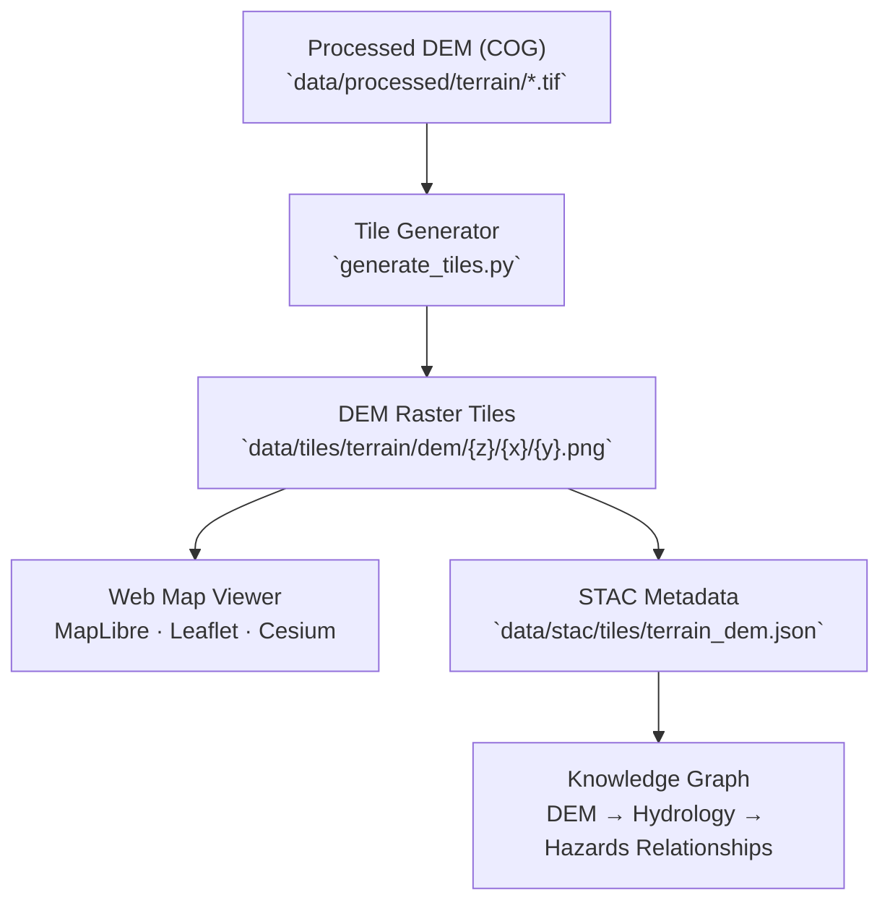

<div align="center">

# 🗻 Kansas Frontier Matrix — DEM Tiles

`data/tiles/terrain/dem/`

**Mission:** Host and document all **Digital Elevation Model (DEM) raster tiles** generated from validated LiDAR and elevation datasets within the Kansas Frontier Matrix (KFM).
These map tiles represent the geospatial foundation of the state’s topography — enabling multi-scale visualization, hydrologic modeling, and terrain analysis in the KFM web viewer.

[](../../../../.github/workflows/site.yml)
[](../../../../.github/workflows/stac-validate.yml)
[](../../../../.github/workflows/codeql.yml)
[](../../../../docs/)
[](../../../../LICENSE)

</div>

---

## 📚 Overview

The `data/tiles/terrain/dem/` directory contains **raster tilesets** derived from high-resolution Digital Elevation Models (DEMs)
used to depict Kansas’s terrain with scientific accuracy and reproducibility.

These tiles are rendered from **USGS 3DEP** and **Kansas DASC LiDAR** DEM sources in `data/processed/terrain/`,
providing fast, multi-resolution elevation visualization for hydrology, landcover, and hazard modeling layers.

---

## 🗂️ Directory Layout

```bash
data/tiles/terrain/dem/
├── README.md
└── ks_dem_1m/                     # 1-meter resolution DEM tile pyramid
    ├── metadata.json
    ├── tiles.json
    └── {z}/{x}/{y}.png            # Individual raster tiles
```

> **Note:**
> Each DEM tileset corresponds to a **validated processed DEM file** (e.g., `ks_1m_dem_2018_2020.tif`)
> and is linked through STAC metadata and checksum validation.

---

## 🧭 System Context (GitHub-safe Mermaid)



---

## ⚙️ DEM Tile Generation Workflow

**Makefile Target:**

```bash
make terrain-dem-tiles
```

**Python Example:**

```bash
python src/utils/generate_tiles.py \
  --input data/processed/terrain/ks_1m_dem_2018_2020.tif \
  --output data/tiles/terrain/dem/ks_dem_1m/ \
  --type raster --zoom 5-15 --style grayscale
```

**Workflow Steps**

1. **Input Load:** Import COG or GeoTIFF DEMs from processed datasets.
2. **Projection:** Convert to EPSG:3857 for global web compatibility.
3. **Tile Pyramid Build:** Render 256×256 pixel PNG tiles for each zoom level.
4. **Optimization:** Compress and generate overviews.
5. **Validation:** Check schema compliance and completeness.
6. **Registration:** Link generated tiles to STAC assets and checksum records.

---

## 🧱 Tile Specifications

| Attribute          | Description                                    |
| ------------------ | ---------------------------------------------- |
| **Projection**     | EPSG:3857 (Web Mercator)                       |
| **Resolution**     | 1 m (native), 10 m (resampled)                 |
| **Format**         | PNG, grayscale height visualization            |
| **Zoom Range**     | 5–15                                           |
| **Tile Size**      | 256×256 px                                     |
| **Source Data**    | USGS 3DEP, KS DASC LiDAR                       |
| **Generated With** | GDAL2Tiles / MapTiler / custom Python renderer |

> Elevation values are normalized for display (0–255 grayscale), preserving relative relief detail across zoom levels.

---

## 🧩 Integration with KFM Web Viewer

**Layer Definition Example:**

```json
{
  "id": "ks-dem-1m",
  "type": "raster",
  "source": {
    "type": "raster",
    "tiles": ["data/tiles/terrain/dem/ks_dem_1m/{z}/{x}/{y}.png"],
    "tileSize": 256
  },
  "paint": {"raster-opacity": 0.9}
}
```

| Component                           | Role                                            |
| ----------------------------------- | ----------------------------------------------- |
| `web/config/layers.json`            | Defines tile source and style parameters        |
| `data/stac/tiles/terrain_dem.json`  | Stores STAC metadata and provenance             |
| `data/checksums/terrain/`           | Contains `.sha256` checksums for tile integrity |
| `src/pipelines/terrain_pipeline.py` | Generates input DEMs for tile creation          |

---

## 🧪 Validation Commands

**Manual Validation**

```bash
python src/utils/validate_tiles.py data/tiles/terrain/dem/
```

**Make Targets**

```bash
make terrain-dem-validate
make terrain-dem-clean
```

**CI/CD Validation Includes**

* File structure and zoom range validation
* STAC linkage verification
* Raster value normalization check
* SHA-256 checksum comparison

---

## 🧠 MCP Compliance Summary

| MCP Principle           | Implementation                                         |
| ----------------------- | ------------------------------------------------------ |
| **Documentation-first** | README defines DEM tile lineage, structure, and usage. |
| **Reproducibility**     | Deterministic generation with Makefile and scripts.    |
| **Open Standards**      | GeoTIFF, PNG, EPSG:3857, STAC 1.0.                     |
| **Provenance**          | Linked directly to processed DEMs and STAC assets.     |
| **Auditability**        | Continuous CI validation and checksum tracking.        |

---

## 🧾 Changelog

| Version  | Date       | Summary                                                       |
| -------- | ---------- | ------------------------------------------------------------- |
| **v1.1** | 2025-10-12 | Expanded integration, validation, and metadata documentation. |
| v1.0     | 2025-10-04 | Initial creation of DEM tiles directory README.               |

---

## 🏷️ Version Block

```text
Component: data/tiles/terrain/dem/README.md
SemVer: 1.1.0
Spec Dependencies: MCP v1.0 · STAC 1.0 · Mapbox Raster Spec
Last Updated: 2025-10-12
Maintainer: @bartytime4life
```

---

<div align="center">

**Kansas Frontier Matrix** — *“Elevation is history made visible — every meter, a layer of time.”*
📍 [`data/tiles/terrain/dem/`](.) · Repository of Kansas’s elevation tile pyramids enabling scalable terrain exploration.

</div>

