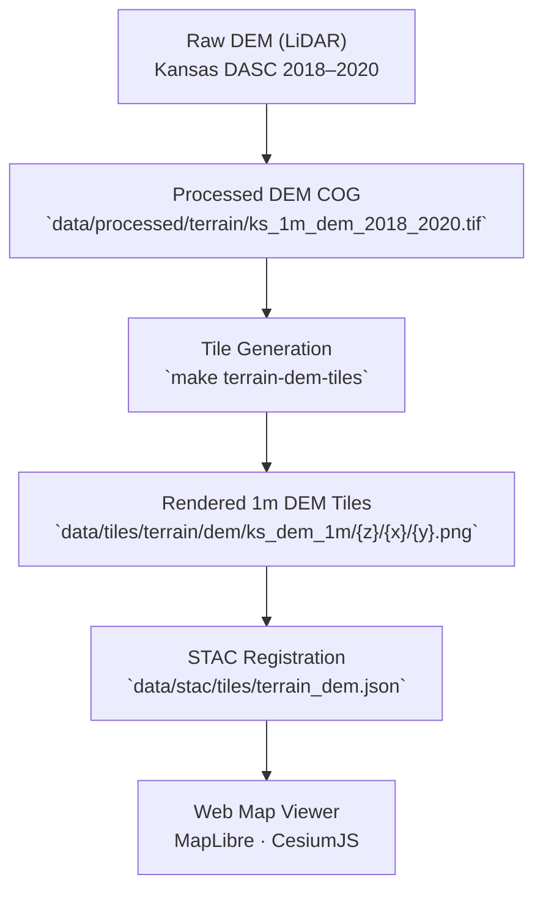

<div align="center">

# 🧭 Kansas Frontier Matrix — Kansas 1-Meter DEM Tileset

`data/tiles/terrain/dem/ks_dem_1m/`

**Mission:** Store and document the **1-meter resolution Digital Elevation Model (DEM) tiles**
that form the foundational terrain layer for the Kansas Frontier Matrix (KFM).
These tiles represent the most detailed topographic model of Kansas, supporting all downstream hydrology, landcover,
and hazard analyses across the project’s geospatial ecosystem.

[](../../../../../.github/workflows/site.yml)
[](../../../../../.github/workflows/stac-validate.yml)
[](../../../../../.github/workflows/codeql.yml)
[](../../../../../docs/)
[](../../../../../LICENSE)

</div>

---

## 📚 Overview

The `ks_dem_1m/` tileset is derived from **Kansas LiDAR DEMs (2018–2020)** provided by
the **Kansas Data Access & Support Center (DASC)** and **USGS 3DEP** program.

This 1-meter resolution DEM serves as the **canonical terrain base layer** in KFM.
Tiles are built as **256×256 pixel PNGs** and designed for rapid rendering within
MapLibre, Cesium, and other web visualization tools.

Each tile is geospatially registered, STAC-linked, and reproducibly generated through
automated ETL and rendering workflows.

---

## 🗂️ Directory Layout

```bash
data/tiles/terrain/dem/ks_dem_1m/
├── README.md
├── metadata.json              # Tile metadata (extent, zoom, min/max elevation)
├── tiles.json                 # Mapbox tileset manifest
├── checksums.sha256           # Integrity validation hashes
└── {z}/{x}/{y}.png            # Individual raster tiles (EPSG:3857)
```

> **Note:** Each `{z}/{x}/{y}` tile corresponds to a defined Web Mercator bounding box
> and is reproducibly derived from the canonical 1m DEM COG.

---

## 🧭 System Context (GitHub-safe Mermaid)



---

## ⚙️ Generation Workflow

**Makefile Target**

```bash
make terrain-dem-ks1m
```

**Python Command**

```bash
python src/utils/generate_tiles.py \
  --input data/processed/terrain/ks_1m_dem_2018_2020.tif \
  --output data/tiles/terrain/dem/ks_dem_1m/ \
  --zoom 5-15 --type raster --style grayscale
```

**Pipeline Steps**

1. Import LiDAR DEM from `data/processed/terrain/`.
2. Project to Web Mercator (EPSG:3857).
3. Render raster tiles at zoom levels 5–15 (256×256).
4. Normalize elevation values (0–255 grayscale).
5. Export to tile pyramid and compute checksums.
6. Register in STAC and publish for map rendering.

---

## 🧱 Tile Specifications

| Parameter          | Value                                                |
| ------------------ | ---------------------------------------------------- |
| **Projection**     | EPSG:3857                                            |
| **Resolution**     | 1 meter                                              |
| **Zoom Levels**    | 5–15                                                 |
| **Tile Format**    | PNG (8-bit grayscale)                                |
| **Data Range**     | 207–1235 m (approx.)                                 |
| **Source Data**    | Kansas DASC · USGS 3DEP                              |
| **Generated With** | GDAL · MapTiler · Python Rasterio                    |
| **Purpose**        | Terrain visualization, slope, and hydrology modeling |

---

## 🧩 Integration with the Web Viewer

**Example Layer Configuration**

```json
{
  "id": "ks-dem-1m",
  "type": "raster",
  "source": {
    "type": "raster",
    "tiles": ["data/tiles/terrain/dem/ks_dem_1m/{z}/{x}/{y}.png"],
    "tileSize": 256
  },
  "paint": {"raster-opacity": 0.9}
}
```

| Component                           | Role                                    |
| ----------------------------------- | --------------------------------------- |
| `web/config/layers.json`            | Layer configuration for MapLibre viewer |
| `data/stac/tiles/terrain_dem.json`  | STAC entry linking DEM tile metadata    |
| `data/checksums/terrain/`           | Integrity verification                  |
| `src/pipelines/terrain_pipeline.py` | Tile generator integration              |

---

## 🧪 Validation & Maintenance

**Validate Tiles**

```bash
python src/utils/validate_tiles.py data/tiles/terrain/dem/ks_dem_1m/
```

**Regenerate**

```bash
make terrain-dem-ks1m-refresh
```

**Checksum Verify**

```bash
sha256sum -c checksums.sha256
```

> Rebuild tiles when source DEMs or styling parameters change.
> All regenerated tiles must pass CI validation before merging.

---

## 🧠 MCP Compliance Summary

| MCP Principle           | Implementation                                            |
| ----------------------- | --------------------------------------------------------- |
| **Documentation-first** | Full lineage documented in this README and STAC metadata. |
| **Reproducibility**     | Scripted generation ensures deterministic results.        |
| **Open Standards**      | GeoTIFF · PNG · EPSG:3857 · STAC 1.0.                     |
| **Provenance**          | Links raw → processed → tileset → STAC → viewer.          |
| **Auditability**        | SHA-256 integrity checks + automated CI validation.       |

---

## 🧾 Changelog

| Version  | Date       | Summary                                                                 |
| -------- | ---------- | ----------------------------------------------------------------------- |
| **v1.1** | 2025-10-12 | Added STAC references, validation workflow, and configuration examples. |
| v1.0     | 2025-10-04 | Initial creation of Kansas 1-m DEM tileset documentation.               |

---

## 🏷️ Version Block

```text
Component: data/tiles/terrain/dem/ks_dem_1m/README.md
SemVer: 1.1.0
Spec Dependencies: MCP v1.0 · STAC 1.0 · Mapbox Raster Spec
Last Updated: 2025-10-12
Maintainer: @bartytime4life
```

---

<div align="center">

**Kansas Frontier Matrix** — *“Every rise, every ridge, every meter of Kansas — preserved in pixels.”*
📍 [`data/tiles/terrain/dem/ks_dem_1m/`](.) · Canonical 1-m DEM tileset forming the geospatial backbone of Kansas topography.

</div>

