<div align="center">

# 🌄 Kansas Frontier Matrix — Hillshade Tiles

`data/tiles/terrain/hillshade/`

**Mission:** Store and document all **hillshade raster tiles** derived from validated elevation datasets,
providing realistic shaded-relief visualizations of Kansas’s terrain. These tiles enable intuitive
topographic exploration in the Kansas Frontier Matrix (KFM) web mapping environment, supporting both
scientific and aesthetic applications.

[](../../../../.github/workflows/site.yml)
[](../../../../.github/workflows/stac-validate.yml)
[](../../../../.github/workflows/codeql.yml)
[](../../../../docs/)
[](../../../../LICENSE)

</div>

---

## 📚 Overview

The `data/tiles/terrain/hillshade/` directory contains **grayscale raster tiles** that simulate
sunlight and shadows across Kansas’s landscape — enhancing visual depth in elevation maps
and providing contextual terrain cues for other thematic layers (hydrology, hazards, landcover).

Hillshade tiles are generated from the **Kansas 1-Meter DEM** and other high-resolution elevation datasets
processed under `data/processed/terrain/`. Each tile is **projection-aligned, STAC-registered**,
and produced through a **reproducible ETL + rendering workflow**.

---

## 🗂️ Directory Layout

```bash
data/tiles/terrain/hillshade/
├── README.md
├── ks_hillshade/                # Hillshade tile pyramid (256×256 px)
│   ├── metadata.json
│   ├── tiles.json
│   ├── checksums.sha256
│   └── {z}/{x}/{y}.png
```

> **Note:**
> The `ks_hillshade/` tileset is derived from the 1-m LiDAR DEM (`ks_1m_dem_2018_2020.tif`),
> normalized and styled for multi-scale shaded-relief visualization.

---

## 🧭 System Context (GitHub-safe Mermaid)

```mermaid
flowchart TD
  A["Processed DEM (COG)\n`data/processed/terrain/ks_1m_dem_2018_2020.tif`"] --> B["Hillshade Renderer\n`generate_hillshade.py`"]
  B --> C["Hillshade Tiles\n`data/tiles/terrain/hillshade/{z}/{x}/{y}.png`"]
  C --> D["Web Viewer\nMapLibre · Leaflet · CesiumJS"]
  C --> E["STAC Registration\n`data/stac/tiles/terrain_hillshade.json`"]
  E --> F["Knowledge Graph\nTerrain → Visualization → Provenance Links"]
%%END OF MERMAID%%
```



---

## ⚙️ Hillshade Generation Workflow

**Makefile Target**

```bash
make terrain-hillshade
```

**Python Example**

```bash
python src/utils/generate_hillshade.py \
  --input data/processed/terrain/ks_1m_dem_2018_2020.tif \
  --output data/tiles/terrain/hillshade/ks_hillshade/ \
  --zoom 5-15 --azimuth 315 --altitude 45
```

### Workflow Steps

1. Load DEM COG from `data/processed/terrain/`.
2. Calculate shaded relief using GDAL hillshade or rasterio.
3. Render at zoom levels 5–15, 256×256 pixel tiles.
4. Compress and color-correct grayscale output.
5. Generate metadata and checksums.
6. Validate STAC linkages and file structure.

---

## 🧱 Tile Specifications

| Parameter                | Description                                  |
| ------------------------ | -------------------------------------------- |
| **Projection**           | EPSG:3857 (Web Mercator)                     |
| **Resolution**           | 1 m (derived)                                |
| **Tile Size**            | 256×256 px                                   |
| **Zoom Range**           | 5–15                                         |
| **Illumination Azimuth** | 315°                                         |
| **Sun Altitude**         | 45°                                          |
| **Format**               | PNG (8-bit grayscale)                        |
| **Source**               | Kansas LiDAR DEM (2018–2020)                 |
| **Purpose**              | Topographic visualization and map base layer |

---

## 🧩 Integration with KFM Web Viewer

**Example Layer Configuration**

```json
{
  "id": "ks-hillshade",
  "type": "raster",
  "source": {
    "type": "raster",
    "tiles": ["data/tiles/terrain/hillshade/ks_hillshade/{z}/{x}/{y}.png"],
    "tileSize": 256
  },
  "paint": {"raster-opacity": 0.75}
}
```

| Component                                | Role                                           |
| ---------------------------------------- | ---------------------------------------------- |
| `web/config/layers.json`                 | Layer configuration and rendering style        |
| `data/stac/tiles/terrain_hillshade.json` | Metadata linking hillshade tiles to source DEM |
| `data/checksums/terrain/`                | SHA-256 validation files                       |
| `src/pipelines/terrain_pipeline.py`      | Pipeline for hillshade generation              |

---

## 🧪 Validation & Maintenance

**Validate Tiles**

```bash
python src/utils/validate_tiles.py data/tiles/terrain/hillshade/
```

**Regenerate**

```bash
make terrain-hillshade-refresh
```

**Checksum Verify**

```bash
sha256sum -c ks_hillshade/checksums.sha256
```

---

## 🧠 MCP Compliance Summary

| MCP Principle           | Implementation                                                       |
| ----------------------- | -------------------------------------------------------------------- |
| **Documentation-first** | README defines structure, lineage, and parameters.                   |
| **Reproducibility**     | Deterministic generation via controlled azimuth/altitude parameters. |
| **Open Standards**      | GeoTIFF, PNG, EPSG:3857, STAC 1.0, Mapbox Raster Spec.               |
| **Provenance**          | Linked to processed DEMs, STAC metadata, and source manifests.       |
| **Auditability**        | Checksum and CI validation maintain data integrity.                  |

---

## 🧾 Changelog

| Version  | Date       | Summary                                                                   |
| -------- | ---------- | ------------------------------------------------------------------------- |
| **v1.1** | 2025-10-12 | Added generation workflow, STAC integration, and parameter documentation. |
| v1.0     | 2025-10-04 | Initial creation of hillshade tile directory documentation.               |

---

## 🏷️ Version Block

```text
Component: data/tiles/terrain/hillshade/README.md
SemVer: 1.1.0
Spec Dependencies: MCP v1.0 · STAC 1.0 · Mapbox Raster Spec
Last Updated: 2025-10-12
Maintainer: @bartytime4life
```

---

<div align="center">

**Kansas Frontier Matrix** — *“Light reveals the land — and every shadow tells a story.”*
📍 [`data/tiles/terrain/hillshade/`](.) · Canonical shaded-relief tile repository for the Kansas Frontier Matrix’s topographic visualization system.

</div>

