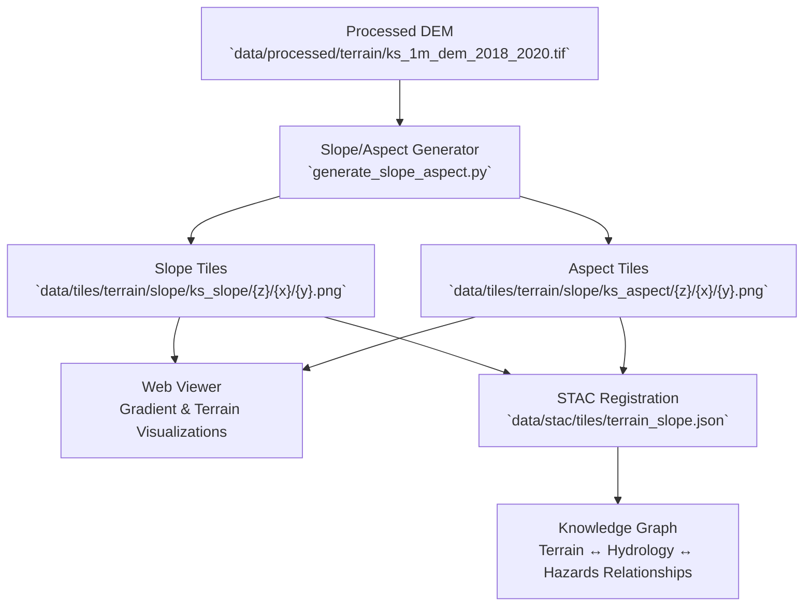

<div align="center">

# 🧗 Kansas Frontier Matrix — Slope & Aspect Tiles

`data/tiles/terrain/slope/`

**Mission:** Generate, store, and document all **slope and aspect raster tiles** derived from Kansas’s high-resolution elevation data.
These products visualize surface gradients, relief energy, and orientation — key for geomorphology, erosion, hydrology, and hazard analysis within the Kansas Frontier Matrix (KFM).

[](../../../../.github/workflows/site.yml)
[](../../../../.github/workflows/stac-validate.yml)
[](../../../../.github/workflows/codeql.yml)
[](../../../../docs/)
[](../../../../LICENSE)

</div>

---

## 📚 Overview

The `data/tiles/terrain/slope/` directory contains **colorized raster tiles** representing surface slope and aspect (orientation) derived from
Kansas’s 1-meter LiDAR-based Digital Elevation Models (DEMs).

These tiles support both analytical modeling (e.g., runoff, erosion) and visual storytelling,
providing gradient-based terrain layers for interactive mapping and simulation.

Tiles are created via deterministic pipelines that use **GDAL**, **rasterio**, and **NumPy**,
producing 256×256 pixel tiles in EPSG:3857 projection.

---

## 🗂️ Directory Layout

```bash
data/tiles/terrain/slope/
├── README.md
├── ks_slope/                 # Slope tile pyramid (degrees or % rise)
│   ├── metadata.json
│   ├── tiles.json
│   ├── checksums.sha256
│   └── {z}/{x}/{y}.png
└── ks_aspect/                # Aspect tile pyramid (orientation)
    ├── metadata.json
    ├── tiles.json
    ├── checksums.sha256
    └── {z}/{x}/{y}.png
```

> **Note:**
> The slope and aspect layers are **derived** from the 1-m DEM and linked to its STAC collection for provenance and reproducibility.

---

## 🧭 System Context (GitHub-safe Mermaid)



---

## ⚙️ Generation Workflow

**Makefile Target**

```bash
make terrain-slope
```

**Python Example**

```bash
python src/utils/generate_slope_aspect.py \
  --input data/processed/terrain/ks_1m_dem_2018_2020.tif \
  --output data/tiles/terrain/slope/ \
  --zoom 5-15 --mode slope
```

**Workflow Steps**

1. Load DEM raster (GeoTIFF/COG).
2. Compute slope (`degrees` or `% rise`) using GDAL or rasterio.
3. Optionally compute aspect (azimuthal orientation).
4. Normalize and colorize for visualization.
5. Export as Web Mercator (EPSG:3857) raster tiles.
6. Register in STAC and verify with checksums.

---

## 🧱 Tile Specifications

| Parameter          | Slope                                   | Aspect                                      |
| ------------------ | --------------------------------------- | ------------------------------------------- |
| **Projection**     | EPSG:3857                               | EPSG:3857                                   |
| **Units**          | Degrees or % rise                       | Azimuth (0–360°)                            |
| **Format**         | PNG (colorized)                         | PNG (hue-mapped)                            |
| **Zoom Levels**    | 5–15                                    | 5–15                                        |
| **Tile Size**      | 256×256 px                              | 256×256 px                                  |
| **Source Data**    | Kansas LiDAR DEM (2018–2020)            | Kansas LiDAR DEM (2018–2020)                |
| **Generated With** | GDAL · Rasterio · NumPy                 | GDAL · Rasterio · NumPy                     |
| **Purpose**        | Gradient visualization, hazard modeling | Aspect-based mapping, sun exposure analysis |

---

## 🌈 Color Symbology

| Layer      | Style             | Description                                                 |
| ---------- | ----------------- | ----------------------------------------------------------- |
| **Slope**  | Grayscale (0–255) | Bright = steep slope; dark = flat.                          |
| **Aspect** | HSV color wheel   | Hue encodes orientation (N=red, E=yellow, S=green, W=blue). |

Example colormap snippet (`colormap.json`):

```json
{
  "slope": {"0": "#000000", "30": "#999999", "60": "#FFFFFF"},
  "aspect": {"0": "#FF0000", "90": "#FFFF00", "180": "#00FF00", "270": "#0000FF"}
}
```

---

## 🧩 Integration with Web Map Viewer

**Example Slope Layer**

```json
{
  "id": "ks-slope",
  "type": "raster",
  "source": {
    "type": "raster",
    "tiles": ["data/tiles/terrain/slope/ks_slope/{z}/{x}/{y}.png"],
    "tileSize": 256
  },
  "paint": {"raster-opacity": 0.85}
}
```

**Example Aspect Layer**

```json
{
  "id": "ks-aspect",
  "type": "raster",
  "source": {
    "type": "raster",
    "tiles": ["data/tiles/terrain/slope/ks_aspect/{z}/{x}/{y}.png"],
    "tileSize": 256
  },
  "paint": {"raster-opacity": 0.85}
}
```

---

## 🧪 Validation & Maintenance

**Validate Tiles**

```bash
python src/utils/validate_tiles.py data/tiles/terrain/slope/
```

**Regenerate**

```bash
make terrain-slope-refresh
```

**Checksum Verify**

```bash
sha256sum -c ks_slope/checksums.sha256
sha256sum -c ks_aspect/checksums.sha256
```

---

## 🧠 MCP Compliance Summary

| MCP Principle           | Implementation                                             |
| ----------------------- | ---------------------------------------------------------- |
| **Documentation-first** | Comprehensive directory documentation and lineage mapping. |
| **Reproducibility**     | Deterministic tile generation from validated DEMs.         |
| **Open Standards**      | GeoTIFF, PNG, EPSG:3857, STAC 1.0, Mapbox Raster Spec.     |
| **Provenance**          | Manifest-linked pipeline with STAC metadata.               |
| **Auditability**        | CI validation + SHA-256 checksums for each tile pyramid.   |

---

## 🧾 Changelog

| Version  | Date       | Summary                                                            |
| -------- | ---------- | ------------------------------------------------------------------ |
| **v1.1** | 2025-10-12 | Added aspect documentation, color symbology, and STAC integration. |
| v1.0     | 2025-10-04 | Initial creation of slope tile directory documentation.            |

---

## 🏷️ Version Block

```text
Component: data/tiles/terrain/slope/README.md
SemVer: 1.1.0
Spec Dependencies: MCP v1.0 · STAC 1.0 · Mapbox Raster Spec
Last Updated: 2025-10-12
Maintainer: @bartytime4life
```

---

<div align="center">

**Kansas Frontier Matrix** — *“Every gradient tells a story — where gravity, erosion, and time converge.”*
📍 [`data/tiles/terrain/slope/`](.) · Canonical slope and aspect tile repository for geomorphologic and hydrologic visualization in KFM.

</div>

