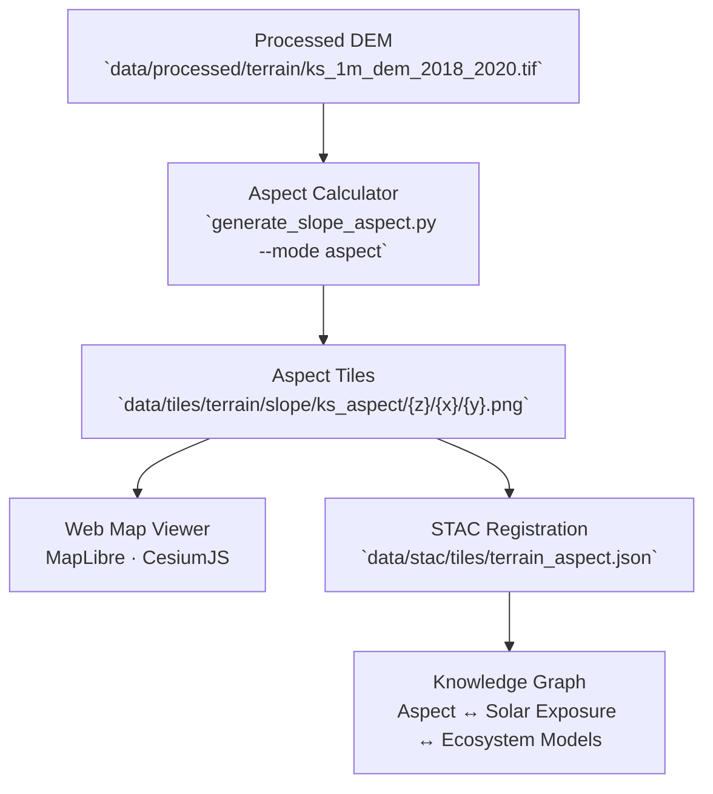

<div align="center">

# 🧭 Kansas Frontier Matrix — Kansas Aspect Tileset

`data/tiles/terrain/slope/ks_aspect/`

**Mission:** Host and document the **aspect raster tile pyramid** derived from the Kansas 1-meter LiDAR Digital Elevation Model (DEM).
These tiles visualize the **directional orientation of terrain surfaces** (azimuth) across Kansas — essential for studying solar exposure,
wind patterns, geomorphology, and environmental modeling in the Kansas Frontier Matrix (KFM).

[](../../../../../.github/workflows/site.yml)
[](../../../../../.github/workflows/stac-validate.yml)
[](../../../../../.github/workflows/codeql.yml)
[](../../../../../docs/)
[](../../../../../LICENSE)

</div>

---

## 📚 Overview

The `ks_aspect/` directory contains **raster tiles** that encode the orientation (aspect) of terrain slopes
in Kansas — measured in degrees clockwise from north (0–360°).

These tiles, derived from the **Kansas 1m DEM (2018–2020)**, help visualize how landforms interact
with sunlight, moisture, and wind, forming a key analytical layer for the KFM’s environmental and
geophysical modeling workflows.

Each tile is colorized using an **HSV hue wheel**, where hue corresponds to slope direction:

* **0° / 360° (North)** = Red
* **90° (East)** = Yellow
* **180° (South)** = Green
* **270° (West)** = Blue

---

## 🗂️ Directory Layout

```bash
data/tiles/terrain/slope/ks_aspect/
├── README.md
├── metadata.json              # Tile coverage, min/max azimuth, color map
├── tiles.json                 # Mapbox-style tile manifest
├── checksums.sha256           # SHA-256 file integrity hashes
└── {z}/{x}/{y}.png            # Aspect tiles (colorized by orientation)
```

> **Note:**
> Each `{z}/{x}/{y}.png` tile is generated directly from the same DEM used in
> `data/tiles/terrain/slope/ks_slope/` to ensure spatial and analytical consistency.

---

## 🧭 System Context (GitHub-safe Mermaid)



---

## ⚙️ Tile Generation Workflow

**Makefile Target**

```bash
make terrain-aspect-ks
```

**Python Command**

```bash
python src/utils/generate_slope_aspect.py \
  --input data/processed/terrain/ks_1m_dem_2018_2020.tif \
  --output data/tiles/terrain/slope/ks_aspect/ \
  --zoom 5-15 --mode aspect --colormap hsv
```

### Workflow Steps

1. Load processed DEM from `data/processed/terrain/`.
2. Compute terrain aspect (azimuth 0–360°).
3. Map azimuth values to HSV color spectrum.
4. Export tiled raster pyramids at multiple zoom levels (5–15).
5. Generate metadata and checksum hashes.
6. Register output in STAC for reproducibility tracking.

---

## 🧱 Tile Specifications

| Parameter          | Value                                                                        |
| ------------------ | ---------------------------------------------------------------------------- |
| **Projection**     | EPSG:3857                                                                    |
| **Resolution**     | 1 m (native)                                                                 |
| **Zoom Levels**    | 5–15                                                                         |
| **Tile Size**      | 256×256 px                                                                   |
| **Format**         | PNG (8-bit RGB colorized)                                                    |
| **Units**          | Degrees (0–360°)                                                             |
| **Colorization**   | HSV hue-mapped by orientation                                                |
| **Source Data**    | Kansas LiDAR DEM (2018–2020)                                                 |
| **Generated With** | GDAL · Rasterio · NumPy                                                      |
| **Purpose**        | Terrain aspect visualization, solar modeling, and slope orientation analysis |

---

## 🌈 Color Map Reference (Azimuth → Hue)

| Direction | Degrees   | Color     | Description  |
| --------- | --------- | --------- | ------------ |
| North     | 0° / 360° | `#FF0000` | Red          |
| Northeast | 45°       | `#FF8000` | Orange       |
| East      | 90°       | `#FFFF00` | Yellow       |
| Southeast | 135°      | `#80FF00` | Yellow-Green |
| South     | 180°      | `#00FF00` | Green        |
| Southwest | 225°      | `#00FFFF` | Cyan         |
| West      | 270°      | `#0000FF` | Blue         |
| Northwest | 315°      | `#8000FF` | Purple       |

> **Visualization Tip:** Aspect hue maps can be combined with hillshade tiles
> for enhanced terrain orientation visualization in MapLibre or Cesium.

---

## 🧩 Integration with Web Map Viewer

**Example Layer Configuration**

```json
{
  "id": "ks-aspect-tiles",
  "type": "raster",
  "source": {
    "type": "raster",
    "tiles": ["data/tiles/terrain/slope/ks_aspect/{z}/{x}/{y}.png"],
    "tileSize": 256
  },
  "paint": {"raster-opacity": 0.9}
}
```

| Component                             | Role                                           |
| ------------------------------------- | ---------------------------------------------- |
| `web/config/layers.json`              | Defines aspect visualization layer and opacity |
| `data/stac/tiles/terrain_aspect.json` | Registers STAC asset and provenance            |
| `data/checksums/terrain/`             | Stores hash checksums for integrity validation |
| `src/pipelines/terrain_pipeline.py`   | Automates DEM → aspect tile generation         |

---

## 🧪 Validation & Maintenance

**Validate Tiles**

```bash
python src/utils/validate_tiles.py data/tiles/terrain/slope/ks_aspect/
```

**Regenerate Tiles**

```bash
make terrain-aspect-ks-refresh
```

**Checksum Verification**

```bash
sha256sum -c checksums.sha256
```

**Continuous Integration Checks**

* Schema validation (STAC + directory)
* Tile completeness audit
* File hash verification
* Colormap compliance validation

---

## 🧠 MCP Compliance Summary

| MCP Principle           | Implementation                                       |
| ----------------------- | ---------------------------------------------------- |
| **Documentation-first** | Full lineage documented with technical parameters.   |
| **Reproducibility**     | Scripted generation and deterministic color-mapping. |
| **Open Standards**      | GeoTIFF, PNG, EPSG:3857, STAC 1.0.                   |
| **Provenance**          | Linked to processed DEM and stored in STAC catalog.  |
| **Auditability**        | SHA-256 verification and automated CI workflows.     |

---

## 🧾 Changelog

| Version  | Date       | Summary                                                       |
| -------- | ---------- | ------------------------------------------------------------- |
| **v1.1** | 2025-10-12 | Added color mapping, workflow examples, and STAC integration. |
| v1.0     | 2025-10-04 | Initial creation of aspect tile documentation.                |

---

## 🏷️ Version Block

```text
Component: data/tiles/terrain/slope/ks_aspect/README.md
SemVer: 1.1.0
Spec Dependencies: MCP v1.0 · STAC 1.0 · Mapbox Raster Spec
Last Updated: 2025-10-12
Maintainer: @bartytime4life
```

---

<div align="center">

**Kansas Frontier Matrix** — *“Every slope faces a direction — and every direction tells a story of light, wind, and time.”*
📍 [`data/tiles/terrain/slope/ks_aspect/`](.) · Canonical aspect tile pyramid visualizing Kansas’s terrain orientations in vivid color.

</div>

