<div align="center">

# 🧱 Kansas Frontier Matrix — Kansas Slope Tileset

`data/tiles/terrain/slope/ks_slope/`

**Mission:** Host and document the **slope raster tile pyramid** generated from Kansas’s 1-meter LiDAR Digital Elevation Model (DEM).
This dataset visualizes the **steepness and gradient of the land surface** across Kansas — essential for hydrology, erosion, hazard, and geomorphology analysis
within the Kansas Frontier Matrix (KFM).

[](../../../../../.github/workflows/site.yml)
[](../../../../../.github/workflows/stac-validate.yml)
[](../../../../../.github/workflows/codeql.yml)
[](../../../../../docs/)
[](../../../../../LICENSE)

</div>

---

## 📚 Overview

The `ks_slope/` directory contains **raster map tiles** showing the slope (in degrees)
derived from the **Kansas 1m DEM (2018–2020)**, computed using GDAL and Rasterio.
These tiles support high-precision topographic analysis, visualization, and model calibration
for downstream hydrological and hazard simulations.

Each tile represents a **256×256 pixel raster** with normalized slope values,
projected in Web Mercator (`EPSG:3857`), and linked via STAC metadata for full reproducibility.

---

## 🗂️ Directory Layout

```bash
data/tiles/terrain/slope/ks_slope/
├── README.md
├── metadata.json            # Tile coverage, zoom range, and statistics
├── tiles.json               # Mapbox tile metadata manifest
├── checksums.sha256         # Integrity verification hashes
└── {z}/{x}/{y}.png          # Slope tiles (grayscale 0–255)
```

> **Note:**
> Each `{z}/{x}/{y}.png` tile corresponds to slope values derived from the Kansas LiDAR DEM.
> Bright pixels = steeper terrain; dark pixels = flatter surfaces.

---

## 🧭 System Context (GitHub-safe Mermaid)

```mermaid
flowchart TD
  A["Processed DEM\n`data/processed/terrain/ks_1m_dem_2018_2020.tif`"] --> B["Slope Calculator\n`generate_slope_aspect.py --mode slope`"]
  B --> C["Slope Raster Tiles\n`data/tiles/terrain/slope/ks_slope/{z}/{x}/{y}.png`"]
  C --> D["Web Map Viewer\nMapLibre · CesiumJS"]
  C --> E["STAC Registration\n`data/stac/tiles/terrain_slope.json`"]
  E --> F["Knowledge Graph\nTerrain → Hydrology → Hazards Relations"]
%%END OF MERMAID%%
```



---

## ⚙️ Tile Generation Workflow

**Makefile Target**

```bash
make terrain-slope-ks
```

**Python Command**

```bash
python src/utils/generate_slope_aspect.py \
  --input data/processed/terrain/ks_1m_dem_2018_2020.tif \
  --output data/tiles/terrain/slope/ks_slope/ \
  --zoom 5-15 --mode slope --colormap grayscale
```

### Workflow Steps

1. Load the validated DEM raster (`data/processed/terrain/ks_1m_dem_2018_2020.tif`).
2. Compute slope values (degrees) using GDAL or rasterio gradient functions.
3. Normalize and colorize slope values into 8-bit grayscale.
4. Reproject to EPSG:3857 and tile into `{z}/{x}/{y}.png` pyramids.
5. Generate metadata and checksums.
6. Validate tile completeness and link to STAC records.

---

## 🧱 Tile Specifications

| Parameter          | Value                                                       |
| ------------------ | ----------------------------------------------------------- |
| **Projection**     | EPSG:3857                                                   |
| **Resolution**     | 1 meter (native)                                            |
| **Zoom Levels**    | 5–15                                                        |
| **Tile Size**      | 256×256 px                                                  |
| **Format**         | PNG (8-bit grayscale)                                       |
| **Units**          | Degrees (0° = flat, 90° = vertical)                         |
| **Source Dataset** | Kansas LiDAR DEM 2018–2020                                  |
| **Generated With** | GDAL · Rasterio · Python NumPy                              |
| **Purpose**        | Terrain slope visualization, hydrology, and hazard modeling |

---

## 🌈 Visualization Style

| Value Range | Color                   | Interpretation                         |
| ----------- | ----------------------- | -------------------------------------- |
| 0–5°        | `#000000` (dark)        | Flat plains and floodplains            |
| 5–15°       | `#808080` (medium gray) | Rolling hills                          |
| >15°        | `#FFFFFF` (bright)      | Steep terrain, bluffs, and escarpments |

**Colorization Rule (JSON Example):**

```json
{
  "0": "#000000",
  "5": "#666666",
  "10": "#AAAAAA",
  "15": "#FFFFFF"
}
```

---

## 🧩 Integration with KFM Web Viewer

**Example Layer Configuration**

```json
{
  "id": "ks-slope-tiles",
  "type": "raster",
  "source": {
    "type": "raster",
    "tiles": ["data/tiles/terrain/slope/ks_slope/{z}/{x}/{y}.png"],
    "tileSize": 256
  },
  "paint": {"raster-opacity": 0.85}
}
```

| Component                            | Function                                  |
| ------------------------------------ | ----------------------------------------- |
| `web/config/layers.json`             | Defines slope tile visibility and styling |
| `data/stac/tiles/terrain_slope.json` | Metadata describing slope tile provenance |
| `data/checksums/terrain/`            | Integrity verification files              |
| `src/pipelines/terrain_pipeline.py`  | ETL for DEM and slope derivation          |

---

## 🧪 Validation & Maintenance

**Validate Tiles**

```bash
python src/utils/validate_tiles.py data/tiles/terrain/slope/ks_slope/
```

**Regenerate**

```bash
make terrain-slope-ks-refresh
```

**Checksum Verify**

```bash
sha256sum -c checksums.sha256
```

**CI/CD Validation**

* Tile hierarchy and naming check
* STAC linkage and metadata sync
* SHA-256 integrity verification
* Zoom-level coverage validation

---

## 🧠 MCP Compliance Summary

| MCP Principle           | Implementation                                                   |
| ----------------------- | ---------------------------------------------------------------- |
| **Documentation-first** | Each slope tileset fully documented with lineage and parameters. |
| **Reproducibility**     | Deterministic slope generation via parameterized scripts.        |
| **Open Standards**      | GeoTIFF, PNG, EPSG:3857, STAC 1.0.                               |
| **Provenance**          | Linked directly to processed DEM and STAC metadata.              |
| **Auditability**        | Checksum validation and automated CI verification.               |

---

## 🧾 Changelog

| Version  | Date       | Summary                                                      |
| -------- | ---------- | ------------------------------------------------------------ |
| **v1.1** | 2025-10-12 | Added workflow diagram, visualization guide, and STAC links. |
| v1.0     | 2025-10-04 | Initial creation of Kansas slope tile documentation.         |

---

## 🏷️ Version Block

```text
Component: data/tiles/terrain/slope/ks_slope/README.md
SemVer: 1.1.0
Spec Dependencies: MCP v1.0 · STAC 1.0 · Mapbox Raster Spec
Last Updated: 2025-10-12
Maintainer: @bartytime4life
```

---

<div align="center">

**Kansas Frontier Matrix** — *“Steepness tells the story of motion, erosion, and time.”*
📍 [`data/tiles/terrain/slope/ks_slope/`](.) · Canonical slope tile pyramid for Kansas terrain analysis and visualization.

</div>

