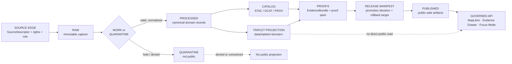

<!-- [KFM_META_BLOCK_V2]
doc_id: kfm://doc/REVIEW-REQUIRED
title: KFM Triplets Data Directory
type: standard
version: v1
status: draft
owners: REVIEW-REQUIRED
created: REVIEW-REQUIRED
updated: 2026-04-22
policy_label: REVIEW-REQUIRED
related: [data/triplets/README.md, REVIEW-REQUIRED]
tags: [kfm, data, triplets, graph, evidence, publication]
notes: [doc_id, owners, created date, policy_label, and related links require verification against the canonical document registry, CODEOWNERS, and mounted target repository.]
[/KFM_META_BLOCK_V2] -->

# KFM Triplets Data Directory

Governed graph/triplet projections for evidence-bound KFM claims after processing and catalog closure.

<p align="left">
  
  
  
  
</p>

> [!IMPORTANT]
> **Impact block**
>
> | Field | Value |
> |---|---|
> | Status | `experimental` — NEEDS VERIFICATION against the mounted repository |
> | Owners | `REVIEW-REQUIRED` — confirm in CODEOWNERS or document registry |
> | Path | `data/triplets/README.md` |
> | Directory role | Derived graph/triplet projection zone inside the `CATALOG / TRIPLET` lifecycle stage |
> | Public posture | Not a direct public data surface; downstream public use must go through released artifacts, governed APIs, EvidenceBundle resolution, and policy gates |
> | Quick jumps | [Scope](#scope) · [Repo fit](#repo-fit) · [Inputs](#inputs) · [Exclusions](#exclusions) · [Directory tree](#directory-tree) · [Quickstart](#quickstart) · [Validation gates](#validation-gates) · [Definition of done](#definition-of-done) · [FAQ](#faq) |

> [!NOTE]
> **Evidence posture**
>
> **CONFIRMED doctrine:** KFM preserves the lifecycle `RAW -> WORK / QUARANTINE -> PROCESSED -> CATALOG / TRIPLET -> PUBLISHED`, treats public clients as downstream of governed interfaces, and keeps graph edges, tiles, summaries, indexes, and AI output subordinate to evidence.
>
> **PROPOSED directory contract:** this README defines how `data/triplets/` should behave as a derived, reviewable, rebuildable graph/triplet projection lane.
>
> **UNKNOWN implementation depth:** the actual target repository tree, schema home, validators, CI workflows, and current contents of `data/triplets/` must be verified before treating this file as enforced behavior.

---

## Scope

`data/triplets/` is for **derived relationship projections** that make KFM evidence easier to query, review, explain, and publish without replacing canonical domain records.

Triplets are useful when KFM needs to represent relationships such as:

- a processed record **supports** an EvidenceBundle;
- an entity **is located within** a spatial scope;
- a claim **depends on** a source, catalog item, review, release, or correction notice;
- a domain object **participates in** a temporal, spatial, taxonomic, hydrologic, transport, land, or cultural relationship;
- a public artifact **was generated from** a governed pipeline run and release manifest.

Triplets in this directory are **not sovereign truth**. They are graph-shaped projections of governed records, evidence, catalog entries, proofs, and release state.

### Operating rule

A triplet may help users and systems navigate meaning, but the meaning must remain reconstructable to admissible source material, EvidenceBundle closure, policy posture, review state, release state, and correction lineage.

[Back to top](#kfm-triplets-data-directory)

---

## Repo fit

| Relationship | Path | Status | Role |
|---|---:|---|---|
| Current file | `data/triplets/README.md` | PROPOSED | Directory entrypoint and maintainer rules |
| Parent data area | [`../`](../) | NEEDS VERIFICATION | Data lifecycle root |
| Upstream processed records | [`../processed/`](../processed/) | NEEDS VERIFICATION | Validated normalized records eligible to project into graph form |
| Upstream catalog records | [`../catalog/`](../catalog/) | NEEDS VERIFICATION | STAC/DCAT/PROV catalog closure that triplets must not bypass |
| Upstream source registries | [`../registry/`](../registry/) | NEEDS VERIFICATION | Source roles, rights, cadence, sensitivity, activation state |
| Companion receipts | [`../receipts/`](../receipts/) | NEEDS VERIFICATION | Process memory: runs, transforms, redactions, validation events |
| Companion proofs | [`../proofs/`](../proofs/) | NEEDS VERIFICATION | EvidenceBundles, proof packs, validation reports, release-supporting evidence |
| Downstream published artifacts | [`../published/`](../published/) | NEEDS VERIFICATION | Public-safe release outputs after promotion |
| Downstream release lane | [`../../release/`](../../release/) | NEEDS VERIFICATION | Release manifests, rollback cards, promotion records |
| Machine schemas | [`../../schemas/`](../../schemas/) | NEEDS VERIFICATION | Schema authority must be confirmed by ADR or repo convention |
| Policy gates | [`../../policy/`](../../policy/) | NEEDS VERIFICATION | Rights, sensitivity, source-role, citation, and release checks |
| Validator tooling | [`../../tools/`](../../tools/) | NEEDS VERIFICATION | Schema, graph, evidence, catalog, and public-safety validation |
| Governed API | [`../../apps/`](../../apps/) | NEEDS VERIFICATION | Public/runtime access surface; clients should not read this directory directly |
| Map/UI surfaces | [`../../ui/`](../../ui/) | NEEDS VERIFICATION | MapLibre layers, Evidence Drawer payloads, Focus Mode fixtures, if present |

> [!WARNING]
> Do not treat a link in this table as proof that the linked path exists in the current repository. Paths are relative from `data/triplets/README.md` and must be verified in the real checkout.

[Back to top](#kfm-triplets-data-directory)

---

## Inputs

Only graph-ready, evidence-bound, policy-aware inputs belong here.

| Accepted input | Required condition | Why it belongs |
|---|---|---|
| Processed domain records | Must have stable IDs, source references, temporal scope, review state, and validation status | Triplets should project validated records, not raw observations |
| EvidenceBundle references | Must resolve to admissible evidence or abstain from public use | Graph edges must remain traceable |
| Catalog references | STAC/DCAT/PROV or repo-equivalent catalog closure must exist when the triplet supports publishable artifacts | Triplets cannot bypass catalog closure |
| SourceDescriptor references | Source role, rights, sensitivity, cadence, and activation state must be known | Prevents source-role confusion |
| Validation reports | Must identify schema, graph, evidence, policy, and public-safety outcomes | Supports review, promotion, and rollback |
| Release-candidate manifests | Must include `run_id`, `spec_hash` or equivalent, content digest, review state, and rollback target | Allows promotion to remain a governed state transition |
| Public-safe generalized geometry references | Must be produced by reviewed transforms with receipts | Prevents exact sensitive-location leakage |

### Input acceptance checklist

Before a triplet artifact lands here:

- [ ] It was generated from `PROCESSED`, cataloged, or release-candidate material.
- [ ] It does not point to `RAW`, `WORK`, or `QUARANTINE` as a public dependency.
- [ ] Every consequential edge has source and evidence support.
- [ ] Sensitive geometry and restricted claims have been denied, generalized, suppressed, or staged behind access controls.
- [ ] A validator can reproduce the projection from declared inputs.
- [ ] A reviewer can trace the projection back to evidence and release state.

[Back to top](#kfm-triplets-data-directory)

---

## Exclusions

These do **not** belong in `data/triplets/`.

| Excluded material | Use instead | Reason |
|---|---|---|
| Raw source pulls, scraped pages, downloads, original shapefiles, direct API responses | `../raw/<domain>/` | Raw material is not graph-ready and must not become public through projection |
| Temporary normalization work | `../work/<domain>/` | Work products may contain unresolved quality, rights, sensitivity, or identity issues |
| Held, denied, quarantined, or unresolved material | `../quarantine/<domain>/` | Triplets must not launder unresolved obligations |
| Canonical processed domain records | `../processed/<domain>/` | Triplets are derived projections, not canonical records |
| STAC/DCAT/PROV catalog objects | `../catalog/<standard>/<domain>/` | Catalog records have their own closure and validation responsibilities |
| Receipts, run logs, transform logs, redaction logs | `../receipts/<domain>/` | Receipts are process memory, not graph truth |
| EvidenceBundles and proof packs | `../proofs/<domain>/` | Proof objects may be referenced by triplets but should not be stored as triplets |
| Published PMTiles, GeoJSON, tiles, API snapshots, exports | `../published/<domain>/` | Publication follows promotion; it is not the same as graph projection |
| Ontologies, JSON Schemas, OpenAPI contracts, predicate registries | `../../schemas/` or `../../contracts/` | Machine contracts must remain governed separately |
| UI layer descriptors and Evidence Drawer fixtures | `../../ui/` or app-specific surface | UI consumes governed outputs; it should not redefine graph truth |
| AI answers, summaries, chain-of-thought, model transcripts | Runtime receipts or governed-AI logs, if approved | AI output is interpretive and must not become root evidence |

> [!CAUTION]
> A triplet that is easy to query but unsupported by evidence is still unsupported. Convenience does not create authority.

[Back to top](#kfm-triplets-data-directory)

---

## Directory tree

PROPOSED target shape until verified in the mounted repository:

```text
data/triplets/
├── README.md
├── <domain>/
│   ├── README.md
│   ├── manifest.<json|yaml>
│   ├── triplets.<approved-format>
│   ├── validation_report.<json|yaml>
│   └── CHANGELOG.md
└── _index.<json|yaml>              # Optional; only if the repo establishes a generated triplet index.
```

### File family matrix

| Path pattern | Status | Purpose | Truth role | Maintained as | Update trigger | Owner / authority |
|---|---|---|---|---|---|---|
| `data/triplets/README.md` | PROPOSED | Directory guide and guardrail | Human-facing control-plane doc | Hand-maintained | Any lifecycle, policy, graph, schema, or public-surface rule change | REVIEW-REQUIRED |
| `data/triplets/<domain>/README.md` | PROPOSED | Domain-specific triplet rules | Human-facing domain guide | Hand-maintained | New domain projection, predicate set, source role, or sensitivity profile | Domain steward + data governance |
| `data/triplets/<domain>/manifest.<json\|yaml>` | PROPOSED | Projection manifest | Machine-readable release-supporting record | Generated or generated-with-review | Any projection rebuild, schema version change, source change, policy change, or correction | Pipeline + reviewer |
| `data/triplets/<domain>/triplets.<approved-format>` | PROPOSED | Graph/triplet projection artifact | Derived graph projection | Generated | Rebuild from processed/cataloged inputs | Pipeline |
| `data/triplets/<domain>/validation_report.<json\|yaml>` | PROPOSED | Validation result summary | Proof-supporting derivative | Generated | Validator run, policy update, schema update, input rebuild | Validator suite |
| `data/triplets/<domain>/CHANGELOG.md` | PROPOSED | Human-readable projection history | Review and lineage support | Append-only | Material semantics, predicate, source, review, correction, or publication change | Domain steward |
| `data/triplets/_index.<json\|yaml>` | PROPOSED / OPTIONAL | Cross-domain generated index | Derived navigation aid | Generated | Domain added, removed, superseded, or rebuilt | CI / docs tooling |

[Back to top](#kfm-triplets-data-directory)

---

## Quickstart

Use this sequence when adding or refreshing a domain triplet projection.

1. **Confirm the source and schema authority.** Check source registries, schema home, domain ADRs, and policy files before generating graph output.
2. **Start from processed or cataloged records.** Do not read directly from `RAW`, `WORK`, or `QUARANTINE`.
3. **Generate a manifest-bound projection.** Every artifact must have a manifest with declared inputs, digest, run identity, schema version, policy posture, review state, and rollback target.
4. **Validate before promotion.** Run schema, evidence, catalog, policy, sensitivity, temporal, and graph-integrity checks.
5. **Publish only through promotion.** Downstream public use must flow through release manifests, proof packs, governed APIs, and UI trust surfaces.

Illustrative command shape only — replace with repo-native commands after verification:

```bash
# PROPOSED / illustrative only.
# Do not add to CI until these tool paths are verified in the mounted repository.

python ../../tools/validators/triplets/validate_triplet_manifest.py ./<domain>/manifest.json
python ../../tools/validators/triplets/validate_triplet_edges.py ./<domain>/triplets.jsonl
python ../../tools/validators/governance/validate_evidence_closure.py ./<domain>/manifest.json
python ../../tools/validators/policy/validate_public_safety.py ./<domain>/manifest.json
```

[Back to top](#kfm-triplets-data-directory)

---

## Usage

### Maintainers

Use `data/triplets/` to hold graph-shaped projections that are:

- rebuildable from declared inputs;
- scoped to a domain or release;
- tied to EvidenceBundle references;
- valid under current schemas and policy;
- safe for downstream governed use after promotion.

### Reviewers

Review `data/triplets/` by asking:

| Review question | Expected answer |
|---|---|
| Can every consequential edge resolve to source and evidence? | Yes, or the projection must abstain from public use |
| Does the projection preserve temporal scope? | Yes; no timeless claims unless the source supports them |
| Are rights, sensitivity, and release state explicit? | Yes; unknowns fail closed |
| Is this a derived projection rather than a canonical store? | Yes; canonical records live upstream |
| Can the projection be regenerated? | Yes; manifests and receipts identify inputs and process |
| Can a bad release be rolled back? | Yes; release and rollback references must remain queryable |

### Downstream systems

Downstream systems should consume triplet-backed meaning through governed surfaces, not by scraping this directory.

| Consumer | Allowed path |
|---|---|
| Governed API | Release-aware query or evidence endpoint |
| MapLibre shell | Released layer descriptor and Evidence Drawer payload |
| Focus Mode / governed AI | EvidenceBundle-resolved context with finite outcome |
| Review console | Validation report, manifest, proof pack, correction lineage |
| Export/story surfaces | Published artifact + release manifest + trust labels |

[Back to top](#kfm-triplets-data-directory)

---

## Diagram



> [!TIP]
> Read the diagram left to right as a trust path, not as a storage convenience. `data/triplets/` is useful only when it preserves the chain from source to evidence to review to release.

[Back to top](#kfm-triplets-data-directory)

---

## Validation gates

Triplet projections are eligible for downstream release only after the relevant gates pass.

| Gate | Required proof | Failure handling |
|---|---|---|
| Schema gate | Projection manifest and artifact match approved schema or documented serializer contract | Block projection |
| Source-role gate | Every source reference has an allowed role for the claim it supports | Deny or quarantine |
| Evidence closure gate | EvidenceRefs resolve to EvidenceBundles or the edge is not publishable | Abstain from public use |
| Catalog closure gate | Related catalog entries and provenance records exist where publication is in scope | Block promotion |
| Rights gate | Rights, licenses, attribution, and redistribution posture are known | Fail closed |
| Sensitivity gate | Exact sensitive location, cultural, living-person, DNA, rare species, critical infrastructure, and restricted data rules are enforced | Redact, generalize, suppress, deny, or stage access |
| Temporal gate | Valid time, observation time, transaction time, or release time is explicit where relevant | Block or mark as incomplete |
| Spatial gate | CRS, geometry precision, generalization, and spatial validity are documented | Block or transform with receipt |
| Review gate | Reviewer state and decision are recorded | Block promotion |
| Release gate | ReleaseManifest, rollback target, checksums, and correction path exist | Block publication |
| Public-interface gate | Map/UI/API/AI consumers use governed release surfaces, not internal stores | Block integration |

[Back to top](#kfm-triplets-data-directory)

---

## Triplet projection rules

### 1. Derived, not canonical

Triplets may summarize relationships between canonical objects. They must not become the only location where a canonical fact exists.

### 2. Evidence-bound or absent

If a relation cannot point to admissible evidence, omit it from public graph projection or mark it as non-publishable in the manifest.

### 3. Deterministic where practical

IDs, manifests, and projection digests should be deterministic across rebuilds when inputs and rules are unchanged.

### 4. Accretive by default

Do not silently overwrite released graph meaning. Prefer append, version, supersede, correct, or withdraw with explicit lineage.

### 5. Negative outcomes are first-class

When a projection cannot be produced safely, record the outcome as a validation, policy, or review result rather than forcing incomplete data into the graph.

### 6. Sensitive edges fail closed

Edges that expose restricted location, living-person, DNA, cultural, archaeological, rare species, critical infrastructure, or steward-controlled information require explicit policy support before public release.

### 7. UI and AI consume released meaning

MapLibre, Evidence Drawer, Focus Mode, exports, stories, and governed AI should consume release-aware API payloads, not raw triplet files.

[Back to top](#kfm-triplets-data-directory)

---

## Minimal manifest expectations

The manifest is the contract that keeps a projection inspectable. Until a repo schema is confirmed, treat the following fields as PROPOSED minimum expectations.

| Field | Purpose | Required for public release |
|---|---|---|
| `manifest_type` | Identifies this as a KFM triplet projection manifest | Yes |
| `manifest_version` | Supports schema evolution | Yes |
| `domain` | Names the domain lane | Yes |
| `projection_id` | Stable identifier for the projection | Yes |
| `run_id` | Links to run receipt or pipeline execution | Yes |
| `spec_hash` | Identifies schema/process identity | Yes |
| `content_hash` | Identifies artifact content | Yes |
| `input_refs` | Declares processed/catalog/proof inputs | Yes |
| `source_refs` | Declares source descriptors used | Yes |
| `evidence_bundle_refs` | Links triplets to evidence | Yes |
| `catalog_refs` | Links projection to catalog closure | When publication is in scope |
| `policy_labels` | Records public/restricted/sensitivity posture | Yes |
| `review_state` | Records review status | Yes |
| `release_state` | Records candidate/released/withdrawn/superseded state | Yes |
| `rollback_ref` | Identifies rollback target | Yes for release |
| `correction_refs` | Links correction notices | Required after correction |
| `generated_at` | Records generation time | Yes |
| `generated_by` | Identifies tool or pipeline | Yes |

[Back to top](#kfm-triplets-data-directory)

---

## Change, growth, and retention

| Event | Required action |
|---|---|
| New domain adds triplets | Add `data/triplets/<domain>/README.md`, manifest, validation report, and registry/index updates |
| New source feeds existing projection | Update source registry first; regenerate projection; preserve old manifest and release lineage |
| Schema or predicate meaning changes | Create a new schema version or compatibility note; do not silently change old meaning |
| Evidence changes | Regenerate affected projection and record supersession or correction |
| Rights or sensitivity changes | Re-run policy gates; withdraw, suppress, generalize, or stage access if needed |
| Public artifact changes | Update release manifest, proof pack, catalog closure, and rollback reference |
| Triplet serializer changes | Record ADR or compatibility note; keep old artifacts readable or explicitly migrated |
| Projection deleted or deprecated | Preserve manifest, release/correction lineage, and replacement pointer |
| Backfill occurs | Record backfill run receipt, affected time range, source snapshot, and content hash |
| Rollback occurs | Preserve old and restored manifests; link rollback card and release decision |

> [!IMPORTANT]
> Generated artifacts may be regenerated. Published lineage must remain queryable.

[Back to top](#kfm-triplets-data-directory)

---

## Definition of done

A triplet projection is not done when it renders or loads. It is done when its meaning can be inspected and safely released.

- [ ] Domain directory has a README or equivalent domain guide.
- [ ] Manifest declares domain, inputs, hashes, schema/serializer version, source refs, evidence refs, policy labels, review state, and release state.
- [ ] Projection artifact is generated from declared inputs.
- [ ] Validation report exists and records pass/fail outcomes.
- [ ] Source roles and evidence references are resolvable.
- [ ] Rights and sensitivity gates pass, deny, or stage access explicitly.
- [ ] Catalog/proof/release objects are updated where publication is in scope.
- [ ] Public consumers use governed APIs or published artifacts, not direct internal files.
- [ ] Rollback target and correction path are recorded for release candidates.
- [ ] Older manifests, receipts, proofs, releases, and correction notices remain findable.
- [ ] Changes are reflected in adjacent docs, registries, schema index, tests, and CI where those surfaces exist.

[Back to top](#kfm-triplets-data-directory)

---

## FAQ

### Can triplets be edited by hand?

Projection artifacts should be generated. Human review belongs in manifests, review records, correction notices, changelogs, and ADRs. If a graph edge is wrong, correct the source, processed record, mapping rule, or projection recipe, then regenerate.

### Can public clients read `data/triplets/` directly?

No. Public clients and normal UI surfaces should use governed APIs, released artifacts, and EvidenceBundle-aware payloads.

### Are triplets the same as proof?

No. Triplets may reference proofs, but proofs remain in the proof lane. A graph relation is not proof by itself.

### Are triplets the same as catalog records?

No. Catalog records describe datasets, assets, distributions, and provenance closure. Triplets project relationships for graph navigation and reasoning.

### What happens when a relation is plausible but not proven?

Do not publish it as authoritative. Mark it as candidate, restricted, review-required, or omit it from the public projection until evidence and policy support release.

### Can triplets include sensitive locations?

Only when policy, rights, review, access control, and release scope explicitly permit it. Public projections should use redaction, suppression, generalization, or delayed/staged access where needed.

[Back to top](#kfm-triplets-data-directory)

---

## Appendix

<details>
<summary>Illustrative manifest sketch — PROPOSED, not a confirmed schema</summary>

```json
{
  "manifest_type": "kfm.triplet_projection_manifest",
  "manifest_version": "v1",
  "status": "PROPOSED",
  "domain": "REVIEW-REQUIRED",
  "projection_id": "kfm://triplet-projection/REVIEW-REQUIRED",
  "run_id": "REVIEW-REQUIRED",
  "spec_hash": "REVIEW-REQUIRED",
  "content_hash": "REVIEW-REQUIRED",
  "input_refs": [
    "kfm://processed/REVIEW-REQUIRED"
  ],
  "source_refs": [
    "kfm://source/REVIEW-REQUIRED"
  ],
  "evidence_bundle_refs": [
    "kfm://evidence-bundle/REVIEW-REQUIRED"
  ],
  "catalog_refs": [
    "kfm://catalog/REVIEW-REQUIRED"
  ],
  "policy_labels": [
    "REVIEW-REQUIRED"
  ],
  "review_state": "REVIEW-REQUIRED",
  "release_state": "candidate",
  "public_release_allowed": false,
  "rollback_ref": "REVIEW-REQUIRED",
  "correction_refs": [],
  "generated_at": "REVIEW-REQUIRED",
  "generated_by": "REVIEW-REQUIRED"
}
```

</details>

<details>
<summary>Triplet relation conventions — NEEDS VERIFICATION</summary>

Use these as review prompts until the repo defines a predicate registry or graph schema.

| Convention | Rationale |
|---|---|
| Subjects, predicates, and objects should use stable KFM IDs or source-preserved IDs | Prevents graph drift |
| Predicates should be drawn from an approved registry | Prevents uncontrolled vocabulary growth |
| Temporal scope should be explicit on time-varying relations | Prevents timeless falsehoods |
| Spatial scope should identify geometry source and precision/generalization posture | Prevents false precision |
| Candidate or inferred relations should not be styled like confirmed relations | Preserves trust-visible uncertainty |
| Sensitive relations should be withheld or generalized before public release | Prevents location and privacy leakage |
| Every public relation should be reconstructable to EvidenceBundle support | Enables cite-or-abstain behavior |

</details>

<details>
<summary>Truth labels used in this README</summary>

| Label | Meaning |
|---|---|
| CONFIRMED | Verified from attached KFM doctrine or direct workspace inspection |
| PROPOSED | Recommended repo behavior not verified as current implementation |
| UNKNOWN | Not verifiable without the mounted target repository, tests, workflows, schemas, logs, or runtime artifacts |
| NEEDS VERIFICATION | A concrete check must be performed before relying on the claim |
| REVIEW-REQUIRED | Maintainer or steward must resolve the placeholder before publication or enforcement |

</details>

[Back to top](#kfm-triplets-data-directory)
