# 🧰 `data/work/<domain>` — Workbench (Intermediate Artifacts)


> [!TIP]
> Replace every `<domain>` placeholder in this README with your domain slug (example: `sims`, `rivers`, `landcover`, `boundaries`, `census`, `hazards`).

> [!IMPORTANT]
> `data/work/<domain>/` is **staging + scratch + receipts**.  
> ✅ Use it for intermediate transforms, caches, QA reports, and run manifests.  
> ❌ Do **not** treat it as a published source of truth.

---

## 🧭 Quick Links

- 🔒 Raw inputs (read-only): `../../raw/<domain>/`
- ✅ Published outputs: `../../processed/<domain>/`
- 🧾 Catalog + provenance (publish gates): `../../catalog/` + `../../provenance/`
- 🧪 Pipeline code (recommended): `../../../pipelines/<domain>/`
- 📚 Domain docs (recommended): `../../../docs/data/<domain>/`

---

## 🧠 Why this folder exists

KFM follows a **managed promotion lifecycle**:

- **`data/raw/`** → immutable source bytes (evidence)
- **`data/work/`** → *temporary + intermediate* transformations and experiments
- **`data/processed/`** → authoritative datasets ready to be served
- **`data/catalog/` + `data/provenance/`** → discovery + traceability backbone (STAC/DCAT/PROV)

This domain folder exists so we can:
- normalize inputs (schema, CRS, time indexes) 🧹
- generate intermediate artifacts (tiles, indexes, embeddings, QA results) 🧪
- keep **receipts** (checksums, manifests, logs) for reproducibility 🧾
- promote only *validated* outputs to `data/processed/<domain>/` ✅

---

## ✅ Golden Rules (non‑negotiable)

1) **Never modify `data/raw/`**  
   If bytes change, that happens in `data/work/` (intermediate) or `data/processed/` (publishable).

2) **Everything is reproducible**
   - Prefer scripted, config-driven transforms over “hand edits”
   - Capture environment + command + inputs in a run manifest

3) **No “mystery layers”**
   - If an artifact could be served, it must be promotable into `data/processed/` + documented with metadata/provenance.

4) **Safety & sensitivity**
   - Treat location-sensitive / culturally-sensitive / private data as **restricted**
   - Obfuscate or aggregate *before* promotion (example: distribution maps vs exact points)

---

## 🗂️ Directory Layout (recommended)

```text
data/work/<domain>/
├─ 👋📄 README.md                          # 👋 you are here 📌 What belongs in work/, retention rules, and promotion to processed/
├─ 🧹 _tmp/                               # 🧹 Throwaway scratch (safe to delete; never relied on by pipelines)
├─ ⚡ cache/                              # ⚡ Deterministic caches (rebuildable; keyed by inputs+params+versions)
├─ 🧪 runs/                               # 🧪 Every pipeline execution produces one run folder (append-only)
│  └─ 🏷️ <run_id>/                        # e.g. 2026-01-24T031500Z_a1b2c3d (UTC timestamp + short suffix)
│     ├─ 🧾 manifest/                     # 🧾 “What happened” receipts (inputs/config/tooling/policy)
│     │  ├─ 🧾🔐 run_manifest.json          # Run ledger: who/what/when + params + inputs/outputs + hashes/pointers
│     │  ├─ 🔒🧾 inputs.lock.json           # Frozen pointers to raw inputs (paths/URIs + checksums) for reproducibility
│     │  ├─ 🧰🧾 tool_versions.txt          # Toolchain versions (python/node/gdal/tippecanoe/etc.) used by the run
│     │  └─ 🚦🧾 policy_decisions.json      # Optional: OPA/governance decisions (pass/fail, findings, waivers)
│     ├─ 🔧 staging/                      # 🔧 Intermediate transforms (not final; may be pruned)
│     ├─ ✅ qa/                           # ✅ Validation outputs (anomaly scans, link checks, geo sanity, metrics)
│     │  ├─ 📝📄 qa_report.md              # Human QA summary (what was checked + key findings)
│     │  └─ 📊🧾 qa_metrics.json           # Machine QA metrics (counts, thresholds, anomaly rates)
│     ├─ 📦 outputs/                      # 📦 Candidate artifacts (promote to processed/ when accepted)
│     ├─ 📜 logs/                         # 📜 Run logs (structured; sanitize secrets/PII)
│     │  ├─ 📈🧾 telemetry.ndjson          # Append-only NDJSON events (timings, counters, audit-safe signals)
│     │  └─ 🪵📄 run.log                   # Human-readable log (high-level; useful for quick debugging)
│     └─ 🔐 receipts/                     # 🔐 Integrity + traceability receipts (tamper evidence)
│        ├─ 🔐📄 checksums.sha256          # sha256 sums for key files/artifacts in this run bundle
│        └─ 🧾 file_inventory.json         # Inventory of produced files (paths, sizes, roles, digests, pointers)
├─ 📓 notebooks/                          # 📓 Exploration notebooks (keep small; link to runs/ and manifests)
└─ 🗞️ reports/                            # 🗞️ Human-readable summaries across runs (rollups, trends, release notes)
```

> [!NOTE]
> A good “rule of thumb”: **anything you’d be sad to lose belongs in `data/processed/` + catalogs**, not here.

---

## 🆔 Run IDs & Naming Conventions

### Run ID format (recommended)
Use a sortable timestamp + short hash:

- `<run_id> = YYYY-MM-DDThhmmssZ_<shortsha>`
  - example: `2026-01-24T031500Z_a1b2c3d`

### Dataset/artifact naming (recommended)
When you create intermediate or candidate outputs:

- `<dataset_id>__<variant>__v<semver>.<ext>`
  - example: `landcover__county_summary__v1.2.0.parquet`
  - example: `rivers__gauges_latest__v0.1.0.geojson`

### Geospatial conventions
- Serve-friendly CRS: **WGS84 (EPSG:4326)**  
- Keep the original CRS recorded in manifests/metadata
- If you generalize/simplify geometries for performance, record *how* and *why* (zoom thresholds, tolerance)

---

## 🧾 Required Run Artifacts (minimum contract)

Every `runs/<run_id>/` should include:

- [ ] `manifest/run_manifest.json`
- [ ] `receipts/checksums.sha256` (or multihash equivalent)
- [ ] `logs/telemetry.ndjson` (or structured JSON logs)
- [ ] `qa/qa_report.md` (or an equivalent machine+human report)
- [ ] `manifest/tool_versions.txt` (or lockfile snapshot)

### Suggested `run_manifest.json` shape

```json
{
  "run_id": "2026-01-24T031500Z_a1b2c3d",
  "domain": "<domain>",
  "pipeline": "pipelines/<domain>/pipeline.py",
  "git": {
    "repo": "Kansas-Frontier-Matrix",
    "commit": "<commit_sha>",
    "dirty": false
  },
  "inputs": [
    {
      "path": "data/raw/<domain>/source_a/file.ext",
      "sha256": "<hex>",
      "source_url": "<optional>",
      "license": "<spdx-or-text>",
      "sensitivity": "public|restricted|embargoed"
    }
  ],
  "steps": [
    { "name": "extract", "ts_start": "...", "ts_end": "...", "params": {} },
    { "name": "transform", "ts_start": "...", "ts_end": "...", "params": {} },
    { "name": "validate", "ts_start": "...", "ts_end": "...", "params": {} }
  ],
  "outputs": [
    {
      "path": "data/work/<domain>/runs/…/outputs/candidate.parquet",
      "sha256": "<hex>",
      "candidate_promotion_target": "data/processed/<domain>/candidate.parquet"
    }
  ]
}
```

> [!TIP]
> If you support *idempotency keys*, hash a canonicalized manifest (or config) and store it as `manifest/idempotency_key.txt` so reruns can detect duplicates.

---

## 🧪 What belongs in `outputs/` vs `staging/`

### `staging/` (🔧 intermediate)
Put here:
- extracted raw tables before schema alignment
- reprojection scratch files
- partial merges / joins
- temporary tiles or intermediate rasters
- intermediate embeddings / indexes (if rebuildable)

### `outputs/` (📦 promotion candidates)
Put here:
- final-cleaned candidate tables
- candidate GeoParquet / Parquet / GeoJSON
- COGs / derived rasters ready for cataloging
- vector tile bundles (PMTiles / MBTiles) ready for packaging
- scenario/simulation results intended to become publishable layers
- any AI artifacts intended for product features (only if reproducible + documented)

---

## 🧼 Hygiene: what should **never** live here

- ❌ secrets (API keys, tokens, credentials)
- ❌ untracked binaries with no manifest
- ❌ “final” data that bypasses `data/processed/` + metadata/provenance
- ❌ private data in plaintext without governance clearance

---

## 🔐 Sensitivity, Ethics, and Governance

This is where **safe-by-design** happens:

- If a dataset contains sensitive coordinates (endangered species, cultural sites, private stations):
  - produce an **obfuscated/aggregated** output here
  - promote only the safe form
  - record the transformation + rationale in the manifest and QA report

> [!WARNING]
> “We can hide it in the UI” is **not** a safety plan. If it shouldn’t be public, don’t promote it.

### Policy gates (recommended)
When applicable, store decision artifacts under `manifest/`:
- OPA / Conftest decision output
- sensitivity classification checks
- license compliance checks
- schema & metadata lint results

---

## ✅ Promotion Checklist (Work ➜ Processed)

Before copying/moving anything from:

`data/work/<domain>/runs/<run_id>/outputs/*`
to
`data/processed/<domain>/…`

confirm:

- [ ] Output passes schema validation
- [ ] Geometry validity checked (if spatial)
- [ ] CRS recorded + standard served CRS confirmed
- [ ] License recorded + compatible
- [ ] Sensitivity classification confirmed
- [ ] Checksums recorded
- [ ] Catalog metadata prepared (STAC/DCAT as applicable)
- [ ] Provenance record prepared (PROV / JSON-LD as applicable)
- [ ] CI-friendly: can be regenerated in a clean environment

---

## 🗺️ Common Domain Artifact Patterns

<details>
<summary><strong>🧩 Geospatial (MapLibre / tiles / PostGIS)</strong></summary>

Typical artifacts you might stage in this domain workbench:

- **Vector**: GeoJSON, GeoParquet, Parquet
- **Raster**: COG (Cloud-Optimized GeoTIFF), XYZ tile caches
- **Tiles**: MVT, MBTiles, PMTiles
- **3D**: 3D Tiles, CZML (for Cesium), KML regionated tiles (legacy)

If you generate tiles:
- keep raw geometry in authoritative storage (usually processed + DB)
- store tile generation parameters (minzoom/maxzoom, simplification tolerances, layers)
- ensure the tile outputs are traceable back to their source

</details>

<details>
<summary><strong>🧠 AI / Focus Mode artifacts</strong></summary>

Allowed here *only when reproducible + documented*:

- embeddings generation scratch (with model/version noted)
- vector index snapshots (if rebuildable)
- retrieval evaluation reports (precision/recall metrics)
- prompt/test fixtures for explainable Q&A

If an AI output is user-facing, it must be:
- attributable (citations/evidence)
- reproducible (manifest)
- policy-checked (sensitivity + license)

</details>

<details>
<summary><strong>⏱️ Simulations & scenario outputs</strong></summary>

Keep scenario sweeps here first:

- parameter grids
- intermediate model state
- scenario outputs (per run)
- model cards + assumptions + caveats

Then promote “published scenarios” to `data/processed/<domain>/` with the same rigor as any dataset.

</details>

---

## 🔁 Pipeline Flow (mental model)

```mermaid
flowchart LR
  RAW[📥 data/raw domain - immutable] --> WORK[🧰 data/work domain - intermediate]
  WORK --> PROC[📦 data/processed domain - authoritative]
  PROC --> META[🧾 data/catalog + 🧬 data/provenance - STAC DCAT PROV]
  META --> API[🔌 API + 🧱 tiles + 🕸️ graph]
  API --> UI[🗺️ UI - 2D 3D timeline 🤖 focus mode]
```



---

## 🏁 “New Domain” Setup Checklist

When adding a new domain:

- [ ] Create:
  - `data/raw/<domain>/README.md`
  - `data/work/<domain>/README.md` ✅ (this file)
  - `data/processed/<domain>/README.md`
  - `docs/data/<domain>/README.md` (domain docs + data contract)
- [ ] Add pipeline scaffold: `pipelines/<domain>/`
- [ ] Add validation hooks and promotion checks (CI-friendly)
- [ ] Define data contract + sensitivity defaults

---

## 📚 Project Reference Docs (what shaped this README)

<details>
<summary><strong>📦 Project file library (click to expand)</strong></summary>

These project documents inform the patterns used here:

- 📚 **KFM Data Intake – Technical & Design Guide** (pipeline, provenance-first, QA gates)
- 🏗️ **KFM Comprehensive Architecture, Features, and Design** (STAC/DCAT/PROV backbone, managed promotion)
- 🧱 **KFM Comprehensive Technical Documentation** (formats, WGS84, tiles, validation + contracts)
- 🧭🤖 **KFM AI System Overview** (policy gates, explainability, agent workflows)
- 🖥️ **KFM Comprehensive UI System Overview** (map behind the map, offline packs, AR/3D, simulations)
- 💡 **Innovative Concepts to Evolve KFM** (future simulation + governance ideas)
- 🧠 **Additional Project Ideas** (evidence-first manifests, run receipts, integrity patterns)
- 🌟 **Latest Ideas & Future Proposals** (security, roles, rollback + provenance repair)
- 📦 **AI Concepts & more** (reference library; may be a PDF portfolio)
- 🌍 **Maps / Virtual Worlds / WebGL** (reference library; may be a PDF portfolio)
- 🧰 **Various programming languages & resources** (reference library; may be a PDF portfolio)
- 🗃️ **Data management theories / Bayesian / architectures** (reference library; may be a PDF portfolio)

</details>

---

## 🧹 Cleanup

Safe cleanup targets:
- `data/work/<domain>/_tmp/`
- old `runs/<run_id>/` directories that were never promoted
- rebuildable `cache/` entries

> [!TIP]
> If you delete a run, consider keeping at least its `run_manifest.json` and QA report in `reports/` if it influenced decisions.

---

## ✅ Status

- This folder is intentionally **run-oriented** and **disposable**.
- Promote only validated artifacts into `data/processed/<domain>/`.
- Keep receipts, keep trust. ✨


