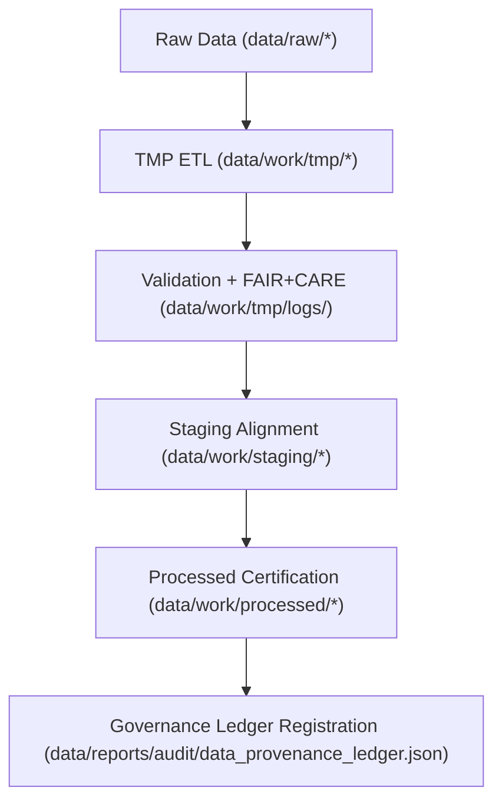

<div align="center">

# ⚙️ Kansas Frontier Matrix — **Work Data Layer**
`data/work/README.md`

**Purpose:** Core operational layer for ETL, AI/ML, and FAIR+CARE governance workflows within the Kansas Frontier Matrix (KFM).  
This environment manages all transient, staging, and processed data with complete traceability, ethical compliance, and provenance logging.

[](../../docs/standards/faircare-validation.md)
[](../../LICENSE)
[](../../docs/architecture/repo-focus.md)

</div>

---

## 📚 Overview

The `data/work/` directory functions as the **KFM operational workspace**, orchestrating ETL pipelines, FAIR+CARE audits, and governance-controlled data staging.  
It ensures reproducible transformations, transparent lineage, and ethical handling across all data domains.

### Core Responsibilities
- Handle intermediate datasets used during transformation and AI validation workflows.  
- Provide complete provenance from ingestion to certified data outputs.  
- Integrate FAIR+CARE auditing into every ETL cycle.  
- Support schema validation, version control, and AI model training readiness.

This layer adheres to **MCP-DL v6.3**, ensuring compliance with FAIR+CARE data ethics and open-science reproducibility.

---

## 🗂️ Directory Layout

```plaintext
data/work/
├── README.md
│
├── tmp/                       # Transient ETL and AI temporary workspace
│   ├── climate/               # NOAA, NIDIS, CPC data normalization
│   ├── hazards/               # Hazard ETL, model prep, and validation
│   ├── hydrology/             # Watershed and groundwater analysis
│   ├── landcover/             # Landcover index harmonization
│   ├── tabular/               # Schema alignment for tabular inputs
│   ├── terrain/               # DEM and elevation analysis
│   ├── text/                  # OCR and NLP workspace for documents
│   └── logs/                  # Validation and audit logging
│
├── staging/                   # Schema-aligned validated workspace
│   ├── tabular/               # Normalized CSV datasets
│   ├── spatial/               # GeoJSON / GeoParquet staging
│   ├── metadata/              # FAIR+CARE audit summaries
│   └── logs/                  # Validation logs and schema checks
│
└── processed/                 # Certified datasets ready for archival
    ├── climate/               # Harmonized climate layers
    ├── hazards/               # Risk model and hazard outputs
    ├── hydrology/             # Hydrological analytics
    ├── tabular/               # Cleaned and validated tabular datasets
    ├── spatial/               # Integrated spatial layers with STAC/DCAT
    └── metadata/              # Certified metadata exports
```

---

## ⚙️ Work Layer Workflow



### Description
1. **TMP:** Data is cleaned and preprocessed for transformation.  
2. **Validation:** FAIR+CARE and schema compliance checks applied.  
3. **Staging:** Aligned to standards, awaiting promotion.  
4. **Processed:** Final datasets validated and indexed for release.  
5. **Governance:** Each action recorded to the immutable provenance ledger.

---

## 🧩 Example Metadata Record

```json
{
  "id": "work_hazards_pipeline_v9.4.0",
  "domain": "hazards",
  "pipeline": "src/pipelines/etl/hazards_etl_pipeline.py",
  "records_processed": 22112,
  "staging_promotion": "2025-11-02T14:00:00Z",
  "checksum": "sha256:e58cbaf0e4f1a3a6d96ffb1f547d29f8c1342a1b...",
  "validator": "@kfm-etl",
  "fairstatus": "certified",
  "governance_ref": "data/reports/audit/data_provenance_ledger.json"
}
```

---

## 🧠 FAIR+CARE Governance Framework

| Principle | Implementation |
|------------|----------------|
| **Findable** | Indexed with unique IDs and schema descriptors. |
| **Accessible** | Reproducible open formats and transparent policy. |
| **Interoperable** | Conforms to STAC 1.0 / DCAT 3.0 schemas. |
| **Reusable** | Versioned artifacts with checksum lineage. |
| **Collective Benefit** | Supports ethical reuse and open research. |
| **Authority to Control** | Managed by FAIR+CARE Governance Council. |
| **Responsibility** | Validators ensure accuracy and traceability. |
| **Ethics** | All transformations pass ethics and compliance review. |

---

## ⚖️ Governance & Provenance Records

| File | Description |
|------|-------------|
| `data/reports/audit/data_provenance_ledger.json` | Immutable ledger of ETL transformations. |
| `data/reports/fair/data_care_assessment.json` | Annual FAIR+CARE audit results. |
| `data/reports/validation/schema_validation_summary.json` | Contract compliance validation reports. |
| `releases/v9.4.0/manifest.zip` | Comprehensive checksum registry. |

Automation via `.github/workflows/data-governance.yml`.

---

## 🧾 Retention Policy

| Layer | Retention | Policy |
|--------|------------|--------|
| TMP | 14 days | Auto-purge after staging. |
| Staging | 180 days | Retained for governance audits. |
| Processed | Permanent | Canonical archive. |
| Logs | 365 days | Stored for reproducibility. |

Cleanup handled via `work_cleanup.yml` workflow.

---

## 🧾 Internal Citation

```text
Kansas Frontier Matrix (2025). Work Data Layer (v9.4.0).
Core operational workspace enabling ETL reproducibility, AI governance, and FAIR+CARE validation.
Maintains transparent lineage, ethics compliance, and provenance assurance.
Internal — for system processing and governance operations.
```

---

## 🧾 Version Notes

| Version | Date | Notes |
|----------|------|--------|
| v9.4.0 | 2025-11-02 | Added AI/ML cross-domain staging and ledger-linked checksum validation. |
| v9.3.2 | 2025-10-28 | Unified TMP, staging, processed layer under FAIR+CARE governance. |
| v9.2.0 | 2024-07-15 | Expanded terrain and text ETL coverage. |
| v9.0.0 | 2023-01-10 | Initial reproducible work layer architecture. |

---

<div align="center">

**Kansas Frontier Matrix** · *FAIR+CARE Ethics × Provenance × Reproducibility*  
[🔗 Repository](https://github.com/bartytime4life/Kansas-Frontier-Matrix) • [📘 Docs](../../docs/) • [⚖️ Governance Ledger](../../docs/standards/governance/)

</div>
