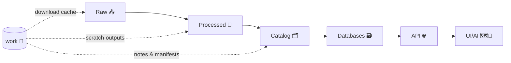

# 🧰 `data/work/` — Working Data Sandbox (Non‑Authoritative)


> [!WARNING]
> **Nothing in `data/work/` is “source of truth.”**  
> This directory exists for *iteration*, *experiments*, and *scratch outputs* only. Anything destined for publication must be promoted into the governed pipeline (Raw ➜ Processed ➜ Catalog ➜ Databases ➜ API ➜ UI/AI).

---

## 🎯 What this folder is for

`data/work/` is the **hands-on workshop** for the Kansas Frontier Matrix (KFM) data pipeline: quick prototypes, staging, exploratory transformations, QA checks, and intermediate artifacts created while you learn/iterate.

Typical uses:
- 🧪 **Exploratory ETL**: rough transforms, schema experiments, trial joins, validation spikes
- 🧊 **Caches**: downloaded source bundles, API responses (when allowed), temporary tiles
- 🧹 **Pre-QA / QA**: profiling, row counts, geometry checks, bounding boxes, sampling
- 🧾 **Run manifests**: lightweight logs + provenance notes to preserve “how we got here”
- 🗺️ **Preview outputs**: small sample GeoJSON, plots, screenshots, debug tiles (small only)

---

## 🧭 Where `work/` fits in the “truth path”



**Rule:** `work/` can *assist* any stage, but **must not replace** any stage.

---

## 📁 Recommended structure

Keep `work/` predictable so tools and humans can find things fast:

```text
data/
├─ raw/ 📥                  # immutable source snapshots (governed)
├─ processed/ 🧼            # cleaned/standardized outputs (governed)
├─ catalog/ 🗂️             # metadata, STAC/DCAT, provenance (governed)
└─ work/ 🧰                 # (YOU ARE HERE) scratch + iteration (NOT governed)
   ├─ tmp/ 🧯               # throwaway files (safe to delete anytime)
   ├─ cache/ 🧊             # re-download avoidance (safe to delete anytime)
   ├─ runs/ 🏃              # one folder per experiment/run (recommended)
   ├─ experiments/ 🧪       # notebooks / ad-hoc spikes (small outputs only)
   └─ reports/ 📊           # QA summaries, profiling results (small text/plots)
```

> [!TIP]
> Treat `tmp/` and most of `cache/` as **rebuildable**. If it can’t be rebuilt, it doesn’t belong here.

---

## 🏃 Run folder contract (✅ do this)

Each meaningful experiment should get a dedicated run folder:

```text
data/work/runs/YYYY-MM-DD__<pipeline>__<dataset_slug>/
├─ manifest.yml             # what you did + where inputs came from
├─ provenance.jsonld        # optional but recommended: PROV-style record
├─ logs/                    # stdout/stderr, validation logs
├─ inputs/                  # small samples only (or pointers)
├─ outputs/                 # small outputs only (or pointers)
└─ notes.md                 # decisions, issues, next steps
```

### `manifest.yml` (template)
```yaml
run_id: "2026-02-03__ingest__ks_dasc_counties"
owner: "@your-handle"
goal: "Validate geometry + normalize CRS; prep for processed promotion"

inputs:
  - name: "DASC counties layer"
    source: "https://…"
    retrieved_at: "2026-02-03T20:00:00Z"
    license: "TBD"
    checksum_sha256: "TBD"

processing:
  steps:
    - "download"
    - "inspect schema"
    - "reproject to EPSG:4326"
    - "fix invalid geometries"
  code_ref:
    git_sha: "TBD"
    entrypoint: "pipelines/…"
  environment:
    container: "TBD"
    tool_versions:
      python: "TBD"
      gdal: "TBD"

outputs:
  - name: "counties_sample.geojson"
    path: "data/work/runs/.../outputs/counties_sample.geojson"
    size_bytes: 123456
    notes: "sample only; full data promoted elsewhere"

promotion_intent:
  target_stage: "processed"
  required_checks:
    - "license verified"
    - "schema validated"
    - "provenance recorded"
```

---

## ✅ Promotion checklist (work ➜ governed pipeline)

Before anything leaves `work/` and becomes “real”:

1. 🔒 **License & rights check**
   - Confirm allowed use + redistribution
   - Record license string & source link in metadata

2. 🧾 **Provenance captured (“map behind the map”)**
   - Source URL(s), retrieval date/time, checksums
   - Toolchain + parameters + code reference (git SHA)

3. 🧪 **Quality gates**
   - Schema validation (types, null rules)
   - Spatial validation (CRS, geometry validity, bbox sanity)
   - Basic profiling (row counts, uniqueness, join keys)

4. 🗂️ **Catalog entry created**
   - Minimum viable metadata (title, description, extent, license, lineage)
   - Add STAC/DCAT/PROV artifacts *where your repo expects them*

5. 🗃️ **Load & serve through the API (no bypasses)**
   - No UI direct-to-DB shortcuts
   - Publish via the service layer

> [!IMPORTANT]
> Promotion is a **one-way mindset**: once promoted, the governed copies become the reference—not the scratch files in `work/`.

---

## 🧼 What NOT to put in `data/work/`

**Hard “no” list:**
- 🔑 Secrets (API keys, tokens, `.env`, credentials)
- 🧍 PII / sensitive records unless explicitly approved + governed
- 🏋️ Huge binaries (rasters, LiDAR, full tilesets) committed to git
- 📌 Anything “production-critical” that can’t be recreated

> [!NOTE]
> Large artifacts belong in object storage + referenced via metadata (STAC items, manifests, or catalog pointers), not committed here.

---

## 🧷 Git hygiene (keep the repo healthy)

Recommended approach:
- ✅ Commit: `README.md`, run manifests (`manifest.yml`), small QA reports, tiny samples
- ❌ Do not commit: big downloads, big intermediate outputs, database dumps

If needed, keep empty dirs with a `.gitkeep`:
```text
data/work/tmp/.gitkeep
data/work/cache/.gitkeep
```

---

## 🧠 Workflow philosophy (why this exists)

This folder is intentionally designed for:
- **Iterative cycles** (try ➜ observe ➜ refine ➜ promote)
- **Fast feedback** with minimal ceremony *until* you’re ready to govern the output
- **Transparent decisions** via lightweight manifests + notes

---

## 🔗 Related docs (inside the repo)

- `../../docs/architecture/` 🏛️ *(system overview, truth path, governance)*
- `../../pipelines/` 🧰 *(ETL entrypoints, dataset recipes, loaders)*
- `../../docs/data/` 🗂️ *(metadata standards, catalog format, naming rules)*

> If these paths differ in your checkout, update links here to match the repo layout.

---

## 🙌 Quick start (copy/paste)

```bash
# 1) Create a new run folder
mkdir -p data/work/runs/$(date +%F)__<pipeline>__<dataset_slug>/{logs,inputs,outputs}

# 2) Add a manifest
touch data/work/runs/$(date +%F)__<pipeline>__<dataset_slug>/manifest.yml

# 3) Do your work, then promote outputs into governed stages
#    raw/ -> processed/ -> catalog/ -> db -> api -> ui/ai
```

---

## 📌 Maintainership

- Default owner: **Data / Pipeline maintainers**
- PR expectation: If you add a new workflow, include at least:
  - `manifest.yml` (or equivalent)
  - a short `notes.md`
  - a clear promotion plan (where it lands in the governed pipeline)

✨ Keep it rebuildable. Keep it traceable. Keep it honest.