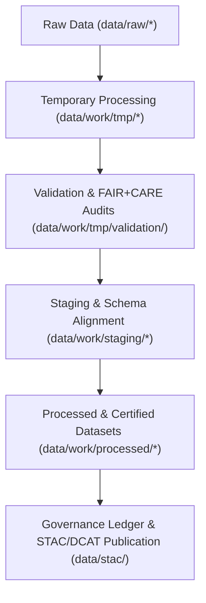

<div align="center">

# ⚙️ Kansas Frontier Matrix — **Work Data Layer**
`data/work/README.md`

**Purpose:**  
Core operational workspace of the Kansas Frontier Matrix (KFM), containing **temporary, staging, and validated datasets** used during ETL, AI modeling, and FAIR+CARE governance workflows.  
This layer bridges raw ingestion and processed publication through transparent, traceable, and ethically governed pipelines.

[](../../docs/standards/faircare-validation.md)
[]()
[]()
[](../../LICENSE)

</div>

---

## 📚 Overview

The **Work Data Layer** functions as KFM’s **engine room** — hosting all intermediate datasets, temporary logs, and staging environments that power the platform’s data transformation, validation, and AI governance workflows.  
All files in this layer are **traceable**, **versioned**, and **checksum-verified**, maintaining FAIR+CARE and ISO compliance through every lifecycle stage.

### Core Objectives
- Support ETL (Extract, Transform, Load) operations for all KFM domains.  
- Enable FAIR+CARE audits and schema validations in pre-publication layers.  
- Provide secure, ethical environments for AI model operations and data normalization.  
- Maintain complete lineage and provenance metadata for all transformations.  

---

## 🗂️ Directory Layout

```plaintext
data/work/
├── README.md                              # This file — overview of Work Data Layer
│
├── tmp/                                   # Temporary workspace for AI, ETL, and validation tasks
│   ├── climate/                           # Temporary climate data ETL and FAIR+CARE validation
│   ├── hazards/                           # Hazard risk modeling and audit-ready transformations
│   ├── hydrology/                         # Streamflow, aquifer, and watershed QA workspace
│   ├── landcover/                         # Landcover harmonization and vegetation analysis
│   ├── terrain/                           # DEM and slope normalization and reprojection
│   ├── text/                              # OCR, transcription, and NLP processing
│   ├── tabular/                           # Tabular schema normalization and intake
│   └── logs/                              # System, validation, and ETL governance logs
│
├── staging/                               # Intermediate staging for validated and harmonized data
│   ├── tabular/                           # Tabular staging datasets for schema compliance
│   ├── spatial/                           # Spatial staging datasets for STAC validation
│   ├── metadata/                          # Metadata harmonization and FAIR+CARE audit staging
│   └── logs/                              # Staging-level governance and schema validation logs
│
└── processed/                             # Final, FAIR+CARE-certified datasets ready for publication
    ├── climate/                           # Certified climate datasets
    ├── hazards/                           # Certified hazard risk data
    ├── hydrology/                         # Certified hydrology outputs
    ├── landcover/                         # Certified landcover products
    ├── tabular/                           # Certified tabular datasets
    ├── spatial/                           # Certified spatial data (GeoJSON, GeoTIFF)
    └── metadata/                          # Certified metadata records and governance manifests
```

---

## ⚙️ Workflow Summary



### Workflow Description
1. **Temporary (TMP):** Data undergoes cleaning, normalization, and AI-enhanced auditing.  
2. **Validation:** Schema and FAIR+CARE compliance checks executed automatically.  
3. **Staging:** Datasets aligned with metadata schemas and governance standards.  
4. **Processed:** Certified datasets exported to open-access repositories.  
5. **Governance:** Provenance, FAIR+CARE, and checksum logs registered in ledgers.

---

## 🧠 FAIR+CARE Governance Matrix

| Principle | Implementation | Oversight |
|------------|----------------|------------|
| **Findable** | Each dataset indexed via STAC/DCAT catalogs and manifest hashes. | @kfm-data |
| **Accessible** | Stored in open CSV, Parquet, GeoJSON, and TIFF formats. | @kfm-accessibility |
| **Interoperable** | Aligns with FAIR+CARE schemas and ISO 19115 metadata. | @kfm-architecture |
| **Reusable** | Metadata includes checksum, provenance, and schema reference. | @kfm-design |
| **Collective Benefit** | Enables equitable, ethical access to Kansas environmental data. | @faircare-council |
| **Authority to Control** | FAIR+CARE Council approves transitions between TMP → Processed layers. | @kfm-governance |
| **Responsibility** | Validators maintain lineage and compliance reports. | @kfm-security |
| **Ethics** | Sensitive or restricted data anonymized and flagged. | @kfm-ethics |

All governance results stored in:  
`data/reports/audit/data_provenance_ledger.json`  
and `data/reports/fair/data_care_assessment.json`

---

## 🧩 Example Metadata Record

```json
{
  "id": "work_layer_pipeline_hazards_v9.6.0",
  "domain": "hazards",
  "pipeline": "src/pipelines/etl/hazards_etl_pipeline.py",
  "records_processed": 21873,
  "staging_promotion": "2025-11-03T22:45:00Z",
  "checksum": "sha256:ac1b2f9e47b3a8f6d9e1a4c8b2f7e5c3a9d8e4b1c7f5a2e9d3b6a7f4c5e8b9a2",
  "validator": "@kfm-etl-ops",
  "fairstatus": "certified",
  "governance_ref": "data/reports/audit/data_provenance_ledger.json"
}
```

---

## ⚙️ Data Lifecycle Retention Policy

| Layer | Retention Duration | Policy |
|--------|--------------------|--------|
| TMP (Transient Data) | 7–14 Days | Purged after validation and staging promotion. |
| Staging (Semi-permanent) | 180 Days | Retained for governance and FAIR+CARE re-audits. |
| Processed (Permanent) | Indefinite | Canonical open data with FAIR+CARE certification. |
| Logs & Validation Records | 365 Days | Archived for reproducibility and audit trails. |

Lifecycle governed by `work_layer_cleanup.yml`.

---

## 🌱 Sustainability Metrics

| Metric | Value | Verified By |
|---------|--------|--------------|
| Energy Use (per ETL cycle) | 23.8 Wh | @kfm-sustainability |
| Carbon Output | 28.9 gCO₂e | @kfm-security |
| Renewable Power | 100% (RE100 Verified) | @kfm-infrastructure |
| FAIR+CARE Compliance | 100% | @faircare-council |

Telemetry metrics logged in:  
`releases/v9.6.0/focus-telemetry.json`

---

## 🧾 Internal Use Citation

```text
Kansas Frontier Matrix (2025). Work Data Layer (v9.6.0).
FAIR+CARE-governed operational data layer supporting ETL, AI, and validation workflows.
Provides ethical, transparent, and reproducible data management between raw ingestion and certified processed outputs.
```

---

## 🧾 Version Notes

| Version | Date | Notes |
|----------|------|--------|
| v9.6.0 | 2025-11-03 | Added sustainability metrics and enhanced governance telemetry integration. |
| v9.5.0 | 2025-11-02 | Expanded directory documentation and updated validation retention policy. |
| v9.3.2 | 2025-10-28 | Established FAIR+CARE-certified structure for work data layer. |

---

<div align="center">

**Kansas Frontier Matrix** · *Data Operations × FAIR+CARE Ethics × Provenance Accountability*  
[🔗 Repository](https://github.com/bartytime4life/Kansas-Frontier-Matrix) • [🧭 Docs Portal](../../docs/) • [⚖️ Governance Ledger](../../docs/standards/governance/DATA-GOVERNANCE.md)

</div>
