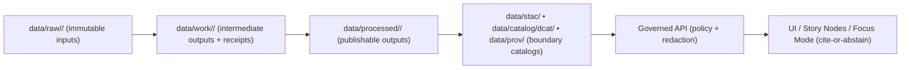

<!--
KANSAS FRONTIER MATRIX (KFM) — Governed Data Workspace
File: data/work/README.md
Last updated: 2026-02-16
-->

# 🧪 `data/work/` — Working Zone (Intermediate Outputs)


> [!IMPORTANT]
> **Nothing in `data/work/` is considered authoritative.**
> This directory is for **intermediate, reproducible artifacts** produced while transforming:
>
> `data/raw/` ➜ `data/work/` ➜ `data/processed/`
>
> **Do not serve, publish, export, or cite `data/work/` outputs as “truth.”**

---

## ✅ What belongs here

- Intermediate ETL outputs (cleaned tables, temporary joins, format conversions, clipped subsets, etc.)
- Validation artifacts and *run receipts* (e.g., `run_record`, `validation_report`, `run_manifest`)
- QA snapshots (schema diffs, small redacted samples, checksums)
- Temporary caches needed to complete a run (**safe to delete**)

---

## 🚫 What must NOT belong here

- Final “publishable” datasets (those belong in `data/processed/`)
- Mutable copies of *raw* source snapshots (raw must remain immutable in `data/raw/`)
- Secrets (API keys, tokens, passwords), private keys, `.env` files
- Any content that would violate **rights**, **privacy**, or **sensitivity** if exposed  
  (treat work artifacts as **sensitive-by-default** unless explicitly cleared)

> [!WARNING]
> **Sensitive-location risk is real.** If work artifacts contain restricted locations (e.g., archaeological points),
> assume they are **not publishable** without generalization + governance review.

---

## 🧭 Canonical truth path (high-level)



---

## 🗂️ Directory layout

```text
data/work/
└── <domain>/                       # bounded topic area (e.g., "land-parcels", "newspapers", "boundaries")
    ├── runs/                        # recommended: one folder per ETL run
    │   └── <run_id>/
    │       ├── receipts/            # REQUIRED for promotion (contract evidence)
    │       ├── stage/               # intermediate outputs (safe to delete/regenerate)
    │       └── logs/                # structured logs (NO secrets)
    ├── scratch/                     # local exploration (should remain local; typically not committed)
    └── README.md                    # optional domain notes (or keep runbook under docs/)
```

> [!NOTE]
> Subfolder names under `data/work/<domain>/` can vary by pipeline, but these invariants may not:
> **intermediate + reproducible + non-authoritative + fail-closed on risk**.

---

## 🧾 Receipts and evidence (promotion prerequisites)

Promotion from Work ➜ Processed is a **governed action**. If evidence is missing, promotion must not happen.

**Minimum expected receipts** (names may vary, but the roles don’t):
- `run_record` — what ran, when, with what versions/config
- `validation_report` — checks performed + pass/fail results + quality notes
- `run_manifest` — inputs/outputs + checksums (so reruns are provable)

---

## 🧰 Governance rules (non-negotiable behaviors)

| Rule | Why it exists | Practical enforcement |
|---|---|---|
| **Work outputs are not truth** | Prevent intermediates becoming “accidental truth” | UI/API must only expose processed + cataloged assets |
| **Fail closed on sensitivity** | Reduce harm from restricted/unsafe disclosure | Default classification = restricted until cleared |
| **Receipts required for promotion** | Preserve auditability + reproducibility | Promotion gate denies if receipts are missing |
| **No secrets in work** | Prevent credential leakage via artifacts/logs | Secret manager usage + redaction + CI checks |
| **Reproducible from raw** | Enables rebuilds and external verification | Capture params + versions in receipts |

---

## ✅ Promotion checklist: `data/work/` ➜ `data/processed/`

> [!TIP]
> Treat promotion as a **contract**: if you can’t prove it, you can’t publish it.

- [ ] Raw inputs are immutable and referenced (manifests + checksums exist)
- [ ] Receipts exist (**required**):
  - [ ] `run_record`
  - [ ] `validation_report`
  - [ ] `run_manifest`
- [ ] Outputs written to `data/processed/<domain>/` in canonical formats
- [ ] Boundary catalogs generated + cross-linked (publication boundary artifacts):
  - [ ] STAC items/collections (`data/stac/...`)
  - [ ] DCAT dataset record (`data/catalog/dcat/...`)
  - [ ] PROV lineage bundle (`data/prov/...`)
- [ ] Rights + attribution metadata captured and validated
- [ ] Sensitivity tags applied; public outputs generalized/redacted as required
- [ ] CI gates pass (schema validation + policy checks)

---

## 🧹 Cleanup and retention

- `data/work/` may be deleted and regenerated from `data/raw/`.
- Keep only what is needed for:
  - completing a run,
  - debugging a run,
  - proving promotion evidence (receipts + manifests).

> [!NOTE]
> If you retain anything long-term in `data/work/`, it should be **small, non-sensitive, and auditable** (receipts/manifests).
> Publishable assets still belong in `data/processed/`.

---

## 🧾 Git hygiene (recommended)

Most `data/work/**` should **not** be committed.

If you must commit artifacts here, prefer:
- receipts (`*.json`, `*.jsonld`, `*.ttl`) that are **small** and **non-sensitive**
- checksums/manifests
- tiny QA samples (**redacted/synthetic only**)

Example `.gitignore` snippet:

```gitignore
# Intermediate / bulky / local
data/work/**/stage/
data/work/**/scratch/
data/work/**/tmp/
data/work/**/logs/*.log
data/work/**/outputs/

# Keep receipts (subject to review gates)
!data/work/**/receipts/**
```

---

## 🔎 Verification steps (minimum viable)

1. Pick **one pilot dataset** and run end-to-end: `raw ➜ work ➜ processed`.
2. Confirm:
   - deleting `data/work/<domain>/runs/<run_id>/stage/` and re-running reproduces outputs,
   - promotion fails if **any receipt** is missing,
   - no UI/API paths reference `data/work/` directly.

---

## 📚 Glossary

- **Work zone**: Intermediate artifacts produced during ETL; not served to users.
- **Promotion Contract**: Fail-closed gate that blocks publication unless required evidence exists.
- **Receipts**: Machine-readable run records (inputs, outputs, checks, versions) used for audit/provenance.