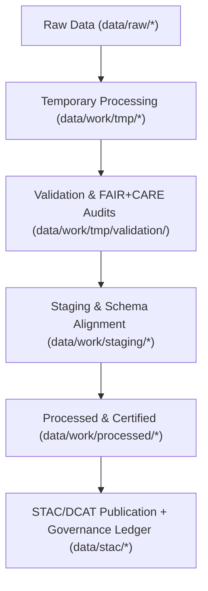

<div align="center">

# ⚙️ Kansas Frontier Matrix — **Work Data Layer**
`data/work/README.md`

**Purpose:**  
Core operational workspace of the Kansas Frontier Matrix (KFM), containing **temporary, staging, and validated datasets** used during ETL, AI modeling, and FAIR+CARE governance workflows.  
This layer bridges raw ingestion and processed publication through transparent, traceable, and ethically governed pipelines.

[](../../docs/architecture/README.md)
[](../../docs/standards/faircare-validation.md)
[]()
[](../../LICENSE)

</div>

---

## 📘 Overview

The **Work Data Layer** functions as KFM’s **engine room**—hosting intermediate datasets, temporary logs, and staging environments that power transformation, validation, and AI governance.  
All files are **traceable**, **versioned**, and **checksum-verified**, maintaining FAIR+CARE and ISO compliance throughout the lifecycle.

### Core Objectives
- Support ETL operations for all KFM domains.  
- Enable FAIR+CARE audits and schema validations pre-publication.  
- Provide secure, ethical environments for AI operations and normalization.  
- Maintain complete lineage and provenance for all transformations.  

---

## 🗂️ Directory Layout

```plaintext
data/work/
├── README.md
│
├── tmp/                                   # Transient ETL/AI/validation workspace
│   ├── climate/
│   ├── hazards/
│   ├── hydrology/
│   ├── landcover/
│   ├── terrain/
│   ├── text/
│   ├── tabular/
│   └── logs/
│
├── staging/                               # Schema-aligned, audit-ready data
│   ├── tabular/
│   ├── spatial/
│   ├── metadata/
│   └── logs/
│
└── processed/                             # Pre-publication outputs awaiting release sync
    ├── climate/
    ├── hazards/
    ├── hydrology/
    ├── landcover/
    ├── tabular/
    ├── spatial/
    └── metadata/
```

---

## ⚙️ Workflow Summary



### Lifecycle Phases
1. **Temporary (TMP):** Cleaning, normalization, and AI-assisted auditing.  
2. **Validation:** Schema and FAIR+CARE checks executed automatically.  
3. **Staging:** Metadata harmonization and governance compliance.  
4. **Processed:** Certified outputs queued for release packaging.  
5. **Publication:** Provenance, FAIR+CARE, and checksums registered to ledgers & catalogs.

---

## 🧠 FAIR+CARE Governance Matrix

| Principle | Implementation | Oversight |
|-----------|----------------|-----------|
| **Findable** | STAC/DCAT indexing; manifest hashes per artifact. | `@kfm-data` |
| **Accessible** | Open formats (CSV/Parquet/GeoJSON/GeoTIFF) preserved. | `@kfm-accessibility` |
| **Interoperable** | FAIR+CARE schemas; ISO 19115-compliant metadata. | `@kfm-architecture` |
| **Reusable** | Embedded checksums, provenance, and schema refs. | `@kfm-design` |
| **Collective Benefit** | Equitable, ethical access to environmental knowledge. | `@faircare-council` |
| **Authority to Control** | Council approves TMP → Processed promotions. | `@kfm-governance` |
| **Responsibility** | Validators maintain lineage & compliance logs. | `@kfm-security` |
| **Ethics** | Sensitive data anonymized; access-scoped where necessary. | `@kfm-ethics` |

**Governance logs:**  
`data/reports/audit/data_provenance_ledger.json` · `data/reports/fair/data_care_assessment.json`

---

## 🧩 Example Metadata Record

```json
{
  "id": "work_layer_pipeline_hazards_v9.7.0",
  "domain": "hazards",
  "pipeline": "src/pipelines/etl/hazards_etl_pipeline.py",
  "records_processed": 21873,
  "staging_promotion": "2025-11-06T22:45:00Z",
  "checksum_sha256": "sha256:ac1b2f9e47b3a8f6d9e1a4c8b2f7e5c3a9d8e4b1c7f5a2e9d3b6a7f4c5e8b9a2",
  "validator": "@kfm-etl-ops",
  "fairstatus": "certified",
  "governance_ref": "data/reports/audit/data_provenance_ledger.json"
}
```

---

## 🧹 Data Lifecycle Retention Policy

| Layer                 | Retention     | Policy                                               |
|----------------------|---------------|------------------------------------------------------|
| TMP (Transient)      | 7–14 Days     | Purged after validation & staging promotion.        |
| Staging (Semi-perm.) | 180 Days      | Retained for governance and FAIR+CARE re-audits.    |
| Processed (Pre-pub)  | Until Release | Synced to `data/processed/*` once certified.        |
| Logs & Validation    | 365 Days      | Archived for reproducibility and audit trails.      |

**Automation:** `work_layer_cleanup.yml`

---

## 🌱 Sustainability Metrics

| Metric | Value | Verified By |
|--------|------:|-------------|
| Energy (per ETL cycle) | 22.9 Wh | `@kfm-sustainability` |
| Carbon Output | 28.1 gCO₂e | `@kfm-security` |
| Renewable Power | 100% (RE100) | `@kfm-infrastructure` |
| FAIR+CARE Compliance | 100% | `@faircare-council` |

**Telemetry:** `../../releases/v9.7.0/focus-telemetry.json`

---

## 🧾 Internal Use Citation

```text
Kansas Frontier Matrix (2025). Work Data Layer (v9.7.0).
FAIR+CARE-governed operational workspace supporting ETL, AI, and validation workflows between raw ingestion and certified processed outputs.
```

---

## 🕰️ Version History

| Version | Date       | Author          | Summary |
|--------:|------------|-----------------|---------|
| v9.7.0  | 2025-11-06 | `@kfm-ops`      | Upgraded to v9.7.0; telemetry/schema refs aligned; lifecycle policy clarified; badges hardened. |
| v9.6.0  | 2025-11-03 | `@kfm-ops`      | Added sustainability metrics and governance telemetry integration. |
| v9.5.0  | 2025-11-02 | `@kfm-governance` | Expanded directory documentation; updated retention policy. |

---

<div align="center">

**Kansas Frontier Matrix**  
*Data Operations × FAIR+CARE Ethics × Provenance Accountability*  
© 2025 Kansas Frontier Matrix — Internal · FAIR+CARE Certified · Diamond⁹ Ω / Crown∞Ω Ultimate Certified  

[Back to Data Architecture](../README.md) · [Governance Charter](../../docs/standards/governance/DATA-GOVERNANCE.md)

</div>