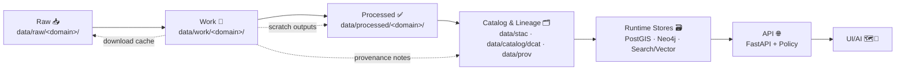

# 🧰 `data/work/` — Working Data Sandbox (Non‑Authoritative)


> [!WARNING]
> **Nothing in `data/work/` is “source of truth.”**  
> `work/` is the **intermediate + scratch stage** of KFM’s governed truth path. It is **regenerable**, and **not served to end users**.
>
> Anything destined for publication must travel the governed pipeline:  
> **Raw ➜ Work ➜ Processed ➜ Catalog & Lineage (STAC/DCAT/PROV) ➜ Runtime Stores ➜ API ➜ UI/AI**

---

## 🎯 What this folder is for

`data/work/` is the **hands‑on workshop** for the Kansas Frontier Matrix (KFM) data pipeline: quick prototypes, staging, exploratory transformations, QA checks, and intermediate artifacts created while you learn/iterate.

Typical uses:
- 🧪 **Exploratory ETL**: rough transforms, schema experiments, trial joins, validation spikes
- 🧊 **Caches**: downloaded source bundles, API responses (when allowed), temporary tiles
- 🧹 **Pre‑QA / QA**: profiling, row counts, geometry checks, bounding boxes, sampling
- 🧾 **Run manifests**: lightweight logs + provenance notes (“how we got here”)
- 🗺️ **Preview outputs**: *tiny* sample GeoJSON, plots, screenshots, debug tiles (small only)

> [!IMPORTANT]
> **Work is allowed to be messy. It is not allowed to be untraceable.**  
> If a work artifact influences a decision or promotion, it must have a manifest + provenance notes.

---

## 🧭 Where `work/` fits in the KFM “truth path”



**Rule:** `work/` can *assist* any stage, but **must not replace** any stage.  
**Rule:** Nothing moves “forward” without satisfying the **policy gates** for that transition.

---

## 📁 Recommended structure

Keep `work/` predictable so tools and humans can find things fast.

> [!NOTE]
> The examples below assume the canonical KFM staging layout:  
> `data/raw/<domain>/` ➜ `data/work/<domain>/` ➜ `data/processed/<domain>/`

```text
data/
├─ raw/ 📥
│  └─ <domain>/...              # immutable source snapshots (governed)
├─ work/ 🧪                     # (YOU ARE HERE) intermediate + scratch (NOT authoritative)
│  ├─ tmp/ 🧯                   # throwaway files (safe to delete anytime)
│  ├─ cache/ 🧊                 # re-download avoidance (safe to delete anytime)
│  ├─ runs/ 🏃                  # one folder per run/experiment (recommended)
│  ├─ experiments/ 🧪           # notebooks / ad-hoc spikes (small outputs only)
│  └─ reports/ 📊               # QA summaries, profiling results (small text/plots)
├─ processed/ ✅
│  └─ <domain>/...              # canonical cleaned outputs (governed)
├─ stac/ 🗺️
│  ├─ collections/              # STAC Collections (governed)
│  └─ items/                    # STAC Items (governed)
├─ catalog/ 🗂️
│  └─ dcat/                     # DCAT JSON-LD outputs (governed)
├─ prov/ 🧾                     # PROV lineage bundles (governed)
└─ graph/ 🕸️                    # graph import/export artifacts (governed)
   ├─ csv/
   └─ cypher/
```

> [!TIP]
> Treat `tmp/` and most of `cache/` as **rebuildable**. If it can’t be rebuilt, it doesn’t belong here.

---

## 🏃 Run folder contract

Each meaningful experiment should get a dedicated run folder.

```text
data/work/runs/YYYY-MM-DD__<pipeline>__<dataset_slug>/
├─ manifest.yml                 # what you did + where inputs came from
├─ provenance.jsonld            # optional but recommended (PROV-style record)
├─ logs/                        # stdout/stderr, validation logs
├─ checks/                      # schema checks, geometry checks, QA outputs
├─ inputs/                      # small samples only (or pointers)
├─ outputs/                     # small outputs only (or pointers)
└─ notes.md                     # decisions, issues, next steps
```

### `manifest.yml` (template)

```yaml
run_id: "2026-02-03__ingest__ks_dasc_counties"
owner: "@your-handle"
created_at: "2026-02-03T20:05:00Z"
goal: "Validate geometry + normalize CRS; prep for processed promotion"
domain: "boundaries"
dataset_slug: "ks_dasc_counties"
truth_path_stage: "work"

inputs:
  - name: "DASC counties layer"
    raw_path: "data/raw/boundaries/ks_dasc_counties.zip"
    source: "https://…"
    retrieved_at: "2026-02-03T20:00:00Z"
    license: "TBD"
    checksum_sha256: "TBD"
    sensitivity:
      classification: "public"   # public | internal | confidential | restricted
      notes: ""

processing:
  steps:
    - "download (raw snapshot)"
    - "inspect schema + nulls"
    - "reproject to EPSG:4326"
    - "fix invalid geometries"
    - "write small sample outputs for QA review"
  code_ref:
    git_sha: "TBD"
    entrypoint: "src/pipelines/boundaries/ks_dasc_counties.py"
  environment:
    container: "TBD"
    tool_versions:
      python: "TBD"
      gdal: "TBD"

outputs:
  - name: "counties_sample.geojson"
    path: "data/work/runs/2026-02-03__ingest__ks_dasc_counties/outputs/counties_sample.geojson"
    size_bytes: 123456
    notes: "sample only; full data promoted to processed stage"

promotion_intent:
  target_stage: "processed"
  target_paths:
    - "data/processed/boundaries/ks_counties.geojson"
  required_checks:
    - "license verified"
    - "schema validated"
    - "CRS validated"
    - "geometry validity checks passed"
    - "sensitivity classification recorded"
    - "provenance recorded (PROV bundle planned)"
  catalog_artifacts_expected:
    - "data/stac/items/<item>.json"
    - "data/catalog/dcat/<dataset>.jsonld"
    - "data/prov/<bundle>.jsonld"

notes:
  risks:
    - "TBD"
  next_steps:
    - "TBD"
```

---

## ✅ Promotion checklist

Before anything leaves `work/` and becomes “real”:

1. 🔒 **License & rights check**
   - Confirm allowed use + redistribution
   - Record license string & source link in metadata

2. 🧾 **Provenance captured (“map behind the map”)**
   - Source URL(s), retrieval date/time, checksums
   - Toolchain + parameters + code reference (git SHA)
   - Record what was *changed* and what was *discarded*

3. 🧪 **Quality gates**
   - Schema validation (types, null rules)
   - Spatial validation (CRS, geometry validity, bbox sanity)
   - Basic profiling (row counts, uniqueness, join keys)

4. 🗂️ **Catalog & lineage artifacts prepared**
   - STAC (items/collections): bbox, time range, links to assets
   - DCAT: dataset-level description, license, distributions
   - PROV: inputs → transformations → outputs (agents + timestamps)

5. 🗃️ **Load & serve through the platform boundary (no bypasses)**
   - No UI direct-to-DB shortcuts
   - Publish via the service layer (API + policy enforcement)

> [!IMPORTANT]
> Promotion is a **one-way mindset**: once promoted, the governed copies become the reference—not the scratch files in `work/`.

---

## 🛡️ Sovereignty, sensitivity, and redaction

KFM enforces **FAIR + CARE** expectations through policy gates and governance review.

**If you touch sensitive data in `work/`, you must treat it as sensitive everywhere:**
- Apply redaction/generalization at **processed outputs**
- Reflect redaction/sensitivity in **STAC/DCAT metadata**
- Ensure **API/Policy** does not serve unredacted data
- Ensure **UI** doesn’t leak sensitive data (even indirectly)

> [!WARNING]
> Some additions (e.g., culturally sensitive layers, detailed locations of protected sites, Indigenous data sovereignty contexts) may require **manual governance review** before promotion.

---

## 🧼 What NOT to put in `data/work/`

**Hard “no” list:**
- 🔑 Secrets (API keys, tokens, `.env`, credentials)
- 🧍 PII / sensitive records unless explicitly approved + governed
- 🏋️ Huge binaries (rasters, LiDAR, full tilesets) committed to git
- 📌 Anything “production-critical” that can’t be recreated

> [!NOTE]
> Large artifacts belong in object storage + referenced via metadata (STAC items, manifests, or catalog pointers), not committed here.

---

## 🧷 Git hygiene (keep the repo healthy)

Recommended approach:
- ✅ Commit: `README.md`, run manifests (`manifest.yml`), tiny QA reports, tiny samples
- ❌ Do not commit: big downloads, big intermediate outputs, database dumps

If needed, keep empty dirs with a `.gitkeep`:
```text
data/work/tmp/.gitkeep
data/work/cache/.gitkeep
```

Optional `.gitignore` pattern (adjust to taste):
```gitignore
# data/work is scratch by default
data/work/tmp/**
data/work/cache/**
data/work/runs/**/outputs/**

# allow small committed breadcrumbs
!data/work/**/manifest.yml
!data/work/**/notes.md
!data/work/**/reports/**
```

---

## 🔗 Related docs (inside the repo)

- `../../docs/architecture/` 🏛️ *(system overview, truth path, governance)*
- `../../src/pipelines/` 🧰 *(ETL entrypoints, dataset recipes, loaders)*
- `../../docs/data/` 🗂️ *(metadata standards, catalog format, naming rules)*
- `../../schemas/` 🧾 *(STAC/DCAT/PROV + validation schemas)*
- `../../tools/` 🔧 *(validators, helpers, dev utilities)*

> If these paths differ in your checkout, update links here to match the repo layout.

---

## 🙌 Quick start (copy/paste)

```bash
# 1) Create a new run folder
mkdir -p data/work/runs/$(date +%F)__<pipeline>__<dataset_slug>/{logs,checks,inputs,outputs}

# 2) Add a manifest + notes
touch data/work/runs/$(date +%F)__<pipeline>__<dataset_slug>/manifest.yml
touch data/work/runs/$(date +%F)__<pipeline>__<dataset_slug>/notes.md

# 3) Do your work, then promote outputs into governed stages
#    raw/ -> work/ -> processed/ -> (stac + dcat + prov) -> db -> api -> ui/ai
```

---

## 📌 Maintainership

- Default owner: **Data / Pipeline maintainers**
- PR expectation: If you add a new workflow, include at least:
  - `manifest.yml` (or equivalent)
  - a short `notes.md`
  - a clear promotion plan (where it lands in the governed pipeline)

✨ Keep it rebuildable. Keep it traceable. Keep it honest.
