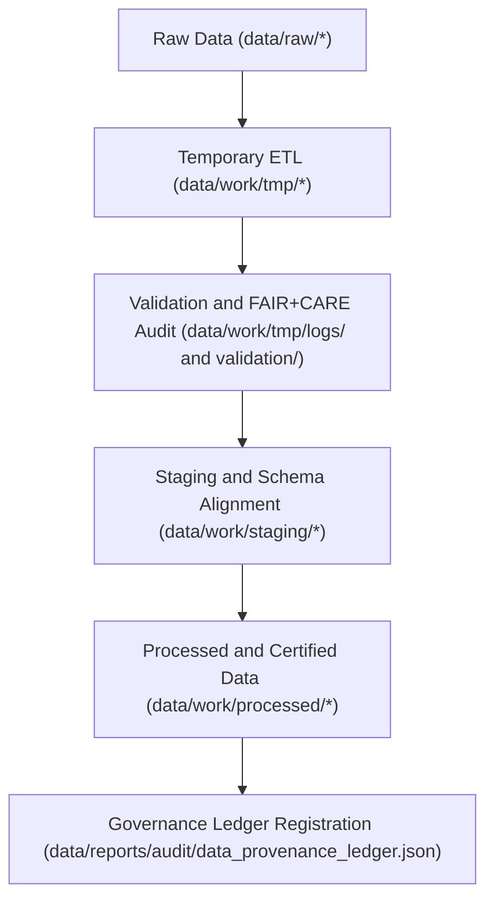

<div align="center">

# ⚙️ Kansas Frontier Matrix — **Work Data Layer**
`data/work/README.md`

**Purpose:** Core operational data layer of the Kansas Frontier Matrix (KFM), hosting transient, staging, and validated data used in ETL, AI/ML, and FAIR+CARE governance workflows.  
This layer bridges the gap between raw data ingestion and final processed outputs—ensuring every transformation is transparent, traceable, and ethically governed.

[](../../docs/standards/faircare-validation.md)
[](../../LICENSE)
[](../../docs/architecture/repo-focus.md)

</div>

---

## 📚 Overview

The `data/work/` directory represents the **engine room** of the KFM’s data operations—where active ETL (Extract, Transform, Load) and AI governance pipelines are executed.  
It provides controlled spaces for transformation, quality assurance, FAIR+CARE auditing, and domain-specific data staging.

### Key Responsibilities:
- Manage intermediate, validated, and staging datasets across all KFM domains.  
- Maintain transparent lineage from raw inputs to processed artifacts.  
- Facilitate FAIR+CARE data validation, audit logging, and provenance recording.  
- Support model-ready feature generation and transformation reproducibility.  

All subdirectories under this workspace conform to the **Master Coder Protocol (MCP-DL v6.3)** and are governed under FAIR+CARE and open data ethics policies.

---

## 🗂️ Directory Layout

```plaintext
data/work/
├── README.md                             # This file — overview of the KFM Work Data Layer
│
├── tmp/                                  # Temporary and transient workspace for ETL and AI workflows
│   ├── climate/                          # Temporary climate data (NOAA, NIDIS, CPC)
│   ├── hazards/                          # Hazard ETL and risk modeling workspace
│   ├── hydrology/                        # Watershed, groundwater, and streamflow processing
│   ├── landcover/                        # Landcover and vegetation index normalization
│   ├── tabular/                          # Temporary tabular datasets for normalization and validation
│   ├── terrain/                          # DEM, slope, and elevation reanalysis workspace
│   ├── text/                             # Text-processing workspace for OCR and historical documents
│   └── logs/                             # Transient system, ETL, and FAIR+CARE validation logs
│
├── staging/                              # Semi-permanent workspace for validated, schema-aligned data
│   ├── tabular/                          # Tabular staging (normalized tables and schema-compliant CSVs)
│   ├── spatial/                          # Spatial staging (GeoJSON, GeoParquet, raster tiles)
│   ├── metadata/                         # Metadata harmonization and FAIR+CARE audit staging
│   └── logs/                             # Staging validation and schema conformance logs
│
└── processed/                            # Final, validated data ready for archival and publication
    ├── climate/                          # Harmonized climate datasets and reanalysis results
    ├── hazards/                          # Processed hazard analytics and model outputs
    ├── hydrology/                        # Processed hydrological indicators
    ├── tabular/                          # Validated tabular datasets for distribution
    ├── spatial/                          # Final spatial datasets integrated with STAC/DCAT catalogs
    └── metadata/                         # Certified metadata for processed data layers
```

---

## ⚙️ Work Layer Workflow



### Workflow Description:
1. **Temporary Layer (TMP):** Data enters ETL pipelines for cleaning, transformation, and QA.  
2. **Validation:** Each TMP dataset undergoes FAIR+CARE audits, schema validation, and checksum registration.  
3. **Staging:** Validated data is prepared for publication, ensuring schema and ethics compliance.  
4. **Processed:** Final datasets are governance-certified, exported, and indexed into catalogs.  
5. **Governance:** Every data transition is logged into the provenance ledger and FAIR+CARE audit reports.

---

## 🧩 Example Metadata Record

```json
{
  "id": "work_layer_pipeline_hazards_v9.3.2",
  "domain": "hazards",
  "pipeline": "src/pipelines/etl/hazards_etl_pipeline.py",
  "records_processed": 21873,
  "staging_promotion": "2025-10-28T15:45:00Z",
  "checksum": "sha256:fc2be19c8b9f9c51c2479e77af84a93c28a1f0b8...",
  "validator": "@kfm-etl-ops",
  "fairstatus": "certified",
  "governance_ref": "data/reports/audit/data_provenance_ledger.json"
}
```

---

## 🧠 FAIR+CARE Governance Integration

| Principle | Implementation |
|------------|----------------|
| **Findable** | All work-layer datasets are indexed with versioned IDs, schema metadata, and FAIR+CARE tags. |
| **Accessible** | Open, reproducible formats (CSV, JSON, Parquet, GeoJSON) stored under transparent policies. |
| **Interoperable** | Data aligns with STAC 1.0, DCAT 3.0, and KFM schema contracts. |
| **Reusable** | Every artifact has checksum and provenance records linked to the governance ledger. |
| **Collective Benefit** | Enables ethical, transparent, and equitable access to Kansas environmental knowledge. |
| **Authority to Control** | FAIR+CARE Council governs schema promotion, access, and lifecycle rules. |
| **Responsibility** | Validators maintain audit logs of all transformations. |
| **Ethics** | All datasets pass FAIR+CARE ethics and governance audits prior to release. |

---

## ⚖️ Governance & Provenance Integration

| Record | Description |
|---------|-------------|
| `data/reports/audit/data_provenance_ledger.json` | Central record of all ETL lineage and FAIR+CARE certifications. |
| `data/reports/fair/data_care_assessment.json` | Annual audit summary for data ethics and accessibility. |
| `data/reports/validation/schema_validation_summary.json` | Schema and contract compliance tracking for all work-layer transitions. |
| `releases/v9.3.2/manifest.zip` | Global checksum registry linking TMP, staging, and processed datasets. |

All governance and synchronization events automated via GitHub Actions workflows (`*.yml` in `.github/workflows/`).

---

## 🧾 Retention Policy

| Layer | Retention Duration | Policy |
|--------|--------------------|--------|
| TMP (Transient Data) | 7–14 days | Purged after validation or staging promotion. |
| Staging (Semi-Permanent) | 180 days | Retained for governance audit review. |
| Processed (Permanent) | Indefinite | Archived as FAIR+CARE-certified canonical datasets. |
| Logs & Validation Records | 365 days | Archived for provenance and reproducibility. |

Lifecycle and cleanup tasks managed via `work_layer_cleanup.yml`.

---

## 🧾 Internal Use Citation

```text
Kansas Frontier Matrix (2025). Work Data Layer (v9.3.2).
Core operational data environment supporting ETL, AI, and FAIR+CARE validation workflows.
Maintains transparent provenance, ethics compliance, and open science traceability.
Restricted to internal processing and governance operations.
```

---

## 🧾 Version Notes

| Version | Date | Notes |
|----------|------|--------|
| v9.3.2 | 2025-10-28 | Unified TMP, staging, and processed sublayer structure under FAIR+CARE governance. |
| v9.2.0 | 2024-07-15 | Expanded domain coverage for terrain and text pipelines. |
| v9.0.0 | 2023-01-10 | Established work layer architecture for reproducible ETL workflows. |

---

<div align="center">

**Kansas Frontier Matrix** · *ETL Performance × FAIR+CARE Ethics × Provenance Continuity*  
[🔗 Repository](https://github.com/bartytime4life/Kansas-Frontier-Matrix) • [🧭 Docs Portal](../../docs/) • [⚖️ Governance Ledger](../../docs/standards/governance/)

</div>