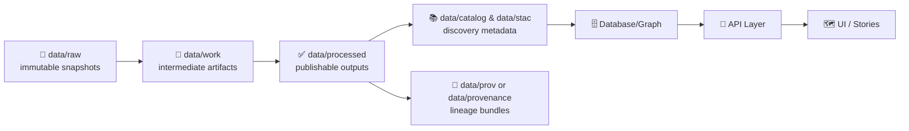

# 🧰 `data/work/` — Pipeline Workbench (Intermediate Artifacts)


> ✅ **TL;DR:** `data/work/` is the **scratch + staging zone** for repeatable ETL runs.  
> Nothing here should be treated as “published” or “API-ready.”  
> When you’re confident, **promote** outputs to `data/processed/` *with* catalogs + provenance.

---

## 🎯 What `data/work/` is for

Use this directory to hold **intermediate, reproducible artifacts** produced while transforming data:

- 🧪 **Intermediate transforms** (normalized tables, cleaned-but-not-final layers)
- 🧩 **Join outputs** (e.g., “treaty layer joined to census block IDs”)
- 🧹 **QA/QC reports** (row counts, null scans, geometry validity summaries)
- 🧰 **Pipeline logs** + run manifests (so runs can be re-audited)
- 🗃️ **Caches** to speed up iteration (safe to delete / regenerate)

---

## 🚫 What does **NOT** belong in `data/work/`

- ✅ **Final datasets intended for release** → put them in `data/processed/`
- 🪄 **AI/analysis outputs that will be referenced as evidence** → treat as a first-class dataset and store in `data/processed/...` with full lineage
- 🔑 **Secrets** (API keys, tokens, credentials) — never store here
- 🧍 **Sensitive or disallowed location/identity data** — if you must work with it locally, keep it out of Git and apply redaction rules before promotion
- ✍️ **Manual edits to “make it work”** — fix the pipeline instead (so results are reproducible)

---

## 🔁 Canonical data flow (where `work` sits)

KFM/KMS expects a **layered pipeline** where each stage depends on the previous stage.



**Rule of thumb:** if it’s not in `data/processed/` **and** not described by catalogs + provenance, it’s not “real” to the platform.

---

## 🗂️ Recommended folder layout

Organize by **domain** → **dataset** → **stages**.

```text
📁 data/
├─ 📁 raw/                                   🧾 source snapshots (immutable / read-only)
├─ 📁 work/                                  🧪 pipeline workspace (intermediate + ephemeral artifacts)
│  ├─ 📄 README.md                            👈 you are here
│  └─ 📁 <domain>/                            🧭 thematic bucket (e.g., historical/, hydrology/, soils/)
│     └─ 📁 <dataset_slug>/                   🏷️ dataset workspace (one dataset at a time)
│        ├─ 📁 _run/                          🧷 run manifests + pipeline fingerprints
│        │  ├─ 📄 run.json                     ✅ required: run config + tool versions + params
│        │  └─ 📁 logs/                        🪵 pipeline logs (stdout/stderr, timings, warnings)
│        ├─ 📁 stage_01_extract/               📦 unpack/unzip/extract outputs
│        ├─ 📁 stage_02_clean/                 🧼 cleaning (nulls, types, geometry fixes, de-dupe)
│        ├─ 📁 stage_03_normalize/             🧩 canonicalization (schema, CRS, domains, IDs)
│        ├─ 📁 stage_04_join/                  🔗 joins/enrichment (crosswalks, lookups, merges)
│        ├─ 📁 qc/                             🧪 QA/QC outputs (reports, expectations, diffs)
│        ├─ 📁 exports/                        📤 short-lived shareables (NOT final / not canonical)
│        └─ 📁 tmp/                            🗑️ delete-anytime scratch
├─ 📁 processed/                              ✅ final outputs consumed by DB/API/UI
├─ 📁 catalog/                                🗂️ discovery catalog (DCAT)
├─ 📁 stac/                                   🛰️ geospatial catalog (STAC)
└─ 📁 prov/                                   🧬 provenance bundles (or 📁 provenance/)
```

### ✅ Domain expansion pattern

When adding a new domain, keep it isolated and consistent:

- `data/raw/<new-domain>/` → source snapshots
- `data/work/<new-domain>/` → intermediate processing
- `data/processed/<new-domain>/` → final outputs
- Add a domain runbook under `docs/data/<new-domain>/` (and link it from your higher-level docs)

---

## 🏷️ Naming conventions (so artifacts stay searchable)

**Prefer “self-describing” filenames** that won’t confuse future-you:

**Recommended pattern**
- `dataset__stage__vX__YYYY-MM-DD__<optional-short-hash>.<ext>`

**Examples**
- `census_1900__normalize__v1__2026-01-29.parquet`
- `land_treaties__join_census__v2__2026-01-29__a1b2c3.geojson`
- `landsat_2010_kansas__cloudmask__v1__2026-01-29.tif`

**Always capture somewhere (file name or manifest):**
- 🌍 CRS / projection
- 🕒 time span represented
- 🔢 units + any transforms
- 🔁 pipeline + config version used

---

## 🧾 Run manifests & provenance (make work auditable)

Even though `data/work/` is “intermediate,” it should still be **traceable**.  
Every pipeline run should write a manifest that links:

- inputs (raw)
- intermediate outputs (work)
- final outputs (processed, if produced)
- pipeline version + config used

<details>
<summary>🧾 Suggested <code>_run/run.json</code> template</summary>

```json
{
  "run_id": "2026-01-29T18:42:11Z__census_1900__normalize__v1",
  "git_commit": "abc1234",
  "pipeline": "pipelines/census_1900",
  "config": {
    "profile": "default",
    "crs_out": "EPSG:4326",
    "notes": "normalize + standardize units"
  },
  "inputs": [
    {"path": "data/raw/census/1900.csv", "sha256": "…"}
  ],
  "intermediate_outputs": [
    {"path": "data/work/census/census_1900/stage_03_normalize/census_1900__normalize__v1__2026-01-29.parquet", "sha256": "…"}
  ],
  "qc": {
    "rows_in": 123456,
    "rows_out": 123456,
    "null_rates": {"population": 0.0},
    "geometry_valid": true
  },
  "timestamp_utc": "2026-01-29T18:42:11Z"
}
```

</details>

> 🧾 **Provenance expectation:** lineage should reference **raw inputs → work intermediates → processed outputs**, plus the **pipeline run/config**.

---

## 🔍 Quality gates you should run in `work/` (before promotion)

Use `data/work/` to catch issues early. A good minimum checklist:

- [ ] **Schema**: expected columns present, types correct
- [ ] **Ranges**: numeric fields sane (no impossible negatives, etc.)
- [ ] **Nulls**: missingness understood and documented
- [ ] **Duplicates**: key uniqueness confirmed (or intentional duplicates explained)
- [ ] **CRS**: known + consistent; any reprojection documented
- [ ] **Geometry** (if spatial): valid geometries, no obviously flipped coords
- [ ] **Time** (if temporal): time range verified + encoded consistently
- [ ] **Sampling sanity**: a quick map/view confirms it “looks right”
- [ ] **License + rights**: known before anything is considered publishable

---

## 🚀 Promotion checklist: `work/` → `processed/` ✅

When an artifact is ready to become a real dataset:

1. **Export final output** → `data/processed/<domain>/...`
2. **Generate boundary artifacts** (required for “published” state):
   - 🗂️ STAC item/collection
   - 🏷️ DCAT dataset entry
   - 🧾 PROV lineage bundle
3. **Validate** (schema + basic sanity)
4. **Commit + PR**
   - include processed data + metadata + provenance
   - let CI enforce requirements

> 🔒 **Governance note:** the project is designed to **fail closed** — if licensing/metadata/provenance is missing, promotion should be blocked.

---

## 🧹 Cleaning & retention

`data/work/` is allowed to be big and messy **during iteration** — but it should remain safe to prune.

**Good hygiene**
- Keep throwaway output in `tmp/`
- Keep caches in `cache/` (if you add it) and document how to rebuild
- Keep anything required for auditing in `_run/`

<details>
<summary>🧽 Example cleanup patterns</summary>

```bash
# clear only scratch + tmp (keep run manifests)
rm -rf data/work/<domain>/<dataset_slug>/tmp/*
rm -rf data/work/<domain>/<dataset_slug>/exports/*

# optional: remove *all* intermediates for a dataset (rebuild from raw)
rm -rf data/work/<domain>/<dataset_slug>/*
```

</details>

---

## 🔒 Safety, privacy & licensing reminders

Geospatial work frequently contains sensitive location information:

- 📍 **Locational privacy**: treat any location traces as potentially sensitive until proven otherwise.
- 🧾 **Metadata + copyright**: track origin, rights, and allowed uses early — *before* you publish anything.
- ✅ **Interoperability**: prefer standard formats and document coordinate/projection info.

### 🧾 Minimum metadata fields to capture (even while in `work/`)
When promoting, ensure you can provide at least:

- Identification (what it is)
- Quality (limits + confidence)
- Spatial data organization (how geometry is stored)
- Spatial reference (CRS/projection)
- Entity/attribute descriptions
- Distribution + use policy
- Citation info
- Temporal info
- Contact info

---

## 🔗 Quick navigation

- 📁 `../raw/` — immutable inputs
- ✅ `../processed/` — publishable outputs
- 📚 `../catalog/` — catalog metadata (DCAT)
- 🗂️ `../stac/` — STAC items/collections
- 🧾 `../prov/` *(or `../provenance/` depending on branch)* — lineage bundles

---

## 📚 Project reference shelf (handy for doing “work” correctly)

<details>
<summary>📖 Internal docs used to define conventions here</summary>

- 🧱 Kansas Frontier Matrix (KFM) — Comprehensive Technical Blueprint  
- 🧭 Master Guide (v13) — required staging layout + catalog/prov expectations  
- 🗺️ *Making Maps* — metadata, copyright, interoperability, and privacy considerations  
- 🛰️ Cloud-Based Remote Sensing w/ Earth Engine — practical QC + metadata habits  
- 🧭 Map Reading & Land Navigation — coordinate systems + ground-truth thinking  
- 📱 Mobile Mapping (Project Muse) — field capture patterns + GPS considerations  

</details>

---

<!--
📌 Source grounding (for maintainers)

Pipeline order + governance (fail closed) + PR/CI expectations:
- Fail closed + FAIR/CARE: :contentReference[oaicite:0]{index=0}
- Canonical pipeline order: :contentReference[oaicite:1]{index=1}
- Stage changes + CI checks catalog/provenance: :contentReference[oaicite:2]{index=2}

Staging layout + work folder intent:
- Raw → Work → Processed (required staging): :contentReference[oaicite:3]{index=3}
- Domain expansion pattern + docs guidance: :contentReference[oaicite:4]{index=4}
- Evidence artifacts belong in processed: :contentReference[oaicite:5]{index=5}

Metadata + privacy/copyright reminders:
- Metadata fields + locational privacy/copyright/interoperability: :contentReference[oaicite:6]{index=6}
-->

