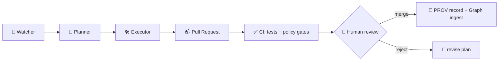

<div align="center">
<a id="top"></a>

# 🧰 `data/work/` — Workbench & Experiment Sandbox


-0a3069?style=flat-square)


**Controlled chaos with receipts** 🧪🧾  
`data/work/` is where experiments become deterministic, validated, and governable **before** promotion to `data/processed/` + catalogs.

</div>

> [!IMPORTANT]
> ✅ If it can’t be reproduced, it doesn’t count. 🔬  
> ✅ If it’s used downstream (Graph/API/UI/Story/Focus), it **must be promoted** and shipped as an **evidence artifact** (STAC + DCAT + PROV).  
> ❌ No “sneaky” UI reads from file paths, PostGIS, or Neo4j: the **API boundary** mediates access.

---

## 🚀 Quick links (jump out of the sandbox)

- 📥 Raw inputs (immutable trust boundary) → [`../raw/`](../raw/)
- 🧾 Source manifests (recommended for large externals) → [`../sources/`](../sources/) *(if present)*
- 📦 Processed / publishable outputs → [`../processed/`](../processed/)
- 🛰️ STAC → [`../stac/`](../stac/) *(Collections/Items/Assets)*
- 🗂️ DCAT → [`../catalogs/`](../catalogs/) *(preferred)* • [`../catalog/`](../catalog/) *(legacy, if present)*
- 🧬 PROV → [`../prov/`](../prov/) *(preferred)* • [`../provenance/`](../provenance/) *(legacy, if present)*
- 🕸️ Graph exports (optional) → [`../graph/`](../graph/)
- 🧪 Validation tooling → [`../../tools/validation/`](../../tools/validation/)
- 🧱 Policy pack (OPA + Conftest, if adopted) → `../../tools/validation/policy/`
- 🧠 Methods + protocols (MCP) → `../../mcp/`
- 🧭 Master Guide (canonical order + invariants) → `docs/MASTER_GUIDE_v13.md` *(or equivalent)*
- 🔐 Security policy → [`../../SECURITY.md`](../../SECURITY.md)

> [!NOTE]
> **Path note (v13 vs legacy):** some repos use `data/catalogs/` + `data/prov/` while older layouts used `data/catalog/` + `data/provenance/`.  
> This README treats `catalogs/` + `prov/` as preferred, but documents both. 🧭

---

<details>
<summary><strong>📌 Table of contents</strong></summary>

- [🎯 What belongs here](#-what-belongs-here)
- [🚫 What must NOT belong here](#-what-must-not-belong-here)
- [🧱 Trust boundaries & invariants](#-trust-boundaries--invariants-policy-pack-enforced)
- [🧭 Canonical pipeline order](#-canonical-pipeline-order-non-negotiable)
- [🗺️ Folder map](#️-folder-map)
- [📦 Work Package Standard](#-work-package-standard-wps)
- [🧠 Simulation work packages](#-simulation-work-packages-kfm-sim-run-pattern)
- [🌊 Streaming & real-time work packages](#-streaming--real-time-work-packages)
- [🧬 Reproducibility & provenance](#-reproducibility--provenance)
- [✅ Quality checklists](#-quality-checklists-fast-but-real)
- [🚀 Promotion rules](#-promotion-rules-work--processed--catalogs)
- [🧷 Domain expansion pattern](#-domain-expansion-pattern-add-a-new-domain-safely)
- [🔐 Governance & “don’t be creepy” rules](#-governance--dont-be-creepy-rules)
- [🤖 Automation hooks](#-automation-hooks-optional-roadmap)
- [📚 Reference shelf](#-reference-shelf-project-library)
- [🧾 Definition of done](#-definition-of-done-for-this-readme)
- [🕰️ Version history](#️-version-history)

</details>

---

## 🎯 What belongs here

✅ Put **intermediate** and **work-in-progress** artifacts here, organized by **domain** (or by special work lanes like `sims/`):

- 🧪 **Repeatable experiment runs**  
  Regression studies, Bayesian inference, statistical EDA, drift checks, model evaluation outputs
- 🛰️ **GIS/remote sensing scratch work**  
  Clips, reprojection trials, NDVI derivations, mosaics, tiling prototypes, pyramids/overviews tests
- 🧱 **Intermediate transform products**  
  Normalized tables, feature engineering outputs, QA fixtures, “candidate” layers
- 📊 **Run-scoped plots & mini-reports**  
  Figures/tables to decide whether something is ready for promotion
- 🧠 **Simulation / scenario prototypes** *(sandboxed)*  
  Deterministic runs that generate *candidate* diffs, patches, or “what-if” outputs
- 🌊 **Streaming / sensor ingestion prototypes** *(sandboxed)*  
  “Can we parse, validate, and catalog this feed?” experiments
- 📦 **Offline pack prototypes** *(sandboxed)*  
  Pre-rendered tiles + a minimal “field” bundle (for mobile/rural/offline use)
- 📤 **Prototype bundles for promotion**  
  `exports/` folder containing a *candidate* processed artifact + metadata drafts

> [!TIP]
> Treat `data/work/` as a **staging lane** between `data/raw/` and `data/processed/`—not as a permanent home.  
> If it becomes evidence, it gets promoted. 📦✅

---

## 🚫 What must NOT belong here

🚫 Never commit these to `data/work/` (or anywhere in the repo):

- 🔑 **Secrets / tokens / credentials** *(ever)*
- 🧍 **PII** *(unless explicitly permitted + classified + controlled)*
- 🧨 **Sensitive locations** or culturally protected knowledge in a form that enables harm
- 🕳️ “Mystery files” with no manifest, provenance, or explanation
- 🏛️ Any “official” dataset that the UI/Graph/Story/Focus depends on (promote it)

> [!CAUTION]
> `data/work/` is allowed to be messy, but it must never be **unsafe**. 🔒

---

## 🧱 Trust boundaries & invariants (policy-pack enforced)

KFM stays stable by being strict about **trust boundaries** and **ordering**.

### 🔐 Trust boundary summary

| Zone | Mutability | Who can read it | What it’s for |
|---|---:|---|---|
| `data/raw/` 📥 | **Immutable** | ETL + auditors | “Receipts” from the world (pinned, hashed, licensed) |
| `data/work/` 🧰 | **Mutable** | humans + tooling | experiments, prototypes, intermediate outputs |
| `data/processed/` 📦 | **Curated** | downstream systems | stable, governed outputs we stand behind |
| Catalogs (`stac/`, `catalogs/`, `prov/`) 🧾🧬 | **Append/Versioned** | everyone | discoverability + lineage + auditability |

> [!IMPORTANT]
> **Raw is the trust boundary.** Do *not* “fix” raw files in place.  
> If something is wrong: re-fetch, re-hash, record receipts, and regenerate. 🧾🔁

### 🧱 Non-negotiable invariants (the “policy gates” mental model)

The repo may enforce these via **OPA + Conftest** or equivalent CI gates:

- ✅ **Every publishable dataset has a license** (and a source citation)
- ✅ **Every evidence artifact has STAC + DCAT + PROV**
- ✅ **No UI reads from file paths / DB / graph directly** (API boundary only)
- ✅ **No “citation-less” AI evidence** (if a claim can’t be sourced, Focus Mode must refuse)
- ✅ **Classification & sensitivity labels present** (FAIR+CARE + sovereignty triggers)
- ✅ **No deprecated contracts / endpoints** (versioned contracts, fail-closed)

> [!NOTE]
> You *can* prototype freely in `data/work/`. You *cannot* bypass governance when it exits the sandbox. 🚧

### 🔗 Cross-layer linkage expectations (STAC ↔ DCAT ↔ PROV ↔ Graph)

When an artifact is promoted, its identifiers should stitch across layers:

- STAC Item/Asset links → the concrete files (COGs, GeoParquet, etc.)
- DCAT Dataset links → the STAC Collection (discoverability + distributions)
- PROV Activity/Entities → the run that produced the outputs (inputs + params + environment)
- Graph nodes → reference IDs/URIs from STAC/DCAT/PROV (never ad-hoc file paths)

---

## 🧭 Canonical pipeline order (non-negotiable)

**ETL → STAC/DCAT/PROV → Graph → API → UI → Story Nodes → Focus Mode**

`data/work/` sits **upstream** of the evidence boundary. It’s where we prove something can be deterministic and governed before it becomes “real.”

```mermaid
flowchart LR
  RAW["📥 data/raw/<domain>/\nimmutable inputs (hashed + licensed)"] --> WORK["🧰 data/work/<domain>/\nintermediate + WIP + prototypes"]
  WORK --> PROC["📦 data/processed/<domain>/\npublishable outputs (stable)"]
  PROC --> CATS["🧾 Catalogs\nSTAC + DCAT + PROV"]
  CATS --> GRAPH["🕸️ Graph\nIDs + relationships"]
  GRAPH --> API["🔌 API boundary\ncontracts + redaction"]
  API --> UI["🗺️ UI\nmap + timeline + downloads"]
  UI --> STORY["🎬 Story Nodes\ncurated narrative"]
  STORY --> FOCUS["🧠 Focus Mode\nprovenance-linked only"]
```



> [!IMPORTANT]
> **Evidence artifact rule:** if an analysis output (including AI-derived artifacts) is used as evidence, it must live in `data/processed/` and be registered via **STAC/DCAT** with **PROV** lineage. 🧾🧬

---

## 🗺️ Folder map

### Recommended layout (domain-first)

```text
📁 data/work/
├── 📁 _templates/                    🧩 copy/paste manifests + checklists
├── 📁 _scratch/                      ⚠️ gitignored throwaway (keep empty in PRs)
├── 📁 sims/                          🧠 deterministic simulation sandbox (optional, but recommended)
│   ├── 📄 README.md                  🧭 rules: sandbox vs promotion
│   └── 📁 YYYY-MM-DD__sims__<slug>__vNN/
├── 📁 streams/                       🌊 streaming/sensor prototypes (optional)
│   └── 📁 YYYY-MM-DD__streams__<slug>__vNN/
├── 📁 <domain>/                      🌾🏙️🌎 one folder per domain
│   ├── 📁 experiments/               🧪 reproducible runs (preferred)
│   ├── 📁 etl_runs/                  🧰 transform trials + intermediate outputs
│   ├── 📁 datasets/                  📦 curated WIP datasets (not published)
│   ├── 📁 qa/                        ✅ run-scoped QA outputs (small + useful)
│   ├── 📁 exports/                   📤 candidate promotion bundles
│   ├── 📁 _archive/                  🧹 cold storage (optional)
│   └── 📄 README.md                  📌 domain-specific notes
└── 📄 README.md                      👈 you are here
```

### Where do notebooks / code live?

- **Preferred (v13-style):** `mcp/` for methods + computational experiments (protocols, notebooks, run records, model cards, SOPs) 🧠📓  
- **Also common:** `notebooks/` for exploratory EDA (if the repo has that pattern) ✍️  
- **Pipelines & tooling:** `tools/` + `pipelines/` (or `etl/`) for repeatable transforms 🧰  
- `data/work/` should store **data artifacts + run outputs**, not be your only code home.

> [!TIP]
> Keep a clean separation:
> - `mcp/` = method + narrative of the experiment (how/why)
> - `data/work/` = intermediate artifacts (what it produced)
> - `data/processed/` + catalogs = publishable evidence (what we stand behind)

---

## 📦 Work Package Standard (WPS)

A **Work Package** is any folder under `data/work/...` that others are expected to rerun, review, or build on.

### ✅ Naming convention

Use date + domain + slug + version:

- `YYYY-MM-DD__<domain>__<short_slug>__vNN/`

Examples:
- `2026-01-02__remote_sensing__ndvi_landsat8__v01/`
- `2026-01-04__stats__soil_moisture_regression__v02/`
- `2026-01-10__viz__webgl_tileset_prototype__v01/`
- `2026-01-15__sims__hydrology_scenario__v01/` *(simulation lane)*
- `2026-01-18__streams__waterlevel_ingest_poc__v01/` *(streaming lane)*

### ✅ Required files (minimum bar)

Every Work Package **must** contain:

- `README.md` — purpose, scope, results, next steps
- `manifest.yaml` — inputs, parameters, outputs, environment, hashes
- `inputs/` — small fixtures **or** pointer manifests (when data is too large/restricted)
- `src/` and/or `notebooks/` — runnable code to generate outputs
- `outputs/` — artifacts produced by the run (keep bounded)

### 🔥 Strongly recommended

- `environment/` — `requirements.txt`, `environment.yml`, `poetry.lock`, `package-lock.json`, etc.
- `checksums.sha256` — integrity list for key artifacts
- `data_dictionary.md` — fields, units, codes, value ranges
- `PROV_HINT.yaml` — minimal mapping from run → intended PROV fields
- `telemetry.ndjson` — append-only event log (run time, hashes, warnings, errors)
- `pack_manifest.json` — if building an offline pack (tiles, layers, licenses, attribution)
- `PROMOTION.md` — if promoted, record dataset IDs + final paths + commit hash
- `SECURITY_NOTES.md` — any untrusted parsers, external binaries, or sandbox constraints

> [!TIP]
> KFM treats “work packages” like small, reviewable **mini-pipelines**.  
> If a third party can’t run it from scratch, it’s not a Work Package yet. 🔁✅

### 🧩 `manifest.yaml` starter (WPS)

```yaml
id: 2026-01-04__stats__soil_moisture_regression__v02
run_uuid: "urn:uuid:<generate>"
owner: "@your-handle"
created_at: "2026-01-04"
status: wip  # wip | review | archived | promoted

governance:
  classification: internal     # open | internal | confidential | restricted
  sensitivity: mixed           # mixed because workbench may contain sensitive intermediates
  care_label: "TBD"
  sovereignty_notes: "TBD (add if dataset involves consent/sovereignty constraints)"
  license: "<SPDX OR URL>"     # required once promoted

policy_gates:
  fail_closed: true
  required:
    - license_present
    - classification_present
    - stac_dcat_prov_when_promoted
    - api_boundary_respected

question:
  problem: "How does soil moisture relate to vegetation index over time in region X?"
  hypothesis: "Soil moisture explains part of NDVI variance with a lag."

inputs:
  - name: soil_moisture_source
    type: table
    pointer: "data/raw/hydro/soil_moisture/<drop_id>/ (or data/sources manifest)"
    immutability: pinned
    checksums:
      - algo: sha256
        value: "<hash>"
    license: "<SPDX or URL>"
    receipts:
      - type: "download_log"
        path: "inputs/receipts/download.json"
      - type: "etag"
        value: "<etag>"
    notes: "Prefer receipts (download log, ETag) + checksum."

process:
  steps:
    - validate: ["schema", "ranges", "missingness", "crs"]
    - feature_engineer: ["lag_features", "seasonality_terms"]
    - model: ["baseline_linear_regression", "robust_regression_optional"]
    - evaluate: ["residuals", "outliers", "uncertainty"]

parameters:
  region: "AOI slug or file path"
  date_range: ["YYYY-MM-DD", "YYYY-MM-DD"]
  random_seed: 1337
  idempotency_key: "<optional: stable key>"

environment:
  runtime: "python"
  python: "3.11"
  lockfiles:
    - environment/requirements.txt
    - environment/poetry.lock
  container:
    image: "<optional: ghcr.io/...:tag>"

outputs:
  - name: metrics
    path: outputs/metrics.json
  - name: model_summary
    path: outputs/model_summary.md
  - name: plots
    path: viz/
  - name: logs
    path: logs/

promotion_intent:
  candidate_dataset_id: "kfm.ks.<domain>.<product>.<time_range>.v1"
  requires_evidence_bundle: true  # STAC + DCAT + PROV
  notes: "Promote only after QA + steward review."
```

---

## 🧠 Simulation work packages (kfm-sim-run pattern)

Simulation output is powerful — and dangerous — because it can *look* like measured reality.

### ✅ Simulation sandbox rules

- 🧠 Treat sim runs as **hypotheses** until promoted.

> [!TIP]
> Example “sim-style” tools/patterns in the KFM roadmap:
> - `kfm-sim-run` — deterministic scenario runner that produces reviewable diffs/patches
> - `kfm-air-correct` — bias-correction/nowcast style pipelines (label outputs clearly as modeled/adjusted)

- 🧾 Every sim output must declare:
  - model name + version
  - parameters + seed
  - input datasets + their versions
  - what is **observed** vs **simulated**
- 🚫 Never wire the UI/Graph to read directly from `data/work/sims/`.

> [!IMPORTANT]
> **Simulation outputs are not “official” until they’re promoted** into `data/processed/` and fully cataloged.  
> `data/work/sims/` is a sandbox; it must remain disposable. 🧪🧯

### 🧰 Recommended sim package layout

```text
📁 data/work/sims/2026-01-15__sims__hydrology_scenario__v01/
├── 📄 README.md
├── 📄 manifest.yaml                # WPS + sim fields (seed, virtual clock, model hash)
├── 📄 change_request.yaml          # what you are testing + acceptance criteria
├── 📁 inputs/                      # pointers (raw/processed IDs), not giant copies
├── 📁 outputs/
│   ├── 📄 diff.patch               # candidate patch/diff to apply (if applicable)
│   ├── 📁 stac_drafts/             # draft STAC items/assets for promotion
│   └── 📁 prov_drafts/             # draft PROV bundle for promotion
├── 📁 viz/                         # maps/plots/screenshots
└── 📁 logs/
```

### 🧪 Suggested sim-specific manifest fields (add-ons)

- `simulation.model_id` + `simulation.model_version`
- `simulation.seed`
- `simulation.virtual_clock` *(if simulates time)*
- `simulation.outputs_are_hypothetical: true`
- `simulation.validation_plan` *(what would falsify it?)*
- `simulation.uq` *(uncertainty quantification notes)*

---

## 🌊 Streaming & real-time work packages

Real-time data (sensors, dashboards, feeds) is still “data with receipts” — just arriving continuously.

### ✅ Streaming sandbox rules

- Log every ingest event (append-only) → `telemetry.ndjson`
- Pin schemas and units early (CSV headers, JSON schema, CRS)
- Declare sampling cadence and retention policy
- Capture *source stability* (URL, auth mode, expected downtime)
- Plan for promotion as **snapshots** or **windowed products**:
  - hourly/daily aggregates
  - rolling windows
  - change logs

> [!TIP]
> Treat streaming pipelines as producing many small, versioned datasets.  
> Promotion usually happens by **time-window snapshots** that can be cataloged deterministically. ⏱️📦

---

## 🧬 Reproducibility & provenance

> [!IMPORTANT]
> **Reproducibility is a security feature.**  
> It enables audit, rollback, and tamper detection—not just “nice science.” 🛡️🔁

### ✅ Scientific-method spine (what every Work Package should capture)

1) **Question / problem statement** ❓  
2) **Background research** 📚 *(cite relevant references)*  
3) **Hypothesis** 🎯 *(testable expectation)*  
4) **Method / protocol** 🧪 *(written before the run, updated with deviations)*  
5) **Data collection & labeling** 🏷️  
6) **Analysis** 📈 *(tests, visuals, model choices)*  
7) **Results** ✅ *(linked artifacts + metrics)*  
8) **Conclusion + limitations** 🧩  
9) **Next steps** ➡️

### 🧾 Provenance “receipts” to prefer

- Source URL(s) + access method
- Download log / fetch receipt (time, bytes, ETag/Last-Modified)
- Checksums (SHA-256 as baseline)
- Tool versions + container image digest (when possible)
- Parameters + seeds + idempotency keys
- A *human* sign-off (review) before promotion

### 🧷 PRs as provenance (DevOps → PROV)

If your repo maps GitHub activities to PROV, treat promotion PRs as first-class provenance events:

- PR = PROV Activity
- Commits = PROV Entities
- Author/Reviewer = PROV Agents
- Dataset outputs = derived Entities

This makes it possible to ask: “Which PR produced this dataset, and who reviewed it?” 🧬🔎

---

## ✅ Quality checklists (fast, but real)

### 🧾 Data hygiene (universal)

- [ ] Missingness measured + explained (not ignored)
- [ ] Duplicates checked (keys defined)
- [ ] Units recorded (especially for time + spatial fields)
- [ ] Value ranges sanity-checked (min/max, outliers)
- [ ] Encoding and locale issues addressed (UTF-8, decimal separators)
- [ ] “Observed vs derived vs simulated” clearly labeled

### 🗺️ Geospatial sanity (raster/vector)

- [ ] CRS explicitly stated (no silent EPSG drift)
- [ ] Units documented (meters vs degrees, mm vs inches, etc.)
- [ ] Geometry validity checks pass (no self-intersections, no empty geoms)
- [ ] Raster `nodata` defined and preserved
- [ ] For web use, produce (or plan to produce) an **EPSG:4326** representation (or documented web CRS path)
- [ ] Interactive outputs include overviews/pyramids when appropriate (COG best practices)
- [ ] Cartography choices recorded (symbology, classification, legends)

### 📈 Stats, inference, optimization (don’t fool yourself)

- [ ] Label the work: **exploration** vs **confirmation**
- [ ] Check assumptions (residuals, heteroskedasticity, independence)
- [ ] Avoid leakage (train/val/test boundaries explicit)
- [ ] Report effect sizes + uncertainty (not just p-values)
- [ ] Document multiple comparisons risk (if applicable)
- [ ] If optimizing under uncertainty: declare whether **stochastic**, **robust**, or **chance-constrained** and record assumptions

### 🛰️ Simulation & modeling integrity (V&V + UQ)

- [ ] Inputs/initial conditions captured
- [ ] Validation plan stated (what would falsify the model?)
- [ ] Sensitivity sweeps documented (even a minimal one)
- [ ] Outputs include units, coordinate frames, and metadata
- [ ] Results reproducible from config + seed + environment
- [ ] Uncertainty communicated (intervals, ensembles, scenario bounds)

### 🌐 Visualization prototypes (Web + WebGL)

- [ ] Save screenshots + “what this proves” note
- [ ] Provide a minimal entry point (`index.html` or `README.md`)
- [ ] Consider mobile-first constraints early 📱
- [ ] Treat 3D assets/parsers as **untrusted inputs** (security boundary)
- [ ] For offline packs: include a `pack_manifest.json`, tile index/bundle, and attribution/license bundle
- [ ] Do not embed credentials in client bundles (ever)

### 🛡️ Security & supply-chain sanity (defensive)

- [ ] Dependencies pinned (lockfiles committed)
- [ ] Avoid `shell=True` with untrusted input; prefer argument arrays
- [ ] External binaries documented + checksummed
- [ ] No secrets in logs (scrub before commit)
- [ ] Treat external files as hostile until validated (PDFs, 3D models, archives)

---

## 🚀 Promotion rules (`work` → `processed` → catalogs)

### When do we promote?

Promote when **any** of the following becomes true:

- A dataset is stable enough to be reused across multiple work packages
- A derived layer should appear in map/timeline exploration
- A result is referenced in Story Nodes or decision-facing docs
- We need the artifact to be audited, cited, or externally shared

### Promotion “definition of done” ✅

- [ ] Output moved (or re-generated) into `data/processed/<domain>/…`
- [ ] Evidence bundle produced: **STAC + DCAT + PROV**
- [ ] QA checks captured (ideally automated)
- [ ] Sensitivity/classification reviewed (no “downgrade by accident”)
- [ ] A thin pointer remains in `data/work/` linking to the canonical artifact
- [ ] Promotion happens via **Pull Request** (reviewable, revertible)

### Promotion bundle (typical)

- 🛰️ `data/stac/collections/<collection_id>/collection.json`
- 📦 `data/stac/items/<collection_id>/<item_id>.json`
- 🗂️ `data/catalogs/dcat/<dataset_id>.jsonld` *(or `data/catalog/dcat/...` if legacy)*
- 🧬 `data/prov/<run_id>/prov.jsonld` *(or bundle)*
- ✅ checksums + receipts (recommended)
- 🔏 optional signing/attestation (future: `releases/`)

> [!TIP]
> Think of `data/work/` as rehearsal 🎭 and `data/processed/` as opening night 🎟️

---

## 🧷 Domain expansion pattern (add a new domain safely)

When introducing a new domain (e.g., `public_health`, `energy`, `hydrology`):

1) Create lifecycle folders:
   - `data/raw/<domain>/`
   - `data/work/<domain>/`
   - `data/processed/<domain>/`

2) Add domain docs:
   - `docs/data/<domain>/README.md` *(runbook: sources, licenses, stewards, risks)*

3) Ensure the domain can publish evidence:
   - STAC (if spatial assets exist)
   - DCAT (always for discoverability)
   - PROV (always for lineage)

4) Add validation hooks:
   - schema checks
   - link integrity checks
   - governance/policy checks (classification, sovereignty, licensing)

> [!NOTE]
> Domain growth is welcome—**but only through contracts + governance**. 🌱✅

---

## 🔐 Governance & “don’t be creepy” rules

KFM is evidence-first **and** human-centered. Maps and datasets can cause harm if handled carelessly.

### Non-negotiables

- ❌ No secrets or credentials in `data/work/`
- ❌ No publishing precise sensitive locations without explicit review
- ✅ Always document provenance + licensing constraints
- ✅ Treat derived outputs as potentially sensitive (inference risk is real)
- ✅ Human-in-the-loop review for AI-assisted metadata and linking

### Practical classification model (recommended)

| Classification | Typical in `data/work/` | Safe distribution pattern |
|---|---:|---|
| **Open** 🌍 | Rare | public files ok |
| **Internal** 🏢 | Common | private storage + governed API |
| **Confidential** 🔐 | Allowed with controls | no direct download URLs; gated access |
| **Restricted** 🧨 | Avoid in Git | minimal disclosure; landing page only |

> [!CAUTION]
> Even “just metadata” can leak. Reduce precision, redact where needed, and document why.

### AI constraints (still apply in the sandbox)

- AI must not infer or reconstruct sensitive locations from partial artifacts.
- If you use AI to draft summaries/labels, keep outputs attributable and **upgrade to evidence artifacts** before anything is shown in Focus Mode.
- Focus Mode is **advisory-only**: it should cite, summarize, and explain — not silently modify data.

---

## 🤖 Automation hooks (optional roadmap)

If/when automation touches `data/work/`, it must be **auditable**, **policy-gated**, and **PR-first**.

### 🧿 Detect → Validate → Promote (CI mental model)

- 🛰️ **Detect** changes (new run folder, new exports, new catalogs)
- ✅ **Validate** (schema, CRS, ranges, policy pack, link integrity)
- 📦 **Promote** via PR merge (human review, provenance recorded)

### 🧠 Watcher–Planner–Executor (W-P-E) agents (governed)

- **Watcher** emits immutable alerts (new data available, drift detected)
- **Planner** generates deterministic change plans (diff + configs)
- **Executor** opens PRs (never auto-merges)
- includes idempotency keys + kill-switch + audit trail



> [!NOTE]
> Automation is welcome **only** when it strengthens governance (not bypasses it). ✅

---

## 📚 Reference shelf (project library)

> [!NOTE]
> These files are a **reading pack / influence map**. Their licenses may differ from the repo’s code/data. Respect upstream terms. 📜

<details>
<summary><strong>🧭 Core KFM specs (vision, architecture, UI, AI, intake)</strong></summary>

- `Kansas Frontier Matrix (KFM) – Comprehensive Technical Documentation.pdf`
- `Kansas Frontier Matrix (KFM) – Comprehensive Architecture, Features, and Design.pdf`
- `Kansas Frontier Matrix (KFM) – AI System Overview 🧭🤖.pdf`
- `Kansas Frontier Matrix – Comprehensive UI System Overview.pdf`
- `📚 Kansas Frontier Matrix (KFM) Data Intake – Technical & Design Guide.pdf`
- `Innovative Concepts to Evolve the Kansas Frontier Matrix (KFM).pdf`
- `🌟 Kansas Frontier Matrix – Latest Ideas & Future Proposals.docx.pdf`

</details>

<details>
<summary><strong>🧰 Research packs (PDF portfolios / bundles)</strong></summary>

- `AI Concepts & more.pdf` *(PDF portfolio — open locally in a PDF viewer)*
- `Data Managment-Theories-Architures-Data Science-Baysian Methods-Some Programming Ideas.pdf` *(PDF portfolio)*
- `Various programming langurages & resources 1.pdf` *(PDF portfolio)*
- `Maps-GoogleMaps-VirtualWorlds-Archaeological-Computer Graphics-Geospatial-webgl.pdf` *(PDF portfolio)*

</details>

<details>
<summary><strong>🧪 Scientific method + reproducible coding discipline</strong></summary>

- `Scientific Method _ Research _ Master Coder Protocol Documentation.pdf`
- `Comprehensive Markdown Guide_ Syntax, Extensions, and Best Practices.docx` *(governed docs patterns)*

</details>

<details>
<summary><strong>🗺️ GIS + spatial ops</strong></summary>

- `KFM- python-geospatial-analysis-cookbook-over-60-recipes-to-work-with-topology-overlays-indoor-routing-and-web-application-analysis-with-python.pdf`

</details>

<details>
<summary><strong>📈 Data mining, inference, and risk awareness</strong></summary>

- `Data Mining Concepts and Techniques by Jiawei Han, Micheline Kamber, Jian Pei (z-lib.org).pdf` *(defensive + analytical reference)*

</details>

---

## 🧾 Definition of done for this README

- [x] Front-matter present (IDs, versions, governance refs)
- [x] Pipeline order stated and diagrammed
- [x] WPS defined (naming, required files, manifest template)
- [x] Promotion rules include STAC + DCAT + PROV
- [x] Governance + AI constraints included
- [ ] Links checked in-repo (paths may vary by layout)
- [ ] Policy pack alignment confirmed with current CI rules

---

## 🕰️ Version history

| Version | Date | Summary |
|---|---|---|
| v1.2.0 | 2026-01-19 | Added trust-boundary section + policy-gate model (OPA/Conftest), clarified catalog path variants, introduced sims + streaming work package lanes, added PR-as-PROV + W-P-E diagram, expanded security + data hygiene checklists 🧱🧠✅ |
| v1.1.0 | 2026-01-11 | Aligned `data/work/` with v13 staging semantics, evidence artifact rule, WPS manifest upgrades, domain-first layout, governance + automation hooks 🤖✅ |
| v1.0.0 | 2026-01-08 | Initial sandbox README: controlled chaos, promotion rules, reproducibility checklists 🧪 |

---

<p align="right"><a href="#top">⬆️ Back to top</a></p>