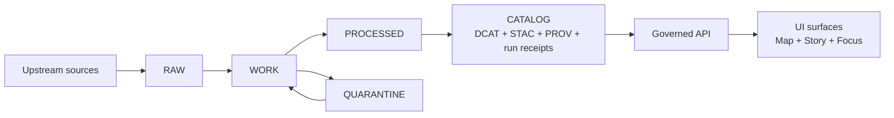

# data/work — WORK / QUARANTINE zone
Intermediate transforms (normalization), QA reports, and redaction/generalization candidates. **Never served directly** to Map / Story / Focus or any public surface.

**Status:** Contract surface (Promotion Contract v1) • **Audience:** Contributors / Operators / Stewards • **Owners:** Data Stewardship + Data/GIS Engineering (set via repo governance)  
`zone:work/quarantine` `publishable:no` `policy:fail-closed` `contents:unreviewed`

**Quick nav:**  
[Purpose](#purpose) • [What belongs here](#what-belongs-here) • [Quarantine](#quarantine) • [Folder layout](#folder-layout-proposed) • [Receipts and QA](#receipts-and-qa) • [Promotion and exit criteria](#promotion-and-exit-criteria) • [Security-and-safety](#security-and-safety)

---

## Where this fits in the truth path



> **WARNING**
> - **Do not publish** from `data/work/`.  
> - **Quarantined items are blocked from promotion** and must not enter runtime surfaces.

---

## Purpose

`data/work/` is the **intermediate zone** used to transform RAW acquisitions into publishable outputs by:
- normalizing source data into analysis-friendly structures,
- generating QA/validation reports,
- producing **candidate** redactions/generalizations (when needed),
- producing provisional entity-resolution outputs.

This zone exists so we can do real work while still keeping promotion **fail-closed** and evidence-first.

---

## What belongs here

### Allowed artifacts (examples)
- **Normalized representations** (e.g., parsed CSV→Parquet, OCR outputs, cleaned geometry)  
- **QA reports** (schema checks, spatial checks, completeness checks)  
- **Candidate redactions / generalizations** (proposals; not “final publish” by default)  
- **Provisional entity resolution outputs** (linkage tables, match confidence reports)

### Not allowed
- Anything that is intended to be served directly to users or clients
- “Final” assets without promotion artifacts (catalog triplet + receipts + approvals)
- Secrets/credentials or access tokens embedded in specs/logs
- Unreviewed sensitive location precision in any public-facing derivative

---

## Quarantine

`QUARANTINE` exists for work outputs that cannot proceed because of:
- validation failures,
- unclear licensing/rights,
- sensitivity concerns,
- upstream instability that prevents reproducible acquisition.

**Rule:** Quarantined items are **not promoted**.

### Quarantine workflow (minimum)
1. **Mark or move** the run outputs into a quarantine subfolder (see layout below).
2. Add a short `QUARANTINE_REASON.md` describing:
   - the blocking issue(s),
   - who must review (steward / legal / governance council),
   - the minimum steps to unblock (re-run, add rights metadata, redact/generalize, etc.).
3. Do not reference quarantined artifacts from any Story Node, Map layer, or Focus Mode response.

---

## Folder layout (PROPOSED)

> **NOTE**
> This layout is a repo convention recommendation for clarity. The authoritative promotion gates
> are enforced by the Promotion Contract and policy checks.

```text
data/work/
  README.md

  # Per dataset “work runs”
  <dataset_slug>/
    <dataset_version_id>/               # Candidate version (deterministic ID; reruns may supersede)
      manifest.work.json                # Minimal work manifest (inputs, outputs, checks, quarantine flag)
      normalized/                       # Normalized artifacts (intermediate; not publishable)
      qa/                               # QA reports (schema/spatial/completeness/etc.)
      redaction_candidates/             # Candidate redactions/generalizations + diffs/notes
      entity_resolution/                # Provisional linkage outputs
      receipts/                         # Run receipts (one per producing run) + validation summaries
      notes/                            # Optional: analyst notes (non-sensitive)

  # Quarantine lane (blocked from promotion)
  _quarantine/
    <dataset_slug>/
      <dataset_version_id>/
        QUARANTINE_REASON.md
        (same subfolders as above)
```

### Naming guidance (recommended)
- `dataset_slug`: lowercase, snake-case, stable over time (e.g., `noaa_ncei_storm_events`)
- `dataset_version_id`: immutable identifier for a specific version candidate (e.g., `2026-02.abcd1234`)
- Avoid spaces and avoid embedding environment-specific hostnames in paths.

---

## Receipts and QA

### Run receipts
A **run receipt** is emitted for every pipeline run (and for Focus Mode queries). Keep receipts alongside the work outputs that they describe so provenance is not “lost in logs.”

Minimum expectation:
- inputs and outputs enumerated with **checksums/digests**
- environment captured (git commit and container image digest, at minimum)
- validation status recorded

### QA reports
QA reports are required inputs to promotion decisions:
- schema validity (types, required fields)
- spatial validity (geometry validity, CRS, bbox sanity)
- completeness / missingness checks
- policy-sensitive checks (e.g., “does this contain restricted fields?”)

If QA fails → quarantine.

---

## Promotion and exit criteria

Work artifacts become eligible for runtime only after **promotion** into:
- `PROCESSED` artifacts (publishable formats + checksums),
- validated **catalog triplet** (DCAT + STAC + PROV),
- run receipts + audit/approvals,
- policy label assignment and policy tests.

### Promotion Contract summary (for awareness)
Promotion is blocked unless (at minimum):
- identity/versioning is deterministic,
- processed artifacts exist with digests,
- catalogs validate,
- cross-links resolve and EvidenceRefs can resolve,
- policy label is assigned and obligations applied,
- QA reports exist and failures are quarantined,
- run receipts and audit trail entries exist.

> **TIP**
> Treat “promotion-ready” as a **packet**: you should be able to point to a receipt, QA report, and
> intended policy posture for the exact dataset_version_id—without guesswork.

---

## Security and safety

Policy posture is **fail-closed**:
- If sensitivity is unclear, quarantine and escalate review.
- For sensitive-location / restricted material: default deny, and prefer a separate **public generalized** dataset version when any public representation is allowed.
- Treat redaction/generalization as a first-class transform that must be recorded in provenance.

Operational hygiene:
- Never embed credentials in specs, manifests, or logs.
- Don’t leak restricted metadata in errors or “helpful” debug outputs.
- Keep any PII or culturally restricted site detail out of public paths and out of narrative artifacts.

---

## FAQ

**Can a Story Node cite work artifacts?**  
No. Work is not a governed evidence surface. Stories must cite resolvable evidence bundles via governed mechanisms, which implies promoted, policy-checked artifacts only.

**Do we delete work artifacts after promotion?**  
Project decision. If retained, treat as internal audit material and keep it policy-labeled. If removed, ensure receipts + PROV + catalogs remain sufficient to reproduce.

**Where should heavy binaries live?**  
Project decision. Prefer object storage and commit only manifests/receipts/reports unless the repo explicitly supports large-file storage.

---

_Back to top:_ [data/work — WORK / QUARANTINE zone](#datawork--work--quarantine-zone)
