<div align="center">
<a id="top"></a>

# 🧰 `data/work/` — Workbench & Experiment Sandbox


**Controlled chaos with receipts** 🧪🧾  
`data/work/` is where experiments become deterministic, validated, and governable **before** promotion to `data/processed/` + catalogs.

</div>

> [!IMPORTANT]
> ✅ If it can’t be reproduced, it doesn’t count. 🔬  
> ✅ If it’s used downstream (Graph/API/UI/Story/Focus), it **must be promoted** and shipped as an **evidence artifact** (STAC + DCAT + PROV).  
> ❌ No “sneaky” UI reads from file paths or Neo4j: the **API boundary** mediates access.

---

## 🚀 Quick links (jump out of the sandbox)

- 📥 Raw inputs (immutable) → [`../raw/`](../raw/)
- 🧾 Source manifests (recommended for large externals) → [`../sources/`](../sources/) *(if present)*
- 📦 Processed / publishable outputs → [`../processed/`](../processed/)
- 🛰️ STAC → [`../stac/`](../stac/) *(Collections/Items/Assets)*
- 🗂️ DCAT → [`../catalog/`](../catalog/) → [`../catalog/dcat/`](../catalog/dcat/)
- 🧬 PROV → [`../prov/`](../prov/)
- 🕸️ Graph exports (optional) → [`../graph/`](../graph/)
- 🧪 Validation tooling (recommended) → [`../../tools/validation/`](../../tools/validation/)
- 🧭 Master Guide (canonical order + invariants) → `docs/MASTER_GUIDE_v13.md` *(or equivalent)*
- 🔐 Security policy → [`../../SECURITY.md`](../../SECURITY.md)

---

<details>
<summary><strong>📌 Table of contents</strong></summary>

- [🎯 What belongs here](#-what-belongs-here)
- [🚫 What must NOT belong here](#-what-must-not-belong-here)
- [🧭 Canonical pipeline order](#-canonical-pipeline-order-non-negotiable)
- [🗺️ Folder map](#️-folder-map)
- [📦 Work Package Standard](#-work-package-standard-wps)
- [🧬 Reproducibility & provenance](#-reproducibility--provenance)
- [✅ Quality checklists](#-quality-checklists-fast-but-real)
- [🚀 Promotion rules](#-promotion-rules-work--processed--catalogs)
- [🧷 Domain expansion pattern](#-domain-expansion-pattern-add-a-new-domain-safely)
- [🔐 Governance & “don’t be creepy” rules](#-governance--dont-be-creepy-rules)
- [🤖 Automation hooks](#-automation-hooks-optional-roadmap)
- [📚 Reference shelf](#-reference-shelf-project-library)
- [🕰️ Version history](#️-version-history)

</details>

---

## 🎯 What belongs here

✅ Put **intermediate** and **work-in-progress** artifacts here, organized by **domain**:

- 🧪 **Repeatable experiment runs**  
  Regression studies, Bayesian inference, statistical EDA, drift checks, model evaluation outputs
- 🛰️ **GIS/remote sensing scratch work**  
  Clips, reprojection trials, NDVI derivations, mosaics, tiling prototypes, pyramids/overviews tests
- 🧱 **Intermediate transform products**  
  Normalized tables, feature engineering outputs, QA fixtures, “candidate” layers
- 📊 **Run-scoped plots & mini-reports**  
  Figures/tables to decide whether something is ready for promotion
- 🧰 **Prototype bundles for promotion**  
  `exports/` folder containing a *candidate* processed artifact + metadata drafts

> [!TIP]
> Treat `data/work/` as a **staging lane** between `data/raw/` and `data/processed/`—not as a permanent home.  
> If it becomes evidence, it gets promoted. 📦✅

---

## 🚫 What must NOT belong here

🚫 Never commit these to `data/work/` (or anywhere in the repo):

- 🔑 **Secrets / tokens / credentials** *(ever)*
- 🧍 **PII** *(unless explicitly permitted + classified + controlled)*
- 🧨 **Sensitive locations** or culturally protected knowledge in a form that enables harm
- 🕳️ “Mystery files” with no manifest, provenance, or explanation
- 🏛️ Any “official” dataset that the UI/Graph/Story/Focus depends on (promote it)

> [!CAUTION]
> `data/work/` is allowed to be messy, but it must never be **unsafe**. 🔒

---

## 🧭 Canonical pipeline order (non-negotiable)

KFM stays stable by being strict about ordering:

**ETL → STAC/DCAT/PROV → Graph → API → UI → Story Nodes → Focus Mode**

`data/work/` sits **upstream** of the evidence boundary. It’s where we prove something can be deterministic and governed before it becomes “real.”

```mermaid
flowchart LR
  RAW["📥 data/raw/<domain>/\nimmutable inputs"] --> WORK["🧰 data/work/<domain>/\nintermediate + WIP"]
  WORK --> PROC["📦 data/processed/<domain>/\npublishable outputs"]
  PROC --> CATS["🧾 Catalogs\nSTAC + DCAT + PROV"]
  CATS --> GRAPH["🕸️ Graph\nIDs + relationships"]
  GRAPH --> API["🔌 API boundary\ncontracts + redaction"]
  API --> UI["🗺️ UI\nmap + timeline + downloads"]
  UI --> STORY["🎬 Story Nodes\ncurated narrative"]
  STORY --> FOCUS["🧠 Focus Mode\nprovenance-linked only"]
```



> [!IMPORTANT]
> **Evidence artifact rule:** if an analysis output (including AI-derived artifacts) is used as evidence, it must live in `data/processed/` and be registered via **STAC/DCAT** with **PROV** lineage. 🧾🧬

---

## 🗺️ Folder map

### Recommended layout (domain-first)

```text
📁 data/work/
├── 📁 _templates/                    🧩 copy/paste manifests + checklists
├── 📁 _scratch/                      ⚠️ gitignored throwaway (keep empty in PRs)
├── 📁 <domain>/                      🌾🏙️🌎 one folder per domain
│   ├── 📁 experiments/               🧪 reproducible runs (preferred)
│   ├── 📁 etl_runs/                  🧰 transform trials + intermediate outputs
│   ├── 📁 datasets/                  📦 curated WIP datasets (not published)
│   ├── 📁 qa/                        ✅ run-scoped QA outputs (small + useful)
│   ├── 📁 exports/                   📤 candidate promotion bundles
│   ├── 📁 _archive/                  🧹 cold storage (optional)
│   └── 📄 README.md                  📌 domain-specific notes
└── 📄 README.md                      👈 you are here
```

### Where do notebooks / code live?

- **Preferred (v13-style):** `mcp/` for methods + computational experiments (protocols, notebooks, run records, model cards, SOPs) 🧠📓  
- **Also common:** `notebooks/` for exploratory EDA (if the repo has that pattern) ✍️  
- `data/work/` should store **data artifacts + run outputs**, not be your only code home.

> [!TIP]
> Keep a clean separation:
> - `mcp/` = method + narrative of the experiment (how/why)
> - `data/work/` = intermediate artifacts (what it produced)
> - `data/processed/` + catalogs = publishable evidence (what we stand behind)

---

## 📦 Work Package Standard (WPS)

A **Work Package** is any folder under `data/work/<domain>/...` that others are expected to rerun, review, or build on.

### ✅ Naming convention

Use date + domain + slug + version:

- `YYYY-MM-DD__<domain>__<short_slug>__vNN/`

Examples:
- `2026-01-02__remote_sensing__ndvi_landsat8__v01/`
- `2026-01-04__stats__soil_moisture_regression__v02/`
- `2026-01-10__viz__webgl_tileset_prototype__v01/`

### ✅ Required files (minimum bar)

Every Work Package **must** contain:

- `README.md` — purpose, scope, results, next steps
- `manifest.yaml` — inputs, parameters, outputs, environment, hashes
- `inputs/` — small fixtures **or** pointer manifests (when data is too large/restricted)
- `src/` and/or `notebooks/` — runnable code to generate outputs
- `outputs/` — artifacts produced by the run (keep bounded)

### 🔥 Strongly recommended

- `environment/` — `requirements.txt`, `environment.yml`, `poetry.lock`, `package-lock.json`, etc.
- `checksums.sha256` — integrity list for key artifacts
- `data_dictionary.md` — fields, units, codes, value ranges
- `PROV_HINT.yaml` — minimal mapping from run → intended PROV fields
- `openlineage.json` — optional lineage event export (if adopted)
- `PROMOTION.md` — if promoted, record dataset IDs + final paths + commit hash

---

## 🧬 Reproducibility & provenance

> [!IMPORTANT]
> **Reproducibility is a security feature.**  
> It enables audit, rollback, and tamper detection—not just “nice science.” 🛡️🔁

### ✅ Scientific-method spine (what every Work Package should capture)

1) **Question / problem statement** ❓  
2) **Background research** 📚 *(cite relevant references)*  
3) **Hypothesis** 🎯 *(testable expectation)*  
4) **Method / protocol** 🧪 *(written before the run, updated with deviations)*  
5) **Data collection & labeling** 🏷️  
6) **Analysis** 📈 *(tests, visuals, model choices)*  
7) **Results** ✅ *(linked artifacts + metrics)*  
8) **Conclusion + limitations** 🧩  
9) **Next steps** ➡️

### `manifest.yaml` starter (WPS)

```yaml
id: 2026-01-04__stats__soil_moisture_regression__v02
run_uuid: "urn:uuid:<generate>"
owner: "@your-handle"
created_at: "2026-01-04"
status: wip  # wip | review | archived | promoted

governance:
  classification: internal     # open | internal | confidential | restricted
  sensitivity: mixed           # mixed because workbench may contain sensitive intermediates
  sovereignty_notes: "TBD (add if dataset involves consent/sovereignty constraints)"

question:
  problem: "How does soil moisture relate to vegetation index over time in region X?"
  hypothesis: "Soil moisture explains part of NDVI variance with a lag."

inputs:
  - name: soil_moisture_source
    type: table
    pointer: "data/raw/hydro/soil_moisture/<drop_id>/ (or data/sources manifest)"
    immutability: pinned
    checksums:
      - algo: sha256
        value: "<hash>"
    license: "<SPDX or URL>"
    notes: "Prefer receipts (download log, ETag) + checksum."

  - name: ndvi_candidate
    type: raster
    pointer: "data/work/remote_sensing/experiments/2026-01-02__remote_sensing__ndvi_landsat8__v01/outputs/ndvi_cog.tif"
    immutability: local
    notes: "If promoted later, this becomes a STAC asset."

process:
  steps:
    - validate: ["schema", "ranges", "missingness", "crs"]
    - feature_engineer: ["lag_features", "seasonality_terms"]
    - model: ["baseline_linear_regression", "robust_regression_optional"]
    - evaluate: ["residuals", "outliers", "uncertainty"]
parameters:
  region: "AOI slug or file path"
  date_range: ["YYYY-MM-DD", "YYYY-MM-DD"]
  random_seed: 1337

environment:
  runtime: "python"
  python: "3.11"
  lockfiles:
    - environment/requirements.txt
    - environment/poetry.lock
  container:
    image: "<optional: ghcr.io/...:tag>"

outputs:
  - name: metrics
    path: outputs/metrics.json
  - name: model_summary
    path: outputs/model_summary.md
  - name: plots
    path: viz/
  - name: logs
    path: logs/

promotion_intent:
  candidate_dataset_id: "kfm.ks.<domain>.<product>.<time_range>.v1"
  requires_evidence_bundle: true  # STAC + DCAT + PROV
  notes: "Promote only after QA + steward review."
```

> [!TIP]
> If a run is meant to be replayable, treat it like a mini-pipeline:
> **idempotent inputs + pinned environment + deterministic outputs** 🔁

---

## ✅ Quality checklists (fast, but real)

### 🗺️ Geospatial sanity (raster/vector)

- [ ] CRS explicitly stated (no silent EPSG drift)
- [ ] Units documented (meters vs degrees, mm vs inches, etc.)
- [ ] Geometry validity checks pass (no self-intersections, no empty geoms)
- [ ] Raster `nodata` defined and preserved
- [ ] For web use, produce (or plan to produce) an **EPSG:4326** representation (or documented web CRS path)
- [ ] Interactive outputs include overviews/pyramids when appropriate (COG best practices)
- [ ] Cartography choices recorded (symbology, classification, legends)

### 📈 Statistics & experimental design (don’t fool yourself)

- [ ] Label the work: **exploration** vs **confirmation**
- [ ] Check assumptions (residuals, heteroskedasticity, independence)
- [ ] Avoid leakage (train/val/test boundaries explicit)
- [ ] Report effect sizes + uncertainty (not just p-values)
- [ ] Document multiple comparisons risk (if applicable)

### 🛰️ Simulation & modeling integrity (V&V + UQ)

- [ ] Inputs/initial conditions captured
- [ ] Validation plan stated (what would falsify the model?)
- [ ] Sensitivity sweeps documented (even a minimal one)
- [ ] Outputs include units, coordinate frames, and metadata
- [ ] Results reproducible from config + seed + environment

### 🌐 Visualization prototypes (Web + WebGL)

- [ ] Save screenshots + “what this proves” note
- [ ] Provide a minimal entry point (`index.html` or `README.md`)
- [ ] Consider mobile-first constraints early 📱
- [ ] Treat 3D assets/parsers as **untrusted inputs** (security boundary)

---

## 🚀 Promotion rules (`work` → `processed` → catalogs)

### When do we promote?

Promote when **any** of the following becomes true:

- A dataset is stable enough to be reused across multiple work packages
- A derived layer should appear in map/timeline exploration
- A result is referenced in Story Nodes or decision-facing docs
- We need the artifact to be audited, cited, or externally shared

### Promotion “definition of done” ✅

- [ ] Output moved (or re-generated) into `data/processed/<domain>/…`
- [ ] Evidence bundle produced: **STAC + DCAT + PROV**
- [ ] QA checks captured (ideally automated)
- [ ] Sensitivity/classification reviewed (no “downgrade by accident”)
- [ ] A thin pointer remains in `data/work/` linking to the canonical artifact

### Promotion bundle (typical)

- 🛰️ `data/stac/collections/<collection_id>/collection.json`
- 📦 `data/stac/items/<collection_id>/<item_id>.json`
- 🗂️ `data/catalog/dcat/<dataset_id>.jsonld`
- 🧬 `data/prov/<run_id>/prov.jsonld` *(or bundle)*
- ✅ checksums + receipts (recommended)
- 🔏 optional signing/attestation (future: `releases/`)

> [!TIP]
> Think of `data/work/` as rehearsal 🎭 and `data/processed/` as opening night 🎟️

---

## 🧷 Domain expansion pattern (add a new domain safely)

When introducing a new domain (e.g., `public_health`, `energy`, `hydrology`):

1) Create lifecycle folders:
   - `data/raw/<domain>/`
   - `data/work/<domain>/`
   - `data/processed/<domain>/`

2) Add domain docs:
   - `docs/data/<domain>/README.md` *(runbook: sources, licenses, stewards, risks)*

3) Ensure the domain can publish evidence:
   - STAC (if spatial assets exist)
   - DCAT (always for discoverability)
   - PROV (always for lineage)

4) Add validation hooks:
   - schema checks
   - link integrity checks
   - governance/policy checks (classification, sovereignty, licensing)

> [!NOTE]
> Domain growth is welcome—**but only through contracts + governance**. 🌱✅

---

## 🔐 Governance & “don’t be creepy” rules

KFM is evidence-first **and** human-centered. Maps and datasets can cause harm if handled carelessly.

### Non-negotiables

- ❌ No secrets or credentials in `data/work/`
- ❌ No publishing precise sensitive locations without explicit review
- ✅ Always document provenance + licensing constraints
- ✅ Treat derived outputs as potentially sensitive (inference risk is real)

### Practical classification model (recommended)

| Classification | Typical in `data/work/` | Safe distribution pattern |
|---|---:|---|
| **Open** 🌍 | Rare | public files ok |
| **Internal** 🏢 | Common | private storage + governed API |
| **Confidential** 🔐 | Allowed with controls | no direct download URLs; gated access |
| **Restricted** 🧨 | Avoid in Git | minimal disclosure; landing page only |

> [!CAUTION]
> Even “just metadata” can leak. Reduce precision, redact where needed, and document why.

### AI constraints (still apply in the sandbox)

- AI must not infer or reconstruct sensitive locations from partial artifacts.
- If you use AI to draft summaries/labels, keep outputs attributable and **upgrade to evidence artifacts** before anything is shown in Focus Mode.

---

## 🤖 Automation hooks (optional roadmap)

If/when automation touches `data/work/`, it must be **auditable** and **safe**:

- 🛰️ **Detect → Validate → Promote** workflows (fast checks + deterministic promotion)
- 🧾 Checksums/ETags for change detection
- 🧠 Watcher–Planner–Executor agents:
  - Watcher emits immutable alerts
  - Planner generates deterministic change plans
  - Executor opens PRs (never auto-merges)
  - includes idempotency keys + kill-switch

> [!NOTE]
> Automation is welcome **only** when it strengthens governance (not bypasses it). ✅

---

## 📚 Reference shelf (project library)

> [!NOTE]
> These files are a **reading pack / influence map**. Their licenses may differ from the repo’s code/data. Respect upstream terms. 📜

<details>
<summary><strong>🧭 Canonical KFM docs</strong></summary>

- `docs/MASTER_GUIDE_v13.md` *(or current Master Guide file)*
- `docs/specs/Kansas Frontier Matrix (KFM) – Comprehensive Technical Documentation.docx`
- `docs/specs/🌟 Kansas Frontier Matrix – Latest Ideas & Future Proposals.docx`
- `docs/glossary.md`
- `docs/templates/`
- `docs/standards/`
- `docs/governance/`

</details>

<details>
<summary><strong>🧪 Scientific method + reproducible coding discipline</strong></summary>

- `docs/library/Scientific Method _ Research _ Master Coder Protocol Documentation.pdf`
- `docs/library/Scientific Modeling and Simulation_ A Comprehensive NASA-Grade Guide.pdf`

</details>

<details>
<summary><strong>🗺️ GIS, spatial ops, cartography</strong></summary>

- `docs/library/python-geospatial-analysis-cookbook.pdf`
- `docs/library/PostgreSQL Notes for Professionals - PostgreSQLNotesForProfessionals.pdf`
- `docs/library/making-maps-a-visual-guide-to-map-design-for-gis.pdf`
- `docs/library/Mobile Mapping_ Space, Cartography and the Digital - 9789048535217.pdf`
- `docs/library/compressed-image-file-formats-jpeg-png-gif-xbm-bmp.pdf`
- `docs/library/Cloud-Based Remote Sensing with Google Earth Engine-Fundamentals and Applications.pdf`

</details>

<details>
<summary><strong>📈 Stats, inference, modeling</strong></summary>

- `docs/library/Understanding Statistics & Experimental Design.pdf`
- `docs/library/regression-analysis-with-python.pdf`
- `docs/library/Regression analysis using Python - slides-linear-regression.pdf`
- `docs/library/graphical-data-analysis-with-r.pdf`
- `docs/library/think-bayes-bayesian-statistics-in-python.pdf`

</details>

<details>
<summary><strong>🌐 Web UI + 3D/graphics</strong></summary>

- `docs/library/responsive-web-design-with-html5-and-css3.pdf`
- `docs/library/webgl-programming-guide-interactive-3d-graphics-programming-with-webgl.pdf`

</details>

<details>
<summary><strong>⚙️ Systems, scalability, interoperability</strong></summary>

- `docs/library/Scalable Data Management for Future Hardware.pdf`
- `docs/library/concurrent-real-time-and-distributed-programming-in-java-threads-rtsj-and-rmi.pdf`
- `docs/library/Data Spaces.pdf`

</details>

<details>
<summary><strong>❤️ Ethics, autonomy, governance</strong></summary>

- `docs/library/Introduction to Digital Humanism.pdf`
- `docs/library/Principles of Biological Autonomy - book_9780262381833.pdf`
- `docs/library/On the path to AI Law’s prophecies and the conceptual foundations of the machine learning age.pdf`

</details>

<details>
<summary><strong>🛡️ Security (defensive reference only)</strong></summary>

- `docs/library/ethical-hacking-and-countermeasures-secure-network-infrastructures.pdf`
- `docs/library/Gray Hat Python - Python Programming for Hackers and Reverse Engineers (2009).pdf`

> Used to inform **defensive controls** (threat modeling, incident response, secure coding).  
> Not a request for offensive tooling contributions.

</details>

<details>
<summary><strong>🧰 General programming shelf (bundles)</strong></summary>

- `docs/library/A programming Books.pdf`
- `docs/library/B-C programming Books.pdf`
- `docs/library/D-E programming Books.pdf`
- `docs/library/F-H programming Books.pdf`
- `docs/library/I-L programming Books.pdf`
- `docs/library/M-N programming Books.pdf`
- `docs/library/O-R programming Books.pdf`
- `docs/library/S-T programming Books.pdf`
- `docs/library/U-X programming Books.pdf`

</details>

---

## 🕰️ Version history

| Version | Date | Summary |
|---|---|---|
| v1.1.0 | 2026-01-11 | Aligned `data/work/` with v13 staging semantics, evidence artifact rule, WPS manifest upgrades, domain-first layout, governance + automation hooks 🤖✅ |
| v1.0.0 | 2026-01-08 | Initial sandbox README: controlled chaos, promotion rules, reproducibility checklists 🧪 |

---

<p align="right"><a href="#top">⬆️ Back to top</a></p>
