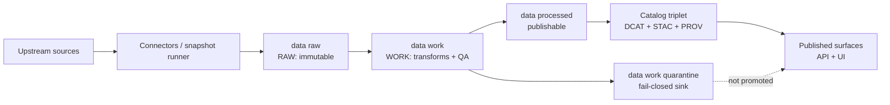

<!-- [KFM_META_BLOCK_V2]
doc_id: kfm://doc/5b98d1f0-fb59-4a7e-9ab6-6c70f025e67a
title: data/work — WORK / QUARANTINE zone README
type: standard
version: v1
status: draft
owners: TBD
created: 2026-02-22
updated: 2026-02-22
policy_label: public
related:
  - kfm://doc/ZONE_DEFS
  - kfm://doc/PROMOTION_CONTRACT
tags:
  - kfm
  - data-lifecycle
  - work-zone
notes:
  - This README defines expectations for intermediate artifacts and quarantine handling.
[/KFM_META_BLOCK_V2] -->

# `data/work/` — WORK / QUARANTINE zone

**Purpose:** Intermediate transforms, QA outputs, and redaction candidates. **Not publishable. Not served to runtime.**  
**Status:** draft • **Owners:** TBD


---

## Quick navigation

- [What belongs here](#what-belongs-here)
- [What does not belong here](#what-does-not-belong-here)
- [Quarantine rules](#quarantine-rules)
- [Truth path and where WORK fits](#truth-path-and-where-work-fits)
- [Promotion Contract summary](#promotion-contract-summary)
- [Recommended directory layout](#recommended-directory-layout)
- [Determinism and spec hashing](#determinism-and-spec-hashing)
- [Work artifact conventions](#work-artifact-conventions)
- [Cleanup and retention](#cleanup-and-retention)
- [Governance triggers](#governance-triggers)
- [Appendix: templates](#appendix-templates)

---

> [!WARNING]
> **Anything in `data/work/` is intermediate.** It may be incomplete, unvalidated, sensitive, or non-compliant.
> Treat it as **not-for-publication** unless and until it is promoted through the Promotion Contract.

---

## What belongs here

This folder is for **WORK** artifacts that arise *after* acquisition and *before* publication-ready outputs.

Typical contents:

- **Normalized representations** (e.g., parsed CSV→Parquet, JSON normalization, OCR outputs).
- **QA reports** (schema checks, spatial checks, completeness checks, drift checks).
- **Candidate redactions / generalizations** (draft outputs used to make a publishable version).
- **Entity resolution outputs (provisional)** (dedupe/linking passes before finalization).

**Back to top:** [Quick navigation](#quick-navigation)

---

## What does not belong here

- **Canonical raw acquisitions** (those belong in RAW; do not “fix” raw here).
- **Published artifacts** (those belong in PROCESSED + catalogs).
- **Secrets** (API keys, credentials, tokens, private certs).
- **Runtime state** (databases, indexes, tiles served to users).
- **Anything that bypasses governance** (e.g., ad hoc exports you intend to “ship” without promotion).

> [!NOTE]
> If you discover licensing ambiguity, sensitivity issues, or validation failures **move or mark the item as QUARANTINED** immediately (see below). Fail closed.

**Back to top:** [Quick navigation](#quick-navigation)

---

## Quarantine rules

Quarantine exists for intermediate items that **must not** be promoted.

Quarantine is used when any of the following are true:

- Validation fails (schema/spatial/consistency).
- Licensing is unclear / incompatible / missing rights holder.
- Sensitivity concerns exist (e.g., restricted locations, vulnerable infrastructure, private individuals).
- Upstream instability prevents reproducible acquisition.

**Hard rule:** Quarantined items are **not** promoted.

### Quarantine workflow (minimum)

1. **Stop promotion:** do not generate PROCESSED artifacts.
2. **Record why:** write a short note (issue/ticket reference preferred).
3. **Contain:** move into `data/work/quarantine/…` or mark clearly within the dataset version folder.
4. **Remediate:** resolve license/sensitivity/QA, then regenerate WORK outputs deterministically.
5. **Re-run gates:** only after the Promotion Contract gates pass can it move forward.

**Back to top:** [Quick navigation](#quick-navigation)

---

## Truth path and where WORK fits



**Back to top:** [Quick navigation](#quick-navigation)

---

## Promotion Contract summary

Promotion is the governed act of moving from **RAW/WORK → PROCESSED + Catalog/Lineage → Published surfaces**.

A dataset version promotion **must be blocked** unless the minimum gates pass.

### Minimum gates (v1)

| Gate | Name | What it means (practical) | Where WORK contributes |
|---:|---|---|---|
| A | Identity & versioning | Stable Dataset ID; immutable DatasetVersion ID derived from stable `spec_hash` | WORK outputs must be tied to a stable spec + hash |
| B | Licensing & rights | Explicit license + rights holder + attribution; **unclear license ⇒ QUARANTINE** | WORK must surface license gaps early |
| C | Sensitivity & redaction | `policy_label` assigned; redaction/generalization plan exists and is recorded in lineage | WORK holds candidate redactions + evidence |
| D | Catalog triplet validation | DCAT + STAC + PROV exist, validate, and cross-link | WORK must produce metadata inputs required to build catalogs |
| E | Run receipt + checksums | Run receipt exists; inputs/outputs enumerated with checksums; environment recorded | WORK should emit receipts + digests for each run |
| F | Policy + contract tests | Policy tests pass; evidence resolution works in CI; schemas/contracts validate | WORK must produce at least one resolvable EvidenceRef |
| G | Optional (recommended) | SBOM/provenance; performance + a11y smoke checks | WORK should not block, but can provide signals |

### Dataset integration “DONE” checklist (operational)

- [ ] RAW acquisition is reproducible and documented.
- [ ] WORK transforms are deterministic (same inputs → same outputs; same spec → same hash).
- [ ] PROCESSED artifacts exist in approved formats and are digest-addressed.
- [ ] Catalog triplet validates and is cross-linked.
- [ ] Evidence references resolve and render in evidence UI surfaces.
- [ ] Policy label is assigned, with documented review.
- [ ] Changelog entry explains what changed and why.

**Back to top:** [Quick navigation](#quick-navigation)

---

## Recommended directory layout

> [!NOTE]
> The exact layout may vary by pipeline, but keep it predictable. Prefer **domain → dataset → version**.

```text
data/
├─ raw/                         # immutable acquisitions (append-only)
├─ work/                         # THIS ZONE: intermediate artifacts
│  ├─ README.md                  # you are here
│  ├─ quarantine/                # fail-closed items (not promotable)
│  │  └─ <domain>/<dataset>/<version>/...
│  └─ <domain>/
│     └─ <dataset_slug>/
│        └─ <dataset_version_id>/           # derived from spec_hash (immutable)
│           ├─ normalized/                  # canonicalized intermediate formats
│           ├─ qa/                          # reports + summaries
│           ├─ redaction_candidates/        # draft generalized/public-safe forms
│           ├─ entity_resolution/           # provisional link/dedupe outputs
│           ├─ receipts/                    # run receipts, params, environment refs
│           └─ scratch/                     # optional; safe to delete anytime
├─ processed/                    # publishable artifacts
└─ catalog/                      # DCAT + STAC + PROV (+ linkages)
```

**Back to top:** [Quick navigation](#quick-navigation)

---

## Determinism and spec hashing

WORK outputs must be **regenerable** and **stable** under the same inputs + spec.

Guidelines:

- Treat WORK as **rebuildable**; do not rely on manual edits.
- Keep a single “spec of record” per dataset version (config, parameters, transform graph).
- Derive `dataset_version_id` from a stable `spec_hash` (canonicalize config before hashing).
- Record producing environment (at minimum: container image digest, pipeline commit SHA, parameters).
- Checksums for inputs/outputs are mandatory for promotion readiness.

> [!TIP]
> If you can’t reproduce WORK outputs deterministically, you can’t trust PROCESSED outputs later.

**Back to top:** [Quick navigation](#quick-navigation)

---

## Work artifact conventions

### Naming

**Dataset slug (recommended):**

- lowercase
- words separated by underscore
- include upstream authority when helpful
- **do not** put dates in the dataset slug (date belongs to the version)

### IDs (recommended families)

Use explicit URI-like identifiers (examples):

- `kfm://dataset/<dataset_slug>`
- `kfm://dataset/@<dataset_version_id>`
- `kfm://artifact/sha256:<digest>`
- `kfm://run/<run_id>`
- `kfm://evidence/<evidence_id>`

### Minimal files per dataset version (suggested)

Inside `data/work/<domain>/<dataset_slug>/<dataset_version_id>/`:

- `receipts/run_receipt.json` (or `.yaml`)
- `receipts/params.json` (canonicalized)
- `qa/summary.json` + human-readable `qa/report.md`
- `normalized/` intermediates (format depends on pipeline)
- `redaction_candidates/` (when applicable)
- `entity_resolution/` (when applicable)

> [!WARNING]
> **Do not leak restricted metadata** in ad hoc logs or reports. Treat QA outputs as potentially sensitive until policy review assigns a label.

**Back to top:** [Quick navigation](#quick-navigation)

---

## Cleanup and retention

WORK is allowed to be large and messy, but it must be **safe** and **reproducible**.

Recommended posture:

- `scratch/` may be deleted anytime.
- Keep `qa/` and `receipts/` long enough to support promotion review.
- Avoid committing large binaries to Git unless explicitly intended (prefer object storage or ephemeral volumes).
- Never delete QUARANTINE evidence without recording the reason + replacement.

**Back to top:** [Quick navigation](#quick-navigation)

---

## Governance triggers

Escalate for governance review when:

- License terms are missing/unclear or conflict with intended use.
- Data includes (or may include) sensitive locations, private individuals, culturally restricted sites, or vulnerable infrastructure.
- Redaction/generalization is required but not yet specified.
- A dataset is requested for runtime/UI before promotion gates can pass.

Operational safety defaults (summary):

- **Default deny** when sensitivity is unclear.
- If any public representation is allowed, produce a separate **public generalized** dataset version.
- Do not embed precise coordinates in narrative outputs unless policy explicitly allows.
- Treat redaction/generalization as a first-class transform recorded in lineage.

**Back to top:** [Quick navigation](#quick-navigation)

---

## Appendix: templates

<details>
<summary><strong>Template: run_receipt.json (minimal)</strong></summary>

```json
{
  "run_id": "kfm://run/<uuid-or-ulid>",
  "dataset_id": "kfm://dataset/<dataset_slug>",
  "dataset_version_id": "kfm://dataset/@<dataset_version_id>",
  "started_at": "2026-02-22T00:00:00Z",
  "ended_at": "2026-02-22T00:00:00Z",
  "inputs": [
    { "artifact": "kfm://artifact/sha256:<digest>", "role": "raw_input" }
  ],
  "outputs": [
    { "artifact": "kfm://artifact/sha256:<digest>", "role": "work_normalized" }
  ],
  "environment": {
    "pipeline_commit": "<git_sha>",
    "container_image_digest": "sha256:<digest>",
    "spec_hash": "sha256:<digest>"
  },
  "policy": {
    "policy_label": "TBD",
    "redaction_required": false
  }
}
```

</details>

<details>
<summary><strong>Template: qa/report.md (human-readable)</strong></summary>

```markdown
# QA Report — <dataset_slug> @ <dataset_version_id>

## Inputs
- kfm://artifact/sha256:<digest> (raw)

## Checks run
- Schema validation: PASS/FAIL
- Spatial validity: PASS/FAIL
- Temporal coverage sanity: PASS/FAIL
- Null/missing thresholds: PASS/FAIL

## Findings
- …

## Recommendation
- Promote ✅ / Quarantine ⛔ (with reason)
```

</details>

**Back to top:** [Quick navigation](#quick-navigation)
