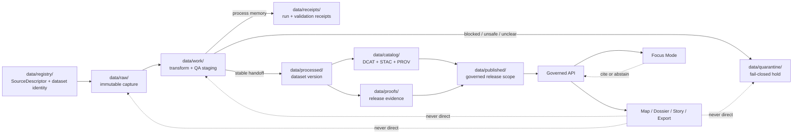

<!-- [KFM_META_BLOCK_V2]
doc_id: kfm://doc/NEEDS-VERIFICATION-data-work-readme-uuid
title: data/work
type: standard
version: v1
status: draft
owners: @bartytime4life
created: NEEDS-VERIFICATION
updated: 2026-04-22
policy_label: public
related: [../README.md, ../raw/README.md, ../quarantine/README.md, ../processed/README.md, ../catalog/README.md, ../receipts/README.md, ../proofs/README.md, ../published/README.md, ../registry/README.md, ../../contracts/README.md, ../../schemas/README.md, ../../policy/README.md, ../../tests/README.md, ../../tools/validators/README.md]
tags: [kfm, data, work, lifecycle, qa, transform, receipts, proofs, promotion]
notes: [doc_id and created date require live-repo verification; owner is carried forward from surfaced public /data/ ownership evidence and should be rechecked in CODEOWNERS before merge; this README is public documentation but data/work payloads are non-public staging by default.]
[/KFM_META_BLOCK_V2] -->

<a id="datawork"></a>

# `data/work/`

Repeatable, reviewable, **non-public** transformation and QA staging for KFM data before stable processed handoff.

> [!IMPORTANT]
> **Status:** experimental  
> **Owners:** `@bartytime4life` *(NEEDS VERIFICATION in the active checkout before merge)*  
> **Path:** `data/work/README.md`  
> **Repo fit:** child of [`../README.md`](../README.md); receives admitted inputs from [`../raw/README.md`](../raw/README.md) and source context from [`../registry/README.md`](../registry/README.md); hands off to [`../processed/README.md`](../processed/README.md); escalates blocked material to [`../quarantine/README.md`](../quarantine/README.md); keeps process memory and release proof separate in [`../receipts/README.md`](../receipts/README.md) and [`../proofs/README.md`](../proofs/README.md).  
> **Quick jumps:** [Scope](#scope) · [Repo fit](#repo-fit) · [Accepted inputs](#accepted-inputs) · [Exclusions](#exclusions) · [Directory tree](#directory-tree) · [Quickstart](#quickstart) · [Usage](#usage) · [Diagram](#diagram) · [Reference tables](#reference-tables) · [Definition of done](#definition-of-done--promotion-gates) · [FAQ](#faq) · [Appendix](#appendix)


> [!NOTE]
> `data/work/` is where ambiguity is reduced. It is **not** where outward truth is declared.
>
> KFM publication remains a governed state transition: `RAW -> WORK / QUARANTINE -> PROCESSED -> CATALOG / TRIPLET -> PUBLISHED`.

---

## Scope

`data/work/` is the staging lane for deterministic or reviewable transformations that are not yet stable processed artifacts.

Use this lane to make work inspectable while it is still being shaped:

- normalize source-native material into repo conventions
- repair geometry, CRS, units, timestamps, or schema shape
- run QA and validation before processed handoff
- stage enrichment, joins, redaction, or generalization candidates
- capture run-local notes before decisions become tribal memory
- preserve pre-release traceability without confusing staging with proof

**CONFIRMED doctrine:** this directory sits inside the KFM truth path and must preserve the boundary between source capture, working transformation, quarantine, processed artifacts, catalog closure, proof, and publication.

**NEEDS VERIFICATION:** active branch contents, exact child directories, workflow wiring, tool commands, branch protection, and local storage policy.

[Back to top](#datawork)

---

## Repo fit

`data/work/` is one lifecycle zone inside `data/`. It is intentionally close to `raw`, `quarantine`, `processed`, `catalog`, `receipts`, `proofs`, `published`, and `registry`, but it does not replace any of them.

| Neighbor | Relationship | Boundary rule |
|---|---|---|
| [`../raw/README.md`](../raw/README.md) | upstream source-native capture | Work starts from admitted or reviewable source material; it does not reinvent raw storage. |
| [`../registry/README.md`](../registry/README.md) | source and dataset identity context | Source roles, source admission, and dataset identity should remain registry-backed, not hidden in run folders. |
| [`../quarantine/README.md`](../quarantine/README.md) | fail-closed holding lane | Blocked, unsafe, ambiguous, rights-conflicted, or review-held material exits normal work into quarantine. |
| [`../processed/README.md`](../processed/README.md) | stable handoff target | Work leaves only when processed identity, QA status, and downstream catalog intent are clear. |
| [`../catalog/README.md`](../catalog/README.md) | `DCAT + STAC + PROV` closure | Catalog closure is downstream of processed handoff, not a shortcut from staging. |
| [`../receipts/README.md`](../receipts/README.md) | process memory | Centrally queryable run receipts, validation reports, and replay/audit memory belong there. |
| [`../proofs/README.md`](../proofs/README.md) | release evidence | Release manifests, proof packs, attestations, rollback evidence, and correction proof belong there. |
| [`../published/README.md`](../published/README.md) | governed published scope | Nothing becomes public merely because it passed through `data/work/`. |

Cross-cutting authority lives outside this folder:

- schemas and machine contracts: [`../../schemas/README.md`](../../schemas/README.md), [`../../contracts/README.md`](../../contracts/README.md)
- policy and deny reasons: [`../../policy/README.md`](../../policy/README.md)
- tests and fixture expectations: [`../../tests/README.md`](../../tests/README.md)
- validators and helper tooling: [`../../tools/validators/README.md`](../../tools/validators/README.md)

[Back to top](#datawork)

---

## Accepted inputs

The following belong here when they are part of a **repeatable, reviewable, non-public** transformation path.

### Confirmed fit

- normalized tabular or spatial intermediates
- reprojected or schema-aligned vector/raster working outputs
- enrichment outputs that still need review or downstream stabilization
- QA staging products, samples, and validation-side artifacts
- redaction or generalization candidates before processed release
- run-local notes that explain non-obvious transform decisions

### Proposed starter artifacts

Use these as starter patterns, not as already-proven branch conventions:

- `NOTES.md`
- `run_record.json`
- `run_manifest.json`
- `validation_report.json`
- `checksums.txt`
- `spec_hash.txt`
- small `staging/`, `qa/`, `logs/`, and `manifests/` subfolders inside a run area

### Proof-aware carryovers

April 2026 KFM doctrine increasingly names a small proof-aware quartet: `spec_hash`, `run_receipt`, `ai_receipt`, and attestation references. For `data/work/`, treat those as **PROPOSED carryovers**, not as confirmed local naming or placement standards.

That means:

- a local `spec_hash` file or reference can be useful when it helps replay or explain the run
- `run_receipt` or `ai_receipt` artifacts may appear here only when active-branch convention confirms that placement
- attestation references or bundle pointers should stay explicit if they exist
- centrally queryable receipts still belong in [`../receipts/README.md`](../receipts/README.md)
- release-significant proof still belongs in [`../proofs/README.md`](../proofs/README.md)

### Good-fit test

An artifact likely belongs in `data/work/` when all six checks pass:

1. It derives from admitted or reviewable upstream material.
2. It is needed to transform, normalize, enrich, validate, redact, generalize, or prepare a handoff.
3. It is reproducible enough to replay or explain.
4. It is **not yet** the stable processed release artifact.
5. It should **not** be read directly by normal client, API, model, or runtime surfaces.
6. Any proof-aware context is visibly pre-release and not being mistaken for outward proof.

[Back to top](#datawork)

---

## Exclusions

| Excluded content | Why it does not belong here | Put it here instead |
|---|---|---|
| Immutable upstream captures | Intake must stay source-native and append-friendly | [`../raw/README.md`](../raw/README.md) |
| Blocked, ambiguous, or review-held material | Work is not the fail-closed holding lane | [`../quarantine/README.md`](../quarantine/README.md) |
| Canonical processed artifacts | `data/work/` is pre-release staging, not the stable processed zone | [`../processed/README.md`](../processed/README.md) |
| STAC / DCAT / PROV closure files | Outward discovery and lineage belong downstream of processed handoff | [`../catalog/README.md`](../catalog/README.md) |
| Central run receipts that must stay queryable across runs | Process memory should stay resolvable during replay, correction, and audit | [`../receipts/README.md`](../receipts/README.md) |
| Release manifests, proof packs, attestations, rollback evidence | Release proof is a separate trust surface | [`../proofs/README.md`](../proofs/README.md) |
| Materialized public release scope | Publication is a governed state, not a work-folder copy | [`../published/README.md`](../published/README.md) |
| Source descriptors or dataset identity authority | Source roles and admission state should remain registry-backed | [`../registry/README.md`](../registry/README.md) |
| Secrets, credentials, API tokens, private keys | No KFM data lane should store secrets | secure runtime secret manager / deployment configuration |
| Unreviewed AI summaries or model chain-of-thought | AI is interpretive and evidence-subordinate; chain-of-thought is not a KFM truth object | governed runtime receipts or reviewed explanation outputs, when policy allows |

[Back to top](#datawork)

---

## Directory tree

Current mounted checkout contents are **NEEDS VERIFICATION**. The structure below is a safe starter pattern for run-local work areas.

```text
data/work/
├── README.md
└── <dataset-or-lane>/
    └── <run-id>/
        ├── NOTES.md
        ├── checksums.txt
        ├── run_manifest.json
        ├── validation_report.json
        ├── staging/
        ├── qa/
        ├── logs/
        └── manifests/
```

> [!TIP]
> Prefer one small, named run folder over a pile of loose intermediate files. A reviewer should be able to tell what the work is, what it came from, what it intends to become, and why it has not yet left staging.

[Back to top](#datawork)

---

## Quickstart

These snippets are **illustrative** and use only portable shell operations. Verify repo-local commands before adopting them in automation.

### Create a starter run area

```bash
RUN_ID="$(date -u +%Y-%m-%d)-example-001"
DATASET="<dataset>"

mkdir -p "data/work/${DATASET}/${RUN_ID}"/{staging,qa,logs,manifests}
```

### Record the purpose of the work

```bash
cat > "data/work/${DATASET}/${RUN_ID}/NOTES.md" <<'EOF'
# Working note

- Source input: data/raw/<source-batch>/
- Intended handoff: data/processed/<dataset>/
- Public exposure: blocked
- Reviewer: TBD
- Status: draft
- Open issues:
  - TBD
EOF
```

### Keep simple integrity context

```bash
find "data/work/${DATASET}/${RUN_ID}" -type f -maxdepth 3 \
  -not -name "checksums.txt" \
  -print0 | sort -z | xargs -0 shasum -a 256 \
  > "data/work/${DATASET}/${RUN_ID}/checksums.txt"
```

### Escalate blocked work explicitly

```bash
# Illustrative only — verify local quarantine handling before adopting verbatim.
CASE_ID="q-$(date -u +%Y%m%d)-${DATASET}-001"

mkdir -p "data/quarantine/${CASE_ID}"
```

### Validate with confirmed local tooling only

Use the checked-out command set documented in the active repo. Do not assume an unverified `promote`, `gate`, `publish`, or `focus` CLI exists just because doctrine or planning documents mention one.

[Back to top](#datawork)

---

## Usage

### 1. Admit from raw; do not reinvent raw

Start from source-native or admitted material in [`../raw/README.md`](../raw/README.md). `data/work/` should never become a shadow raw archive.

### 2. Transform in small, reviewable steps

Prefer a chain of understandable intermediates over one opaque mega-step. This keeps replay, QA, and handoff review legible.

### 3. Attach evidence while the work is fresh

If a normalization decision, reprojection, filter threshold, enrichment step, sensitivity action, or redaction choice matters, capture it before it becomes tribal memory.

### 4. Escalate failure or ambiguity to quarantine

When rights are unclear, validation fails, sensitivity is unresolved, source role is ambiguous, or review blocks advancement, use [`../quarantine/README.md`](../quarantine/README.md) rather than leaving “temporary” blocked material mixed into normal work runs.

### 5. Keep receipts and proofs adjacent, not hidden

Receipts preserve **process memory**. Proofs preserve **release evidence**. If process memory needs to stay centrally queryable, place it in [`../receipts/README.md`](../receipts/README.md). If evidence belongs to release proof, use [`../proofs/README.md`](../proofs/README.md).

`data/work/` should not become a junk drawer for governance artifacts.

### 6. Hand off cleanly to processed

Promotion out of `data/work/` should reduce ambiguity, not move it downstream. By the time material leaves this lane, its processed identity, validation context, and downstream catalog intent should be clear.

[Back to top](#datawork)

---

## Diagram


```mermaid
flowchart LR
    REG[data/registry/<br/>SourceDescriptor + dataset identity] --> RAW[data/raw/<br/>immutable capture]
    RAW --> WORK[data/work/<br/>transform + QA staging]

    WORK -->|blocked / unsafe / unclear| QUAR[data/quarantine/<br/>fail-closed hold]
    WORK -->|process memory| REC[data/receipts/<br/>run + validation receipts]
    WORK -->|stable handoff| PROC[data/processed/<br/>dataset version]

    PROC --> CAT[data/catalog/<br/>DCAT + STAC + PROV]
    PROC --> PROOF[data/proofs/<br/>release evidence]
    CAT --> PUB[data/published/<br/>governed release scope]
    PROOF --> PUB

    PUB --> API[Governed API]
    API --> UI[Map / Dossier / Story / Export]
    API --> FOCUS[Focus Mode]

    UI -. never direct .-> WORK
    UI -. never direct .-> RAW
    UI -. never direct .-> QUAR
    FOCUS -. cite or abstain .-> API
```

### Reading rule

The key relationship is not just left-to-right flow. It is the **blocked path**: normal governed surfaces do **not** read `data/work/`, `data/quarantine/`, or `data/raw/` directly.

[Back to top](#datawork)

---

## Reference tables

### Zone comparison

| Zone | Primary job | Public-facing? | Working rule |
|---|---|---:|---|
| `data/raw/` | Immutable intake | No | Preserve source-native capture, request context, checksums, and terms context. |
| `data/work/` | Repeatable transform + QA staging | No | Keep intermediates reviewable, non-public, and handoff-ready. |
| `data/quarantine/` | Fail-closed hold | No | Isolate blocked, unsafe, ambiguous, or review-held material explicitly. |
| `data/processed/` | Stable processed outputs | Indirect only | Carry governed dataset versions and release-adjacent artifacts. |
| `data/catalog/` | `DCAT + STAC + PROV` closure | Indirect only | Make release-backed truth discoverable, traceable, and cross-linkable. |
| `data/receipts/` | Process memory | Indirect only | Keep run, validation, replay, and audit context resolvable. |
| `data/proofs/` | Release evidence | Indirect only | Preserve promotion, release, correction, withdrawal, and rollback proof. |
| `data/published/` | Materialized published scope | Governed only | Materialize only already governed, release-backed scope. |

### Typical starter artifact classes

| Artifact class | Typical use | Status in this README |
|---|---|---|
| normalized intermediate dataset | schema, CRS, unit, or time alignment | **CONFIRMED fit** |
| QA sample or validation output | pass/fail or warning context | **CONFIRMED fit** |
| transform note | preserves non-obvious decisions | **CONFIRMED fit** |
| redaction/generalization candidate | prepares a sensitivity-safe downstream artifact | **CONFIRMED fit** |
| `run_record.json` | compact run summary | **PROPOSED starter pattern** |
| `run_manifest.json` | file inventory, digests, and roles | **PROPOSED starter pattern** |
| `validation_report.json` | structured validation result | **PROPOSED starter pattern** |
| `checksums.txt` | quick integrity check | **PROPOSED starter pattern** |
| `spec_hash.txt` | stable spec or input hash carryover | **PROPOSED starter pattern** |
| `run_receipt.json` | machine-checkable run audit object | **PROPOSED proof-aware carryover** |
| `ai_receipt.json` | model-mediated proposal or synthesis audit object | **PROPOSED proof-aware carryover** |
| attestation ref / bundle pointer | integrity or origin evidence for emitted artifacts | **PROPOSED proof-aware carryover** |

### Boundary checks

| Check | Minimum expectation | If it fails |
|---|---|---|
| Source lineage | input resolves to `raw`, `registry`, or a documented quarantine case | hold |
| Reproducibility | transform can be replayed or explained | hold |
| QA evidence | validation result, sample check, or review note exists | hold |
| Rights and sensitivity | labels, review notes, or deny posture are explicit | quarantine or hold |
| Handoff clarity | target `processed` identity is named | hold |
| Receipt/proof separation | process memory and release proof are not buried in staging | cleanup before promotion |
| Public-surface boundary | no normal UI/API/model path reads `work` directly | block |
| Reviewability | reviewer can understand the run without guessing | hold |

[Back to top](#datawork)

---

## Definition of done / promotion gates

A work run is ready to leave `data/work/` only when the following are satisfied:

- [ ] Inputs resolve back to admitted source material in `data/raw/`, source identity in `data/registry/`, or an explicitly resolved quarantine case.
- [ ] Intermediate outputs are reproducible enough to replay or explain.
- [ ] QA evidence exists and unresolved issues are visible.
- [ ] Rights, sensitivity, redaction, and generalization implications are explicit.
- [ ] The intended target in `data/processed/` is named.
- [ ] Receipt placement is clear if process memory must be retained centrally in `data/receipts/`.
- [ ] Release-evidence placement is clear if the work is approaching proof-bearing promotion in `data/proofs/`.
- [ ] Any proof-aware artifacts such as `spec_hash`, `run_receipt`, `ai_receipt`, or attestation refs have explicit placement and downstream references.
- [ ] Promotion is being treated as a governed state transition rather than as a convenience folder copy.
- [ ] No outward catalog or published scope is generated directly from `data/work/`.
- [ ] Any blocked subset has been moved or referenced to `data/quarantine/`.
- [ ] Local validators, scripts, and conventions used by the run have been verified on the active branch.

### Promotion-minded checklist

| Gate | Evidence to look for | Outcome |
|---|---|---|
| Identity | dataset name, run id, source refs, optional `spec_hash` | continue / clarify |
| Integrity | checksums, manifest, stable file list | continue / rerun |
| QA | validation report, sample review, spatial/temporal sanity | continue / hold |
| Provenance | transform notes and upstream traceability | continue / hold |
| Rights / sensitivity | explicit labels or review notes | continue / quarantine |
| Handoff | `data/processed/` target is named | continue / hold |
| Receipt routing | process-memory artifacts routed or justified | continue / cleanup |
| Proof routing | release-evidence artifacts routed or deferred | continue / cleanup |
| Public boundary | no direct public path from work | continue / block |

[Back to top](#datawork)

---

## FAQ

### Is `data/work/` the same as `data/quarantine/`?

No. `data/work/` is the normal repeatable transform and QA lane. [`../quarantine/README.md`](../quarantine/README.md) is the stricter fail-closed lane for blocked, ambiguous, unsafe, or review-held material.

### Why can’t we publish directly from `data/work/`?

Because KFM treats publication as a governed trust-state change, not a convenient file move. `data/work/` is where ambiguity is reduced, not where outward truth is declared.

### Where should receipts go?

If receipts need to remain centrally queryable across runs, corrections, or audits, use [`../receipts/README.md`](../receipts/README.md). Keep only local, run-specific context in the work run itself unless active-branch conventions say otherwise.

### Where should proof packs and attestations go?

Use [`../proofs/README.md`](../proofs/README.md) for release-significant evidence. `data/work/` is not the release-evidence home.

### Should `run_receipt.json` or `ai_receipt.json` live here?

Sometimes, but only as **PROPOSED** local carryovers until active-branch conventions confirm naming and placement. If the artifact is mainly centrally queryable process memory, prefer [`../receipts/README.md`](../receipts/README.md). If it is release-significant or promotion-bearing proof, use [`../proofs/README.md`](../proofs/README.md).

### Can normal UI or API surfaces read previews from here?

Not as a normal governed path. Any preview behavior still has to respect the trust membrane and should not normalize direct reads from `data/work/`.

### Does a README-only public tree mean the lane is unused?

No. It only means this README should not speculate about populated working branches, external storage mappings, private runtime usage, or pipeline maturity without direct verification.

[Back to top](#datawork)

---

## Appendix

<details>
<summary><strong>Verification boundary and review placeholders</strong></summary>

### Values deliberately left reviewable

| Field | Current value | Why it remains unresolved |
|---|---|---|
| `doc_id` | `kfm://doc/NEEDS-VERIFICATION-data-work-readme-uuid` | No mounted repo document registry was available during this revision. |
| `created` | `NEEDS-VERIFICATION` | Existing file creation history needs live-repo confirmation. |
| `owners` | `@bartytime4life` | Carried forward from surfaced public `/data/` ownership evidence; recheck `.github/CODEOWNERS`. |
| exact child tree | starter pattern only | Active checkout contents and runtime storage policy need verification. |
| exact tooling commands | not asserted | Repo-local validators, scripts, and workflows need active-branch inspection. |
| proof-aware artifact placement | PROPOSED carryover | Naming and storage conventions for `run_receipt`, `ai_receipt`, and attestations need branch confirmation. |

### Merge-time review checks

- [ ] Confirm `.github/CODEOWNERS` ownership for `/data/` or `data/work/`.
- [ ] Confirm whether `data/work/` is README-only or has active child folders in the target branch.
- [ ] Run repository doc-link checks from the active documentation tooling.
- [ ] Verify every relative link from `data/work/README.md`.
- [ ] Confirm whether `policy_label: public` is correct for this README while payloads remain non-public.
- [ ] Confirm whether any generated run folders should be `.gitignore`-controlled.
- [ ] Confirm no workflow, API, or UI reads `data/work/` as a normal public path.

</details>

[Back to top](#datawork)
