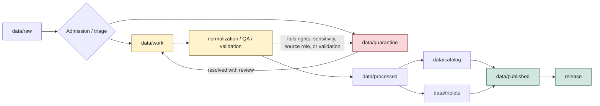

<!-- [KFM_META_BLOCK_V2]
doc_id: kfm://data/work/readme
title: Data WORK README
type: data-lifecycle-index-readme
version: v0.1.0
status: draft
owners:
  - <data-steward>
  - <pipeline-steward>
  - <source-steward>
  - <domain-stewards>
  - <rights-reviewer>
  - <sensitivity-reviewer>
  - <policy-steward>
  - <evidence-steward>
  - <proof-steward>
  - <receipt-steward>
  - <catalog-steward>
  - <release-steward>
  - <docs-steward>
created: 2026-06-29
updated: 2026-06-29
policy_label: restricted-review
truth_posture: cite-or-abstain
responsibility_root: data/
lifecycle_phase: work
artifact_family: working-intermediates-and-candidate-assertions
path_posture: existing-greenfield-stub-replaced; directory-rules-list-data-work-domain-run-id; data-root-lists-work-lifecycle-family; adjacent-raw-quarantine-processed-catalog-triplets-published-release-readmes-inspected; domain-child-readmes-confirmed-by-github-fetches; payload-inventory-unknown; implementation-maturity-needs-verification
sensitivity_posture: internal-work-only; no-public-path; release-blocked; candidate-not-truth; source-role-preserving; rights-aware; sensitivity-aware; evidence-aware; receipt-aware; policy-aware; correction-and-rollback-aware
related:
  - ../README.md
  - ../raw/README.md
  - ../quarantine/README.md
  - ../processed/README.md
  - ../catalog/README.md
  - ../triplets/README.md
  - ../proofs/README.md
  - ../receipts/README.md
  - ../published/README.md
  - ../registry/README.md
  - ../rollback/README.md
  - ../../release/README.md
  - ../../docs/doctrine/directory-rules.md
  - ../../docs/doctrine/lifecycle-law.md
  - ../../docs/doctrine/trust-membrane.md
  - ../../contracts/
  - ../../schemas/
  - ../../policy/
  - ../../tools/validators/
tags:
  - kfm
  - data
  - work
  - lifecycle
  - normalized-intermediates
  - candidate-assertions
  - raw-to-work
  - quarantine-exit
  - work-to-processed
  - source-role
  - rights-review
  - sensitivity-review
  - no-public-path
  - not-release-authority
  - not-processed
  - not-proof
  - not-catalog
  - not-published
  - cite-or-abstain
notes:
  - "This README replaces the greenfield stub at `data/work/README.md`."
  - "Directory Rules lists `data/work/<domain>/<run_id>/` and describes WORK as normalized intermediates and candidate assertions that must not be public API/UI or release aliases."
  - "WORK is an internal lifecycle phase between RAW/QUARANTINE and PROCESSED. It is not a truth root or publication surface."
  - "Child README presence confirms documentation/path evidence only; it does not prove payloads, run manifests, validators, receipts, CI checks, policy enforcement, review completion, or release readiness."
[/KFM_META_BLOCK_V2] -->

<a id="top"></a>

# Data WORK

Parent lifecycle lane for KFM normalized intermediates, candidate assertions, QA outputs, join packets, redaction/generalization trials, and run-local material that is not yet processed, cataloged, proven, released, or public.

<p>
  
  
  
  
  
  
</p>

**Status:** active lifecycle index / draft governance contract  
**Owners:** `<data-steward>`, `<pipeline-steward>`, `<domain-stewards>`, `<policy-steward>`, `<release-steward>`  
**Path:** `data/work/`  
**Quick links:** [Scope](#scope) · [Repo fit](#repo-fit) · [Accepted material](#accepted-material) · [Exclusions](#exclusions) · [Confirmed child lanes](#confirmed-child-lanes) · [WORK guardrails](#work-guardrails) · [Lifecycle flow](#lifecycle-flow) · [Suggested directory shape](#suggested-directory-shape) · [Required checks](#required-checks-before-use) · [Status notes](#status-notes) · [Evidence ledger](#evidence-ledger)

> [!CAUTION]
> `data/work/` is not public, not release authority, not proof, not receipt authority, not catalog closure, not processed truth, not source registry authority, not policy authority, not schema authority, not a normal UI/API source, and not an AI-answer source. It is an internal working lane for candidate and intermediate material only.

---

## Scope

`data/work/` holds domain-scoped working material after governed RAW source capture or quarantine exit and before PROCESSED promotion.

WORK is the place where KFM can normalize, align, inspect, repair, compare, conflate, redact, generalize, summarize, and validate candidates without prematurely promoting them into truth, catalog, proof, release, publication, or public delivery.

Allowed use is intentionally narrow:

- preserve enough lineage to explain where candidate material came from;
- preserve source role, evidence posture, rights posture, sensitivity posture, temporal posture, and review state;
- produce reviewable outputs that can either move to `data/processed/`, return to `data/quarantine/`, or be denied/abstained/superseded;
- keep public clients and normal UI surfaces away from incomplete or unresolved material.

A file in WORK may support a steward review. It does **not** make a claim true, public, rights-cleared, policy-admitted, evidence-supported, cataloged, or released.

---

## Repo fit

| Responsibility | Correct home | Boundary |
|---|---|---|
| Immutable source captures | [`../raw/`](../raw/README.md) | Upstream source-edge material; not mutable work scratch. |
| Normalized intermediates and candidate assertions | `data/work/` | This lifecycle root. Internal only. |
| Held unsafe or unresolved material | [`../quarantine/`](../quarantine/README.md) | Rights, sensitivity, source-role, validation, schema, geometry, review, or policy holds. |
| Validated normalized outputs | [`../processed/`](../processed/README.md) | Downstream after validation and governed promotion. |
| Catalog records | [`../catalog/`](../catalog/README.md) | Downstream CATALOG projection; not work material. |
| Graph/triplet projections | [`../triplets/`](../triplets/README.md) | Downstream TRIPLET projection; not work storage. |
| Proof support | `../proofs/` | EvidenceBundle, ProofPack, validation, citation, and integrity proof support. |
| Process receipts | `../receipts/` | Process memory; WORK may reference receipts but does not own them. |
| Published artifacts | [`../published/`](../published/README.md) | Released public-safe carriers only. |
| Rollback support | `../rollback/` | Recovery support for governed releases and corrections. |
| Source, rights, sensitivity, layer, and dataset registries | `../registry/` | Registry authority; not work scratch. |
| Release decisions | [`../../release/`](../../release/README.md) | Release manifests, promotion decisions, rollback cards, corrections, withdrawals, signatures. |
| Contracts, schemas, policy, validators | `../../contracts/`, `../../schemas/`, `../../policy/`, `../../tools/validators/` | Separate authority roots; do not duplicate them here. |

---

## Accepted material

Accepted content is limited to work/intermediate material and work-local sidecars:

- run-local normalized tables, rasters, vectors, graph-ready drafts, text extracts, or derived records that still need validation;
- candidate assertions, candidate object packets, candidate joins, and source-role mapping drafts;
- transform, conflation, crosswalk, alignment, dedupe, unit conversion, date/vintage alignment, geometry repair, raster/vector derivation, and QA outputs;
- aggregation, suppression, redaction, public-safe geometry, and generalization trials;
- model/classification outputs clearly marked as candidates and tied to input/source/run context;
- policy-review reference packets, sensitivity-review drafts, rights-review drafts, and citation-support drafts;
- work-local manifests, digests, indexes, README files, and disposition sidecars;
- references to RAW inputs, quarantine exits, receipts, proof candidates, policy decisions, and review notes.

Every accepted work product should retain enough context to inspect input refs, content digests, source role, domain ownership, run identity, tool/version where applicable, units, temporal role, geometry handling, rights posture, sensitivity posture, reviewer state, and intended downstream disposition.

---

## Exclusions

| Do not place here | Correct home |
|---|---|
| Immutable source captures, source-native payloads, source query snapshots, source-head records, or raw response mirrors | `data/raw/` |
| Failed validation, unresolved rights, unresolved sensitivity, schema drift, source-role ambiguity, over-precise geometry, review-blocked material, or policy-held material | `data/quarantine/` |
| Validated normalized datasets ready for catalog/triplet promotion | `data/processed/` |
| Catalog records, STAC/DCAT/PROV/domain catalog entries, catalog matrices, or catalog indexes | `data/catalog/` |
| Graph/triplet projections, graph deltas, relationship exports, or public graph support | `data/triplets/` |
| EvidenceBundle, ProofPack, citation validation, integrity proof, or proof indexes | `data/proofs/` |
| RunReceipt, TransformReceipt, AggregationReceipt, RedactionReceipt, ValidationReceipt, AIReceipt, PolicyDecision, release-support receipt, or rollback receipt authority | `data/receipts/` or accepted rollback lanes |
| SourceDescriptor, source activation records, source registry entries, rights registry, sensitivity registry, layer registry, or dataset registry records | `data/registry/` |
| Published layers, PMTiles, GeoParquet, reports, stories, API payloads, map tiles, public downloads, or release-linked artifacts | `data/published/` after release gates |
| ReleaseManifest, PromotionDecision, RollbackCard, CorrectionNotice, WithdrawalNotice, signatures, or release changelog | `release/` |
| Contracts, schemas, policy rules, validators, tests, implementation code, apps, packages, notebooks intended as code, or workflows | `contracts/`, `schemas/`, `policy/`, `tools/`, `tests/`, `apps/`, `packages/`, `.github/` |
| Public API/UI material, Focus Mode answer payloads, generated answer caches, vector index authority, or map/story delivery artifacts | Governed API, published, proof, catalog, triplet, and release paths only after appropriate gates. |

---

## Confirmed child lanes

The lanes below were confirmed by GitHub fetches during this documentation pass. This table confirms README/path evidence only; it does **not** prove work payloads, run manifests, schemas, validators, receipts, CI enforcement, policy automation, review completion, or release readiness.

| Lane | Status | Boundary summary |
|---|---:|---|
| [`agriculture/`](agriculture/README.md) | CONFIRMED README | Agriculture working candidates; field/operator/parcel/private-yield/proprietary joins fail closed. |
| [`archaeology/`](archaeology/README.md) | CONFIRMED README | Archaeology working normalization; exact location and cultural sensitivity are deny-by-default. |
| [`atmosphere/`](atmosphere/README.md) | CONFIRMED README | Atmosphere working candidates; source role, freshness, model/observation distinction, and alert boundary remain explicit. |
| [`fauna/`](fauna/README.md) | CONFIRMED README | Fauna working candidates; occurrence sensitivity and geoprivacy controls remain fail-closed. |
| [`flora/`](flora/README.md) | CONFIRMED README | Flora working candidates; rare-plant, rights, taxonomy, and geoprivacy risk remain gated. |
| [`geology/`](geology/README.md) | CONFIRMED README | Geology working candidates; exact subsurface, resource, rights, and interpretation-collapse risks remain gated. |
| [`habitat/`](habitat/README.md) | CONFIRMED README | Habitat working candidates; class crosswalks and join-induced sensitivity require review. |
| [`habitat/ecoregions/`](habitat/ecoregions/README.md) | CONFIRMED SUBLANE README | Ecoregions working lane; context layer, not occurrence truth. |
| [`hazards/`](hazards/README.md) | CONFIRMED README | Hazards working candidates; not an alert system and not life-safety guidance. |
| [`hydrology/`](hydrology/README.md) | CONFIRMED README | Hydrology working candidates; datum, units, time, regulatory/observed distinctions, and emergency boundary remain explicit. |
| [`people/`](people/README.md) | CONFIRMED COMPATIBILITY README | People compatibility lane; canonical candidate remains `people-dna-land`. |
| [`people/dna/`](people/dna/README.md) | CONFIRMED COMPATIBILITY README | DNA compatibility sublane; consent, privacy, revocation, and canonical-path warning apply. |
| [`people-dna-land/`](people-dna-land/README.md) | CONFIRMED README | People/DNA/Land working candidates; living-person, DNA/genomic, consent, and private person-parcel joins fail closed. |
| [`people-dna-land/land-ownership/`](people-dna-land/land-ownership/README.md) | CONFIRMED SUBLANE README | Land-ownership working lane; not title opinion, not boundary proof, not public ownership exposure. |
| [`roads-rail-trade/`](roads-rail-trade/README.md) | CONFIRMED README | Roads/Rail/Trade working candidates; topology, legal status, critical transport, and corridor review required. |
| [`settlement/`](settlement/README.md) | CONFIRMED COMPATIBILITY README | Singular Settlement compatibility lane; canonical candidate is `settlements-infrastructure`. |
| [`settlements-infrastructure/`](settlements-infrastructure/README.md) | CONFIRMED README | Settlements/Infrastructure working candidates; settlement identity and infrastructure sensitivity remain gated. |
| [`soil/`](soil/README.md) | CONFIRMED README | Soil working candidates; support-type separation and map-unit/component/horizon lineage required. |

---

## WORK guardrails

| Risk | Guardrail |
|---|---|
| Candidate becomes truth | WORK candidates remain candidates until processed validation, proof/catalog closure, policy review, and release state support stronger claims. |
| WORK becomes public | Public clients, normal UI surfaces, reports, stories, map layers, graph/vector indexes, Focus Mode, and AI answers must not read this lane directly. |
| Release alias bypass | WORK must not contain or update release aliases, current pointers, public route payloads, or published artifacts. |
| RAW mutation | RAW captures stay immutable; WORK may derive from RAW but must not overwrite or replace source captures. |
| Quarantine bypass | Rights-unclear, sensitivity-unsafe, source-role-unclear, validation-failed, over-precise, proprietary, or review-blocked material must move to quarantine or remain denied/held. |
| Source-role collapse | Observed, modeled, aggregate, administrative, regulatory, candidate, synthetic, and generated outputs must stay distinguishable. |
| Domain ownership drift | Cross-domain joins may be inspected here as candidates, but ownership stays with the appropriate domain and lifecycle lane. |
| Policy displacement | Policy decisions belong in policy/receipt/release structures, not in work files by tone or placement. |
| Evidence collapse | EvidenceRef/EvidenceBundle support must be resolved downstream before consequential claims are answered, exported, promoted, or rendered authoritative. |
| AI overclaim | Generated summaries, labels, or classifications are downstream carriers and cannot stand in for evidence, source role, validation, policy, review, or release state. |
| Stale work | Work products should carry run identity, input refs, digests, timestamp/vintage, reviewer state, and intended disposition. |

---

## Lifecycle flow


```mermaid
flowchart LR
    RAW[data/raw] --> TRIAGE{Admission / triage}
    TRIAGE --> WORK[data/work]
    TRIAGE --> QUAR[data/quarantine]
    QUAR -->|resolved with review| WORK
    WORK --> VALIDATE[normalization / QA / validation]
    VALIDATE -->|fails rights, sensitivity, source role, or validation| QUAR
    VALIDATE --> PROC[data/processed]
    PROC --> CAT[data/catalog]
    PROC --> TRIP[data/triplets]
    CAT --> PUB[data/published]
    TRIP --> PUB
    PUB --> REL[release]

    classDef work fill:#fff3cd,stroke:#8a6d3b,color:#202124;
    classDef hold fill:#f8d7da,stroke:#842029,color:#202124;
    classDef public fill:#d1e7dd,stroke:#0f5132,color:#202124;
    class WORK,VALIDATE work;
    class QUAR hold;
    class PUB,REL public;
```

> [!NOTE]
> This diagram is a responsibility map, not proof that pipelines, validators, receipts, policy engines, release manifests, or CI gates are currently wired.

---

## Suggested directory shape

Directory Rules list the pattern `data/work/<domain>/<run_id>/`. Exact domain run layouts remain **PROPOSED** unless child READMEs, schemas, pipeline specs, validators, and receipt conventions confirm them.

```text
data/work/
├── README.md
├── <domain>/
│   ├── README.md
│   └── <run_id>/
│       ├── README.md
│       ├── work.manifest.json
│       ├── input_refs.json
│       ├── candidate_index.json
│       ├── normalized/
│       ├── candidates/
│       ├── joins/
│       ├── qa/
│       ├── redaction_trials/
│       ├── policy_review_refs.json
│       ├── receipt_refs.json
│       └── disposition.json
└── indexes/
    └── work.index.json
```

Do not pre-create empty child stubs unless a real run, migration, inventory, or steward decision requires them.

Recommended run-level fields:

| Field | Purpose |
|---|---|
| `run_id` | Stable working-run identifier. |
| `domain` | Owning domain or compatibility lane. |
| `source_refs` | RAW captures, source registry records, or source descriptors feeding the run. |
| `input_digests` | Hashes or digests for source and intermediate inputs. |
| `source_role_state` | Observed, modeled, aggregate, administrative, regulatory, candidate, generated, or other governed posture. |
| `candidate_families` | Object or claim families represented by the run. |
| `rights_state` | Rights, terms, attribution, agreement, consent, and use-limit posture. |
| `sensitivity_state` | Sensitive-location, living-person, cultural, ecological, infrastructure, proprietary, title, or cross-lane risk posture. |
| `validation_state` | Preflight, failed, held, passed, or needs review. |
| `intended_disposition` | `PROCESS`, `QUARANTINE`, `HOLD`, `DENY`, `ABSTAIN`, or `SUPERSEDE`. |
| `downstream_refs` | Processed, quarantine, receipt, proof, catalog, or release references if promoted later. |

---

## Required checks before use

- [ ] Confirm actual child run directories under `data/work/` before claiming payload inventory.
- [ ] Confirm accepted WORK manifest shape and naming convention.
- [ ] Confirm domain contracts, schemas, and validators for candidate records.
- [ ] Confirm RAW source refs, source descriptors, and input digest closure for every work run.
- [ ] Confirm source-role, rights, sensitivity, time/vintage, geometry, and review-state handling for each domain.
- [ ] Confirm high-risk joins involving living persons, DNA/genomic context, cultural sites, archaeology, rare species, sensitive habitat, infrastructure, private land, land/title, field/operator/parcel data, or precise restricted locations are quarantined, redacted, generalized, denied, or explicitly reviewed before downstream promotion.
- [ ] Confirm candidate outputs that advance to `data/processed/` have validation, receipt refs, policy posture, correction path, and rollback target where material.
- [ ] Confirm no public clients, normal UI, API, map layer, report, story, vector index, search surface, Focus Mode answer, or AI answer reads from this lane.
- [ ] Confirm work-local cleanup, retention, and supersession do not delete required provenance, receipts, evidence refs, or review state.

---

## Status notes

| Item | Status | Notes |
|---|---:|---|
| Target path presence | CONFIRMED | `data/work/README.md` existed as a greenfield stub before this update. |
| Data root | CONFIRMED README | `data/README.md` lists `work` under lifecycle data and excludes release decisions. |
| Directory Rules WORK path | CONFIRMED doctrine | Directory Rules list `data/work/<domain>/<run_id>/` and say WORK holds normalized intermediates and candidate assertions. |
| RAW root | CONFIRMED README | `data/raw/README.md` defines upstream source-capture posture and downstream routing to WORK or QUARANTINE. |
| QUARANTINE root | CONFIRMED README | `data/quarantine/README.md` defines held material and governed exit to WORK/PROCESSED. |
| PROCESSED root | CONFIRMED README | `data/processed/README.md` defines downstream normalized outputs after RAW/WORK/QUARANTINE handling. |
| CATALOG root | CONFIRMED README | `data/catalog/README.md` defines downstream catalog projections and release-gated public exposure. |
| TRIPLETS root | CONFIRMED README | `data/triplets/README.md` defines downstream graph-compatible relationship projections. |
| PUBLISHED root | CONFIRMED README | `data/published/README.md` defines released public-safe delivery artifacts and governed access. |
| Release root | CONFIRMED README | `release/README.md` places release decisions outside `data/`. |
| Child WORK README paths | CONFIRMED README/PATH | The child lanes listed above were fetched during this pass. |
| Actual WORK payload inventory | UNKNOWN | This README does not prove any work-run payloads exist. |
| WORK schemas, validators, receipts, CI, policy enforcement, release linkage | NEEDS VERIFICATION | No runtime enforcement was proven by this edit. |
| Public release readiness | DENY | A WORK root README cannot publish, prove, or expose claims. |

---

## Evidence ledger

| Source | Status | Supports | Limits |
|---|---|---|---|
| Previous target file | CONFIRMED | `data/work/README.md` existed as a greenfield stub. | Did not define WORK-root boundaries. |
| [`../README.md`](../README.md) | CONFIRMED README | `data/` owns lifecycle data and lists `work`. | Data root README is short and status `PROPOSED`. |
| [`../../docs/doctrine/directory-rules.md`](../../docs/doctrine/directory-rules.md) | CONFIRMED doctrine | `data/work/<domain>/<run_id>/`; WORK holds normalized intermediates and candidate assertions; no public API/UI or release aliases. | Does not prove child payload inventory or enforcement. |
| [`../raw/README.md`](../raw/README.md) | CONFIRMED README | RAW source-capture boundary and downstream routing to WORK or QUARANTINE. | Does not prove raw payload inventory or connector activation. |
| [`../quarantine/README.md`](../quarantine/README.md) | CONFIRMED README | Quarantine hold posture and governed exit expectations. | Does not prove held payloads or policy automation. |
| [`../processed/README.md`](../processed/README.md) | CONFIRMED README | Processed is downstream of RAW/WORK/QUARANTINE and upstream of catalog/triplet/publication. | Does not prove processed inventory or validators. |
| [`../catalog/README.md`](../catalog/README.md) | CONFIRMED README | Catalog is downstream projection, not work storage or release authority. | Does not prove catalog payloads or release linkage. |
| [`../triplets/README.md`](../triplets/README.md) | CONFIRMED README | Triplets are graph-compatible relationship projections, not canonical truth. | Does not prove graph payloads or validators. |
| [`../published/README.md`](../published/README.md) | CONFIRMED README | Published artifacts are released public-safe carriers, not source/proof/release authority. | Does not prove hosted artifacts or release approval. |
| [`../../release/README.md`](../../release/README.md) | CONFIRMED README | Release decisions live under `release/`, distinct from data artifacts. | Release root README is short and status `PROPOSED`. |
| Child WORK READMEs listed above | CONFIRMED README/PATH | Current child lane documentation and compatibility/sublane markers. | README presence does not prove payloads, run manifests, tests, validators, CI, policy enforcement, or release readiness. |

[Back to top](#top)
