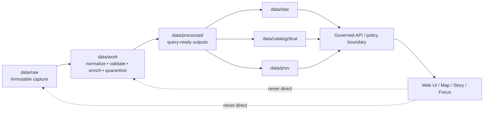

<!-- [KFM_META_BLOCK_V2]
doc_id: kfm://doc/<uuid-TBD-NEEDS-VERIFICATION>
title: data/work
type: standard
version: v1
status: draft
owners: <TBD-NEEDS-VERIFICATION>
created: YYYY-MM-DD
updated: YYYY-MM-DD
policy_label: <TBD-public-or-restricted-NEEDS-VERIFICATION>
related: [../raw/, ../processed/, ../stac/, ../catalog/dcat/, ../prov/]
tags: [kfm, data, work, staging, provenance]
notes: [This README is doctrine-grounded; exact mounted folder contents, owners, identifiers, and dates still require repo verification.]
[/KFM_META_BLOCK_V2] -->

# `data/work`

Repeatable, non-public staging space for KFM intermediate transformations, validation artifacts, and promotion-ready handoff material.

> **Status:** `active (doctrine-confirmed)` · **Mounted tree:** `needs verification` · **Owners:** `TBD`  
>      
> **Quick jumps:** [Scope](#scope) · [Repo fit](#repo-fit) · [Inputs](#accepted-inputs) · [Exclusions](#exclusions) · [Directory tree](#directory-tree) · [Quickstart](#quickstart) · [Usage](#usage) · [Diagram](#diagram) · [Reference tables](#reference-tables) · [Definition of done](#definition-of-done--promotion-gates) · [FAQ](#faq) · [Appendix](#appendix)

> [!IMPORTANT]
> `data/work/` is **not** a publication surface, **not** a canonical endpoint, and **not** a client-facing integration path. In KFM, public and role-limited access crosses the governed API and policy boundary; normal UI surfaces must not read `data/work/` directly.

---

## Scope

`data/work/` sits in the governed KFM truth path between immutable source capture and query-ready processed outputs:

**RAW → WORK / QUARANTINE → PROCESSED → CATALOG / TRIPLET → PUBLISHED**

Within that path, this folder is the zone for **repeatable transformation, normalization, enrichment, QA staging, and quarantine handling** before promotion. Its outputs are still operationally important, but they are **not yet releasable truth objects**.

### What this folder is for

- **CONFIRMED:** intermediate transforms and QA staging
- **CONFIRMED:** derivation, normalization, enrichment, reprojection, redaction/generalization work
- **CONFIRMED:** supporting provenance and validation activity needed before promotion
- **PROPOSED starter convention:** grouped run/batch folders carrying manifests, reports, and intermediate artifacts

### What this folder is not for

- direct public serving
- long-term narrative publication
- bypassing policy, provenance, or catalog generation
- replacing `data/processed/` as the authoritative processed handoff zone

[Back to top](#datawork)

---

## Repo fit

| Aspect | Path | Role here | Status |
|---|---|---|---|
| Current directory | `data/work/` | Intermediate working zone for repeatable transforms and QA | **CONFIRMED doctrine** |
| Upstream source capture | [`../raw/`](../raw/) | Immutable acquisition copies and source manifests | **CONFIRMED doctrine** |
| Downstream processed outputs | [`../processed/`](../processed/) | Query-ready, promotion-target artifacts | **CONFIRMED doctrine** |
| STAC catalogs | [`../stac/`](../stac/) | Spatiotemporal asset metadata written after promotion | **CONFIRMED doctrine** |
| DCAT catalogs | [`../catalog/dcat/`](../catalog/dcat/) | Dataset discovery metadata | **CONFIRMED doctrine** |
| PROV lineage | [`../prov/`](../prov/) | Lineage bundles and transformation traces | **CONFIRMED doctrine** |
| Policy / gating | [`../../policy/`](../../policy/) | Default-deny policy, classification, promotion checks | **INFERRED repo adjacency** |
| Tests / fixtures | [`../../tests/`](../../tests/) | Validation, regression, promotion, and fail-closed checks | **INFERRED repo adjacency** |
| Tooling / scripts | [`../../tools/`](../../tools/) · [`../../scripts/`](../../scripts/) | Validators, evidence checks, promotion helpers | **INFERRED repo adjacency** |

### Upstream / downstream flow

- **Upstream into `data/work/`:** raw captures admitted from `data/raw/`
- **Downstream out of `data/work/`:** processed artifacts, then STAC/DCAT/PROV catalogs, then governed API/UI surfaces
- **Never downstream directly:** browser clients, story surfaces, Focus Mode, or map renderers

[Back to top](#datawork)

---

## Accepted inputs

The following belong here when they are part of a **repeatable, reviewable, non-public** transformation path.

### CONFIRMED fit

- normalized tabular extracts
- reprojected vector or raster intermediates
- enrichment outputs
- QA staging products
- validation-side artifacts created during transformation
- redaction or generalization transforms before processed release
- quarantine outputs for failed or blocked promotion candidates

### PROPOSED starter artifacts

These appear repeatedly in KFM’s March 2026 working patterns and make good starter conventions here, but they are **not claimed as mounted repo truth**:

- `run_record.json`
- `run_manifest.json`
- `validation_report.json`
- `checksums.txt` or `SHA256SUMS.txt`
- `spec_hash.txt`
- transformation logs
- small intermediate provenance notes tied to later PROV emission

### Good fit test

An artifact likely belongs in `data/work/` if all of the following are true:

1. It is derived from admitted source material.
2. It is needed to validate, normalize, enrich, or stage promotion.
3. It is reproducible from upstream inputs and documented logic.
4. It is **not yet** the final processed release artifact.
5. It should **not** be served directly to ordinary clients.

---

## Exclusions

Do **not** put the following here.

| Excluded content | Why it does not belong here | Put it here instead |
|---|---|---|
| Immutable source snapshots | `data/work/` is not the acquisition archive | `../raw/` |
| Final publishable artifacts | Work is not the authoritative processed handoff zone | `../processed/` |
| Final STAC/DCAT/PROV records | Catalogs and lineage are release-bearing outputs | `../stac/`, `../catalog/dcat/`, `../prov/` |
| Public map/story/focus payloads | Clients must cross the trust membrane via governed APIs | API/runtime surfaces |
| Long-lived narrative docs | This folder is for data work, not prose-first publication | `../../docs/` |
| Ad hoc personal scratch that cannot be reproduced | KFM favors repeatable, inspectable work | local scratch / ignored workspace |
| Sensitive material lacking classification/redaction handling | Work zone still operates under governance | quarantine or blocked admission |

> [!WARNING]
> “Useful for an analyst right now” is **not** enough. If the artifact weakens reproducibility, obscures provenance, or tempts direct UI consumption, it does not belong here in unmanaged form.

[Back to top](#datawork)

---

## Directory tree

The exact mounted contents of this folder were **not directly inspectable** in this session. The tree below is therefore a **doctrine-aligned starter shape**, not a claim about live repo state.

```text
data/
└── work/
    ├── README.md
    └── <domain>/
        └── <dataset-or-product>/
            ├── <run-or-batch>/
            │   ├── inputs/                 # optional local copies or pointers, policy permitting
            │   ├── staging/                # intermediate transformed artifacts
            │   ├── qa/                     # checks, samples, validation outputs
            │   ├── quarantine/             # blocked or failed candidates
            │   ├── logs/                   # transform logs, diagnostic outputs
            │   ├── run_record.json         # PROPOSED starter artifact
            │   ├── run_manifest.json       # PROPOSED starter artifact
            │   ├── validation_report.json  # PROPOSED starter artifact
            │   ├── checksums.txt           # PROPOSED starter artifact
            │   └── spec_hash.txt           # PROPOSED starter artifact
            └── provenance/
                └── <local activity notes or transform traces>
```

### Naming guidance

Prefer deterministic, boring names over clever names.

- `<domain>`: stable thematic lane such as `hydrology`, `environmental`, `archaeology`
- `<dataset-or-product>`: stable dataset or output family name
- `<run-or-batch>`: machine-sortable run key, date key, or controlled batch id

---

## Quickstart

### Inspect what is here

```bash
find data/work -maxdepth 3 | sort
```

### Create a new working area

```bash
mkdir -p data/work/<domain>/<dataset>/<run-id>/{staging,qa,logs}
```

### Record a minimal transformation note

```bash
cat > data/work/<domain>/<dataset>/<run-id>/NOTES.md <<'EOF'
# Working note

- Source input: data/raw/<domain>/<source>/
- Purpose: normalization / QA / enrichment
- Output target: data/processed/<domain>/<dataset>/
- Reviewer: TBD
- Status: draft
EOF
```

### Run promotion-style checks

The exact repo command set is **NEEDS VERIFICATION**. A commonly repeated KFM starter pattern is:

```bash
# PROPOSED example — verify tool path and arguments in the mounted repo before use
python -m tools.gates.promote \
  --dataset "$DATASET_ID" \
  --from raw \
  --to work \
  --gate data/registry/"$DATASET_ID"/gate.yaml \
  --fail-closed
```

### Quick sanity checklist before moving on

- transformation is reproducible
- intermediate outputs are explainable
- QA evidence exists
- any sensitivity handling is explicit
- downstream target is clear
- nothing here is being served directly

[Back to top](#datawork)

---

## Usage

### 1. Admit from raw, do not reinvent raw

Start from admitted source material in `data/raw/`. `data/work/` should never become a shadow raw archive.

### 2. Transform in small, reviewable steps

Prefer a chain of understandable intermediates over one opaque mega-step. This makes failures easier to quarantine and replay.

### 3. Attach evidence while the work is fresh

If a normalization decision, reprojection, filter threshold, or enrichment step matters, capture it here before it becomes tribal memory.

### 4. Quarantine on doubt

If quality, schema, policy, or provenance checks fail, hold the candidate in a clearly marked blocked state rather than quietly promoting it.

### 5. Hand off cleanly to processed

Promotion out of `data/work/` should reduce ambiguity, not move it downstream.

---

## Diagram


```mermaid
flowchart LR
    A[data/raw<br/>immutable capture] --> B[data/work<br/>normalize • validate • enrich • quarantine]
    B --> C[data/processed<br/>query-ready outputs]
    C --> D[data/stac]
    C --> E[data/catalog/dcat]
    C --> F[data/prov]
    D --> G[Governed API / policy boundary]
    E --> G
    F --> G
    G --> H[Web UI / Map / Story / Focus]

    H -. never direct .-> B
    H -. never direct .-> A
```

### Reading rule

The important relationship in the diagram is not just left-to-right movement. It is the **blocked path**: UI/runtime surfaces do **not** read `data/work/` directly.

[Back to top](#datawork)

---

## Reference tables

### Zone comparison

| Zone | Purpose | Mutability | Client-facing | Promotion burden |
|---|---|---:|---:|---:|
| `data/raw/` | source capture | append-only / immutable intent | no | source manifest, checksums, rights capture |
| `data/work/` | transformation + QA staging | rewritable / reproducible | no | validation, provenance activity, reviewable logic |
| `data/processed/` | query-ready canonical outputs | controlled release artifact | indirect only | machine-checkable gates before release |
| catalogs (`stac` / `dcat` / `prov`) | discoverability + lineage | generated / governed | indirect through API and review | cross-link validity, schema validity |

### Typical artifact classes in `data/work/`

| Artifact class | Typical reason | Status in this README |
|---|---|---|
| normalized intermediate dataset | standardize schema / CRS / units | **CONFIRMED fit** |
| QA report | document pass/fail or warnings | **CONFIRMED fit** |
| quarantine bundle | isolate blocked candidate | **CONFIRMED fit** |
| run manifest | enumerate files, digests, roles | **PROPOSED starter pattern** |
| run record | capture operator, inputs, params, exit status | **PROPOSED starter pattern** |
| validation report JSON | structured gate output | **PROPOSED starter pattern** |
| spec hash | bind outputs to exact config/spec | **PROPOSED starter pattern** |

### Fast decision matrix

| Question | If “yes” | If “no” |
|---|---|---|
| Is it still intermediate? | keep in `data/work/` | move or never place here |
| Is it reproducible from governed inputs? | acceptable | treat as suspect |
| Does it need QA/policy review before release? | belongs here or in quarantine | may be ready for processed |
| Is a public client expected to read it? | wrong location | okay to remain internal |
| Can you explain how it was produced? | continue | stop and document first |

---

## Definition of done / promotion gates

A work-area is ready to hand off only when the following are satisfied.

- [ ] Inputs trace back to admitted source material.
- [ ] Intermediate outputs are reproducible.
- [ ] Validation/QA evidence exists and is reviewable.
- [ ] Sensitivity, rights, and redaction implications are explicit.
- [ ] Nothing here is serving as an undocumented public surface.
- [ ] Downstream processed target is identified.
- [ ] Required catalog/provenance handoff material is ready or clearly derivable.
- [ ] Any quarantine decision is visible rather than implicit.
- [ ] Naming and folder structure are deterministic enough for replay.
- [ ] Mounted repo-specific commands, schemas, and validators have been verified before relying on them.

### Promotion-minded checklist

| Gate | Minimum expectation | Result if missing |
|---|---|---|
| Integrity | checksums / manifests where required | block or quarantine |
| Validation | schema / QA / spatial-temporal sanity | block or quarantine |
| Provenance | activity and input traceability | no trustworthy promotion |
| Rights / sensitivity | labels and obligations recorded | default deny |
| Downstream handoff | processed/catalog targets defined | hold |
| Review | where required, visible reviewer or policy decision | hold |

[Back to top](#datawork)

---

## FAQ

### Why can’t we publish directly from `data/work/`?

Because KFM treats governed transitions as part of trust, not a convenience step. `data/work/` is where ambiguity is reduced, not where public truth is declared.

### Can notebooks or ad hoc scripts write here?

Yes, **if** their outputs are reproducible, reviewable, and handled as governed intermediates. No, if they create undocumented side paths or become de facto publication surfaces.

### Should failed runs stay here?

Failed or blocked candidates can stay here **when explicitly quarantined** and useful for audit, replay, or diagnosis. Silent junk piles should be cleaned up.

### Is this folder authoritative?

No. The authoritative processed handoff lives downstream. This folder is important, but it is transitional.

### Can the UI read previews from here?

Not as a normal path. If preview behavior exists, it still needs to respect the trust membrane and should not normalize direct reads from work storage.

---

## Appendix

<details>
<summary><strong>Confirmed vs proposed conventions</strong></summary>

### CONFIRMED in current evidence

- `data/work/` is part of the KFM truth path.
- It is the intermediate zone for normalization, derivation, enrichment, and QA staging.
- Promotion requires machine-checkable gates and downstream catalog/provenance outputs.
- Public and role-limited clients should not access internal stores directly.

### INFERRED

- This README should sit alongside other zone-level READMEs in a repo that uses adjacent documentation surfaces.
- Relative links to `../raw/`, `../processed/`, `../stac/`, `../catalog/dcat/`, and `../prov/` fit the doctrine and the visible path patterns in project materials.

### PROPOSED starter conventions

- `run_record.json`
- `run_manifest.json`
- `validation_report.json`
- `checksums.txt`
- `spec_hash.txt`
- explicit `quarantine/`, `qa/`, and `logs/` subfolders within a run/batch area

</details>

<details>
<summary><strong>Open verification items before commit</strong></summary>

- exact mounted contents of `data/work/`
- whether this repo already has a neighboring `data/raw/README.md`
- whether `data/stac/` or `data/catalog/stac/` is the mounted path in the live tree
- actual owner/team for this directory
- correct `doc_id`, `created`, and `updated` values for the KFM meta block
- exact validator and promotion commands
- whether run-manifest / run-record names already exist in mounted implementation

</details>

<details>
<summary><strong>Illustrative starter artifact bundle</strong></summary>

```json
{
  "status": "PROPOSED example",
  "artifacts": [
    "run_record.json",
    "run_manifest.json",
    "validation_report.json",
    "checksums.txt",
    "spec_hash.txt"
  ],
  "note": "Use only after mounted repo conventions are verified."
}
```

</details>

---

_This README is intentionally doctrine-first and fail-closed. Where mounted implementation proof was unavailable, the file keeps the gap visible instead of smoothing it away._

[Back to top](#datawork)
