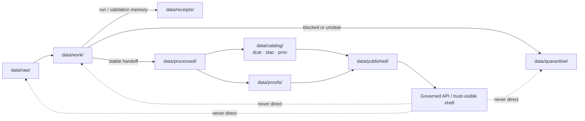

<!-- [KFM_META_BLOCK_V2]
doc_id: kfm://doc/<uuid-TBD-NEEDS-VERIFICATION>
title: data/work
type: standard
version: v1
status: draft
owners: @bartytime4life
created: 2026-03-22
updated: 2026-03-22
policy_label: <TBD-NEEDS-VERIFICATION>
related: [../README.md, ../raw/, ../quarantine/, ../processed/, ../catalog/, ../catalog/stac/, ../catalog/dcat/, ../catalog/prov/, ../receipts/, ../proofs/, ../published/, ../registry/]
tags: [kfm, data, work, staging, provenance]
notes: [Grounded to current public main plus March 2026 doctrine; created/updated reflect current public-main file history for this path; doc_id and policy_label still need verification.]
[/KFM_META_BLOCK_V2] -->

# `data/work`

Repeatable, non-public staging zone for governed intermediate transforms, validation artifacts, and promotion handoff material.

> **Status:** `active directory` · **Doc state:** `draft`  
> **Owners:** `@bartytime4life` *(current public `CODEOWNERS` coverage for `/data/`)*  
> **Path:** `data/work/README.md`  
> **Current public tree:** `data/work/` contains `README.md` only on public `main`  
> [](#scope)
> [](#scope)
> [](#repo-fit)
> [](#directory-tree)
> [](#reference-tables)
> [](#scope)
>
> **Quick jump:** [Scope](#scope) · [Repo fit](#repo-fit) · [Accepted inputs](#accepted-inputs) · [Exclusions](#exclusions) · [Directory tree](#directory-tree) · [Quickstart](#quickstart) · [Usage](#usage) · [Diagram](#diagram) · [Reference tables](#reference-tables) · [Definition of done](#definition-of-done--promotion-gates) · [FAQ](#faq) · [Appendix](#appendix)

> [!IMPORTANT]
> `data/work/` is **not** a publication surface, **not** a canonical endpoint, and **not** a client-facing integration path. In KFM, public and role-limited access crosses the governed API, policy, and evidence boundary; normal UI and runtime surfaces must not read `data/work/` directly.

> [!NOTE]
> Current public `main` confirms the lane, not a populated working inventory. This README therefore separates the **CONFIRMED live tree** from a **PROPOSED working deepening** instead of treating starter structure as checked-in reality.

---

## Scope

`data/work/` sits in the governed KFM truth path between immutable intake and release-ready processed scope:

`Source edge -> RAW -> WORK / QUARANTINE -> PROCESSED -> CATALOG -> PUBLISHED`

Within that path, `data/work/` is the operational zone for **repeatable transformation, normalization, enrichment, QA staging, and handoff preparation** before outputs can support stable dataset-version identity, catalog closure, release evidence, or governed publication.

### Evidence posture used in this README

| Label | Meaning here |
|---|---|
| **CONFIRMED** | Current public `main` proves that `data/work/` exists as a top-level `data/` zone and currently contains `README.md` only. Adjacent public READMEs also confirm neighboring lifecycle lanes. |
| **INFERRED** | A role or relationship follows strongly from confirmed sibling READMEs and KFM doctrine, but is not proven by a populated subtree inside `data/work/` itself. |
| **PROPOSED** | Starter run layout, filename conventions, and working patterns that fit the repo’s doctrine and adjacent docs but are not yet proven as checked-in branch reality. |
| **UNKNOWN** | Working-branch-only content, emitted artifact inventory, local helper commands, and automation beyond the current public tree. |
| **NEEDS VERIFICATION** | Any value that should be checked before merge or release, including final `doc_id`, `policy_label`, deeper subtree shape, and local command wiring. |

### What this directory is for

- intermediate transforms and QA staging
- derivation, normalization, enrichment, reprojection, and generalization work
- reviewable handoff preparation before `data/processed/`
- work notes that keep transform decisions inspectable while context is fresh
- temporary, non-public run material that is still in-flight and not yet release-backed

### What this directory is not for

- direct public serving
- long-term narrative publication
- release manifests, proof packs, or outward catalog closure
- source registration or dataset identity records
- hiding blocked material that should be isolated in `data/quarantine/`
- turning convenient scratch into de facto published truth

[Back to top](#datawork)

---

## Repo fit

### Path and current public state

| Item | Current reading |
|---|---|
| **Path** | `data/work/README.md` |
| **Current public tree state** | `data/work/` currently shows `README.md` only |
| **Owner coverage** | `/data/` is assigned to `@bartytime4life` in the current public `CODEOWNERS` file |
| **Parent surface** | [`../README.md`](../README.md) defines the wider `data/` lifecycle |
| **Lifecycle position** | between [`../raw/`](../raw/) and [`../processed/`](../processed/), with [`../quarantine/`](../quarantine/) as the fail-closed sibling lane |

### Adjacency and flow

| Direction | Surface | Why it matters here | Status |
|---|---|---|---|
| Upstream | [`../raw/`](../raw/) | Immutable, source-native intake for evidence-bearing inputs | **CONFIRMED** |
| Lateral | [`../quarantine/`](../quarantine/) | Explicit fail-closed lane for blocked, ambiguous, or review-held material | **CONFIRMED** |
| Downstream | [`../processed/`](../processed/) | Stable dataset versions and release-adjacent processed artifacts | **CONFIRMED** |
| Downstream | [`../catalog/`](../catalog/) | Catalog-closure parent for outward `DCAT + STAC + PROV` metadata | **CONFIRMED** |
| Downstream | [`../catalog/stac/`](../catalog/stac/) | Spatial and temporal asset discovery | **CONFIRMED** |
| Downstream | [`../catalog/dcat/`](../catalog/dcat/) | Dataset and distribution discovery | **CONFIRMED** |
| Downstream | [`../catalog/prov/`](../catalog/prov/) | Catalog-facing lineage and provenance bundles | **CONFIRMED** |
| Adjacent process memory | [`../receipts/`](../receipts/) | Central receipt placement for run memory, validation context, and replay/audit support | **CONFIRMED** |
| Adjacent release evidence | [`../proofs/`](../proofs/) | Release manifests, proof packs, attestations, and rollback/correction evidence | **CONFIRMED** |
| Adjacent publication state | [`../published/`](../published/) | Optional materialized surface for already release-backed scope | **CONFIRMED** |
| Adjacent registration | [`../registry/`](../registry/) | Source admission, dataset identity, and onboarding guidance | **CONFIRMED** |
| Shared controls | [`../../contracts/`](../../contracts/) · [`../../schemas/`](../../schemas/) · [`../../policy/`](../../policy/) · [`../../tests/`](../../tests/) · [`../../tools/`](../../tools/) · [`../../scripts/`](../../scripts/) | Contracts, schema-home boundary, policy posture, validation, and local helper surfaces | **CONFIRMED public doc surfaces** |

### Upstream / downstream rule of thumb

- Admit source-native material from `data/raw/`.
- Keep active, repeatable transform work in `data/work/`.
- Move blocked or unclear material into `data/quarantine/`.
- Hand off stable outputs to `data/processed/`.
- Keep catalog closure in `data/catalog/`.
- Keep process memory and release proof adjacent, not buried inside working payload folders.
- Reach `data/published/` only through a governed, release-backed state transition.

[Back to top](#datawork)

---

## Accepted inputs

The following belong here when they are part of a **repeatable, reviewable, non-public** transformation path.

### Confirmed fit

- normalized tabular or spatial intermediates
- reprojected or schema-aligned vector/raster working outputs
- enrichment outputs that still need review or downstream stabilization
- QA staging products, samples, and validation-side artifacts
- redaction or generalization candidates before processed release
- run-local notes that explain non-obvious transform decisions

### Proposed starter artifacts

Use these as **starter patterns**, not as already-proven branch conventions:

- `run_record.json`
- `run_manifest.json`
- `validation_report.json`
- `checksums.txt`
- `NOTES.md`
- `spec_hash.txt`
- small `manifests/`, `qa/`, and `logs/` subfolders inside a run area

### Good-fit test

An artifact likely belongs in `data/work/` if all five checks pass:

1. It derives from admitted or reviewable upstream material.
2. It is needed to transform, normalize, enrich, validate, or prepare a handoff.
3. It remains reproducible enough to replay or explain.
4. It is **not yet** the stable processed release artifact.
5. It should **not** be read directly by normal client or runtime surfaces.

---

## Exclusions

| Excluded content | Why it does not belong here | Put it here instead |
|---|---|---|
| Immutable upstream captures | Intake must stay source-native and append-friendly | [`../raw/`](../raw/) |
| Blocked, ambiguous, or review-held material | Work is not the fail-closed holding lane | [`../quarantine/`](../quarantine/) |
| Canonical processed artifacts | `data/work/` is pre-release staging, not the stable processed zone | [`../processed/`](../processed/) |
| STAC / DCAT / PROV closure files | Outward discovery and lineage belong downstream of processed handoff | [`../catalog/`](../catalog/) |
| Central run receipts that must stay queryable across runs | Process memory should remain easy to resolve during replay, correction, and audit | [`../receipts/`](../receipts/) |
| Release manifests, proof packs, attestations, rollback evidence | Release proof is a separate trust surface | [`../proofs/`](../proofs/) |
| Materialized published scope | Publication is a governed state, not a convenience copy out of work | [`../published/`](../published/) |
| Source-registration entries or identity schemas | Onboarding and dataset identity should stay small, explicit, and diffable | [`../registry/`](../registry/) |
| Policy bundles, contract schemas, or runtime code | Preserve lane boundaries instead of hiding control-plane assets in staging | [`../../policy/`](../../policy/) · [`../../contracts/`](../../contracts/) · [`../../schemas/`](../../schemas/) · app/package surfaces |

> [!WARNING]
> “Useful for an analyst right now” is **not** enough. If the artifact weakens reproducibility, obscures provenance, or tempts direct UI/runtime consumption, it does not belong here in unmanaged form.

[Back to top](#datawork)

---

## Directory tree

### Confirmed current public tree

```text
data/work/
└── README.md
```

### Confirmed current `data/` sibling excerpt

```text
data/
├── catalog/
├── processed/
├── proofs/
├── published/
├── quarantine/
├── raw/
├── receipts/
├── registry/
├── work/
└── README.md
```

### Proposed working deepening

```text
data/work/
├── README.md
└── <domain-or-dataset>/
    └── <run-id>/
        ├── staging/
        ├── qa/
        ├── logs/
        ├── manifests/
        ├── NOTES.md
        ├── run_record.json
        ├── run_manifest.json
        ├── validation_report.json
        ├── checksums.txt
        └── spec_hash.txt
```

> [!NOTE]
> Avoid inventing a pseudo-quarantine subtree under `data/work/`. If a run becomes blocked by rights, sensitivity, validation, or review, move or reference it explicitly in [`../quarantine/`](../quarantine/).

### Naming guidance

Prefer deterministic, boring names over clever names.

- `<domain-or-dataset>`: stable domain or dataset family name
- `<run-id>`: sortable run key, batch key, or date-based identifier
- `NOTES.md`: short human-readable explanation of what changed and why
- `run_*` / `validation_*` files: only after the active branch confirms those names are acceptable

[Back to top](#datawork)

---

## Quickstart

### Inspect the current lane

```bash
find data/work -maxdepth 2 -print | sort
```

### Create a starter run area

```bash
RUN_ID="2026-04-01-example-001"
mkdir -p "data/work/<dataset>/${RUN_ID}"/{staging,qa,logs,manifests}
```

### Record the purpose of the work

```bash
cat > "data/work/<dataset>/${RUN_ID}/NOTES.md" <<'EOF'
# Working note

- Source input: data/raw/<source-batch>/
- Intended handoff: data/processed/<dataset>/
- Public exposure: blocked
- Reviewer: TBD
- Status: draft
EOF
```

### Escalate blocked work explicitly

```bash
# Illustrative only — verify local handling rules before adopting verbatim.
CASE_ID="q-$(date -u +%Y%m%d)-<dataset>-001"
mkdir -p "data/quarantine/${CASE_ID}"
```

### Validate with confirmed local tooling only

Use the checked-out command set documented in [`../../tools/`](../../tools/) and [`../../scripts/`](../../scripts/) **after** those files are verified on the active branch. Do not assume an unverified `promote` or `gate` CLI exists just because doctrine or earlier planning documents mention one.

[Back to top](#datawork)

---

## Usage

### 1. Admit from raw, do not reinvent raw

Start from admitted source material in [`../raw/`](../raw/). `data/work/` should never become a shadow raw archive.

### 2. Transform in small, reviewable steps

Prefer a chain of understandable intermediates over one opaque mega-step. This keeps replay, QA, and handoff review legible.

### 3. Attach evidence while the work is fresh

If a normalization decision, reprojection, filter threshold, enrichment step, or redaction choice matters, capture it here before it becomes tribal memory.

### 4. Escalate failure or ambiguity to quarantine

When rights are unclear, validation fails, sensitivity is unresolved, or review blocks advancement, use [`../quarantine/`](../quarantine/) rather than leaving “temporary” blocked material mixed into normal work runs.

### 5. Keep receipts and proofs adjacent, not hidden

If process memory needs to stay centrally queryable, place it in [`../receipts/`](../receipts/). If evidence belongs to release proof, use [`../proofs/`](../proofs/). `data/work/` should not become a junk drawer for all governance artifacts.

### 6. Hand off cleanly to processed

Promotion out of `data/work/` should reduce ambiguity, not move it downstream. By the time material leaves this lane, its target processed identity, validation context, and downstream catalog intent should be clear.

---

## Diagram


```mermaid
flowchart LR
    A[data/raw/] --> B[data/work/]
    B -->|blocked or unclear| Q[data/quarantine/]
    B -->|run / validation memory| R[data/receipts/]
    B -->|stable handoff| C[data/processed/]
    C --> K[data/catalog/ <br/> dcat · stac · prov]
    C --> P[data/proofs/]
    K --> U[data/published/]
    P --> U
    U --> G[Governed API / trust-visible shell]

    G -. never direct .-> B
    G -. never direct .-> Q
    G -. never direct .-> A
```

### Reading rule

The key relationship is not just left-to-right flow. It is the **blocked path**: normal governed surfaces do **not** read `data/work/`, `data/quarantine/`, or `data/raw/` directly.

[Back to top](#datawork)

---

## Reference tables

### Zone comparison

| Zone | Primary job | Public-facing? | Working rule |
|---|---|---:|---|
| `data/raw/` | Immutable intake | No | Preserve source-native capture and terms context |
| `data/work/` | Repeatable transform + QA staging | No | Keep intermediates reviewable and non-public |
| `data/quarantine/` | Fail-closed hold | No | Isolate blocked or unclear material explicitly |
| `data/processed/` | Stable processed outputs | Indirect only | Carry governed dataset versions and release-adjacent artifacts |
| `data/catalog/` | `DCAT + STAC + PROV` closure | Indirect only | Make release-backed truth discoverable, traceable, and cross-linkable |
| `data/published/` | Optional materialized published scope | Indirect only | Materialize only already governed, release-backed scope |

### Current public sibling surfaces relevant to `data/work/`

| Sibling | Current public state | Why `data/work/` maintainers should care |
|---|---|---|
| [`../raw/`](../raw/) | README-backed live lane | Defines where source-native inputs start |
| [`../quarantine/`](../quarantine/) | README-backed live lane | Prevents blocked work from leaking forward |
| [`../processed/`](../processed/) | README-backed live lane | Defines the immediate downstream handoff target |
| [`../catalog/`](../catalog/) | Live parent with `dcat/`, `stac/`, and `prov/` | Clarifies where closure happens after processed handoff |
| [`../receipts/`](../receipts/) | README-backed live lane | Separates process memory from payload staging |
| [`../proofs/`](../proofs/) | README-backed live lane | Separates release proof from in-flight work |
| [`../published/`](../published/) | README-backed live lane | Reminds maintainers that publication is downstream, not implicit |
| [`../registry/`](../registry/) | README-backed live lane | Keeps source/dataset identity out of staging clutter |

### Typical starter artifact classes

| Artifact class | Typical use | Status in this README |
|---|---|---|
| normalized intermediate dataset | schema/CRS/unit alignment | **CONFIRMED fit** |
| QA sample or validation output | pass/fail or warning context | **CONFIRMED fit** |
| transform note | preserves non-obvious decisions | **CONFIRMED fit** |
| `run_record.json` | compact run summary | **PROPOSED starter pattern** |
| `run_manifest.json` | file inventory + digests + roles | **PROPOSED starter pattern** |
| `validation_report.json` | structured validation result | **PROPOSED starter pattern** |
| `checksums.txt` | quick integrity check | **PROPOSED starter pattern** |

---

## Definition of done / promotion gates

A work run is ready to leave `data/work/` only when the following are satisfied:

- [ ] Inputs resolve back to admitted source material in `data/raw/` or to an explicitly resolved quarantine case.
- [ ] Intermediate outputs are reproducible enough to replay or explain.
- [ ] QA evidence exists and unresolved issues are visible.
- [ ] Rights, sensitivity, redaction, and generalization implications are explicit.
- [ ] The intended target in `data/processed/` is named.
- [ ] Receipt placement is clear if process memory must be retained centrally in `data/receipts/`.
- [ ] Release-evidence placement is clear if the work is approaching proof-bearing promotion in `data/proofs/`.
- [ ] No outward catalog or published scope is being generated directly from `data/work/`.
- [ ] Any blocked subset has been moved or referenced to `data/quarantine/`.
- [ ] Local validators, scripts, and conventions used by the run have been verified on the active branch.

### Promotion-minded checklist

| Gate | Minimum expectation | Result if missing |
|---|---|---|
| Integrity | checksums or equivalent run-level integrity record where needed | hold or re-run |
| Validation | QA output, schema sanity, spatial/temporal sanity | hold or quarantine |
| Provenance | transform notes and upstream traceability | no trustworthy handoff |
| Rights / sensitivity | explicit labels or review notes | default deny |
| Handoff clarity | processed target and next zone are named | hold |
| Receipt / proof separation | process memory and release proof are not buried in staging | cleanup before promotion |
| Reviewability | the run can be explained without guesswork | hold |

[Back to top](#datawork)

---

## FAQ

### Is `data/work/` the same as `data/quarantine/`?

No. `data/work/` is the normal repeatable transform and QA lane. [`../quarantine/`](../quarantine/) is the stricter fail-closed lane for blocked, ambiguous, or review-held material.

### Why can’t we publish directly from `data/work/`?

Because KFM treats publication as a governed trust-state change, not a convenient file move. `data/work/` is where ambiguity is reduced, not where outward truth is declared.

### Where should receipts go?

If receipts need to remain centrally queryable across runs, corrections, or audits, use [`../receipts/`](../receipts/). Keep only local, run-specific context in the work run itself unless branch conventions say otherwise.

### Where should proof packs and attestations go?

Use [`../proofs/`](../proofs/) for release-significant evidence. `data/work/` is not the release-evidence home.

### Does “README-only on public main” mean the lane is unused?

No. It only means the **currently visible public subtree** is documentation-light. This README should not speculate about populated working branches, external storage mappings, or private runtime usage without direct verification.

### Can normal UI or API surfaces read previews from here?

Not as a normal governed path. Any preview behavior still has to respect the trust membrane and should not normalize direct reads from `data/work/`.

---

## Appendix

<details>
<summary><strong>Confirmed current public-tree signals</strong></summary>

### Confirmed on public `main`

- `data/` currently shows `catalog/`, `processed/`, `proofs/`, `published/`, `quarantine/`, `raw/`, `receipts/`, `registry/`, `work/`, and `README.md`.
- `data/work/` currently shows `README.md` only.
- `data/catalog/` currently shows `dcat/`, `stac/`, and `prov/`.
- Public `CODEOWNERS` coverage assigns `/data/` to `@bartytime4life`.

### Why that matters here

This README can now distinguish:
- **live path existence** from
- **README-level directory contracts** from
- **deeper working patterns that still need branch verification**.

</details>

<details>
<summary><strong>Proposed starter artifacts</strong></summary>

```json
{
  "status": "PROPOSED example",
  "artifacts": [
    "NOTES.md",
    "run_record.json",
    "run_manifest.json",
    "validation_report.json",
    "checksums.txt",
    "spec_hash.txt"
  ],
  "note": "Use only after the active branch confirms naming and placement conventions."
}
```

</details>

<details>
<summary><strong>Open verification items before merge</strong></summary>

- final `doc_id` for the KFM meta block
- final `policy_label` for this directory
- whether branch-local working runs already use a stricter naming convention
- whether any branch-side automation writes receipts locally vs centrally to `data/receipts/`
- whether release-adjacent proof placement is fully standardized in branch-local tooling
- any active validator or handoff command documented in `tools/` or `scripts/`
- whether external object storage or runtime packaging mirrors this lane beyond the public repo

</details>

---

_This README is intentionally trust-visible and verification-first: it preserves the live public path, makes the lifecycle boundary legible, and keeps deeper working shape explicit instead of implied._

[Back to top](#datawork)
