# 🧰 `data/work/` — Workbench & Experiment Sandbox


> [!IMPORTANT]
> `data/work/` is **controlled chaos** 🧪—a sandbox for experiments, prototypes, and intermediate artifacts **before** promotion into the canonical pipeline.
>
> ✅ If it can’t be reproduced, it doesn’t count. 🔬  
> ✅ If it’s relied on downstream (Graph/API/UI/Story/Focus), it **must be promoted** and shipped with **STAC + DCAT + PROV**.  
> ✅ The **API boundary** mediates access (no “sneaky” UI reads from Neo4j or file paths).

---

## 📌 Quick navigation

- [🎯 What belongs here](#-what-belongs-here)
- [🧱 Canonical pipeline order](#-canonical-pipeline-order-non-negotiable)
- [🗂️ Recommended layout](#️-recommended-layout)
- [🧾 Work Package Standard](#-work-package-standard-wps)
- [🧬 Reproducibility & provenance](#-reproducibility--provenance)
- [✅ Quality checklists](#-quality-checklists-fast-but-real)
- [🚀 Promotion rules](#-promotion-rules-work--processed--catalogs)
- [🔐 Governance & “don’t be creepy” rules](#-governance--dont-be-creepy-rules)
- [📚 Reference shelf](#-reference-shelf-project-library)

---

## 🎯 What belongs here

✅ Put **work-in-progress** artifacts here:

- 🧪 **Experiment runs**  
  Regression studies, Bayesian inference, statistical EDA, model training/evaluation, drift checks
- 🛰️ **GIS/remote sensing scratch work**  
  Clips, reprojection trials, NDVI derivations, mosaics, tiling prototypes, pyramids/overviews tests
- 📓 **Notebooks + narrative analysis**  
  Exploratory notebooks that explain *what/why/how* and point to inputs + outputs
- 🧱 **Intermediate data products**  
  Staging outputs: normalized tables, feature engineering outputs, QA fixtures (with manifests)
- 📊 **Run-scoped plots & mini-reports**  
  Figures/tables that help decide whether something is ready for promotion
- 🌐 **UI + visualization prototypes**  
  WebGL demos, responsive layout tests, map style experiments, timeline prototypes

🚫 Do **not** treat `data/work/` as a permanent source of truth:

- 🔑 **Secrets / tokens / credentials** (never, ever)
- 🧍 **PII or sensitive coordinates** (unless explicitly allowed + classified + controlled)
- 🧨 “Mystery files” with no manifest/provenance
- 🏛️ Final datasets intended for others to consume (promote them out)

> [!TIP]
> **Keep raw raw.** If you changed bytes, it’s not raw anymore → it belongs in `data/work/` (intermediate) or `data/processed/` (final).

---

## 🧭 Canonical pipeline order (non-negotiable)

KFM stays stable by being strict about order:

**ETL → STAC/DCAT/PROV → Graph → API → UI → Story Nodes → Focus Mode**

`data/work/` sits **upstream** of the boundary artifacts (catalogs + provenance). It’s where we prove something can be made deterministic and governed before it becomes “real.” 

```mermaid
flowchart LR
  RAW["📥 data/raw/<domain>\nimmutable inputs"] --> WORK["🧰 data/work/<domain>\nexperiments + prototypes"]
  WORK --> PROC["📦 data/processed/<domain>\nfinal products"]
  PROC --> STAC["🛰️ data/stac/\nCollections + Items"]
  PROC --> DCAT["🗂️ data/catalog/dcat/\ndiscovery views"]
  PROC --> PROV["🧬 data/prov/\nlineage bundles"]
  STAC --> GRAPH["🕸️ Graph runtime (Neo4j)\nreferences IDs, not payloads"]
  DCAT --> GRAPH
  PROV --> GRAPH
  GRAPH --> API["🔌 API boundary\ncontracts + redaction"]
  API --> UI["🗺️ UI\nmap + timeline + downloads"]
  UI --> STORY["🎬 Story Nodes\ncurated narrative"]
  STORY --> FOCUS["🧠 Focus Mode\nprovenance-linked only"]
```



> 📌 System context & architecture notes live in the project technical documentation.  [oai_citation:0‡Kansas Frontier Matrix (KFM) – Comprehensive Technical Documentation.docx](file-service://file-PaBDqECcJe7NbC8hvXNGDS)

---

## 🗂️ Recommended layout

Keep it flexible, but consistent enough that others can navigate quickly.

```text
📁 data/work/
├── 📁 _templates/                     # ✅ copy/paste manifests + checklists
├── 📁 _scratch/                       # ⚠️ throwaway (safe to delete; keep it empty in PRs)
├── 📁 experiments/                    # 🧪 repeatable runs (preferred home)
│   ├── 📁 2026-01-02__remote_sensing__ndvi_landsat8__v01/
│   ├── 📁 2026-01-04__stats__soil_moisture_regression__v02/
│   └── 📁 2026-01-10__viz__webgl_tileset_prototype__v01/
├── 📁 datasets/                       # 📦 curated WIP datasets (not published)
├── 📁 sims/                           # 🛰️ simulation campaigns (parameter sweeps, V&V)
├── 📁 qa/                             # ✅ run-scoped QA outputs (optional; keep small)
└── 📄 README.md                       # 👈 you are here
```

> [!NOTE]
> Keep `data/work/` PR-friendly: commit **manifests, small fixtures, plots**, and pointers—avoid dumping unbounded large binaries into Git.

---

## 🧾 Work Package Standard (WPS)

A **Work Package** is any folder under `data/work/` that we expect others to run, review, or build on.

### ✅ Naming convention

Use a timestamp + domain + slug:

- `YYYY-MM-DD__<domain>__<short_slug>__vNN/`

Examples:
- `2026-01-02__remote_sensing__ndvi_landsat8__v01/`
- `2026-01-04__stats__soil_moisture_regression__v02/`
- `2026-01-10__viz__webgl_tileset_prototype__v01/`

### ✅ Required files

Every Work Package **must** contain:

- `README.md` — purpose, scope, results, next steps
- `manifest.yaml` — inputs, parameters, outputs, environment, hashes
- `raw/` — immutable inputs **or pointers** (if data is too large / restricted)
- `src/` and/or `notebooks/` — runnable code that generates outputs

### 🔥 Strongly recommended

- `environment/` — `requirements.txt`, `environment.yml`, `poetry.lock`, `package-lock.json`, etc.
- `checksums.sha256` — integrity list for key artifacts
- `schema/` — JSON schema / SQL schema notes / GeoPackage schema
- `data_dictionary.md` — fields, units, codes, value ranges
- `PROV_HINT.md` — a lightweight pointer that maps the run to intended PROV fields later

---

## 📦 Work Package skeleton (copy/paste)

```text
📁 data/work/experiments/2026-01-04__stats__soil_moisture_regression__v02/
├── 📄 README.md
├── 📄 manifest.yaml
├── 📁 raw/                  # pointers or small fixtures
├── 📁 notebooks/             # EDA + narrative
├── 📁 src/                   # scripts/modules
├── 📁 work/                  # intermediate scratch (scoped to this run)
├── 📁 outputs/               # results: tables, metrics, artifacts
├── 📁 viz/                   # figures, maps, dashboards screenshots
├── 📁 exports/               # OPTIONAL: candidate bundle for promotion
└── 📄 checksums.sha256       # OPTIONAL: integrity
```

---

## 🧬 Reproducibility & provenance

> [!IMPORTANT]
> **Reproducibility is a security feature.**  
> It enables audit, rollback, and tamper detection—not just “nice science.”

### ✅ Minimal reproducibility checklist

- [ ] Inputs are immutable (or pinned to a version/hash)
- [ ] Parameters are recorded (region, date range, filters, thresholds)
- [ ] Environment is pinned (lockfiles, container tag, runtime version)
- [ ] Randomness is controlled (seeds logged where applicable)
- [ ] Outputs include metadata (CRS, units, nodata, schema, timestamps)
- [ ] A tiny “rerun me” command exists (Make target, script, or notebook cell)

### `manifest.yaml` starter (WPS)

```yaml
id: 2026-01-04__stats__soil_moisture_regression__v02
owner: "@your-handle"
created_at: "2026-01-04"
status: wip  # wip | review | archived | promoted

goal:
  question: "How does soil moisture relate to vegetation index over time in region X?"
  hypothesis: "Soil moisture explains part of NDVI variance with a lag."

inputs:
  - name: soil_moisture_source
    type: table
    pointer: "data/raw/hydro/soil_moisture/<drop_id>/ (or external URL if not mirrored)"
    immutability: "pinned"
    notes: "Prefer checksums + retrieval receipt."

  - name: ndvi_processed_candidate
    type: raster
    pointer: "data/work/experiments/2026-01-02__remote_sensing__ndvi_landsat8__v01/outputs/ndvi_cog.tif"
    immutability: "local"
    notes: "If promoted later, this becomes a STAC asset."

process:
  steps:
    - validate: ["schema", "ranges", "missingness", "crs"]
    - feature_engineer: ["lag_features", "seasonality_terms"]
    - model: ["baseline_linear_regression", "robust_regression_optional"]
    - evaluate: ["residuals", "outliers", "uncertainty"]
parameters:
  region: "AOI slug or file path"
  date_range: ["YYYY-MM-DD", "YYYY-MM-DD"]
  random_seed: 1337

outputs:
  - name: metrics
    path: outputs/metrics.json
  - name: model_summary
    path: outputs/model_summary.md
  - name: plots
    path: viz/

environment:
  runtime: "python"
  lockfiles:
    - environment/requirements.txt
    - environment/poetry.lock

promotion_intent:
  candidate_dataset_id: "kfm.<domain>.<theme>.<spacetime>.v1"
  requires_catalogs: true   # STAC + DCAT + PROV
  notes: "Promote only after QA and steward review."
```

---

## ✅ Quality checklists (fast, but real)

### 🗺️ Geospatial sanity (raster/vector)

- [ ] CRS explicitly stated and consistent (no silent EPSG drift)
- [ ] Units documented (meters vs degrees, mm vs inches, etc.)
- [ ] Geometry validity checks pass (no self-intersections, no empty geoms)
- [ ] Raster nodata defined and preserved
- [ ] Outputs have overviews/pyramids when meant for interactive browsing
- [ ] Cartography choices recorded (symbology, classification, color ramps, legends)

**Helpful project refs 📚**
- `making-maps-a-visual-guide-to-map-design-for-gis.pdf`
- `python-geospatial-analysis-cookbook.pdf`
- `Cloud-Based Remote Sensing with Google Earth Engine-Fundamentals and Applications.pdf`
- `compressed-image-file-formats-jpeg-png-gif-xbm-bmp.pdf`

### 📈 Statistics & experimental design (don’t fool yourself)

- [ ] Label the work: **exploration** vs **confirmation**
- [ ] Check assumptions (residuals, heteroskedasticity, independence)
- [ ] Avoid leakage (train/val/test boundaries are explicit)
- [ ] Report effect sizes + uncertainty (not just p-values)
- [ ] Document multiple comparisons risk (if applicable)

**Helpful project refs 📚**
- `Understanding Statistics & Experimental Design.pdf`
- `regression-analysis-with-python.pdf`
- `Regression analysis using Python - slides-linear-regression.pdf`
- `graphical-data-analysis-with-r.pdf`
- `think-bayes-bayesian-statistics-in-python.pdf`

### 🛰️ Simulation & modeling integrity (V&V + UQ)

- [ ] Inputs/initial conditions captured
- [ ] Validation plan stated (what would falsify the model?)
- [ ] Sensitivity sweeps documented (even a minimal one)
- [ ] Outputs include units, coordinate frames, and metadata
- [ ] Results reproducible from config + seed + environment

**Helpful project refs 📚**
- `Scientific Modeling and Simulation_ A Comprehensive NASA-Grade Guide.pdf`
- `Generalized Topology Optimization for Structural Design.pdf`
- `Spectral Geometry of Graphs.pdf`

### 🌐 Visualization prototypes (Web + WebGL)

- [ ] Save screenshots + “what this proves” note
- [ ] Keep a minimal demo entry point (`index.html` or `README.md`)
- [ ] Consider mobile-first constraints early
- [ ] Treat 3D assets/parsers as untrusted inputs (security boundary)

**Helpful project refs 📚**
- `responsive-web-design-with-html5-and-css3.pdf`
- `webgl-programming-guide-interactive-3d-graphics-programming-with-webgl.pdf`
- `Mobile Mapping_ Space, Cartography and the Digital - 9789048535217.pdf`  [oai_citation:1‡Mobile Mapping_ Space, Cartography and the Digital - 9789048535217.pdf](file-service://file-AkVmsLhdFzwie5Gco3zgYj)

---

## 🚀 Promotion rules (`work` → `processed` → catalogs)

### When do we promote?

Promote when **any** of the following becomes true:

- A dataset is stable enough to be reused across multiple work packages
- A derived layer should appear in map/timeline exploration
- A result is referenced in Story Nodes or decision-facing docs
- We need the artifact to be audited, cited, or externally shared

### Promotion “definition of done” ✅

- [ ] Output moved (or re-generated) into `data/processed/<domain>/…`
- [ ] Boundary artifacts produced: **STAC + DCAT + PROV**
- [ ] QA checks captured (and ideally automated)
- [ ] Sensitivity/classification reviewed (no “downgrade by accident”)
- [ ] A thin pointer remains in `data/work/` (README linking to the canonical artifact)

> [!TIP]
> Think of `data/work/` as *rehearsal* 🎭 and `data/processed/` as *opening night* 🎟️

---

## 🔐 Governance & “don’t be creepy” rules

KFM is evidence-first **and** human-centered. Maps and datasets can cause harm if handled carelessly.

### Non-negotiables

- ❌ No secrets or credentials in `data/work/`
- ❌ No publishing precise sensitive locations without explicit review
- ✅ Always document provenance + licensing constraints
- ✅ Treat derived outputs as potentially sensitive (inference risk is real)

### Interoperability & data sharing

When your work package “wants to become real,” design it so it can be shared responsibly:

- stable IDs
- clear metadata
- explicit terms of use
- reproducible runs

**Helpful project refs 📚**
- `Data Spaces.pdf` (interoperability + data sharing framing)
- `Introduction to Digital Humanism.pdf` (human-centered accountability)
- `On the path to AI Law’s prophecies and the conceptual foundations of the machine learning age.pdf` (policy + legal context)
- Defensive mindset references (do not add offensive tooling):
  - `ethical-hacking-and-countermeasures-secure-network-infrastructures.pdf`
  - `Gray Hat Python - Python Programming for Hackers and Reverse Engineers (2009).pdf`

---

## 🧠 Data engineering notes (practical)

- Prefer **append-only** patterns for “inputs”
- Prefer **atomic writes** for files (write temp → rename) and **transactions** for DB
- Keep DB experiments explicit (schema migrations, indexes, constraints)
- Pin dependencies and record runtime versions

**Helpful project refs 📚**
- `PostgreSQL Notes for Professionals - PostgreSQLNotesForProfessionals.pdf`
- `Scalable Data Management for Future Hardware.pdf`
- `concurrent-real-time-and-distributed-programming-in-java-threads-rtsj-and-rmi.pdf`

---

## 📚 Reference shelf (project library)

> [!NOTE]
> These files are a **reading pack / influence map**. They may have licenses different from the repo’s code. Keep them in `docs/library/` (or external storage) and respect upstream terms.

### 🧭 KFM system + architecture
- `Kansas Frontier Matrix (KFM) – Comprehensive Technical Documentation.docx`  [oai_citation:2‡Kansas Frontier Matrix (KFM) – Comprehensive Technical Documentation.docx](file-service://file-PaBDqECcJe7NbC8hvXNGDS)

### 🛰️ Remote sensing + GIS
- `Cloud-Based Remote Sensing with Google Earth Engine-Fundamentals and Applications.pdf`
- `python-geospatial-analysis-cookbook.pdf`
- `PostgreSQL Notes for Professionals - PostgreSQLNotesForProfessionals.pdf`
- `making-maps-a-visual-guide-to-map-design-for-gis.pdf`
- `Mobile Mapping_ Space, Cartography and the Digital - 9789048535217.pdf`  [oai_citation:3‡Mobile Mapping_ Space, Cartography and the Digital - 9789048535217.pdf](file-service://file-AkVmsLhdFzwie5Gco3zgYj)
- `compressed-image-file-formats-jpeg-png-gif-xbm-bmp.pdf`

### 🌐 Web + 3D
- `responsive-web-design-with-html5-and-css3.pdf`
- `webgl-programming-guide-interactive-3d-graphics-programming-with-webgl.pdf`

### 📈 Stats + inference
- `Understanding Statistics & Experimental Design.pdf`
- `regression-analysis-with-python.pdf`
- `Regression analysis using Python - slides-linear-regression.pdf`
- `graphical-data-analysis-with-r.pdf`
- `think-bayes-bayesian-statistics-in-python.pdf`

### 🧪 Simulation + optimization + graph math
- `Scientific Modeling and Simulation_ A Comprehensive NASA-Grade Guide.pdf`
- `Generalized Topology Optimization for Structural Design.pdf`
- `Spectral Geometry of Graphs.pdf`

### ⚙️ Systems + scale + interoperability
- `Scalable Data Management for Future Hardware.pdf`
- `concurrent-real-time-and-distributed-programming-in-java-threads-rtsj-and-rmi.pdf`
- `Data Spaces.pdf`

### ❤️ Ethics + autonomy + policy
- `Introduction to Digital Humanism.pdf`
- `Principles of Biological Autonomy - book_9780262381833.pdf`
- `On the path to AI Law’s prophecies and the conceptual foundations of the machine learning age.pdf`

### 🧰 General programming shelf (bundles)
- `A programming Books.pdf`
- `B-C programming Books.pdf`
- `D-E programming Books.pdf`
- `F-H programming Books.pdf`
- `I-L programming Books.pdf`
- `M-N programming Books.pdf`
- `O-R programming Books.pdf`
- `S-T programming Books.pdf`
- `U-X programming Books.pdf`

---

## 🧹 Cleanup & archiving rules

- If it becomes valuable beyond the experiment:
  1) ✅ update `manifest.yaml`
  2) ✅ re-run from scratch (prove reproducibility)
  3) ✅ promote outputs to the canonical location + catalogs
  4) ✅ leave a thin pointer README here (links + commit hash)

- If it’s dead:
  - move to `data/work/_archive/` (optional) or delete it
  - leave a tiny note explaining why (prevents repeat work)

---

## 📎 Glossary (tiny but useful)

- **CRS**: Coordinate Reference System
- **ETL**: Extract → Transform → Load
- **NDVI**: Normalized Difference Vegetation Index
- **UQ / V&V**: Uncertainty Quantification / Verification & Validation
- **COG**: Cloud-Optimized GeoTIFF
- **STAC/DCAT/PROV**: asset catalog / dataset catalog / provenance bundle

---

🧠 **Rule of thumb:** if you can’t answer “where did this come from?” in 10 seconds… it doesn’t belong in `data/work/` yet. 🌾