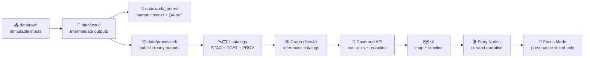

<div align="center">

# 📝 Data Work Notes — `data/work/_notes/`


-f59e0b?style=flat-square)


**Human-authored context** for **work-stage** artifacts: QA findings, anomalies, decisions, and “why it’s like this” notes — without creating shadow truth. 🧾🧠

</div>

> [!IMPORTANT]
> `_notes/` is **evidence-adjacent**, not evidence.
> - ✅ Notes must **point to canonical artifacts** (run manifests, PROV bundles, STAC/DCAT IDs) instead of duplicating them.  
> - ✅ Notes must **not downgrade sensitivity** (no output can be “less restricted” than its inputs).  
> - ❌ No secrets, tokens, credentials, private keys, or person-identifying data.  
> - ❌ No “infer-by-description” sensitive location disclosure.  
> These rules align with KFM’s pipeline invariants and sovereignty/classification propagation expectations.[^inv-pipeline][^inv-sovereignty]

---

## 🚀 Quick links

- 🧰 Workbench root → [`../README.md`](../README.md)
- 🧪 Experiments lab → [`../experiments/`](../experiments/)
- 📦 Work datasets (curated WIP) → [`../datasets/`](../datasets/)
- ✅ QA outputs (if used) → [`./qa/`](./qa/)
- 🧬 PROV bundles → [`../../prov/`](../../prov/)
- 🛰️ STAC → [`../../stac/`](../../stac/)
- 🗂️ DCAT → [`../../catalog/dcat/`](../../catalog/dcat/)
- 🧭 Governance roots → [`../../../docs/governance/ROOT_GOVERNANCE.md`](../../../docs/governance/ROOT_GOVERNANCE.md)

> [!TIP]
> If a note becomes critical to downstream use (Graph/API/UI/Story/Focus), **promote** it into governed docs (or Story Nodes) and keep `_notes/` as the work-stage trailhead. KFM is designed so user-facing narrative stays provenance-linked and audit-ready.[^kfm-mission][^inv-evidence-first]

---

<details>
<summary><strong>📌 Table of contents</strong></summary>

- [📘 Overview](#-overview)
- [🧭 Where `_notes/` fits in the KFM pipeline](#-where-_notes-fits-in-the-kfm-pipeline)
- [🗂️ Directory layout](#️-directory-layout)
- [🏷️ Note taxonomy (what kinds of notes exist)](#️-note-taxonomy-what-kinds-of-notes-exist)
- [🧾 Note file standard (front-matter + structure)](#-note-file-standard-front-matter--structure)
- [🔗 Linking rules (no shadow truth)](#-linking-rules-no-shadow-truth)
- [🔐 Governance, sovereignty & sensitive data rules](#-governance-sovereignty--sensitive-data-rules)
- [🤖 AI usage boundaries](#-ai-usage-boundaries)
- [✅ Validation & CI expectations](#-validation--ci-expectations)
- [🧹 Retention, cleanup & archiving](#-retention-cleanup--archiving)
- [📚 References](#-references)
- [🕰️ Version history](#️-version-history)

</details>

---

## 📘 Overview

### Purpose
- Provide a **single predictable place** for work-stage notes: QA findings, anomalies, decisions, “known weirdness,” and promotion checklists.
- Keep notes **evidence-first** by linking to canonical IDs (PROV activity/entity IDs, dataset IDs, run manifests) rather than embedding canonical payloads.
- Preserve an audit trail that supports deterministic reruns and review (especially when work artifacts later become processed/cataloged).[^deterministic][^prov-end-to-end]

### Scope

| In scope ✅ | Out of scope ❌ |
|---|---|
| Work-stage decisions, QA findings, anomaly tracking | Raw source snapshots (belong in `data/raw/`) |
| Redaction/generalization notes for later enforcement | Publishing policy text (belongs in governed governance docs) |
| Links to manifests, PROV, and eventually STAC/DCAT | Canonical STAC/DCAT/PROV JSON artifacts (belong in their catalog dirs) |
| Lightweight debug snippets (sanitized) | Secrets, credentials, private keys, tokens |
| Pointers to PRs/runs/CI checks for traceability | “Shadow datasets” (data belongs in `data/work/` or `data/processed/`) |

### Audience
- Primary: ETL + data QA maintainers working in `data/work/`
- Secondary: catalog/graph/API maintainers who need the context behind work-stage artifacts
- Reviewers: governance/ethics reviewers when sensitivity, sovereignty, or consent issues appear

---

## 🧭 Where `_notes/` fits in the KFM pipeline

KFM’s pipeline ordering is non-negotiable, and publication requires boundary artifacts (STAC/DCAT/PROV) before graph/UI/narratives.[^inv-pipeline][^lifecycle-staging]



> [!NOTE]
> `_notes/` is a **work-stage sidecar**: it travels with work outputs, but it does not substitute for the boundary artifacts that make data publishable and safe to use downstream.[^lifecycle-staging]

---

## 🗂️ Directory layout

### Expected tree (recommended, flexible)

```text
📁 data/work/_notes/
├─ 📄 README.md                       👈 you are here
├─ 📁 runs/                           🏃 run-scoped notes (by run_id)
├─ 📁 datasets/                       🧩 dataset-scoped notes (by dataset_id)
├─ 📁 qa/                             ✅ checks + anomalies + outcomes
├─ 📁 decisions/                      🗳️ explicit decisions + rationale (promotions/redactions)
├─ 📁 redaction/                      🕶️ generalization + sensitivity handling notes
└─ 📁 _archive/                       🧹 optional: closed/stale notes (keep index pointers)
```

### File naming conventions (recommended)

- Run notes:  
  `data/work/_notes/runs/YYYY-MM-DD__<pipeline_or_domain>__run-<run_id>.md`

- Dataset notes:  
  `data/work/_notes/datasets/<dataset_id>/YYYY-MM-DD__<topic>.md`

- QA notes:  
  `data/work/_notes/qa/YYYY-MM-DD__<dataset_or_run>__<check>.md`

- Decision memos:  
  `data/work/_notes/decisions/YYYY-MM-DD__<decision_slug>.md`

> [!TIP]
> Prefer **sortable, grep-friendly** names and keep the “join key” (run_id / dataset_id) in the filename. This makes review and indexing significantly easier.

---

## 🏷️ Note taxonomy (what kinds of notes exist)

| Type 🧾 | Use it when… | Must include (minimum) |
|---|---|---|
| 🏃 Run note | a pipeline run produced weird output or required a decision | `run_id`, inputs/outputs pointers, summary, validation |
| 🧩 Dataset note | a logical dataset has quirks or caveats | `dataset_id`, known issues, access/classification notes |
| ✅ QA note | a check was run and must be remembered | check name, pass/fail, sample evidence, next steps |
| 🗳️ Decision memo | you chose A over B (promotion/redaction/schema) | decision, rationale, alternatives, reviewers |
| 🕶️ Redaction memo | generalization rules or sensitivity handling | what is redacted, why, scope, enforcement point (API/UI) |
| 🧯 Incident note | data leak risk, secrets near-miss, access anomaly | what happened, containment, follow-ups, links to PR/issues |

> [!CAUTION]
> Notes are not a policy engine. They document *decisions and observations* so governance, catalogs, and APIs can enforce them correctly.[^inv-ci-gates]

---

## 🧾 Note file standard (front-matter + structure)

KFM uses structured Markdown heavily; for governed docs, front-matter is expected and fields should be preserved (use `TBD`/`n/a` rather than deleting fields).[^frontmatter-template]

### Minimal note template (copy/paste)

```markdown
---
title: "Work note — <short topic>"
date: "YYYY-MM-DD"
status: "draft"  # draft | review | closed
owners: ["@handle"]
reviewers: ["TBD"]

# Join keys (pick what applies)
run_id: "run-<id>"               # optional
prov_activity_id: "prov:<...>"   # optional but preferred
dataset_ids:
  - "kfm.<...>.vN"               # optional

# Governance (fail closed)
classification: "open"           # open | internal | confidential | restricted
sensitivity_notes: "none"        # or short rationale
care_label: "TBD"
---

## Summary
- What happened + why it matters.

## Context
- Inputs, assumptions, constraints.

## Observations
- What you saw (include small evidence snippets only).

## Decision (if any)
- Decision + rationale + alternatives.

## Validation
- Checks run + outcomes (links to logs/artifacts).

## Links
- Run manifest:
- PROV bundle:
- STAC/DCAT (if promoted):
- PR / issue:
```

> [!TIP]
> Treat this like a **lab notebook entry**: short, structured, and link-heavy. Markdown is explicitly used in KFM for curation logs/runbooks and evidence-first reporting.[^md-provenance-logs]

---

## 🔗 Linking rules (no shadow truth)

### Always link (don’t copy)
- ✅ **Run manifests** (your “flight recorder” for a run)
- ✅ **PROV bundles** for lineage (raw → work → processed)[^prov-end-to-end]
- ✅ **STAC/DCAT IDs** once something is promoted/published (so downstream can discover it)[^lifecycle-staging]
- ✅ **Issues/PRs/commits** for review traceability (use `#123`, PR links, and commit SHAs)[^gh-autolinks]

### Optional (but increasingly valuable)
KFM proposals include stronger DevOps provenance: mapping GitHub PRs and CI executions into PROV, emitting OpenLineage events, and signing promotions (Sigstore). If you have these IDs, capture them in notes:

- `pr_number: 123`
- `ci_run_url: <...>`
- `openlineage_run_uuid: <uuid>`
- `sigstore_attestation: <bundle_or_ref>`

These help later audits when a “why did this change?” question comes up.[^detect-validate-promote][^pr-to-prov]

---

## 🔐 Governance, sovereignty & sensitive data rules

KFM is built to be open and useful **without** causing harm. Its governance posture is informed by sovereignty and human-centered constraints.[^kfm-mission][^dh-sovereignty]

### Non-negotiables
- ❌ Never store secrets (tokens, credentials, private keys) in `_notes/`.
- ❌ Never include PII or person-identifying data here.
- ❌ Never “triangulate” sensitive locations by description.
- ✅ If classification is uncertain, **fail closed** (treat as more restricted until reviewed).
- ✅ No derivative output can be less restricted than its inputs (classification must propagate end-to-end).[^inv-sovereignty]

### Practical redaction/generalization guidance
If a note must discuss sensitive location-related work:
- Use **coarse geography** (county/region-level) and avoid coordinates.
- Describe enforcement: **where** the redaction is applied (API boundary/UI rule/catalog redaction).
- Link to the dataset’s catalog entry and the provenance run so reviewers can audit changes.

> [!NOTE]
> “Governance” includes security, privacy, quality, provenance, ethics, and sovereignty as first-class dimensions—not afterthoughts.[^dataspaces-gov]

---

## 🤖 AI usage boundaries

This README’s front-matter defines what AI transforms are allowed/prohibited for this content.

### Allowed ✅
- Summarize, extract structure, translate, keyword indexing

### Prohibited ❌
- Generating new policy text
- Inferring or reconstructing sensitive locations

### If AI touched the text
- Label the section clearly (e.g., “AI-assisted summary”).
- Keep it **evidence-linked**: claims should point to run IDs, datasets, or provenance artifacts.
KFM requires AI-generated narrative to remain provenance-backed and clearly identified.[^inv-evidence-first]

---

## ✅ Validation & CI expectations

KFM’s CI is expected to enforce invariants with schema validation, provenance completeness checks, and security scans on pull requests.[^inv-ci-gates]

### Recommended automated checks for `_notes/`
- 🔎 **Secrets scanning** (fail the build on detected keys)
- 🔗 **Link/ID resolution checks** for referenced `run_id`, `prov_activity_id`, dataset IDs (best-effort)
- 🧾 **Markdown lint** (headings, fenced code blocks, front-matter presence)
- 🏷️ **Classification lint** (require `classification`; default to restricted if missing)

### Local self-check (fast)
```bash
# quick grep for “oops” patterns (not sufficient, but a start)
grep -RIn --line-number -E "AKIA|BEGIN PRIVATE KEY|xox[pbar]-|ghp_" data/work/_notes || true
```

> [!TIP]
> Keep notes PR-friendly: small text, crisp links, and minimal attachments. If you need heavy artifacts (images, tiles, logs), store them in the run’s artifacts area and link from the note.

---

## 🧹 Retention, cleanup & archiving

- Keep `_notes/` useful:
  - ✅ Close notes that are resolved (status → `closed`)
  - ✅ Add a final “Outcome” section (“promoted”, “archived”, “superseded by …”)
  - ✅ Move stale notes to `_archive/` **only if** an index pointer remains (so history isn’t lost)

- When a work item is promoted:
  - ✅ Ensure outputs live in `data/processed/`
  - ✅ Ensure boundary artifacts exist (STAC + DCAT + PROV) before graph/UI use[^lifecycle-staging]
  - ✅ Leave a thin pointer note here linking to the canonical dataset IDs

---

## 📚 References

### Governing / project-level docs
- `docs/MASTER_GUIDE_v13.md` (pipeline + invariants + staging + CI gates)[^inv-pipeline][^lifecycle-staging]
- `docs/governance/ROOT_GOVERNANCE.md` · `docs/governance/ETHICS.md` · `docs/governance/SOVEREIGNTY.md`
- `Kansas Frontier Matrix (KFM) – Comprehensive Technical Documentation.docx` (mission, provenance-first, human-centered design)[^kfm-mission]
- `🌟 Kansas Frontier Matrix – Latest Ideas & Future Proposals.docx` (Detect→Validate→Promote, OpenLineage, PR→PROV ideas)[^detect-validate-promote][^pr-to-prov]

### Reference shelf (reading pack / influence map)
<details>
<summary><strong>📚 Library pack (selected by domain) — optional but helpful</strong></summary>

- 📈 Stats & experimental rigor:  
  `Understanding Statistics & Experimental Design.pdf` · `regression-analysis-with-python.pdf` · `graphical-data-analysis-with-r.pdf` · `think-bayes-bayesian-statistics-in-python.pdf`

- 🧪 Simulation & modeling discipline:  
  `Scientific Modeling and Simulation_ A Comprehensive NASA-Grade Guide.pdf` · `Generalized Topology Optimization for Structural Design.pdf`

- 🛰️ GIS / remote sensing & mapping:  
  `python-geospatial-analysis-cookbook.pdf` · `making-maps-a-visual-guide-to-map-design-for-gis.pdf` · `Cloud-Based Remote Sensing with Google Earth Engine-Fundamentals and Applications.pdf` · `Mobile Mapping_ Space, Cartography and the Digital - 9789048535217.pdf`

- ⚙️ Systems, scale, and data interoperability:  
  `Scalable Data Management for Future Hardware.pdf` · `Data Spaces.pdf`

- ❤️ Ethics / sovereignty / governance framing:  
  `Introduction to Digital Humanism.pdf` · `On the path to AI Law’s prophecies and the conceptual foundations of the machine learning age.pdf` · `Principles of Biological Autonomy - book_9780262381833.pdf`

- 🧰 General programming shelf (bundles):  
  `A programming Books.pdf` · `B-C programming Books.pdf` · `D-E programming Books.pdf` · `F-H programming Books.pdf` · `I-L programming Books.pdf` · `M-N programming Books.pdf` · `O-R programming Books.pdf` · `S-T programming Books.pdf` · `U-X programming Books.pdf`

</details>

---

## 🕰️ Version history

| Version | Date | Summary | Author |
|---|---|---|---|
| v1.1.0 | 2026-01-11 | Tightened `_notes/` folder contract, added taxonomy + linking rules, aligned with v13 invariants (classification propagation, CI gates, provenance-first), and added DevOps provenance hooks (PR/CI lineage). | TBD |
| v1.0.0 | 2025-12-28 | Initial README for `data/work/_notes/` | TBD |

---

### Footer refs
- Governance: `docs/governance/ROOT_GOVERNANCE.md`
- Ethics: `docs/governance/ETHICS.md`
- Sovereignty: `docs/governance/SOVEREIGNTY.md`

---

## 📎 Source anchors (for maintainers)

[^inv-pipeline]: KFM pipeline ordering + invariants (ETL → catalogs → graph → API → UI → Story → Focus).:contentReference[oaicite:0]{index=0}
[^inv-evidence-first]: Evidence-first narrative + AI text must be clearly identified and provenance-backed.:contentReference[oaicite:1]{index=1}
[^inv-sovereignty]: Sovereignty & classification propagation: derivatives cannot be less restricted than inputs; sensitive locations should be generalized in UI safeguards.:contentReference[oaicite:2]{index=2}
[^inv-ci-gates]: CI gates enforce provenance completeness, schema validation, and security scans; violations fail builds.:contentReference[oaicite:3]{index=3}
[^lifecycle-staging]: Required staging (raw→work→processed) and catalog outputs (STAC/DCAT/PROV) as boundary artifacts before downstream use.:contentReference[oaicite:4]{index=4}
[^prov-end-to-end]: PROV end-to-end linkage expectation: raw inputs → intermediate work → processed outputs, with run/config references.:contentReference[oaicite:5]{index=5}
[^deterministic]: Deterministic/idempotent pipeline principle (config-driven, logged, stable outputs).:contentReference[oaicite:6]{index=6}
[^frontmatter-template]: Keep/complete front-matter fields; use `TBD`/`n/a` rather than deleting fields (doc template guidance).:contentReference[oaicite:7]{index=7}
[^md-provenance-logs]: Markdown used for provenance logs/runbooks; evidence-first style expects citations/IDs for factual claims.:contentReference[oaicite:8]{index=8}
[^gh-autolinks]: GitHub referencing conventions for issues/PRs/commits (`#123`, SHAs, @mentions) to maintain traceability.:contentReference[oaicite:9]{index=9}
[^kfm-mission]: KFM mission + provenance/transparency + human-centered guardrails (Focus Mode evidence-backed, no black box).:contentReference[oaicite:10]{index=10}
[^detect-validate-promote]: Detect→Validate→Promote workflow concept; validation lanes; Sigstore signing; OpenLineage events for auditability.:contentReference[oaicite:11]{index=11}
[^pr-to-prov]: Mapping GitHub PR events to PROV-O JSON-LD (PR as Activity; commits as Entities; authors/reviewers as Agents).:contentReference[oaicite:12]{index=12}
[^dh-sovereignty]: Digital humanism framing: shaping technologies with human values/needs; sovereignty in the digital age as a central concern.:contentReference[oaicite:13]{index=13}
[^dataspaces-gov]: Data governance dimensions (ownership, sovereignty, trust, privacy, security, quality/provenance, ethics).:contentReference[oaicite:14]{index=14}
