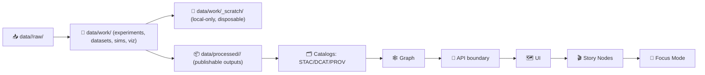

<div align="center">

# 🧻 `_scratch/` — Local Scratchpad (Do Not Commit)


**`data/work/_scratch/` is intentionally “controlled chaos”** 🧪  
A **local-only** place for quick spikes, temporary downloads, and disposable outputs.

</div>

---

> [!DANGER]
> **This folder should be empty in PRs.**  
> If it’s worth keeping, it belongs in **`data/work/experiments/`**, **`data/work/datasets/`**, or a canonical pipeline stage (**`data/processed/` + STAC/DCAT/PROV**) — not here. 🚫📦

---

## 🚀 Quick links (escape hatches)

- ⬅️ Back to `data/work/` → [`../README.md`](../README.md)
- 🧪 Experiments lab → [`../experiments/README.md`](../experiments/README.md)
- 📦 WIP datasets → [`../datasets/README.md`](../datasets/README.md)
- 🎨 Viz prototypes → [`../viz/README.md`](../viz/README.md)
- 🛰️ Sim runs → [`../sims/README.md`](../sims/README.md)
- 🧰 Templates → [`../_templates/README.md`](../_templates/README.md)

---

<details>
<summary><strong>📌 Table of contents</strong></summary>

- [🎯 What `_scratch/` is (and isn’t)](#-what-_scratch-is-and-isnt)
- [✅ Allowed use-cases](#-allowed-use-cases)
- [🚫 Hard “NO” list](#-hard-no-list)
- [🧭 Where it sits in the KFM pipeline](#-where-it-sits-in-the-kfm-pipeline)
- [🧹 Clean-up rules](#-clean-up-rules)
- [🧷 Recommended `.gitignore` patterns](#-recommended-gitignore-patterns)
- [🧯 “Oops I committed scratch” playbook](#-oops-i-committed-scratch-playbook)
- [📚 Project file bundle (reference shelf)](#-project-file-bundle-reference-shelf)

</details>

---

## 🎯 What `_scratch/` is (and isn’t)

### ✅ `_scratch/` **IS**
- 🧻 A **temporary workspace** for:
  - quick tests
  - tiny one-off scripts
  - ad-hoc downloads before proper staging
  - local caches / intermediate blobs during debugging
- 🧪 A place to explore **before** you formalize an approach into:
  - a reproducible Work Package (`data/work/experiments/`)
  - a curated WIP dataset (`data/work/datasets/`)
  - a promoted product (`data/processed/` + STAC/DCAT/PROV)

### ❌ `_scratch/` **IS NOT**
- 🧾 A source of truth
- 🗂️ A place for “final-ish” artifacts
- 🛰️ A substitute for catalogs (STAC/DCAT) or provenance (PROV)
- 🔐 A safe place for secrets (it’s still a folder; treat it as public)

> [!IMPORTANT]
> KFM is strict about the **pipeline order** and “evidence-first” publishing.  
> Anything used in **Graph → API → UI → Story Nodes → Focus Mode** must be **promoted** into governed artifacts (not pulled from `_scratch/`). 🧬🗂️✅

---

## ✅ Allowed use-cases

Use `_scratch/` for things like:

- 🧪 **Throwaway prototypes**  
  “Can I parse this file?” “Does this reprojection work?” “Can I render these tiles?”
- 🔬 **Local debugging outputs**  
  Small logs, tiny sample subsets, quick diagnostic plots.
- 📥 **Short-lived downloads before staging**  
  If you grab a file from a portal to inspect it: fine — but move it to the correct `data/<domain>/raw/` (or store a pointer + checksum) if it becomes part of the project.
- 🧰 **Local caches**  
  Temporary caches from tools (e.g., notebook kernels, build artifacts) *as long as they are not committed*.

---

## 🚫 Hard “NO” list

Never put these in `_scratch/` (even “temporarily”):

- 🔑 **API keys / tokens / credentials**  
- 🧍 **PII / person-adjacent data** (unless explicitly governed and approved — and even then, not here)
- 🧨 **Sensitive coordinates** (culturally sensitive locations, protected sites, restricted resources)
- 🐘 **Huge binaries** (COGs, tilesets, model checkpoints) that will tempt you to commit them
- 🧾 **Evidence artifacts used in Story Nodes / Focus Mode** (those must be cataloged + provenance-linked)

> [!CAUTION]
> `_scratch/` is where mistakes happen. Make it **boring**:
> - keep it small
> - keep it local
> - delete it often 🧹

---

## 🧭 Where it sits in the KFM pipeline

`_scratch/` is **pre-work**. It should never be referenced downstream.



**Rule of thumb** 🧠  
If it’s referenced by anything outside your laptop (CI, teammate, Story Node, map layer list)…  
➡️ it does **not** belong in `_scratch/`.

---

## 🧹 Clean-up rules

### ✅ Always safe to delete
Everything in `_scratch/` **except** this README.

### 🔁 Suggested habit loop
- Daily: delete obvious junk (logs, tmp downloads)
- Weekly: wipe the entire folder (keep README)
- Before PR: ensure `_scratch/` is empty (except README)

### Helpful cleanup commands
```bash
# Show what would be deleted (dry run)
find data/work/_scratch -mindepth 1 -maxdepth 3 -not -name "README.md" -print

# Delete everything except README.md
find data/work/_scratch -mindepth 1 -not -name "README.md" -exec rm -rf {} +
```

---

## 🧷 Recommended `.gitignore` patterns

> [!TIP]
> Keep `_scratch/` **gitignored by default**.

Add something like this to your repo `.gitignore`:

```gitignore
# 🧻 KFM scratchpad: local-only
data/work/_scratch/**
!data/work/_scratch/README.md
```

Optional: if you want a placeholder directory file:

```gitignore
!data/work/_scratch/.gitkeep
```

---

## 🧯 “Oops I committed scratch” playbook

If you accidentally committed scratch content:

1) 🧹 **Remove it** in a follow-up commit (or rewrite history if needed)  
2) 🔐 If any secrets were included:
   - rotate/revoke immediately
   - treat it as compromised
3) 🧾 If the file is actually valuable:
   - move it into a proper Work Package (`data/work/experiments/...`)
   - add a manifest/protocol so it’s reproducible
   - promote properly if it becomes evidence (STAC/DCAT/PROV)

> [!IMPORTANT]
> “Delete later” is not a plan. PR review should catch this — but don’t rely on review to save you. 🧯

---

## 📚 Project file bundle (reference shelf)

> [!NOTE]
> These are the **project docs + reference library** that shape the standards and discipline used across `data/work/`.  
> They’re listed here so contributors know the “why” behind the rules.

<details>
<summary><strong>🧭 Core KFM docs (architectural / governing)</strong></summary>

- `Kansas Frontier Matrix (KFM) – Comprehensive Technical Documentation.docx`
- `🌟 Kansas Frontier Matrix – Latest Ideas & Future Proposals.docx`
- `MARKDOWN_GUIDE_v13.md.gdoc`
- `Comprehensive Markdown Guide_ Syntax, Extensions, and Best Practices.docx`
- `Kansas-Frontier-Matrix_ Open-Source Geospatial Historical Mapping Hub Design.pdf`
- `Scientific Method _ Research _ Master Coder Protocol Documentation.pdf`

</details>

<details>
<summary><strong>📚 Reference library (supporting, non-normative)</strong></summary>

### 📈 Statistics, inference, and modeling discipline
- `Understanding Statistics & Experimental Design.pdf`
- `regression-analysis-with-python.pdf`
- `Regression analysis using Python - slides-linear-regression.pdf`
- `graphical-data-analysis-with-r.pdf`
- `think-bayes-bayesian-statistics-in-python.pdf`
- `Scientific Modeling and Simulation_ A Comprehensive NASA-Grade Guide.pdf`
- `Deep Learning for Coders with fastai and PyTorch - Deep.Learning.for.Coders.with.fastai.and.PyTorchpdf`

### 🗺️ GIS, cartography, remote sensing
- `python-geospatial-analysis-cookbook.pdf`
- `making-maps-a-visual-guide-to-map-design-for-gis.pdf`
- `Mobile Mapping_ Space, Cartography and the Digital - 9789048535217.pdf`
- `Cloud-Based Remote Sensing with Google Earth Engine-Fundamentals and Applications.pdf`
- `compressed-image-file-formats-jpeg-png-gif-xbm-bmp.pdf`

### ⚙️ Systems, scale, data management
- `PostgreSQL Notes for Professionals - PostgreSQLNotesForProfessionals.pdf`
- `Scalable Data Management for Future Hardware.pdf`
- `concurrent-real-time-and-distributed-programming-in-java-threads-rtsj-and-rmi.pdf`
- `Data Spaces.pdf`

### ❤️ Ethics, autonomy, governance context
- `Introduction to Digital Humanism.pdf`
- `Principles of Biological Autonomy - book_9780262381833.pdf`
- `On the path to AI Law’s prophecies and the conceptual foundations of the machine learning age.pdf`

### 🧮 Advanced math + optimization (optional deep dives)
- `Spectral Geometry of Graphs.pdf`
- `Generalized Topology Optimization for Structural Design.pdf`

### 🛡️ Security (defensive reference only)
- `ethical-hacking-and-countermeasures-secure-network-infrastructures.pdf`
- `Gray Hat Python - Python Programming for Hackers and Reverse Engineers (2009).pdf`

### 🧰 General programming shelf (bundles)
- `A programming Books.pdf`
- `B-C programming Books.pdf`
- `D-E programming Books.pdf`
- `F-H programming Books.pdf`
- `I-L programming Books.pdf`
- `M-N programming Books.pdf`
- `O-R programming Books.pdf`
- `S-T programming Books.pdf`
- `U-X programming Books.pdf`

</details>

<details>
<summary><strong>🔗 Internal file references (tool links)</strong></summary>

- :contentReference[oaicite:0]{index=0}
- :contentReference[oaicite:1]{index=1}

</details>

---

<p align="right"><a href="#-kfm-scratchpad-local-only--datawork_scratch">⬆️ Back to top</a></p>

