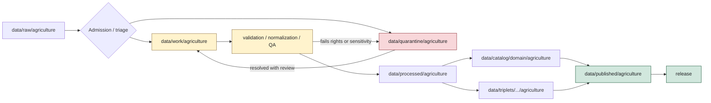

<!-- [KFM_META_BLOCK_V2]
doc_id: kfm://data/work/agriculture/readme
name: Agriculture Work README
path: data/work/agriculture/README.md
type: data-work-domain-lane-readme
version: v0.1.0
status: draft
owners:
  - <data-steward>
  - <agriculture-domain-steward>
  - <pipeline-steward>
  - <source-steward>
  - <rights-reviewer>
  - <sensitivity-reviewer>
  - <privacy-reviewer>
  - <policy-steward>
  - <evidence-steward>
  - <proof-steward>
  - <receipt-steward>
  - <catalog-steward>
  - <release-steward>
  - <docs-steward>
created: 2026-06-29
updated: 2026-06-29
policy_label: restricted-review
truth_posture: cite-or-abstain
responsibility_root: data/
lifecycle_phase: work
domain: agriculture
artifact_family: agriculture-working-intermediates-and-candidates
path_posture: existing-greenfield-stub-replaced; directory-rules-lists-data-work-domain-run-id; parent-data-work-readme-is-greenfield-stub; data-root-lists-work-lifecycle-family; agriculture-domain-docs-confirm-field-operator-private-join-sensitivity; upstream-raw-and-quarantine-lanes-confirmed; downstream-processed-catalog-proof-receipt-published-rollback-lanes-confirmed; run-id-child-shape-proposed
sensitivity_posture: internal-work-only; no-public-path; release-blocked; candidate-not-truth; source-role-preserving; farm-operator-parcel-private-yield-pesticide-proprietary-detail-fail-closed; aggregation-and-redaction-trials-not-public-safe-by-placement; cross-lane-joins-restricted; rights-needs-verification; evidence-aware; receipt-aware; policy-aware; correction-and-rollback-aware
related:
  - ../README.md
  - ../../README.md
  - ../../raw/agriculture/README.md
  - ../../quarantine/agriculture/README.md
  - ../../processed/agriculture/README.md
  - ../../catalog/domain/agriculture/README.md
  - ../../receipts/agriculture/README.md
  - ../../proofs/agriculture/README.md
  - ../../published/agriculture/README.md
  - ../../rollback/agriculture/README.md
  - ../../../release/README.md
  - ../../../docs/domains/agriculture/README.md
  - ../../../docs/domains/agriculture/DATA_LIFECYCLE.md
  - ../../../docs/domains/agriculture/CANONICAL_PATHS.md
  - ../../../docs/domains/agriculture/SENSITIVITY.md
  - ../../../docs/domains/agriculture/PIPELINE.md
  - ../../../docs/domains/agriculture/CROSS_LANE.md
  - ../../../docs/doctrine/directory-rules.md
  - ../../../docs/doctrine/lifecycle-law.md
  - ../../../docs/doctrine/trust-membrane.md
  - ../../../contracts/domains/agriculture/
  - ../../../schemas/contracts/v1/domains/agriculture/
  - ../../../policy/domains/agriculture/
  - ../../../tools/validators/
tags:
  - kfm
  - data
  - work
  - agriculture
  - lifecycle
  - raw-to-work
  - work-to-processed
  - quarantine-exit
  - crop-observation
  - field-candidate
  - crop-rotation
  - yield-observation
  - irrigation-link
  - conservation-practice
  - soil-crop-suitability
  - agricultural-economy
  - supply-chain-node
  - drought-stress-indicator
  - pest-stress-indicator
  - candidate-assertion
  - transform-intermediate
  - normalization
  - conflation
  - join-packet
  - qa
  - redaction-trial
  - aggregation-trial
  - source-role
  - no-public-path
  - not-release-authority
  - not-processed
  - not-proof
  - not-catalog
  - not-published
  - cite-or-abstain
notes:
  - "This README replaces the greenfield stub at `data/work/agriculture/README.md`."
  - "Directory Rules lists `data/work/<domain>/<run_id>/` and describes WORK as normalized intermediates and candidate assertions that must not be public API/UI or release aliases."
  - "Agriculture doctrine makes field polygons, operator identities, private farm/operator/parcel joins, proprietary data, private yield, pesticide-sensitive records, and source-rights-limited material deny-by-default until reviewed."
  - "WORK material is not Agriculture truth, not processed truth, not catalog truth, not proof, not receipt authority, not policy authority, not release authority, and not public material."
  - "README presence does not prove work payloads, run manifests, validators, receipts, CI checks, policy enforcement, source descriptors, review completion, or release readiness."
[/KFM_META_BLOCK_V2] -->

<a id="top"></a>

# Agriculture WORK

Working lifecycle lane for Agriculture-domain normalization intermediates, candidate assertions, QA outputs, join packets, redaction and aggregation trials, and run-local material that is not yet processed, cataloged, proven, released, or public.

<p>
  
  
  
  
  
  
</p>

**Quick links:** [Scope](#scope) · [Path posture](#path-posture) · [Repo fit](#repo-fit) · [Accepted material](#accepted-material) · [Exclusions](#exclusions) · [Agriculture WORK guardrails](#agriculture-work-guardrails) · [Lifecycle flow](#lifecycle-flow) · [Suggested directory shape](#suggested-directory-shape) · [Required checks](#required-checks-before-use) · [Status notes](#status-notes) · [Evidence ledger](#evidence-ledger)

> [!CAUTION]
> `data/work/agriculture/` is not public, not release authority, not proof, not general receipt storage, not catalog closure, not processed truth, not Agriculture truth, not source registry authority, not policy authority, not schema authority, not a normal UI/API source, and not an AI-answer source. It is a working lane for candidate and intermediate material only.

---

## Scope

`data/work/agriculture/` may hold Agriculture working material after RAW source capture or quarantine exit and before PROCESSED promotion.

This lane is appropriate for run-local, reviewable material such as:

- normalized intermediate tables, rasters, vectors, or derived records that still need validation;
- candidate `CropObservation`, `FieldCandidate`, `CropRotation`, `YieldObservation`, `IrrigationLink`, `ConservationPractice`, `SoilCropSuitability`, `AgriculturalEconomyObservation`, `SupplyChainNode`, `DroughtStressIndicator`, or `PestStressIndicator` objects;
- crop classification, crop progress, stress-context, suitability, irrigation-context, conservation-context, and agriculture-economy working products before processed promotion;
- source-role mapping outputs, crosswalk drafts, unit normalization outputs, date/vintage alignment outputs, dedupe outputs, conflation outputs, and QA summaries;
- aggregation and redaction trials used to evaluate public-safe representations;
- join packets that remain internal while evidence, source role, rights, privacy, sensitivity, policy, and review state are unresolved;
- run-local indexes and README files that explain work state without becoming proof, catalog, registry, policy, release, or public authority.

A file here may help a steward inspect a candidate. It does **not** make that candidate true, public, policy-admitted, evidence-supported, or released.

---

## Path posture

The documented lane is:

```text
data/work/agriculture/
```

Current placement evidence:

- `data/README.md` lists `work` as a lifecycle data family.
- `data/work/README.md` exists but is still a greenfield stub, so this child README is self-bounding.
- Directory Rules list `data/work/<domain>/<run_id>/` and define WORK as normalized intermediates and candidate assertions.
- Directory Rules say WORK must not feed public API/UI or release aliases directly.
- Agriculture RAW README points downstream to `data/work/agriculture/` or quarantine after governed source admission/triage.
- Agriculture PROCESSED README places `data/work/agriculture/` upstream of validated processed artifacts.
- Agriculture QUARANTINE README says ordinary safe work material belongs here, while unsafe or unresolved material belongs in quarantine.

Therefore this README treats `data/work/agriculture/` as **CONFIRMED path presence / DRAFT Agriculture WORK-lane contract / NEEDS VERIFICATION implementation maturity**.

---

## Repo fit

| Responsibility | Correct home | Boundary |
|---|---|---|
| Agriculture RAW source captures | [`../../raw/agriculture/`](../../raw/agriculture/README.md) | Immutable source-edge material; not work scratch. |
| Agriculture WORK candidates and intermediates | `data/work/agriculture/` | This lane. Internal only. |
| Agriculture quarantine holds | [`../../quarantine/agriculture/`](../../quarantine/agriculture/README.md) | Rights/sensitivity/privacy/source-role/validation unresolved material. |
| Agriculture processed artifacts | [`../../processed/agriculture/`](../../processed/agriculture/README.md) | Validated normalized outputs; downstream of WORK. |
| Agriculture catalog records | [`../../catalog/domain/agriculture/`](../../catalog/domain/agriculture/README.md) | Discovery and catalog closure; not work material. |
| Agriculture graph/triplets | `data/triplets/.../agriculture/` | Relationship projections; not work storage. |
| Agriculture receipts | [`../../receipts/agriculture/`](../../receipts/agriculture/README.md) | Process memory; WORK may reference receipts but does not own them. |
| Agriculture proofs | [`../../proofs/agriculture/`](../../proofs/agriculture/README.md) | EvidenceBundle/ProofPack support; not work storage. |
| Agriculture published artifacts | [`../../published/agriculture/`](../../published/agriculture/README.md) | Released public-safe carriers only. |
| Agriculture rollback support | [`../../rollback/agriculture/`](../../rollback/agriculture/README.md) | Release recovery support; not work scratch. |
| Release decisions | [`../../../release/`](../../../release/README.md) | Release manifests, promotion decisions, rollback cards, corrections, withdrawals, signatures. |
| Contracts, schemas, policy, validators | `contracts/`, `schemas/`, `policy/`, `tools/validators/` | Separate authority roots. |

---

## Accepted material

Accepted content is limited to Agriculture working/intermediate material and work-local sidecars:

- run-local normalization outputs and candidate assertion files;
- transform, conflation, alignment, dedupe, crosswalk, unit conversion, date/vintage alignment, geometry repair, and QA outputs;
- candidate feature/object packets for Agriculture object families;
- source-role mapping drafts and source-field mapping drafts;
- aggregation, suppression, redaction, public-safe geometry, and generalization trials;
- model or classification working outputs that are clearly marked as candidates and tied to input/source/run context;
- work-local manifest, digest, and index sidecars used to inspect the run;
- references to RAW source captures, quarantine exits, receipts, proof candidates, policy decisions, and review notes;
- README files explaining local run or candidate boundaries.

All accepted material should preserve enough context to inspect source lineage, input digests, source role, run identity, tool/version where applicable, units, time/vintage, geometry handling, sensitivity posture, rights posture, reviewer state, and intended downstream path.

---

## Exclusions

| Do not place here | Correct home |
|---|---|
| Immutable Agriculture source captures, source-native payloads, source query snapshots, source-head records, or raw response mirrors | `data/raw/agriculture/` |
| Rights-unclear, sensitivity-unclear, privacy-unsafe, source-role-unclear, field-level-risk, operator-join, proprietary, or unresolved material requiring hold | `data/quarantine/agriculture/` |
| Validated normalized Agriculture datasets ready for catalog/triplet promotion | `data/processed/agriculture/` |
| Agriculture catalog records, STAC/DCAT/PROV/domain catalog entries, catalog matrices, or catalog indexes | `data/catalog/` |
| Graph/triplet projections, graph deltas, relationship exports, or public graph support | `data/triplets/` |
| EvidenceBundle, ProofPack, citation validation, integrity proof, or proof indexes | `data/proofs/agriculture/` or accepted proof lanes |
| RunReceipt, TransformReceipt, AggregationReceipt, RedactionReceipt, ValidationReceipt, AIReceipt, PolicyDecision, release-support receipt, or rollback receipt authority | `data/receipts/agriculture/` or accepted receipt/rollback lanes |
| SourceDescriptor, source activation records, source registry entries, rights registry, sensitivity registry, or dataset registry records | `data/registry/` |
| Published layers, PMTiles, GeoParquet, reports, stories, API payloads, map tiles, public downloads, or release-linked artifacts | `data/published/` after release gates |
| ReleaseManifest, PromotionDecision, RollbackCard, CorrectionNotice, WithdrawalNotice, signatures, or release changelog | `release/` |
| Contracts, schemas, policy rules, validators, tests, implementation code, notebooks intended as code, apps, packages, or workflows | `contracts/`, `schemas/`, `policy/`, `tools/`, `tests/`, `apps/`, `packages/`, `.github/` |

---

## Agriculture WORK guardrails

| Risk | Guardrail |
|---|---|
| Candidate becomes truth | WORK candidates remain candidates until processed validation, proof/catalog closure, policy review, and release state support stronger claims. |
| WORK becomes public | Public clients, normal UI surfaces, reports, stories, map layers, graph/vector indexes, Focus Mode, and AI answers must not read this lane directly. |
| Release alias bypass | WORK must not contain or update release aliases, current pointers, public route payloads, or published artifacts. |
| RAW mutation | RAW captures stay immutable; WORK may derive from RAW but must not overwrite or replace source captures. |
| Quarantine bypass | Rights-unclear, privacy-unsafe, sensitivity-unsafe, source-role-unclear, over-precise, proprietary, or field/operator risk material must move to quarantine or remain denied/held. |
| Source-role collapse | NASS aggregates, CDL classifications, station readings, satellite/model products, administrative records, candidates, and generated summaries must stay distinguishable. |
| Aggregate becomes field truth | County/HUC/grid aggregates, crop progress summaries, CDL classes, stress indicators, and suitability surfaces must not become field, farm, operator, parcel, or private-yield truth. |
| Field/operator/private join leakage | Field polygons, farm/operator identifiers, parcels, ownership-like joins, private yield, pesticide-sensitive records, proprietary data, and person/land joins fail closed until policy and review allow a safe representation. |
| Cross-lane ownership drift | Soil, Hydrology, Atmosphere, Hazards, People/DNA/Land, Flora, Fauna, Habitat, and Roads/Rail claims stay with their owning lanes. Agriculture WORK may hold candidate joins only. |
| AI overclaim | Generated summaries, labels, or classifications are downstream carriers and cannot stand in for EvidenceBundle, source role, validation, policy, or release state. |
| Stale or orphaned work | Work products should carry run identity, input refs, digests, timestamp/vintage, reviewer state, and intended disposition: process, quarantine, deny, hold, or delete through governed cleanup. |

---

## Lifecycle flow



> [!NOTE]
> This diagram is a responsibility map, not proof that pipelines, validators, receipts, policy engines, release manifests, or CI gates are currently wired.

---

## Suggested directory shape

Directory Rules list the pattern `data/work/<domain>/<run_id>/`. Exact Agriculture run layout is **PROPOSED** until schemas, pipeline specs, validators, and receipt conventions confirm it.

```text
data/work/agriculture/
├── README.md
├── <run_id>/
│   ├── README.md
│   ├── work.manifest.json
│   ├── input_refs.json
│   ├── candidate_index.json
│   ├── normalized/
│   ├── candidates/
│   ├── joins/
│   ├── qa/
│   ├── aggregation_trials/
│   ├── redaction_trials/
│   ├── policy_review_refs.json
│   ├── receipt_refs.json
│   └── disposition.json
└── indexes/
    └── agriculture.work.index.json
```

Do not pre-create empty child stubs unless a real run, migration, inventory, or steward decision requires them.

Recommended run-level fields:

| Field | Purpose |
|---|---|
| `run_id` | Stable working-run identifier. |
| `source_refs` | RAW captures, source registry records, or source descriptors feeding the run. |
| `input_digests` | Hashes or digests for source and intermediate inputs. |
| `source_role_state` | Observed, modeled, aggregate, administrative, candidate, generated, or other governed posture. |
| `candidate_families` | Agriculture object families represented by the run. |
| `rights_state` | Rights, terms, attribution, agreement, and use-limit posture. |
| `sensitivity_state` | Field/operator/parcel/private/proprietary/cross-lane risk posture. |
| `validation_state` | Preflight, failed, held, passed, or needs review. |
| `intended_disposition` | `PROCESS`, `QUARANTINE`, `HOLD`, `DENY`, `ABSTAIN`, or `SUPERSEDE`. |
| `downstream_refs` | Processed, quarantine, receipt, proof, catalog, or release references if promoted later. |

---

## Required checks before use

- [ ] Confirm actual child run directories under `data/work/agriculture/`.
- [ ] Confirm accepted Agriculture WORK manifest shape and naming convention.
- [ ] Confirm Agriculture contracts, schemas, and validators for candidate records.
- [ ] Confirm RAW source refs and input digest closure for every work run.
- [ ] Confirm source-role mapping for NASS aggregates, CDL, Mesonet, SCAN, USCRN, SMAP, HLS, soil-derived inputs, and generated outputs where used.
- [ ] Confirm field/operator/parcel/private-yield/pesticide/proprietary/person-land joins are quarantined, redacted, aggregated, denied, or explicitly reviewed before any downstream promotion.
- [ ] Confirm candidate outputs that advance to `data/processed/agriculture/` have validation, receipt refs, policy posture, correction path, and rollback target where material.
- [ ] Confirm no public clients, normal UI, API, map layer, report, story, vector index, search surface, Focus Mode answer, or AI answer reads from this lane.
- [ ] Confirm work-local cleanup, retention, and supersession do not delete required provenance, receipts, evidence refs, or review state.

---

## Status notes

| Item | Status | Notes |
|---|---:|---|
| Target path presence | CONFIRMED | `data/work/agriculture/README.md` existed as a greenfield stub before this update. |
| Parent WORK README | CONFIRMED stub | `data/work/README.md` exists as a greenfield stub; this child README is self-bounding. |
| Data root | CONFIRMED README | `data/README.md` lists `work` under lifecycle data and excludes release decisions. |
| Directory Rules WORK path | CONFIRMED doctrine | Directory Rules list `data/work/<domain>/<run_id>/` and say WORK holds normalized intermediates and candidate assertions. |
| Agriculture domain doctrine | CONFIRMED README | Agriculture docs define field/operator/private-join sensitivity, public aggregation posture, cross-lane boundaries, and source-role preservation. |
| Agriculture RAW lane | CONFIRMED README | RAW points downstream to WORK or QUARANTINE after governed source admission/triage. |
| Agriculture QUARANTINE lane | CONFIRMED README | Quarantine holds unresolved rights, sensitivity, privacy, policy, or source-role risk material and excludes ordinary safe WORK. |
| Agriculture PROCESSED lane | CONFIRMED README | Processed is downstream of WORK and upstream of catalog/triplet/published outputs. |
| Agriculture CATALOG lane | CONFIRMED README | Catalog excludes WORK and requires evidence/source/aggregation/policy/release references. |
| Agriculture RECEIPTS lane | CONFIRMED README | Receipts are process memory and may be referenced by WORK, but are not proof or release authority. |
| Agriculture PROOFS lane | CONFIRMED README | Proofs support EvidenceBundle/EvidenceRef closure and claim support; they are not WORK storage. |
| Agriculture PUBLISHED lane | CONFIRMED README | Published artifacts are released public-safe carriers only and explicitly exclude WORK. |
| Agriculture ROLLBACK lane | CONFIRMED README | Rollback support references WORK only as part of governed correction/recovery context. |
| Release root | CONFIRMED README | `release/README.md` places release decisions, manifests, rollback cards, withdrawals, corrections, signatures, and changelog under `release/`. |
| Actual WORK payload inventory | UNKNOWN | This README does not prove any work-run payloads exist. |
| WORK schemas, validators, receipts, CI, policy enforcement, release linkage | NEEDS VERIFICATION | No runtime enforcement was proven by this edit. |
| Public release readiness | DENY | A WORK README cannot publish, prove, or expose Agriculture claims. |

---

## Evidence ledger

| Source | Status | Supports | Limits |
|---|---|---|---|
| Previous target file | CONFIRMED | `data/work/agriculture/README.md` existed as a greenfield stub. | Did not define WORK-lane boundaries. |
| [`../README.md`](../README.md) | CONFIRMED stub | Parent WORK root exists. | Parent contract still needs expansion. |
| [`../../README.md`](../../README.md) | CONFIRMED README | `data/` owns lifecycle data and lists `work`. | Data root README is short and status `PROPOSED`. |
| [`../../../docs/doctrine/directory-rules.md`](../../../docs/doctrine/directory-rules.md) | CONFIRMED doctrine | `data/work/<domain>/<run_id>/`; WORK holds normalized intermediates and candidate assertions; no public API/UI or release aliases. | Exact Agriculture run layout remains unresolved. |
| [`../../../docs/domains/agriculture/README.md`](../../../docs/domains/agriculture/README.md) | CONFIRMED doctrine / PROPOSED implementation | Agriculture scope, object families, field/operator sensitivity, source-role preservation, public aggregation posture, and cross-lane boundaries. | Implementation maturity remains bounded and often PROPOSED/NEEDS VERIFICATION. |
| [`../../raw/agriculture/README.md`](../../raw/agriculture/README.md) | CONFIRMED README | RAW captures are upstream and point to WORK or QUARANTINE after admission/triage. | Does not prove source payload presence or connector activation. |
| [`../../quarantine/agriculture/README.md`](../../quarantine/agriculture/README.md) | CONFIRMED README | Quarantine holds unsafe or unresolved Agriculture material and routes safe ordinary work back to this lane. | Does not prove held payloads or automated policy enforcement. |
| [`../../processed/agriculture/README.md`](../../processed/agriculture/README.md) | CONFIRMED README | Processed Agriculture is downstream of WORK and upstream of catalog/triplet/publication. | Does not prove processed inventory or validators. |
| [`../../catalog/domain/agriculture/README.md`](../../catalog/domain/agriculture/README.md) | CONFIRMED README | Agriculture catalog excludes WORK material and requires evidence, source, aggregation, policy, and release references. | Catalog records are not WORK or release decisions. |
| [`../../receipts/agriculture/README.md`](../../receipts/agriculture/README.md) | CONFIRMED README | Agriculture receipts are process memory and may reference WORK outcomes. | Receipts are not proof or release authority. |
| [`../../proofs/agriculture/README.md`](../../proofs/agriculture/README.md) | CONFIRMED README | Agriculture proofs support EvidenceBundle/EvidenceRef closure and exclude WORK scratch. | Proofs are not WORK storage or publication authority. |
| [`../../published/agriculture/README.md`](../../published/agriculture/README.md) | CONFIRMED README | Published Agriculture artifacts are downstream released carriers and exclude WORK material. | Does not prove released artifacts exist. |
| [`../../rollback/agriculture/README.md`](../../rollback/agriculture/README.md) | CONFIRMED README | Rollback is data-plane recovery support tied to release governance. | Does not prove rollback instances or release artifacts. |
| [`../../../release/README.md`](../../../release/README.md) | CONFIRMED README | Release decisions belong under `release/`, distinct from data artifacts. | Release root README is short and status `PROPOSED`. |

[Back to top](#top)
