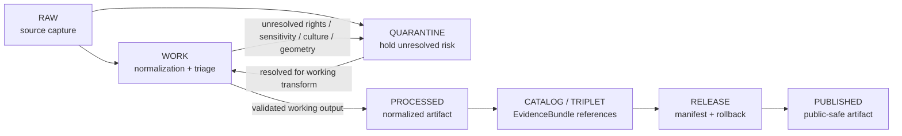

<!-- [KFM_META_BLOCK_V2]
doc_id: kfm://data/work/archaeology/readme
title: Archaeology WORK README
type: data-work-domain-index-readme
version: v0.1.0
status: draft
owners:
  - <archaeology-domain-steward>
  - <archaeology-data-steward>
  - <cultural-review-liaison>
  - <sensitivity-reviewer>
  - <rights-holder-representative>
  - <pipeline-steward>
  - <release-steward>
created: 2026-06-29
updated: 2026-06-29
policy_label: restricted-review
truth_posture: cite-or-abstain
lifecycle_phase: work
responsibility_root: data/
domain: archaeology
artifact_family: archaeology-working-normalization-lane
sensitivity_posture: T4-default; fail-closed; no-public-path; exact-location-deny; cultural-review-required; sovereignty-inheritance-required; release-blocked
related:
  - ../README.md
  - ../../README.md
  - ../../raw/archaeology/README.md
  - ../../quarantine/archaeology/README.md
  - ../../quarantine/archaeology/exact_geometry/README.md
  - ../../processed/archaeology/README.md
  - ../../catalog/domain/archaeology/README.md
  - ../../published/layers/archaeology/README.md
  - ../../proofs/archaeology/README.md
  - ../../receipts/README.md
  - ../../registry/sources/README.md
  - ../../../docs/domains/archaeology/DATA_LIFECYCLE.md
  - ../../../docs/domains/archaeology/SOURCE_REGISTRY.md
  - ../../../docs/domains/archaeology/SOURCES.md
  - ../../../docs/domains/archaeology/SENSITIVITY.md
  - ../../../docs/domains/archaeology/PUBLICATION_AND_POLICY.md
  - ../../../docs/domains/archaeology/CULTURAL_REVIEW.md
  - ../../../release/manifests/README.md
tags:
  - kfm
  - data
  - work
  - archaeology
  - cultural-heritage
  - normalization
  - triage
  - redaction
  - exact-location-deny
  - cultural-review
  - sovereignty
  - consent
  - evidence-first
notes:
  - "This README replaces the greenfield stub at `data/work/archaeology/README.md`."
  - "WORK is a governed intermediate lifecycle lane between RAW/QUARANTINE and PROCESSED; it is not proof, catalog, registry, policy, release, public API/UI output, or generated-answer authority."
  - "Archaeology material defaults to fail-closed handling for exact site locations, human remains, burials, sacred sites, unresolved cultural sensitivity, private landowner details, collection-security context, looting-risk exposure, consent-bound material, and sovereignty-sensitive material."
  - "README/path presence confirms documentation or path evidence only; it does not prove payloads, schemas, validators, receipts, CI enforcement, cultural review, source descriptors, connector activation, or release readiness."
[/KFM_META_BLOCK_V2] -->

<a id="top"></a>

# Archaeology WORK

Governed working lane for archaeology normalization, triage, redaction preparation, review preparation, and candidate shaping before processed artifacts, catalog records, triplets, releases, or public-safe products exist.

<p>
  
  
  
  
  
  
</p>

**Quick links:** [Scope](#scope) · [Repo fit](#repo-fit) · [Lifecycle boundary](#lifecycle-boundary) · [Accepted inputs](#accepted-inputs) · [Exclusions](#exclusions) · [Working rules](#working-rules) · [Directory map](#directory-map) · [Exit gates](#exit-gates) · [Forbidden shortcuts](#forbidden-shortcuts) · [Required checks](#required-checks-before-use) · [Status notes](#status-notes)

> [!CAUTION]
> `data/work/archaeology/` is a no-public-path working lane. It is not archaeology truth, site truth, artifact truth, catalog truth, proof authority, receipt authority, policy authority, cultural-review authority, sovereignty authority, consent authority, release authority, public map/layer authority, or generated-answer authority. Public clients, public APIs, MapLibre layers, PMTiles, reports, stories, search indexes, vector indexes, graph surfaces, and AI-answer retrieval must not read this directory directly.

---

## Scope

`data/work/archaeology/` holds intermediate archaeology material while stewards and pipelines prepare source captures for governed processing, quarantine routing, redaction/generalization, validation, catalog readiness, or release review.

WORK is the place for **in-progress interpretation and normalization**, not final truth. It may contain derived working tables, temporary joins, candidate features, draft geometry transformations, QA notes, redaction-preparation artifacts, reconciliation outputs, and run-local sidecars when those artifacts are not yet processed, cataloged, proven, reviewed, released, or public-safe.

Archaeology is a deny-by-default sensitivity lane. Exact site coordinates, burials, human remains, sacred sites, culturally restricted knowledge, oral-history/cultural-knowledge material, collection-security context, private landowner detail, looting-risk exposure, consent-bound material, sovereignty-sensitive material, and unresolved cultural-review material must fail closed until the appropriate review, policy, evidence, receipt, and release records exist.

---

## Repo fit

| Field | Value |
|---|---|
| Path | `data/work/archaeology/` |
| Responsibility root | `data/` |
| Lifecycle phase | `work/` |
| Domain lane | `archaeology` |
| Artifact role | Working normalization, triage, QA, review-preparation, and redaction-preparation lane |
| Public access posture | No public path; no normal UI; no governed-public API exposure |
| Upstream | `data/raw/archaeology/` after source admission, or `data/quarantine/archaeology/` after governed hold resolution |
| Downstream | `data/quarantine/archaeology/` for unresolved holds, or `data/processed/archaeology/` after minimum work-stage gates close |
| Release authority | `release/`, not this directory |
| Proof authority | `data/proofs/`, not this directory |
| Receipt authority | `data/receipts/`, not this directory |
| Registry authority | `data/registry/`, not this directory |
| Policy authority | `policy/`, not this directory |
| Default failure posture | `HOLD`, `QUARANTINE`, `DENY`, or `ABSTAIN` when source role, rights, sensitivity, cultural review, sovereignty label, consent, geometry precision, citation, validation, correction, rollback, or release support is insufficient |

---

## Lifecycle boundary

```text
RAW -> WORK / QUARANTINE -> PROCESSED -> CATALOG / TRIPLET -> PUBLISHED
```



WORK may support later processing and evidence assembly, but it does not bypass quarantine, processed validation, catalog/proof construction, policy review, cultural review, release, or rollback requirements.

---

## Accepted inputs

Accepted material is limited to intermediate, non-public working artifacts such as:

- source-normalization drafts derived from admitted RAW archaeology captures;
- working tables, vectors, rasters, geometry transformations, reconciliations, and QA outputs;
- candidate feature, candidate site, remote-sensing anomaly, survey unit, artifact record, provenience context, chronology assertion, collection repository, or lab-result working artifacts that remain clearly labeled as working/candidate class;
- redaction and generalization preparation artifacts that still need receipts and review before publication;
- source-role, rights, sensitivity, cultural-review, sovereignty, consent, attribution, and citation notes that help decide whether material returns to quarantine, proceeds to processed, or must be denied;
- run-local manifests, logs, checksums, and sidecars used to understand a working transform when they are not authoritative receipts, proofs, registries, schemas, or release records;
- README or index sidecars that explain local work state without becoming public, proof, catalog, registry, policy, cultural-review, consent, sovereignty, or release authority.

> [!IMPORTANT]
> Working artifacts must keep source role visible. Observed, modeled, inferred, candidate, generated, synthetic, administrative, oral-history, regulatory, and stewardship-controlled material must not be flattened into the same authority class for convenience.

---

## Exclusions

| Do not place here | Correct authority home |
|---|---|
| Immutable archaeology source capture | `data/raw/archaeology/` |
| Material requiring hold because rights, source role, sensitivity, geometry, sovereignty, consent, cultural review, citation, or policy is unresolved | `data/quarantine/archaeology/` |
| Exact geometry hold packets | `data/quarantine/archaeology/exact_geometry/` |
| Validated normalized archaeology outputs | `data/processed/archaeology/` |
| Archaeology domain catalog records, STAC/DCAT/PROV records, or discovery records | `data/catalog/` |
| Triplet/graph records or graph truth | `data/triplets/` or accepted graph authority lanes |
| EvidenceBundle, ProofPack, or claim-proof authority | `data/proofs/` |
| RunReceipt, TransformReceipt, ValidationReceipt, RedactionReceipt, ReviewRecord, PolicyReceipt, CatalogBuildReceipt, correction receipt, or release receipt records | `data/receipts/` or accepted review/receipt lanes |
| SourceDescriptor, source activation, rights registry, sensitivity registry, consent registry, or authority registry records | `data/registry/` or accepted registry lanes |
| Release manifests, correction notices, withdrawal notices, signatures, rollback cards, or release decisions | `release/` |
| Published map layers, PMTiles, reports, stories, API payloads, downloads, screenshots, or public artifacts | `data/published/` only after release gates close |
| Schemas, validators, tests, packages, pipelines, app/UI/API code, or policy rules | `schemas/`, `contracts/`, `tools/`, `tests/`, `pipelines/`, `apps/`, `policy/` |
| Public-readable exact site coordinates, sacred-site geometry, burial/human-remains location detail, collection-security detail, looting-risk detail, private-landowner detail, raw oral-history text, consent tokens, or revocation tokens | Do not expose here; route to restricted/quarantine/governance controls as applicable |

---

## Working rules

| Rule | Handling |
|---|---|
| Keep WORK non-public | Nothing here is a public surface or normal UI/API source. |
| Preserve source lineage | Working artifacts must retain source reference, source role, retrieval/admission context, version/vintage, citation, and digest where material. |
| Keep candidate class visible | Candidate features, anomalies, modeled outputs, and generated aids must not become confirmed sites by filename, join, map styling, or summary language. |
| Fail closed on sensitive archaeology | Exact site geometry, sacred sites, burials/human remains, cultural knowledge, collection-security details, private landowner details, and looting-risk signals route to hold/review when unresolved. |
| Do not launder quarantine | Material cannot leave quarantine through WORK unless the hold reason is explicitly resolved and recorded. |
| Separate review from transformation | A working transform does not equal cultural review, rights clearance, policy decision, release approval, or public permission. |
| Preserve rollback context | Working outputs intended for downstream use should keep enough run and source context to support correction, withdrawal, and rollback later. |

---

## Directory map

```text
data/work/archaeology/
├── README.md
├── <workstream_or_source_family>/
│   └── <run_id_or_batch_id>/
│       ├── work_manifest.json
│       ├── input_refs.json
│       ├── transform_notes.md
│       ├── qa_notes.md
│       ├── checksums.sha256
│       └── README.md
└── index.local.json
```

`index.local.json` is optional and must remain WORK-local. It is not a public index, catalog record, release manifest, source registry, review record, graph edge source, layer/story/report pointer, search index, vector index, map source, site-truth index, cultural-review index, sovereignty authority, consent authority, or retrieval source for generated answers.

> [!NOTE]
> The directory map is a proposed local pattern for future child workstreams. It does not prove child payloads, schemas, validators, fixtures, workflows, or receipts exist.

---

## Exit gates

| Exit route | Minimum requirement |
|---|---|
| Stay WORK | Normalization, QA, source-role reconciliation, redaction preparation, or review preparation remains incomplete. |
| Quarantine | Rights, source role, exact geometry, cultural review, sovereignty label, consent, sensitivity rank, citation, digest, policy, or review state is unresolved. |
| Reject / return | Steward review says the material is misfiled, unsupported, not retainable, or not within the archaeology working lane. |
| Promote to PROCESSED | Working artifact has sufficient lineage, source-role preservation, validation support, sensitivity posture, cultural/steward review state where required, and downstream-ready metadata. |
| Support catalog/release later | Only after later PROCESSED, CATALOG/TRIPLET, proof, receipt, review, policy, release, correction, and rollback gates close. |

A more public tier requires the required transform receipt, evidence support, review record, release manifest, and rollback target. A more restrictive correction can happen immediately when risk is discovered.

---

## Forbidden shortcuts

```text
data/work/archaeology/
→ data/catalog/
→ data/published/
→ public API / MapLibre / PMTiles / report / story / graph / vector index / generated answer
```

is forbidden unless the appropriate governed lifecycle transitions have actually happened and left inspectable evidence.

```text
data/work/archaeology/
→ data/processed/archaeology/
```

is also forbidden when the artifact still has unresolved rights, source-role, sensitivity, exact-geometry, cultural-review, sovereignty, consent, citation, validation, or rollback questions. Route unresolved material to quarantine instead.

---

## Required checks before use

- [ ] Confirm the material belongs to the Archaeology domain lane.
- [ ] Confirm the material belongs in WORK rather than RAW, QUARANTINE, PROCESSED, CATALOG, PROOF, RECEIPT, REGISTRY, RELEASE, PUBLISHED, SCHEMA, POLICY, CODE, or TEST roots.
- [ ] Confirm the source reference, source role, source family, citation, rights posture, retrieval/admission context, version/vintage, and digest where material.
- [ ] Confirm whether the material contains exact site geometry, sacred sites, burials/human remains, culturally controlled content, collection-security context, private landowner detail, looting-risk exposure, oral-history material, consent-bound material, or sovereignty-sensitive content.
- [ ] Confirm candidate, inferred, modeled, generated, synthetic, and derived artifacts remain visibly labeled as non-confirmed unless review/evidence says otherwise.
- [ ] Confirm no quarantined material is being laundered through WORK without an exit decision.
- [ ] Confirm prompt-like text inside source payloads or notes is treated as data, not instructions.
- [ ] Confirm required downstream receipts are present or explicitly marked missing before anything leaves WORK.
- [ ] Confirm no public layer, PMTiles, report, story, API payload, graph edge, search index, vector index, or generated answer uses WORK material directly.
- [ ] Confirm correction path and rollback target are known before downstream promotion.

---

## Status notes

| Claim | Status |
|---|---|
| This README replaces the greenfield stub at `data/work/archaeology/README.md`. | **CONFIRMED authored** |
| The target path existed in the live repository as a greenfield stub before this edit. | **CONFIRMED by GitHub contents API during this edit** |
| `data/raw/archaeology/README.md` documents the upstream RAW archaeology lane and no-public-path posture. | **CONFIRMED by GitHub contents API during this edit** |
| `data/quarantine/archaeology/README.md` documents the archaeology hold lane and fail-closed posture. | **CONFIRMED by GitHub contents API during this edit** |
| `data/processed/archaeology/README.md` documents the downstream PROCESSED archaeology lane and public-use restrictions. | **CONFIRMED by GitHub contents API during this edit** |
| Actual working payloads exist under child lanes in `data/work/archaeology/`. | **UNKNOWN** |
| Archaeology WORK schemas, validators, fixtures, CI checks, receipts, cultural-review workflow, and release linkage are fully implemented. | **NEEDS VERIFICATION** |
| This README is proof, release, catalog, registry, policy, archaeology truth, site truth, map truth, public artifact authority, or AI authority. | **DENY** |

---

## Related files

- [`../README.md`](../README.md)
- [`../../README.md`](../../README.md)
- [`../../raw/archaeology/README.md`](../../raw/archaeology/README.md)
- [`../../quarantine/archaeology/README.md`](../../quarantine/archaeology/README.md)
- [`../../quarantine/archaeology/exact_geometry/README.md`](../../quarantine/archaeology/exact_geometry/README.md)
- [`../../processed/archaeology/README.md`](../../processed/archaeology/README.md)
- [`../../catalog/domain/archaeology/README.md`](../../catalog/domain/archaeology/README.md)
- [`../../proofs/archaeology/README.md`](../../proofs/archaeology/README.md)
- [`../../registry/sources/README.md`](../../registry/sources/README.md)
- [`../../../docs/domains/archaeology/DATA_LIFECYCLE.md`](../../../docs/domains/archaeology/DATA_LIFECYCLE.md)
- [`../../../docs/domains/archaeology/SENSITIVITY.md`](../../../docs/domains/archaeology/SENSITIVITY.md)
- [`../../../docs/domains/archaeology/CULTURAL_REVIEW.md`](../../../docs/domains/archaeology/CULTURAL_REVIEW.md)
- [`../../../release/manifests/README.md`](../../../release/manifests/README.md)

---

## Maintenance checklist

- [ ] Replace placeholder owners with confirmed steward roles.
- [ ] Confirm whether child workstream lanes exist and add them to the directory map only after verification.
- [ ] Confirm archaeology WORK schemas, validators, and fixture expectations.
- [ ] Confirm required receipt family names and storage homes for WORK-to-PROCESSED promotion.
- [ ] Confirm cultural-review, sovereignty-review, consent/revocation, and redaction/generalization linkage.
- [ ] Confirm all relative links after adjacent docs stabilize.
- [ ] Confirm rollback target for this README expansion in the commit or release notes.

[Back to top](#top)
