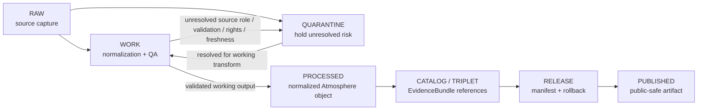

<!-- [KFM_META_BLOCK_V2]
doc_id: kfm://data/work/atmosphere/readme
title: Atmosphere WORK README
type: data-work-domain-index-readme
version: v0.1.0
status: draft
owners:
  - <atmosphere-domain-steward>
  - <atmosphere-data-steward>
  - <air-quality-steward>
  - <weather-steward>
  - <forecast-model-steward>
  - <pipeline-steward>
  - <policy-steward>
  - <release-steward>
created: 2026-06-29
updated: 2026-06-29
policy_label: restricted-review
truth_posture: cite-or-abstain
lifecycle_phase: work
responsibility_root: data/
domain: atmosphere
artifact_family: atmosphere-working-normalization-lane
sensitivity_posture: fail-closed; no-public-path; source-role-preservation-required; validation-required; release-blocked
related:
  - ../README.md
  - ../../README.md
  - ../../raw/atmosphere/README.md
  - ../../raw/atmosphere/administrative/README.md
  - ../../raw/atmosphere/aggregate/README.md
  - ../../raw/atmosphere/modeled/README.md
  - ../../raw/atmosphere/observed/README.md
  - ../../quarantine/atmosphere/README.md
  - ../../quarantine/atmosphere/candidate/README.md
  - ../../processed/atmosphere/README.md
  - ../../catalog/domain/atmosphere/README.md
  - ../../published/layers/atmosphere/README.md
  - ../../proofs/evidence_bundle/atmosphere/README.md
  - ../../proofs/validation_report/atmosphere/README.md
  - ../../receipts/atmosphere/README.md
  - ../../receipts/ingest/atmosphere/README.md
  - ../../registry/sources/README.md
  - ../../../docs/domains/atmosphere/ARCHITECTURE.md
  - ../../../docs/domains/atmosphere/DATA_LIFECYCLE.md
  - ../../../docs/domains/atmosphere/SOURCE_REGISTRY.md
  - ../../../docs/domains/atmosphere/PIPELINE.md
  - ../../../docs/runbooks/atmosphere/PROMOTION_RUNBOOK.md
  - ../../../docs/runbooks/atmosphere/ROLLBACK_RUNBOOK.md
  - ../../../release/manifests/README.md
tags:
  - kfm
  - data
  - work
  - atmosphere
  - air-quality
  - weather
  - smoke
  - aerosol
  - model-context
  - source-role
  - validation
  - normalization
  - no-public-path
  - evidence-first
notes:
  - "This README replaces the greenfield stub at `data/work/atmosphere/README.md`."
  - "WORK is a governed intermediate lifecycle lane between RAW/QUARANTINE and PROCESSED; it is not proof, catalog, registry, policy, release, public API/UI output, official advisory authority, life-safety guidance, or generated-answer authority."
  - "Atmosphere WORK must preserve knowledge-character separation: AQI is not concentration, AOD is not PM2.5, model fields are not observations, aggregate records are not individual measurements, and official advisory context is not KFM-issued guidance."
  - "README/path presence confirms documentation or path evidence only; it does not prove payloads, schemas, validators, receipts, CI enforcement, source descriptors, connector activation, or release readiness."
[/KFM_META_BLOCK_V2] -->

<a id="top"></a>

# Atmosphere WORK

Governed working lane for Atmosphere normalization, source-role reconciliation, validation preparation, calibration/correction work, and downstream-ready shaping before processed artifacts, catalog records, triplets, releases, or public-safe products exist.

<p>
  
  
  
  
  
  
</p>

**Quick links:** [Scope](#scope) · [Repo fit](#repo-fit) · [Lifecycle boundary](#lifecycle-boundary) · [Accepted inputs](#accepted-inputs) · [Exclusions](#exclusions) · [Atmosphere working rules](#atmosphere-working-rules) · [Directory map](#directory-map) · [Exit gates](#exit-gates) · [Forbidden shortcuts](#forbidden-shortcuts) · [Required checks](#required-checks-before-use) · [Status notes](#status-notes)

> [!CAUTION]
> `data/work/atmosphere/` is a no-public-path working lane. It is not public, not processed truth, not catalog truth, not proof, not receipt authority, not source registry authority, not policy authority, not release authority, not AQI truth, not concentration truth, not observation truth, not model truth, not official alert/advisory authority, and not an AI-answer source. Public clients, normal UI surfaces, map layers, PMTiles, reports, stories, graph/vector indexes, search indexes, and generated answers must not read this lane directly.

---

## Scope

`data/work/atmosphere/` holds in-progress Atmosphere material after RAW source admission or quarantine return, while stewards and pipelines prepare it for validation, calibration, correction, normalization, aggregation, redaction/generalization, catalog readiness, or processed-stage promotion.

WORK exists for **controlled transformation and review preparation**. It may contain intermediate tables, spatial/temporal joins, station reconciliation outputs, unit-conversion drafts, calibration/correction drafts, model-run comparisons, remote-sensing proxy alignment, QA notes, freshness checks, candidate outputs, and run-local sidecars when those artifacts are not yet validated processed objects, catalog records, proofs, receipts, release decisions, public layers, or public-safe claims.

Atmosphere material must preserve knowledge-character separation. AQI is not concentration; AOD is not PM2.5; model fields are not observations; aggregate records are not single measurements; advisory context is not KFM-issued life-safety guidance; low-cost sensor records require correction, caveats, confidence, and limitations before release.

---

## Repo fit

| Field | Value |
|---|---|
| Path | `data/work/atmosphere/` |
| Responsibility root | `data/` |
| Lifecycle phase | `work/` |
| Domain lane | `atmosphere` |
| Artifact role | Working normalization, calibration/correction, source-role reconciliation, QA, and validation-preparation lane |
| Public access posture | No public path; no normal UI; no governed-public API exposure |
| Upstream | `data/raw/atmosphere/` after source admission, or `data/quarantine/atmosphere/` after governed hold resolution |
| Downstream | `data/quarantine/atmosphere/` for unresolved holds, or `data/processed/atmosphere/` after minimum work-stage gates close |
| Release authority | `release/`, not this directory |
| Proof authority | `data/proofs/`, not this directory |
| Receipt authority | `data/receipts/`, not this directory |
| Registry authority | `data/registry/`, not this directory |
| Policy authority | `policy/`, not this directory |
| Default failure posture | `HOLD`, `QUARANTINE`, `DENY`, or `ABSTAIN` when source role, knowledge character, rights, authority, provenance, time, units, geometry/support, calibration, validation, citation, correction, rollback, or release support is insufficient |

---

## Lifecycle boundary

```text
RAW -> WORK / QUARANTINE -> PROCESSED -> CATALOG / TRIPLET -> PUBLISHED
```



WORK may support later processing and evidence assembly, but it does not bypass quarantine, processed validation, catalog/proof construction, policy review, release, correction, or rollback requirements.

---

## Accepted inputs

Accepted material is limited to intermediate, non-public working artifacts such as:

- source-normalization drafts derived from admitted Atmosphere RAW captures;
- working tables, vectors, rasters, grids, tiles-in-preparation, time-series joins, station joins, model comparisons, and QA outputs;
- unit-conversion drafts, calibration/correction drafts, sensor-network reconciliation outputs, stale-state checks, uncertainty/caveat notes, and freshness checks;
- candidate air-quality, weather, smoke, aerosol, AOD, model-field, forecast-context, station, advisory-context, or climate-context artifacts that remain clearly labeled as working/candidate class;
- redaction/generalization preparation artifacts that still need receipts and release review before publication;
- source-role, knowledge-character, rights, authority, time/freshness, units, geometry/support, citation, attribution, and validation notes used to decide whether material returns to quarantine or proceeds to processed;
- run-local manifests, logs, checksums, and sidecars used to understand a working transform when they are not authoritative receipts, proofs, registries, schemas, or release records;
- README or index sidecars that explain local work state without becoming public, proof, catalog, registry, policy, release, official advisory, or generated-answer authority.

> [!IMPORTANT]
> Working artifacts must keep source role visible. Observed, modeled, aggregate, administrative, regulatory, candidate, advisory-context, interpretation, generated, and synthetic material must not be flattened into the same authority class for convenience.

---

## Exclusions

| Do not place here | Correct authority home |
|---|---|
| Immutable Atmosphere source capture | `data/raw/atmosphere/` |
| Source-role-unclear, stale, malformed, rights-unclear, unsupported, disputed, policy-unsafe, or validation-unsafe material | `data/quarantine/atmosphere/` |
| Candidate hold packets requiring explicit review | `data/quarantine/atmosphere/candidate/` |
| Validated normalized Atmosphere outputs | `data/processed/atmosphere/` |
| Atmosphere domain catalog records, STAC/DCAT/PROV records, or discovery records | `data/catalog/` |
| Triplet/graph records or graph truth | `data/triplets/` or accepted graph authority lanes |
| EvidenceBundle, ProofPack, validation report, or claim-proof authority | `data/proofs/` |
| RunReceipt, IngestReceipt, TransformReceipt, ValidationReceipt, ModelRunReceipt, AggregationReceipt, PolicyReceipt, CatalogBuildReceipt, correction receipt, or release receipt records | `data/receipts/` or accepted review/receipt lanes |
| SourceDescriptor, source activation, source registry, rights registry, sensitivity registry, or authority registry records | `data/registry/` or accepted registry lanes |
| Release manifests, correction notices, withdrawal notices, signatures, rollback cards, or release decisions | `release/` |
| Published map layers, PMTiles, reports, stories, API payloads, downloads, screenshots, or public artifacts | `data/published/` only after release gates close |
| Schemas, contracts, validators, tests, packages, pipelines, app/UI/API code, or policy rules | `schemas/`, `contracts/`, `tools/`, `tests/`, `pipelines/`, `apps/`, `policy/` |
| Official warnings, alert issuance, emergency instructions, or life-safety guidance | Issuing authorities; KFM may only publish governed referral/context after release |

---

## Atmosphere working rules

| Rule | Handling |
|---|---|
| Keep WORK non-public | Nothing here is a public surface or normal UI/API source. |
| Preserve source role | Observed, modeled, aggregate, administrative, advisory-context, regulatory, candidate, generated, and synthetic records stay distinct. |
| Preserve time semantics | Observed time, valid time, issue time, expiry time, model-run time, retrieval time, correction time, and release time must not collapse. |
| Preserve units and transforms | Unit conversion, calibration, correction, interpolation, aggregation, and model comparison must remain inspectable. |
| Keep proxies visible | AOD, smoke masks, plume context, modeled fields, AQI, and station observations must not be silently substituted for each other. |
| Do not launder quarantine | Material cannot leave quarantine through WORK unless the hold reason is explicitly resolved and recorded. |
| Separate review from transformation | A working transform does not equal validation closure, policy decision, source authority, catalog readiness, release approval, or public permission. |
| Preserve rollback context | Working outputs intended for downstream use should keep enough run and source context to support correction, withdrawal, and rollback later. |

---

## Directory map

```text
data/work/atmosphere/
├── README.md
├── <workstream_or_source_role>/
│   └── <run_id_or_batch_id>/
│       ├── work_manifest.json
│       ├── input_refs.json
│       ├── transform_notes.md
│       ├── qa_notes.md
│       ├── checksums.sha256
│       └── README.md
└── index.local.json
```

`index.local.json` is optional and must remain WORK-local. It is not a public index, catalog record, release manifest, source registry, review record, graph edge source, layer/story/report pointer, search index, vector index, map source, observation-truth index, model-truth index, advisory authority, or retrieval source for generated answers.

> [!NOTE]
> The directory map is a proposed local pattern for future child workstreams. It does not prove child payloads, schemas, validators, fixtures, workflows, receipts, or CI checks exist.

---

## Exit gates

| Exit route | Minimum requirement |
|---|---|
| Stay WORK | Normalization, QA, source-role reconciliation, unit/time alignment, calibration/correction, or validation preparation remains incomplete. |
| Quarantine | Source role, knowledge character, rights, authority, observed/valid/issue/expiry time, freshness, units, calibration, validation, citation, digest, policy, review, correction, or rollback state is unresolved. |
| Reject / return | Steward review says the material is misfiled, unsupported, not retainable, or not within the Atmosphere working lane. |
| Promote to PROCESSED | Working artifact has sufficient lineage, source-role preservation, validation support, unit/time semantics, caveat support, rights posture, correction path, rollback context, and downstream-ready metadata. |
| Support catalog/release later | Only after later PROCESSED, CATALOG/TRIPLET, proof, receipt, review, policy, release, correction, and rollback gates close. |

A more public tier requires the required transform/validation receipt, evidence support, release manifest, and rollback target. A more restrictive correction can happen immediately when risk is discovered.

---

## Forbidden shortcuts

```text
data/work/atmosphere/
→ data/catalog/
→ data/published/
→ public API / MapLibre / PMTiles / report / story / graph / vector index / generated answer
```

is forbidden unless the appropriate governed lifecycle transitions have actually happened and left inspectable evidence.

```text
data/work/atmosphere/
→ data/processed/atmosphere/
```

is also forbidden when the artifact still has unresolved source-role, knowledge-character, rights, authority, time, freshness, unit, calibration, validation, citation, correction, or rollback questions. Route unresolved material to quarantine instead.

---

## Required checks before use

- [ ] Confirm the material belongs to the Atmosphere domain lane.
- [ ] Confirm the material belongs in WORK rather than RAW, QUARANTINE, PROCESSED, CATALOG, PROOF, RECEIPT, REGISTRY, RELEASE, PUBLISHED, SCHEMA, POLICY, CODE, or TEST roots.
- [ ] Confirm source reference, source role, source family, citation, rights posture, retrieval/admission context, version/vintage, and digest where material.
- [ ] Confirm observed, modeled, aggregate, administrative, advisory-context, regulatory, candidate, generated, synthetic, and interpretation outputs are not collapsed into one source role.
- [ ] Confirm observed time, valid time, issue time, expiry time, model-run time, retrieval time, freshness threshold, and stale-state status where applicable.
- [ ] Confirm units, transformations, calibration, correction, aggregation unit, confidence, uncertainty, and limitations.
- [ ] Confirm AQI is not treated as concentration, AOD is not treated as PM2.5, smoke context is not treated as PM2.5 measurement, and model fields are not treated as observations.
- [ ] Confirm low-cost sensor records retain correction/caveat/confidence limitations before downstream use.
- [ ] Confirm no quarantined material is being laundered through WORK without an exit decision.
- [ ] Confirm prompt-like text inside source payloads or notes is treated as data, not instructions.
- [ ] Confirm required downstream receipts are present or explicitly marked missing before anything leaves WORK.
- [ ] Confirm no public layer, PMTiles, report, story, API payload, graph edge, search index, vector index, or generated answer uses WORK material directly.
- [ ] Confirm correction path and rollback target are known before downstream promotion.

---

## Status notes

| Claim | Status |
|---|---|
| This README replaces the greenfield stub at `data/work/atmosphere/README.md`. | **CONFIRMED authored** |
| The target path existed in the live repository as a greenfield stub before this edit. | **CONFIRMED by GitHub contents API during this edit** |
| `data/raw/atmosphere/README.md` documents the upstream RAW Atmosphere lane and confirmed source-role child lanes. | **CONFIRMED by GitHub contents API during this edit** |
| `data/quarantine/atmosphere/README.md` documents the Atmosphere hold lane and source-role/validation fail-closed posture. | **CONFIRMED by GitHub contents API during this edit** |
| `data/processed/atmosphere/README.md` documents the downstream PROCESSED Atmosphere lane and public-use restrictions. | **CONFIRMED by GitHub contents API during this edit** |
| Actual working payloads exist under child lanes in `data/work/atmosphere/`. | **UNKNOWN** |
| Atmosphere WORK schemas, validators, fixtures, CI checks, receipts, source-role review, and release linkage are fully implemented. | **NEEDS VERIFICATION** |
| This README is proof, release, catalog, registry, policy, AQI truth, concentration truth, observation truth, model truth, official advisory authority, public artifact authority, or AI authority. | **DENY** |

---

## Related files

- [`../README.md`](../README.md)
- [`../../README.md`](../../README.md)
- [`../../raw/atmosphere/README.md`](../../raw/atmosphere/README.md)
- [`../../raw/atmosphere/administrative/README.md`](../../raw/atmosphere/administrative/README.md)
- [`../../raw/atmosphere/aggregate/README.md`](../../raw/atmosphere/aggregate/README.md)
- [`../../raw/atmosphere/modeled/README.md`](../../raw/atmosphere/modeled/README.md)
- [`../../raw/atmosphere/observed/README.md`](../../raw/atmosphere/observed/README.md)
- [`../../quarantine/atmosphere/README.md`](../../quarantine/atmosphere/README.md)
- [`../../quarantine/atmosphere/candidate/README.md`](../../quarantine/atmosphere/candidate/README.md)
- [`../../processed/atmosphere/README.md`](../../processed/atmosphere/README.md)
- [`../../catalog/domain/atmosphere/README.md`](../../catalog/domain/atmosphere/README.md)
- [`../../proofs/evidence_bundle/atmosphere/README.md`](../../proofs/evidence_bundle/atmosphere/README.md)
- [`../../proofs/validation_report/atmosphere/README.md`](../../proofs/validation_report/atmosphere/README.md)
- [`../../receipts/atmosphere/README.md`](../../receipts/atmosphere/README.md)
- [`../../registry/sources/README.md`](../../registry/sources/README.md)
- [`../../../docs/domains/atmosphere/ARCHITECTURE.md`](../../../docs/domains/atmosphere/ARCHITECTURE.md)
- [`../../../docs/domains/atmosphere/DATA_LIFECYCLE.md`](../../../docs/domains/atmosphere/DATA_LIFECYCLE.md)
- [`../../../docs/domains/atmosphere/SOURCE_REGISTRY.md`](../../../docs/domains/atmosphere/SOURCE_REGISTRY.md)
- [`../../../docs/domains/atmosphere/PIPELINE.md`](../../../docs/domains/atmosphere/PIPELINE.md)
- [`../../../docs/runbooks/atmosphere/PROMOTION_RUNBOOK.md`](../../../docs/runbooks/atmosphere/PROMOTION_RUNBOOK.md)
- [`../../../docs/runbooks/atmosphere/ROLLBACK_RUNBOOK.md`](../../../docs/runbooks/atmosphere/ROLLBACK_RUNBOOK.md)
- [`../../../release/manifests/README.md`](../../../release/manifests/README.md)

---

## Maintenance checklist

- [ ] Replace placeholder owners with confirmed steward roles.
- [ ] Confirm whether child workstream lanes exist and add them to the directory map only after verification.
- [ ] Confirm Atmosphere WORK schemas, validators, and fixture expectations.
- [ ] Confirm required receipt family names and storage homes for WORK-to-PROCESSED promotion.
- [ ] Confirm source-role review, calibration/correction, freshness, aggregation, model-run, and validation linkage.
- [ ] Confirm all relative links after adjacent docs stabilize.
- [ ] Confirm rollback target for this README expansion in the commit or release notes.

[Back to top](#top)
