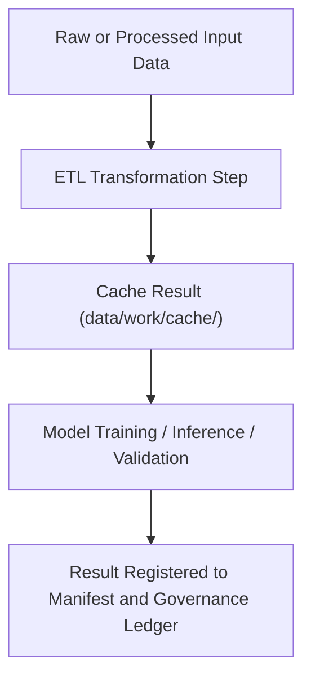

<div align="center">

# 🧮 Kansas Frontier Matrix — **Work Cache Layer**
`data/work/cache/README.md`

**Purpose:** Temporary caching layer for intermediate ETL computations, query results, and model outputs within the Kansas Frontier Matrix (KFM) data pipelines.  
The cache layer accelerates processing while maintaining full traceability, reproducibility, and governance under FAIR+CARE principles.

[](../../../docs/standards/faircare-validation.md)
[](../../../LICENSE)
[](../../../docs/architecture/repo-focus.md)

</div>

---

## 📚 Overview

The `data/work/cache/` directory is a **transient data layer** designed to store:
- Pre-processed data fragments used during ETL and AI model runs.  
- Cached results from database queries, API calls, or feature extraction steps.  
- Serialized intermediate outputs (GeoParquet, Feather, JSON, or Arrow).  
- Temporary computation results used in Focus Mode and analytical dashboards.

**Note:**  
Files in this directory are regenerated automatically during workflows and are not version-controlled for archival retention.  
Each cached artifact includes metadata for provenance, runtime context, and FAIR+CARE compliance.

---

## 🗂️ Directory Layout

```plaintext
data/work/cache/
├── README.md                         # This file — overview of cache layer
│
├── etl_cache/                        # Cached ETL transformations (GeoParquet, JSON)
│   ├── hazards_etl_cache.parquet
│   ├── climate_etl_cache.json
│   ├── validation_context.json
│   └── metadata.json
│
├── ai_cache/                         # Focus Mode AI model inference cache
│   ├── focus_mode_embeddings.arrow
│   ├── entity_context_cache.feather
│   ├── summary_cache.json
│   └── metadata.json
│
└── query_cache/                      # Cached SQL/Graph queries from Neo4j or PostgreSQL
    ├── stac_index_cache.json
    ├── graph_lookup_cache.csv
    └── metadata.json
```

---

## ⚙️ Cache Workflow



### Process Summary:
1. **ETL Stage:** Intermediate outputs generated during transformations are cached here.  
2. **AI Stage:** Focus Mode models read/write contextual embeddings and summaries.  
3. **Validation Stage:** Cached QA results ensure reproducibility and schema consistency.  
4. **Governance Stage:** Provenance metadata logged to `data/reports/audit/data_provenance_ledger.json`.

---

## 🧩 Example Cache Metadata Record

```json
{
  "id": "etl_cache_hazards_2025",
  "title": "ETL Transformation Cache for Hazards Data (v9.3.2)",
  "description": "Temporary intermediate dataset generated during hazard ETL process, used for schema validation and AI Focus Mode inference.",
  "created": "2025-10-28T14:10:00Z",
  "runtime_context": "hazards_etl_pipeline_v14",
  "checksum": "sha256:19b45a1a7ac4d9b1b06a03e5412a563aa12beccc...",
  "valid_until": "2025-10-30T23:59:59Z",
  "governance_tags": ["FAIR+CARE", "Non-Archival", "Transient"]
}
```

---

## 🧠 FAIR+CARE Compliance in Cache Layer

| Principle | Implementation |
|------------|----------------|
| **Findable** | Metadata and manifests generated for every cache artifact. |
| **Accessible** | Cached data accessible to active workflows only (non-public). |
| **Interoperable** | Uses open, cross-platform formats (GeoParquet, Arrow, JSON). |
| **Reusable** | Cache includes provenance and validation metadata for reuse. |
| **Collective Benefit** | Improves system efficiency and transparency. |
| **Authority to Control** | Controlled access via governance rules and workflow tokens. |
| **Responsibility** | All cache data automatically purged upon workflow completion. |
| **Ethics** | Contains no private or restricted data; computationally derived only. |

FAIR+CARE governance applied automatically through the **ETL pipeline metadata registry**.

---

## ⚖️ Governance & Provenance Integration

| Record | Description |
|---------|-------------|
| `metadata.json` | Contains runtime and checksum metadata for each cache segment. |
| `data/reports/audit/data_provenance_ledger.json` | Logs cache creation and purge activities. |
| `data/reports/validation/schema_validation_summary.json` | Confirms cache schema conformance. |
| `releases/v9.3.2/manifest.zip` | Maintains checksum hashes for reproducible cache state. |

---

## 🧾 Caching Policy

- Cache retention period: **72 hours (default)** post-workflow execution.  
- Automated cleanup: Conducted via scheduled `cache_purge.yml` GitHub Action.  
- Sensitive cache data: Not permitted — caches must contain only derived or temporary data.  
- Rebuild triggers: Reconstructed on-demand when upstream data or model changes occur.

---

## 🧾 Citation (Internal Use)

```text
Kansas Frontier Matrix (2025). Work Cache Layer (v9.3.2).
Internal ETL and AI cache system for transient data and intermediate computations.
Not intended for public use or distribution.
```

---

## 🧾 Version Notes

| Version | Date | Notes |
|----------|------|--------|
| v9.3.2 | 2025-10-28 | Introduced cache metadata tracking and checksum governance. |
| v9.2.0 | 2024-07-15 | Added AI inference caching layer for Focus Mode. |
| v9.0.0 | 2023-01-10 | Established base cache layer for ETL transformations. |

---

<div align="center">

**Kansas Frontier Matrix** · *ETL Performance × FAIR+CARE Governance × Reproducible Computing*  
[🔗 Repository](https://github.com/bartytime4life/Kansas-Frontier-Matrix) • [🧭 Docs Portal](../../../docs/) • [⚖️ Governance Ledger](../../../docs/standards/governance/)

</div>