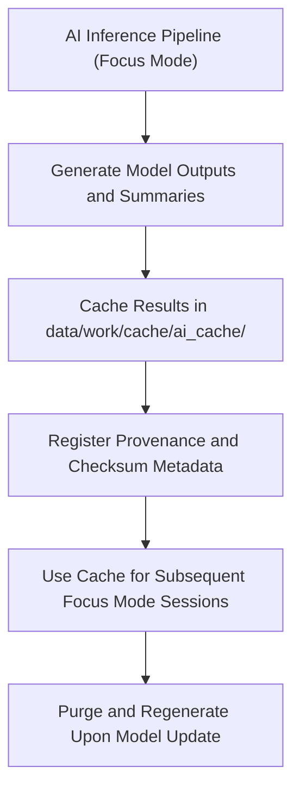

<div align="center">

# 🧠 Kansas Frontier Matrix — **AI Cache Layer**
`data/work/cache/ai_cache/README.md`

**Purpose:** Caches temporary inference results, embeddings, and Focus Mode summaries generated by AI/ML models in the Kansas Frontier Matrix (KFM).  
These cache files accelerate Focus Mode performance, enable reproducible AI analyses, and remain fully traceable under FAIR+CARE ethical governance.

[](../../../../docs/standards/faircare-validation.md)
[](../../../../LICENSE)
[](../../../../docs/architecture/repo-focus.md)

</div>

---

## 📚 Overview

The `data/work/cache/ai_cache/` directory stores **temporary AI-generated artifacts**, including:
- Contextual embeddings for entities, documents, and spatial features.  
- Focus Mode summaries generated via transformer-based models.  
- Cached explainability outputs and interpretability metrics.  
- Intermediate inference results shared between pipeline stages.

This cache layer allows KFM’s AI subsystems to reuse model outputs across sessions for faster inference, reproducibility, and auditability while ensuring no sensitive data is retained.

---

## 🗂️ Directory Layout

```plaintext
data/work/cache/ai_cache/
├── README.md                         # This file — documentation of AI cache directory
│
├── focus_mode_embeddings.arrow        # Vector embeddings for Focus Mode semantic retrieval
├── entity_context_cache.feather       # Cached entity-level contextual data (AI inferences)
├── summary_cache.json                 # AI-generated Focus Mode summaries for current session
├── explainability_cache.json          # SHAP/LIME-based interpretability results
└── metadata.json                      # Provenance and runtime metadata
```

---

## ⚙️ AI Caching Workflow



### Description:
1. **Generation:** AI models generate embeddings, summaries, or contextual predictions.  
2. **Caching:** Outputs are stored locally for reuse within the same model context.  
3. **Governance:** Metadata (model version, prompt seed, checksum) is saved for auditability.  
4. **Reuse:** Cache accelerates Focus Mode queries and timeline visualizations.  
5. **Lifecycle:** Automatically purged or rebuilt when model versions or seed hashes change.

---

## 🧩 Example Metadata Record

```json
{
  "id": "ai_focus_cache_v9.3.2",
  "title": "Focus Mode AI Cache for Semantic Inference",
  "description": "Cached embeddings, contextual summaries, and explainability metrics generated by transformer-based models during Focus Mode analysis.",
  "model": "gpt-5-geo-hybrid-v3.2",
  "embedding_dim": 1536,
  "created": "2025-10-28T16:00:00Z",
  "runtime_context": "focus_mode_session_2025Q4",
  "checksum": "sha256:84c77d2fbbf2de6a67aa1f8d0dc6a8f21e4e6a92...",
  "model_version": "v3.2.1",
  "prompt_seed": 178462,
  "governance_tags": ["AI-Cache", "Transient", "FAIR+CARE"],
  "valid_until": "2025-10-30T00:00:00Z"
}
```

---

## 🧠 FAIR+CARE AI Governance

| Principle | Implementation in AI Cache |
|------------|----------------------------|
| **Findable** | Metadata recorded with model name, version, and seed hash. |
| **Accessible** | Cache visible to authorized pipelines only (non-public). |
| **Interoperable** | Standardized formats (Arrow, Feather, JSON). |
| **Reusable** | Cache regenerates deterministically using model/version info. |
| **Collective Benefit** | Improves transparency and computational efficiency. |
| **Authority to Control** | Access restricted to governance-approved workflows. |
| **Responsibility** | Logs ensure cache data are traceable to model runs. |
| **Ethics** | Contains no personal data; aligns with AI governance policy. |

Governance entries written automatically to:  
`data/reports/audit/ai_hazards_ledger.json`  
and validated by `data/reports/fair/data_care_assessment.json`.

---

## ⚖️ Security & Data Integrity

- **Checksum Verification:** SHA-256 digests generated per cache artifact.  
- **Data Purge Policy:** Automatic cleanup after 72 hours or model update.  
- **AI Transparency:** Each cache record includes `model_version`, `prompt_seed`, and `checksum`.  
- **Governance Logging:** All actions recorded in AI ledger and telemetry manifest.  

Cache integrity audits performed via `governance-ledger.yml` workflow.

---

## ⚙️ Cache Formats and Use Cases

| File | Format | Purpose |
|------|---------|----------|
| `focus_mode_embeddings.arrow` | Apache Arrow | Semantic vector cache for nearest-neighbor retrieval. |
| `entity_context_cache.feather` | Feather (Pandas) | Stores contextual data and entity-level summaries. |
| `summary_cache.json` | JSON | Cached text summaries and Focus Mode insights. |
| `explainability_cache.json` | JSON | Captures interpretability outputs (SHAP, LIME). |

---

## 🔍 Governance & Provenance Integration

| Record | Description |
|---------|-------------|
| `metadata.json` | Defines cache runtime metadata and AI model version. |
| `data/reports/audit/ai_hazards_ledger.json` | AI audit log and provenance record. |
| `data/reports/fair/data_care_assessment.json` | FAIR+CARE compliance for AI outputs. |
| `releases/v9.3.2/focus-telemetry.json` | Session-level telemetry and usage metrics. |

---

## 🧾 Internal Use Policy

- **Retention:** Cache auto-purged after model regeneration or 72 hours.  
- **Privacy:** No user-identifiable data stored or cached.  
- **Access:** Limited to internal pipelines; not distributed publicly.  
- **Transparency:** All AI cache creation events are traceable in governance logs.  

---

## 🧾 Citation (Internal Reference)

```text
Kansas Frontier Matrix (2025). AI Cache Layer (v9.3.2).
Transient cache for AI model inference, embeddings, and Focus Mode contextual outputs.
Restricted to internal governance workflows.
```

---

## 🧾 Version Notes

| Version | Date | Notes |
|----------|------|--------|
| v9.3.2 | 2025-10-28 | Added SHAP/LIME explainability caching and model hash metadata. |
| v9.2.0 | 2024-07-15 | Implemented semantic embedding storage and checksum governance. |
| v9.0.0 | 2023-01-10 | Established AI caching structure for Focus Mode operations. |

---

<div align="center">

**Kansas Frontier Matrix** · *AI Transparency × FAIR+CARE Governance × Ethical Model Stewardship*  
[🔗 Repository](https://github.com/bartytime4life/Kansas-Frontier-Matrix) • [🧭 Docs Portal](../../../../docs/) • [⚖️ Governance Ledger](../../../../docs/standards/governance/)

</div>