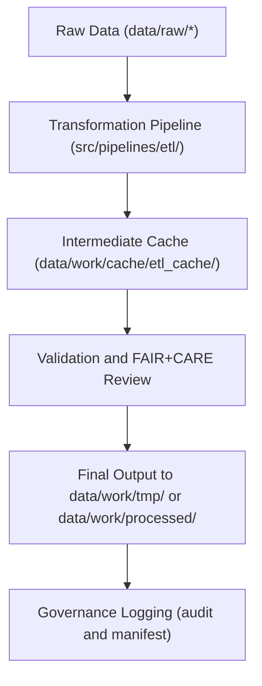

<div align="center">

# ⚙️ Kansas Frontier Matrix — **ETL Cache Layer**
`data/work/cache/etl_cache/README.md`

**Purpose:** Temporary cache for intermediate data transformations and validation checkpoints produced during ETL (Extract, Transform, Load) workflows.  
Ensures reproducibility, computational efficiency, and full FAIR+CARE-compliant traceability in the Kansas Frontier Matrix (KFM) data pipeline architecture.

[](../../../../docs/standards/faircare-validation.md)
[](../../../../LICENSE)
[](../../../../docs/architecture/repo-focus.md)

</div>

---

## 📚 Overview

The `data/work/cache/etl_cache/` directory is used for **storing transient, intermediate ETL outputs** generated during data transformation, validation, and quality assurance workflows.  
It improves efficiency by reusing partial results instead of reprocessing entire datasets, while maintaining full lineage and governance integrity.

### ETL Cache Functions:
- Stores partially transformed GeoJSON, CSV, and Parquet files during pipeline runs.  
- Holds schema validation summaries and normalization context.  
- Enables checkpoint recovery for large-scale ETL workflows.  
- Ensures deterministic transformations via checksum verification.

All cached files are **non-archival** and are automatically cleared upon workflow completion or after 72 hours.

---

## 🗂️ Directory Layout

```plaintext
data/work/cache/etl_cache/
├── README.md                           # This file — overview of ETL cache functionality
│
├── hazards_etl_cache.parquet           # Cached output from hazards ETL pipeline
├── climate_etl_cache.json              # Cached output from climate normalization stage
├── validation_context.json             # Cached validation summary for schema conformance
└── metadata.json                       # Runtime and provenance metadata for cache session
```

---

## ⚙️ ETL Cache Workflow



### Description:
1. **Transformation:** Raw data undergoes normalization and schema alignment.  
2. **Cache Write:** Intermediate results saved temporarily for later reuse or inspection.  
3. **Validation:** Cached results validated against STAC/DCAT metadata schemas.  
4. **Export:** Cleaned, validated datasets exported to processed workspace.  
5. **Governance:** Cache entries logged in provenance ledger for reproducibility.

---

## 🧩 Example Metadata Record

```json
{
  "id": "etl_cache_climate_v9.3.2",
  "title": "ETL Cache for Climate Data Pipeline (v9.3.2)",
  "description": "Intermediate cache for Kansas climate datasets during ETL normalization, schema validation, and anomaly correction.",
  "pipeline": "src/pipelines/etl/climate_pipeline.py",
  "runtime_context": "climate_etl_session_2025Q4",
  "created": "2025-10-28T14:55:00Z",
  "checksum": "sha256:3c7b71d9af2eb5a14b44c9b77a68c1f15f4e1f11...",
  "governance_tags": ["ETL", "Transient", "FAIR+CARE"],
  "valid_until": "2025-10-30T00:00:00Z"
}
```

---

## ⚙️ Common Cache Formats

| Format | Use Case | Example |
|---------|-----------|---------|
| **Parquet (.parquet)** | Large, columnar ETL transformations (hazards, climate). | `hazards_etl_cache.parquet` |
| **JSON (.json)** | Schema validation context and summary data. | `validation_context.json` |
| **CSV (.csv)** | Lightweight intermediate datasets. | `etl_preview.csv` |
| **Feather (.feather)** | Tabular data exchange between Python pipelines. | `etl_temp_cache.feather` |

All cache files adhere to open data standards for transparency and interoperability.

---

## 🧠 FAIR+CARE Compliance in ETL Cache

| Principle | Implementation |
|------------|----------------|
| **Findable** | Metadata and manifest entries generated per cache artifact. |
| **Accessible** | Cache data accessible to workflow processes only (non-public). |
| **Interoperable** | Stored in interoperable open formats (Parquet, JSON, CSV). |
| **Reusable** | Metadata includes checksums and pipeline provenance for reproducibility. |
| **Collective Benefit** | Improves data pipeline efficiency and governance traceability. |
| **Authority to Control** | Cache governed by internal ETL system workflows. |
| **Responsibility** | Logs ensure cache creation and deletion are traceable. |
| **Ethics** | Contains no sensitive or user-specific data. |

Compliance validated in `data/reports/fair/data_care_assessment.json`.

---

## ⚖️ Governance & Provenance Integration

| Record | Description |
|---------|-------------|
| `metadata.json` | Defines cache runtime context, pipeline reference, and checksum. |
| `data/reports/audit/data_provenance_ledger.json` | Records cache creation, validation, and purge events. |
| `data/reports/validation/schema_validation_summary.json` | Contains validation status for cached schema checks. |
| `releases/v9.3.2/manifest.zip` | Global checksum registry for reproducibility. |

Cache governance linked through the **ETL pipeline controller** under  
`src/pipelines/etl/etl_controller.py`.

---

## 🧾 Retention Policy

- **Default TTL:** 72 hours from creation timestamp.  
- **Cleanup Trigger:** Executed automatically after successful ETL completion.  
- **Cache Exclusions:** Files marked with `"retain": true` in metadata persist through next session.  
- **Governance Record:** All cache lifecycle events logged for audit purposes.

---

## 🧾 Internal Use Citation

```text
Kansas Frontier Matrix (2025). ETL Cache Layer (v9.3.2).
Intermediate cache repository for data transformation pipelines.
Used internally for reproducibility and validation efficiency.
```

---

## 🧾 Version Notes

| Version | Date | Notes |
|----------|------|--------|
| v9.3.2 | 2025-10-28 | Enhanced metadata tracking and TTL governance for cache files. |
| v9.2.0 | 2024-07-15 | Introduced validation context logging for ETL checkpoints. |
| v9.0.0 | 2023-01-10 | Established ETL caching architecture under FAIR+CARE governance. |

---

<div align="center">

**Kansas Frontier Matrix** · *ETL Acceleration × FAIR+CARE Governance × Provenance Integrity*  
[🔗 Repository](https://github.com/bartytime4life/Kansas-Frontier-Matrix) • [🧭 Docs Portal](../../../../docs/) • [⚖️ Governance Ledger](../../../../docs/standards/governance/)

</div>