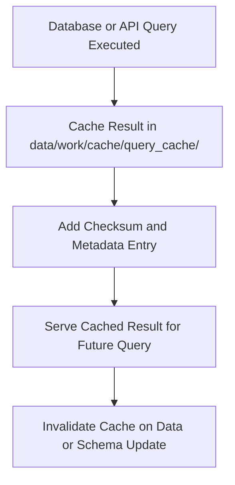

<div align="center">

# 🔍 Kansas Frontier Matrix — **Query Cache Layer**
`data/work/cache/query_cache/README.md`

**Purpose:** Stores temporary query results generated during API requests, database lookups, and Knowledge Graph operations.  
The query cache accelerates data retrieval, reduces redundant computations, and maintains full traceability under FAIR+CARE and MCP-DL governance.

[](../../../../docs/standards/faircare-validation.md)
[](../../../../LICENSE)
[](../../../../docs/architecture/repo-focus.md)

</div>

---

## 📚 Overview

The `data/work/cache/query_cache/` directory functions as a **dynamic in-memory and on-disk caching system** for KFM’s data retrieval and validation workflows.  
It stores precomputed or recently executed query results from:
- STAC catalog lookups  
- Graph database queries (Neo4j, RDF, SPARQL)  
- PostgreSQL and API data endpoints  
- Focus Mode telemetry and entity search layers  

This cache reduces system latency, supports offline revalidation, and is fully traceable via runtime metadata.

---

## 🗂️ Directory Layout

```plaintext
data/work/cache/query_cache/
├── README.md                            # This file — documentation of query cache
│
├── stac_index_cache.json                # Cached responses from STAC catalog indexing
├── graph_lookup_cache.csv               # Cached graph database query results (Neo4j)
├── api_response_cache.json              # Cached API results for Focus Mode or ETL validation
└── metadata.json                        # Provenance and runtime metadata for cached queries
```

---

## ⚙️ Query Caching Workflow



### Workflow Description:
1. **Execution:** Queries executed across internal data stores and APIs.  
2. **Storage:** Responses cached locally as JSON, CSV, or Parquet for quick reuse.  
3. **Verification:** Each cache artifact assigned a SHA-256 checksum for integrity.  
4. **Reuse:** Cached result returned for identical requests within retention policy.  
5. **Invalidation:** Cache automatically refreshed on data update, schema change, or TTL expiration.

---

## 🧩 Example Metadata Record

```json
{
  "id": "query_cache_stac_2025",
  "title": "STAC Index Query Cache (v9.3.2)",
  "description": "Cached STAC catalog index results used during ETL validation and governance ledger updates.",
  "query_type": "stac_search",
  "source_system": "STAC Catalog API",
  "created": "2025-10-28T15:45:00Z",
  "checksum": "sha256:3b29d2c977a7de72a2bb16f2ee8d3d4f3fae9c77...",
  "runtime_context": "governance_stac_update_session",
  "cache_ttl": "24h",
  "governance_tags": ["Transient", "FAIR+CARE", "QueryCache"]
}
```

---

## ⚙️ Cache Use Cases

| Cache Type | Description | Format | Example File |
|-------------|--------------|---------|---------------|
| **STAC Index Cache** | Temporary cache of catalog search results and dataset listings. | JSON | `stac_index_cache.json` |
| **Graph Lookup Cache** | Cached results from Neo4j and RDF graph traversals. | CSV | `graph_lookup_cache.csv` |
| **API Response Cache** | Cached responses from RESTful services (FEMA, NOAA, USGS). | JSON | `api_response_cache.json` |
| **Query Metadata** | Runtime provenance and lifecycle logs for cache artifacts. | JSON | `metadata.json` |

---

## 🧠 FAIR+CARE Compliance

| Principle | Implementation |
|------------|----------------|
| **Findable** | All cache artifacts are referenced in metadata.json with checksum and query hash. |
| **Accessible** | Cache accessible only within internal data workflows (non-public). |
| **Interoperable** | Stored in open data formats (CSV, JSON, Parquet). |
| **Reusable** | Provenance and TTL metadata ensure cache reproducibility. |
| **Collective Benefit** | Reduces query load, enabling sustainable compute and faster validation. |
| **Authority to Control** | Access managed by ETL and governance controllers. |
| **Responsibility** | Cache entries logged and purged according to TTL. |
| **Ethics** | Contains no personal, confidential, or sensitive data. |

FAIR+CARE governance confirmed under:  
`data/reports/fair/data_care_assessment.json` and `data/reports/audit/data_provenance_ledger.json`.

---

## ⚖️ Governance & Provenance Integration

| Record | Description |
|---------|-------------|
| `metadata.json` | Records query context, source, and TTL. |
| `data/reports/audit/data_provenance_ledger.json` | Logs cache lifecycle events. |
| `data/reports/validation/schema_validation_summary.json` | Confirms metadata consistency. |
| `releases/v9.3.2/manifest.zip` | Global checksum registry for cache integrity. |

Governance and cleanup tasks executed automatically by `query_cache_purge.yml` workflow.

---

## 🧾 Cache Policy

- **Default TTL:** 24 hours (refresh automatically after expiration).  
- **Cleanup Trigger:** Schema change, governance ledger update, or new ingestion.  
- **Persistence:** Only temporary; cache rebuilt on-demand during queries.  
- **Audit Logging:** Every cache read/write recorded for reproducibility.  

All query cache operations governed by MCP-DL v6.3 cache policy.

---

## 🧾 Internal Citation

```text
Kansas Frontier Matrix (2025). Query Cache Layer (v9.3.2).
Internal transient cache for STAC, Neo4j, and API query results.
Used to enhance performance and maintain FAIR+CARE-compliant reproducibility.
```

---

## 🧾 Version Notes

| Version | Date | Notes |
|----------|------|--------|
| v9.3.2 | 2025-10-28 | Added full governance tracking and STAC index cache support. |
| v9.2.0 | 2024-07-15 | Integrated graph database caching for Neo4j and RDF queries. |
| v9.0.0 | 2023-01-10 | Established base query caching structure for internal use. |

---

<div align="center">

**Kansas Frontier Matrix** · *Knowledge Graph Performance × FAIR+CARE Reproducibility × Governance Transparency*  
[🔗 Repository](https://github.com/bartytime4life/Kansas-Frontier-Matrix) • [🧭 Docs Portal](../../../../docs/) • [⚖️ Governance Ledger](../../../../docs/standards/governance/)

</div>