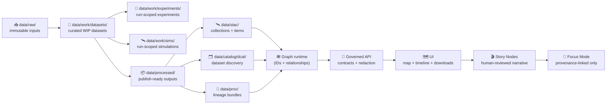

<div align="center">

# 🧺 Work Datasets — `data/work/datasets/`


**A curated shelf of reusable, work-in-progress datasets** 🧪  
Not “final outputs” — but also **not** throwaway scratch.

</div>

> [!IMPORTANT]
> `data/work/datasets/` is for **shared WIP datasets** that multiple experiments/sims/viz prototypes may reuse **before** promotion.  
> If it becomes evidence downstream (Graph/API/UI/Story/Focus), it **must** be promoted to `data/processed/` and published with **STAC + DCAT + PROV**. ✅

---

## 🚀 Quick links

- 🧪 Experiments lab → `../experiments/README.md`
- 🛰️ Sims sandbox → `../sims/README.md`
- 🎛️ Viz sandbox → `../viz/README.md`
- 📦 Processed outputs (publish-ready) → `../../processed/`
- 🛰️ STAC outputs → `../../stac/`
- 🗂️ DCAT outputs → `../../catalog/dcat/`
- 🧬 PROV bundles → `../../prov/`
- 🕸️ Graph exports (if present) → `../../graph/`
- 🔐 Security policy → `../../../SECURITY.md` *(or `.github/SECURITY.md` depending on repo convention)*

---

<details>
<summary><strong>📌 Table of contents</strong></summary>

- [🎯 What this folder is (and is not)](#-what-this-folder-is-and-is-not)
- [🧭 Where `datasets/` fits in the KFM pipeline](#-where-datasets-fits-in-the-kfm-pipeline)
- [🗂️ Recommended layout](#️-recommended-layout)
- [📦 Dataset Package Standard (DPS)](#-dataset-package-standard-dps)
- [🏷️ Identifiers & versioning](#️-identifiers--versioning)
- [🐘 Large-file policy (Git vs DVC/LFS/object storage)](#-large-file-policy-git-vs-dvclfsobject-storage)
- [✅ Minimum QA checks](#-minimum-qa-checks)
- [🚀 Promotion rules](#-promotion-rules)
- [🔐 Governance, sensitivity & sovereignty](#-governance-sensitivity--sovereignty)
- [🧾 Templates](#-templates)
- [📚 Reference shelf](#-reference-shelf)
- [🕰️ Version history](#️-version-history)

</details>

---

## 🎯 What this folder is (and is not)

### ✅ This folder **IS**
- 🧺 A **curated shelf** for datasets that are:
  - **reusable across** multiple work packages (experiments/sims/viz),
  - **structured enough** to have a schema + dictionary + manifest,
  - **not yet promoted** to canonical publication locations.
- 🧷 A place to standardize **dataset packaging habits** early:
  - manifests + hashes,
  - schema/data dictionary,
  - provenance notes and access constraints.

### ❌ This folder is **NOT**
- 📥 A home for raw source ingestion (use `data/raw/<domain>/…`)
- 📦 The canonical home for publish-ready outputs (use `data/processed/<domain>/…`)
- 🛰️ A place for STAC/DCAT/PROV outputs (those have canonical roots elsewhere)
- 🕳️ A dumping ground (no “mystery files” without a manifest)

> [!TIP]
> Think of `data/work/datasets/` as **“shared pre-production”** 🧪  
> and `data/processed/` as **“published production”** 🎟️

---

## 🧭 Where `datasets/` fits in the KFM pipeline

KFM’s order is strict (no skipping stages):

**ETL → STAC/DCAT/PROV → Graph → API → UI → Story Nodes → Focus Mode**

`data/work/datasets/` is a **pre-publication** holding area: it helps us converge on a dataset shape, schema, and QA before we “ship” it as evidence.



> [!WARNING]
> **Nothing in `data/work/` is allowed to be a downstream dependency** (Graph/API/UI/Story/Focus).  
> If it’s important enough to depend on, it’s important enough to **promote + catalog + provenance**.

---

## 🗂️ Recommended layout

Keep it consistent so people can *find things* quickly:

```text
📁 data/work/datasets/
├─ 📁 _templates/                         🧾 copy/paste scaffolds (manifest, README, dictionary)
├─ 📁 _scratch/                           ⚠️ temporary (keep empty in PRs)
├─ 📁 _registry/                          🗂️ optional index (CSV/JSON) for discoverability
│  ├─ 📄 datasets_index.md
│  └─ 📄 datasets_registry.csv
└─ 📁 <dataset_slug>/                     🧺 one dataset package
   ├─ 📄 README.md                        👈 what it is, why it exists, how to use it
   ├─ 📄 manifest.yaml                    🧷 inputs + transforms + outputs + hashes + access rules
   ├─ 📄 data_dictionary.md               🧾 fields, units, codes, value ranges
   ├─ 📄 schema/                          🧩 jsonschema/sql/geo schema notes
   ├─ 📄 checksums.sha256                 🔏 integrity for key artifacts
   ├─ 📁 data/                            📦 small artifacts or pointers (prefer not huge binaries)
   ├─ 📁 samples/                         🧪 tiny samples for tests + docs
   ├─ 📁 notebooks/                       📓 optional EDA (narrative required)
   ├─ 📁 src/                             🧰 optional build/validation scripts
   ├─ 📁 qa/                              ✅ optional QA outputs (keep small)
   └─ 📁 exports/                         🚀 candidate “promotion bundle” (what would ship)
```

> [!NOTE]
> `exports/` is the “handoff folder” for promotion — what you’d move (or re-generate) into `data/processed/…` and catalog.

---

## 📦 Dataset Package Standard (DPS)

A **Dataset Package** is any `<dataset_slug>/` folder that we expect others to reuse.

### ✅ DPS Required files (minimum)
Every dataset package **must** include:

- `README.md`  
  Purpose, scope, usage notes, caveats, known issues, links to inputs/experiments.
- `manifest.yaml`  
  Inputs, transformations, outputs, parameters, environment pointers, hashes, classification.
- `data_dictionary.md`  
  Field definitions, units, code lists, missingness semantics.
- `schema/` *(at least one of these)*  
  - JSON Schema (preferred for JSON/NDJSON)
  - SQL schema (for tables)
  - GeoPackage/OGR schema notes (for spatial)
- `checksums.sha256` *(at least for the “important” artifacts)*  
  Hashes of outputs and key inputs/pointers.

### 🌟 Strongly recommended
- `samples/` with tiny fixtures (safe to commit; great for tests)
- `qa/` with a short QA report (`qa_report.md`) + key screenshots/plots
- `src/` scripts for `build`, `validate`, `export`, `promote`
- `LICENSE.txt` or license note in README (especially if derived from external source data)
- `PROV_HINT.md` to map intended PROV entities/activities (makes promotion painless)

---

## 🏷️ Identifiers & versioning

> [!IMPORTANT]
> **KFM needs two kinds of IDs**:
> 1) **Stable internal identifiers** (never change; never reused; boring on purpose) 🔒  
> 2) **Human-facing dataset slugs** (readable; versioned; can encode meaning) 🏷️

### 1) Dataset slug (`<dataset_slug>/`)
Human-readable and grep-friendly. Example pattern:

```text
kfm.<state>.<domain>.<product>.<time_or_range>.v<major>
# examples:
kfm.ks.remote_sensing.ndvi.landsat8.2017_2025.v1
kfm.ks.hydrology.flood_extent.1993.v1
kfm.ks.air_quality.openaq.pm25.daily.2019_2025.v2
```

Rules:
- ✅ Treat the slug as an **external ID** (stable for the dataset’s major version).
- ✅ If the meaning changes materially → bump the major version.
- ❌ Don’t “edit history” by silently changing what the slug points to.

### 2) Dataset UUID (`dataset_uuid`)
Add to `manifest.yaml`:

- `dataset_uuid: "urn:kfm:dataset:<uuid-or-urn>"`

Rules:
- ✅ Must be **invariant** (never changes).
- ✅ Must be **meaningless** (do not encode location, time, domain, etc.).
- ✅ Must be **non-reusable** (even if the dataset is deleted/archived).
- ✅ Prefer UUIDv4 or a URN minted by the system.

### 3) Run IDs (`run_id`)
When the dataset package is *built* by a pipeline or script, record:

- `run_id: "run-YYYYMMDD-HHMMSSZ"`
- `git_commit: "<sha>"`

> [!TIP]
> Slugs are for humans. UUIDs are for machines.  
> Both should exist so KFM stays stable **and** navigable. 🧭

---

## 🐘 Large-file policy (Git vs DVC/LFS/object storage)

`data/work/datasets/` should remain PR-friendly.

### ✅ Good to commit
- `manifest.yaml`, schemas, dictionaries
- small samples (`samples/`)
- small derived artifacts (tiny GeoJSON, small CSV, small thumbnails)
- plots/screenshots that explain QA decisions

### ⚠️ Use tracking (DVC/LFS/object store) for
- large rasters (COGs), tilesets, parquet warehouses
- big model weights/checkpoints
- large corpora / document stores
- anything that’s hard to diff and likely to churn

**If you can’t store it in Git:**
- store a **pointer** in `manifest.yaml` (URL + checksum + retrieval note)
- store a **receipt** (who fetched it, when, from where, under what terms)

> [!CAUTION]
> If your “dataset” is a folder of huge binaries with no manifest and no hashes, it’s not a dataset — it’s a risk. 🧨

---

## ✅ Minimum QA checks

You don’t need perfection in `work/`, but you **do** need basic truthfulness.

### 🧪 Universal checks (every dataset)
- [ ] `manifest.yaml` present + readable
- [ ] classification set (fail-closed default: `internal`)
- [ ] license/source notes included
- [ ] checksums exist for key artifacts (or for external pointers)
- [ ] schema + dictionary exist (even if incomplete)

### 🗺️ Spatial checks (if geospatial)
- [ ] CRS stated (EPSG code or WKT)
- [ ] geometry validity checks (vectors)
- [ ] nodata + units recorded (rasters)
- [ ] spatial/temporal coverage summarized in README
- [ ] preview assets/screenshots provided *(optional but helps)*

### 📈 Tabular/statistics checks (if numeric tables)
- [ ] row counts & key uniqueness documented
- [ ] missingness rules stated (what does NA mean?)
- [ ] leakage risks identified (if used for ML)
- [ ] basic sanity plots (distributions, outliers, time trends)

### 🛰️ Simulation outputs (if from sims)
- [ ] assumptions + parameter ranges captured
- [ ] units + coordinate frames captured
- [ ] calibration/validation plan noted (even minimal)

---

## 🚀 Promotion rules

### When to promote a dataset
Promote when **any** of the following becomes true:

- the dataset is referenced by Graph/API/UI/Story/Focus
- the dataset becomes a shared dependency for multiple teams/domains
- the dataset needs to be cited/audited
- the dataset becomes part of a release artifact

### Promotion checklist (Definition of Done ✅)
- [ ] outputs moved (or re-generated) into `data/processed/<domain>/…`
- [ ] STAC + DCAT + PROV created in canonical locations
- [ ] dataset ID + UUID stable and referenced across catalogs
- [ ] classification reviewed and propagated (no “downgrade by accident”)
- [ ] QA documented (and ideally automated)
- [ ] the work dataset README updated to point to the canonical published artifact

> [!TIP]
> “Promote” doesn’t always mean “public.”  
> It means “canonical + governed + provenance-backed.” 🧾

---

## 🔐 Governance, sensitivity & sovereignty

This directory is **fail-closed** by default.

### Non‑negotiables
- ❌ No secrets/tokens/credentials
- ❌ No precise sensitive coordinates unless explicitly permitted and controlled
- ✅ Classification must be explicit (`public | internal | confidential | restricted`)
- ✅ Derivatives inherit restrictions (outputs cannot become *less* restricted than inputs)

### Safe pattern for sensitive datasets
- keep the *data* controlled
- keep metadata coarse (county-level or statewide coverage)
- link to an access request or governed API (no direct downloads)

> [!IMPORTANT]
> If in doubt: classify higher, document why, and require review. 🔐

---

## 🧾 Templates

### `manifest.yaml` (starter)

```yaml
dataset_slug: "kfm.ks.<domain>.<product>.<time_or_range>.v1"
dataset_uuid: "urn:kfm:dataset:<uuid>"
status: "wip"                 # wip | candidate | review | archived | promoted
classification: "internal"    # public | internal | confidential | restricted
care_label: "TBD"
owners:
  - "@your-handle"

created_at: "2026-01-11"
updated_at: "2026-01-11"
git_commit: "<sha>"

description:
  title: "Human-readable dataset title"
  summary: "What this dataset is and why it exists."
  intended_use: "What decisions/analyses it supports."
  caveats:
    - "Known limitations, uncertainties, biases, missing coverage."

sources:
  - name: "source_name"
    type: "external|internal"
    pointer: "URL or data/raw pointer"
    license: "TBD"
    retrieved_at: "YYYY-MM-DD"
    checksum: "sha256:<optional>"

build:
  method: "script|notebook|pipeline"
  entrypoint: "src/build.py"
  parameters:
    region: "AOI slug"
    date_range: ["YYYY-MM-DD", "YYYY-MM-DD"]
    crs: "EPSG:4326"
    seed: 1337

artifacts:
  data:
    - path: "data/<file_or_folder>"
      media_type: "application/geo+json|image/tiff|application/parquet|text/csv"
      checksum: "sha256:<hash>"
  samples:
    - path: "samples/<small_sample>"
      checksum: "sha256:<hash>"
  docs:
    - path: "data_dictionary.md"

promotion_intent:
  target_domain: "<domain>"
  candidate_processed_path: "data/processed/<domain>/..."
  requires_catalogs: true      # STAC + DCAT + PROV on promotion
  notes: "What must be true before promotion."
```

### Dataset `README.md` (starter)

```markdown
# 🧺 <dataset_slug>

## 📘 What this is
A short description of the dataset, its scope, and its intended use.

## 🧭 Where it came from
- inputs:
- sources:
- license:

## 🧪 What’s in here
- data/:
- samples/:
- schema/:

## ✅ QA status
- row/feature counts:
- CRS/units:
- known issues:

## 🚀 Promotion intent
- target: data/processed/<domain>/...
- catalogs: STAC + DCAT + PROV
- blockers:
```

---

## 📚 Reference shelf

> [!NOTE]
> These files are a **design influence map**. They may have licenses different from the repo’s code/data.  
> Respect upstream terms and only redistribute what you’re allowed to.

<details>
<summary><strong>🧭 Core KFM docs (architecture + operating rules)</strong></summary>

- `Kansas Frontier Matrix (KFM) – Comprehensive Technical Documentation.docx`
- `🌟 Kansas Frontier Matrix – Latest Ideas & Future Proposals.docx`
- `MARKDOWN_GUIDE_v13.md` *(Master Guide v13 draft)*
- `KFM Open Source Technical Design Documentation (KFM) - v0.9.3.pdf`

</details>

<details>
<summary><strong>🗺️ GIS, cartography, spatial data handling</strong></summary>

- `python-geospatial-analysis-cookbook.pdf`
- `making-maps-a-visual-guide-to-map-design-for-gis.pdf`
- `Mobile Mapping_ Space, Cartography and the Digital - 9789048535217.pdf`
- `compressed-image-file-formats-jpeg-png-gif-xbm-bmp.pdf`
- `PostgreSQL Notes for Professionals - PostgreSQLNotesForProfessionals.pdf`

</details>

<details>
<summary><strong>🛰️ Remote sensing & Earth Engine</strong></summary>

- `Cloud-Based Remote Sensing with Google Earth Engine-Fundamentals and Applications.pdf`

</details>

<details>
<summary><strong>📈 Statistics, inference, regression, EDA</strong></summary>

- `Understanding Statistics & Experimental Design.pdf`
- `regression-analysis-with-python.pdf`
- `Regression analysis using Python - slides-linear-regression.pdf`
- `graphical-data-analysis-with-r.pdf`
- `think-bayes-bayesian-statistics-in-python.pdf`
- `Understanding Machine Learning - From Theory to Algorithms.pdf` *(if in repo bundle)*

</details>

<details>
<summary><strong>🧪 Modeling, simulation discipline, and rigor</strong></summary>

- `Scientific Modeling and Simulation_ A Comprehensive NASA-Grade Guide.pdf`
- `Generalized Topology Optimization for Structural Design.pdf`
- `Spectral Geometry of Graphs.pdf`

</details>

<details>
<summary><strong>⚙️ Systems, scalability, interoperability</strong></summary>

- `Scalable Data Management for Future Hardware.pdf`
- `Data Spaces.pdf`
- `concurrent-real-time-and-distributed-programming-in-java-threads-rtsj-and-rmi.pdf`

</details>

<details>
<summary><strong>🌐 Web + visualization (UI prototypes often consume datasets)</strong></summary>

- `responsive-web-design-with-html5-and-css3.pdf`
- `webgl-programming-guide-interactive-3d-graphics-programming-with-webgl.pdf`

</details>

<details>
<summary><strong>❤️ Ethics, autonomy, governance framing</strong></summary>

- `Introduction to Digital Humanism.pdf`
- `Principles of Biological Autonomy - book_9780262381833.pdf`
- `On the path to AI Law’s prophecies and the conceptual foundations of the machine learning age.pdf`

</details>

<details>
<summary><strong>🛡️ Security (defensive mindset only)</strong></summary>

- `ethical-hacking-and-countermeasures-secure-network-infrastructures.pdf`
- `Gray Hat Python - Python Programming for Hackers and Reverse Engineers (2009).pdf`

</details>

<details>
<summary><strong>🧰 General programming shelf (bundles)</strong></summary>

- `A programming Books.pdf`
- `B-C programming Books.pdf`
- `D-E programming Books.pdf`
- `F-H programming Books.pdf`
- `I-L programming Books.pdf`
- `M-N programming Books.pdf`
- `O-R programming Books.pdf`
- `S-T programming Books.pdf`
- `U-X programming Books.pdf`

</details>

<details>
<summary><strong>🧭 Field ops / navigation (if present)</strong></summary>

- `Map Reading & Land Navigation` *(file present in bundle; confirm extension/format)*

</details>

---

## 🕰️ Version history

| Version | Date | Summary |
|---|---:|---|
| v1.0.0 | 2026-01-11 | Initial README for `data/work/datasets/`: dataset package standard, ID/versioning, QA basics, promotion rules, governance guardrails ✅ |

---

<p align="right"><a href="#-work-datasets--dataworkdatasets">⬆️ Back to top</a></p>

