# 🛰️ NDVI (Landsat 8) — Experiment Notes — 2026-01-02


📍 **Path:** `data/work/experiments/2026-01-02__ndvi__landsat8/data/metadata/notes.md`

> [!IMPORTANT]
> This file is the **human-readable metadata + lab-notebook entry** for the NDVI artifacts produced in this experiment folder.  
> Keep it updated alongside raster outputs and any machine-readable metadata (e.g., `metadata.json`).

---

## 🎯 TL;DR

- **What:** Compute **NDVI** from **Landsat 8** imagery for a defined AOI & time window.
- **Why:** Vegetation health monitoring / greenness proxy, anomaly detection against long-term baselines, and as a reusable layer in KFM.  
- **How:** Prefer **Landsat Surface Reflectance** + **cloud/shadow masking** + optional **compositing** for cloud-free coverage.

---

## 🧾 Experiment Log Entry (Index Card)

| Field | Value |
|---|---|
| **Experiment ID** | `2026-01-02__ndvi__landsat8` |
| **Run date** | `2026-01-02` |
| **Author** | `@__FILL__` |
| **Status** | `draft` / `running` / `complete` |
| **Purpose** | `__FILL__ (1–2 sentences)` |
| **AOI** | `__FILL__ (name + geometry source)` |
| **Temporal window** | `__FILL__ (start/end)` |
| **Sensor** | Landsat 8 (OLI) |
| **Index** | NDVI |
| **Preferred platform** | Google Earth Engine (GEE) |
| **Alternate platform** | Python + GDAL/NumPy |
| **Primary outputs** | NDVI raster (GeoTIFF) + QA raster (optional) |
| **Downstream use** | KFM layers / dashboards / modeling |

---

## 📡 Data Sources

### ✅ Recommended
- **Landsat Surface Reflectance (SR)** imagery (preferred over raw DN), because SR is atmospherically corrected and generally more appropriate for land-surface vegetation monitoring.

### Optional / Supporting
- AOI boundaries (shapefile/GeoJSON): `data/metadata/aoi.*`
- Baselines / comparison products (e.g., MODIS NDVI) for validation: `data/metadata/validation/`

> [!TIP]
> If you’re using Earth Engine, capture **image-level metadata** (e.g., cloudiness properties) and record them in this file for traceability.

---

## 🧮 NDVI Definition

NDVI is computed as:

\[
NDVI = \frac{\rho_{NIR} - \rho_{RED}}{\rho_{NIR} + \rho_{RED}}
\]

For **Landsat 8**:
- **NIR:** Band **B5**
- **RED:** Band **B4**

---

## 🧰 Processing Plan

### 1) Preprocess + Mask (cloud/shadow/snow/water)
- Use SR quality flags / cloud masks where available.
- Record mask logic (and any thresholds) in **Parameters** below.

### 2) NDVI per image
- Compute NDVI from the RED/NIR bands.

### 3) Composite (optional but usually recommended)
- If cloud contamination is high, create a composite for a time window (e.g., 16-day, monthly, seasonal).
- Record compositing reducer (mean/median/max/percentile) and the window definition.

### 4) Gap filling + smoothing (optional)
- If creating a time series or composites, consider gap filling (climatology) and a light smoothing pass to reduce obvious cloud-induced dips.

### 5) Export artifacts
- Export GeoTIFF(s) to `data/processed/` and any previews to `data/preview/`.

```mermaid
flowchart TD
  A[📥 Acquire Landsat 8 SR] --> B[☁️ Cloud/Shadow Mask]
  B --> C[🧮 NDVI per image]
  C --> D{🧩 Composite?}
  D -- Yes --> E[📊 Window reducer]
  D -- No --> F[🗺️ Single-scene NDVI]
  E --> G{🧼 Gap-fill / Smooth?}
  G -- Yes --> H[🧽 Fill + Smooth]
  G -- No --> I[✅ Final NDVI]
  F --> I
  H --> I
  I --> J[📦 Export GeoTIFF + QA]
```



---

## ⚙️ Parameters (fill these in)

| Parameter | Value | Notes |
|---|---:|---|
| AOI source | `__FILL__` | file path / URL / dataset |
| AOI CRS | `__FILL__` | EPSG code |
| Date start | `__FILL__` | |
| Date end | `__FILL__` | |
| Cloud mask source | `__FILL__` | CFMask / QA band / custom |
| Composite window | `__FILL__` | e.g., 16-day, month |
| Composite reducer | `__FILL__` | mean / median / max / p90 |
| Smoothing enabled | `yes/no` | if yes, document rule |
| Gap fill enabled | `yes/no` | climatology length, etc. |
| Output CRS | `__FILL__` | EPSG:4326 vs UTM, etc. |
| Output resolution | `30m` | confirm actual export scale |
| NoData | `__FILL__` | e.g., -9999 |

---

## 🗂️ Artifacts & Folder Map

```text
📁 data/work/experiments/2026-01-02__ndvi__landsat8/
├─ 📁 data/
│  ├─ 📁 metadata/
│  │  ├─ 📝 notes.md                👈 you are here
│  │  ├─ 🧾 metadata.json           (optional, machine-readable)
│  │  └─ 🗺️ aoi.*                   (optional)
│  ├─ 📁 raw/                       (optional exports / input snapshots)
│  ├─ 📁 processed/
│  │  ├─ 🗺️ ndvi.tif                (primary output)
│  │  └─ 🧪 ndvi_quality.tif         (optional)
│  └─ 📁 preview/
│     └─ 🖼️ ndvi_preview.png        (optional)
└─ 📁 src/
   ├─ 🧠 gee_script.js               (optional)
   └─ 🐍 pipeline.py                 (optional)
```

---

## 🧪 Quality Band (if implemented)

If we emit a **quality raster** to accompany NDVI composites, use consistent codes like:

| Value | Meaning |
|---:|---|
| 10 | Clear (not smoothed) |
| 11 | Clear (smoothed) |
| 20 | Snow/Water (not smoothed) |
| 21 | Snow/Water (smoothed) |
| 30 | Climatology-filled (not smoothed) |
| 31 | Climatology-filled (smoothed) |

> [!NOTE]
> If no quality band is produced, at minimum store the **mask strategy** and the **percent of pixels masked** in the run notes below.

---

## ✅ QA/QC Checklist

- [ ] NDVI raster value range sanity check (expected within ~[-1, 1])
- [ ] Visual spot-check: water bodies should trend low/negative; dense vegetation higher
- [ ] Confirm cloud masking effectiveness (no obvious cloud “hotspots”)
- [ ] Confirm CRS + resolution match intended export
- [ ] Confirm NoData behavior (masked pixels, nodata value)
- [ ] (Optional) Compare AOI summary stats to a reference NDVI product for plausibility

---

## 🔁 Reproducibility & Traceability

> [!IMPORTANT]
> The goal is that someone can reproduce this run later with the **same inputs + parameters + environment**.

### Minimal traceability fields
- **Code ref:** `__FILL__` (git commit hash / tag)
- **Config ref:** `__FILL__` (path to config/params file)
- **Data refs:** `__FILL__` (dataset IDs, versions, acquisition timestamps)
- **Environment:** `__FILL__` (Python version, conda env, Docker image tag, or GEE script link)
- **Run IDs:** `__FILL__` (GEE task ID(s), job logs, etc.)

### Snapshot checklist (recommended)
- [ ] Archive a copy of configs + AOI geometry + export parameters
- [ ] Store or reference immutable code version (commit hash)
- [ ] Record exact dataset IDs used (and any collection changes)

---

## 🧾 Metadata Checklist (GIS-friendly)

Use these headings as a “done/not-done” checklist for complete metadata:

- [ ] Identification information (what is it?)
- [ ] Quality information (how good is it?)
- [ ] Spatial data organization information (raster grid details)
- [ ] Spatial reference information (CRS, projection, datum)
- [ ] Entity & attribute information (bands, value meanings, QA codes)
- [ ] Distribution information (how to access/use; license)
- [ ] Metadata reference information (who wrote this metadata)
- [ ] Citation information (how to cite)
- [ ] Temporal information (collection dates, update cadence)
- [ ] Contact information (maintainer)

---

## 📝 Run Notes (append-only)

- **2026-01-02:** `__FILL__` (what ran, what changed, what worked/failed)

---

## 🗒️ Changelog

- **v0.1:** Initialized notes template for NDVI (Landsat 8)

---

## 🧭 Next Steps

- [ ] Fill Parameters table (AOI, dates, reducer, CRS, NoData)
- [ ] Run pipeline + export `ndvi.tif`
- [ ] Add quicklook preview image
- [ ] Populate `metadata.json` (optional)
- [ ] Mark status as `complete`

---

## 📚 References (project docs)

- Kansas Frontier Matrix (KFM) — Technical documentation (remote sensing + processing guidance)
- Scientific Method / Master Coder Protocol — experiment tracking + versioning guidance
- Google Earth Engine references / NDVI compositing notes
- GIS map design + metadata standards references

