# 🌿 NDVI (Landsat 8) — Features (Experiment: `2026-01-02__ndvi__landsat8`)


> [!IMPORTANT]
> This folder lives under `data/work/…` and is **intermediate** by design. Treat outputs here as *reproducible scratch* until they’re promoted to `data/processed/…` with full STAC/DCAT/PROV boundary artifacts (per KFM’s canonical pipeline rules).

---

## 🎯 Purpose

This directory holds **feature artifacts** derived from **Landsat 8 NDVI** for the experiment run on **2026-01-02**.

Typical downstream uses:
- 🌾 Field/region vegetation monitoring (time series / trends)
- 🧠 ML training inputs (tabular features per AOI × time)
- 🗺️ Map layers (raster NDVI composites / tiles)
- ✅ QA/validation support (cloud/quality summaries, reports)

---

## 🔗 Quick links (project standards)

> These are “north star” references for how this work should eventually become publishable evidence.

- 📚 KFM Markdown work protocol: `../../../../../docs/standards/KFM_MARKDOWN_WORK_PROTOCOL.md`
- 🧱 Repo + data layout standard: `../../../../../docs/standards/KFM_REPO_STRUCTURE_STANDARD.md`
- 🌐 STAC profile: `../../../../../docs/standards/KFM_STAC_PROFILE.md`
- 🧾 DCAT profile: `../../../../../docs/standards/KFM_DCAT_PROFILE.md`
- 🧬 PROV profile: `../../../../../docs/standards/KFM_PROV_PROFILE.md`
- 🧩 Schemas root (contract-first): `../../../../../schemas/`

---

## 🧭 Scope

| ✅ In scope | 🚫 Out of scope |
|---|---|
| Feature outputs for this experiment | “Published” catalogs (STAC/DCAT/PROV) unless explicitly generated |
| NDVI-derived rasters and/or tabular aggregates | UI/Graph ingestion (Neo4j) |
| Manifest + schema + QA summaries | Long-term product guarantees |

---

## 🗂️ Directory layout

> [!NOTE]
> Your exact file set may vary based on the pipeline run. If you add/remove artifacts, update the **Manifest** section below.

```text
📁 data/work/experiments/2026-01-02__ndvi__landsat8/features/
├── 📄 README.md
├── 📄 manifest.json            # what files exist + hashes + sizes (recommended)
├── 📄 params.yaml              # run parameters (recommended)
├── 📄 schema.json              # feature contract (recommended)
├── 📄 features.parquet         # tabular features (common)
├── 📄 features.geojson         # optional vector output (AOI/time joins)
├── 📁 rasters/                 # optional raster artifacts (GeoTIFF/COG/tiles)
│   ├── 🗺️ ndvi_*.tif
│   └── 🗺️ ndvi_composite_*.tif
├── 📁 qa/                      # QA summaries + checks
│   ├── 📄 summary_stats.json
│   ├── 📄 range_checks.json
│   └── 📄 qa_report.md
└── 📁 previews/                # lightweight visuals (optional)
    ├── 🖼️ ndvi_preview.png
    └── 📄 preview.md
```

---

## 🧾 Feature definition

### NDVI (Landsat 8)

For Landsat 8 OLI, NDVI is computed from:
- **Red**: Band 4
- **NIR**: Band 5

Formula (two equivalent forms):
- `NDVI = (B5 - B4) / (B5 + B4)`
- `NDVI = (ρ_NIR - ρ_RED) / (ρ_NIR + ρ_RED)`

> [!TIP]
> NDVI is bounded in **[-1, 1]**. It’s common to see:
> - 🌿 Dense vegetation → ~0.8–0.9  
> - 🧱 Bare/low vegetation → near 0  
> - 💧 Water → closer to -1  
> (Validate in QA section.)

---

## 📦 Artifacts in this folder

### 1) `features.parquet` (recommended canonical feature table)

**Grain (recommended):** `AOI × time_window`  
One row per AOI (field/county/gridcell) per composite window / date.

Suggested columns:

| Column | Type | Example | Notes |
|---|---:|---|---|
| `feature_id` | string | `aoi:123|2026-01-01/2026-01-16` | Stable key |
| `aoi_id` | string | `aoi:123` | Join key to AOI geometry |
| `t_start` | date/datetime | `2026-01-01` | ISO-8601 |
| `t_end` | date/datetime | `2026-01-16` | inclusive/exclusive recommended |
| `sensor` | string | `landsat8` | keep explicit |
| `ndvi_mean` | float | `0.41` | computed on **clear** pixels |
| `ndvi_median` | float | `0.44` | optional |
| `ndvi_p10` | float | `0.22` | optional |
| `ndvi_p90` | float | `0.63` | optional |
| `ndvi_std` | float | `0.09` | optional |
| `valid_px` | int | `120344` | count of pixels used |
| `clear_fraction` | float | `0.78` | `valid/total` (define clearly) |
| `qa_notes` | string | `cloudy_edge_trim` | small text flag |

> [!IMPORTANT]
> Don’t use `0` as a NoData sentinel for NDVI—**0 is a valid value**. Prefer `NaN` (tabular) or a clearly documented sentinel like `-9999` (raster).

---

### 2) Raster outputs (optional)

If you are producing rasters in `rasters/`, strongly consider:
- **COG** (Cloud-Optimized GeoTIFF) for large layers
- Explicit `nodata` value (and document it here + in `manifest.json`)
- Pixel QA / cloud mask sidecar raster(s) if needed

Recommended naming:
- `ndvi_YYYYMMDD.tif` (single-date)
- `ndvi_composite_YYYYMMDD_YYYYMMDD.tif` (window composite)
- `qa_cloudmask_YYYYMMDD_YYYYMMDD.tif` (if present)

---

## 🧪 Processing recipe (high level)

> [!NOTE]
> This is a conceptual pipeline outline for consistency and onboarding. The actual “source of truth” should be the pipeline code + `params.yaml`.

```mermaid
flowchart LR
  A["📥 Landsat 8 Surface Reflectance"] --> B["☁ Cloud/Shadow Mask (QA/CFMask)"]
  B --> C["🧮 NDVI Compute (B5,B4)"]
  C --> D["🧱 Temporal Composite or Windowing"]
  D --> E["🧩 Feature Extraction<br/>AOI reducers + stats"]
  E --> F["💾 Write Artifacts<br/>Parquet / GeoTIFF"]
  F --> G["✅ QA Checks + Reports"]
  G --> H["📦 (Optional) Promote to Processed<br/>+ STAC/DCAT/PROV"]
```



### Recommended parameters to log (`params.yaml`)
At minimum:

- `aoi_source`: path or dataset id for AOIs
- `time_range`: start/end
- `composite_window_days`: e.g. 16
- `composite_method`: `mean|median|medoid|percentile`
- `cloud_mask_method`: `qa|cfmask|...`
- `min_clear_fraction`: threshold for accepting AOI stats
- `ndvi_nodata`: `NaN` or sentinel value
- `crs` and `scale_m`: explicit spatial reference and pixel size
- `pipeline_version`: git commit SHA or release tag

---

## ✅ QA / Validation checklist

### Hard checks (should fail the run if violated)
- [ ] **Range check:** all NDVI values are within `[-1, 1]` (ignoring `nodata`)
- [ ] **NoData policy:** nodata is documented and not conflated with valid NDVI
- [ ] **Cloud masking applied:** clear/cloud fractions present (or explicitly N/A)
- [ ] **Schema present:** `schema.json` exists (or schema is linked elsewhere)
- [ ] **Manifest present:** `manifest.json` lists every artifact + checksum (recommended)

### Soft checks (warnings, but track them)
- [ ] Seasonality is plausible (no impossible jumps unless disturbance is known)
- [ ] AOIs with extremely low valid pixel counts are flagged
- [ ] Visual spot-check: at least one preview image or quick map view of a sample area

> [!TIP]
> If NDVI looks “inverted” (vegetation showing as negative), double-check the **band order** used in normalized-difference computations: **NIR first, Red second**.

---

## 🔁 Reproducibility & provenance

This experiment folder should be reproducible from:
- `params.yaml` (all parameters)
- `manifest.json` (hashes + file inventory)
- pipeline code version (commit SHA)
- explicit input dataset identifiers (Landsat collection + filtering criteria)

### Minimum recommended provenance fields (store in manifest or a sidecar)
- `generated_by`: tool + version (e.g., `earthengine`, `python`, etc.)
- `generated_at`: timestamp
- `inputs`: dataset IDs + filters
- `software`: commit SHA + environment snapshot
- `qa_summary`: stats + thresholds used

---

## 🔐 Governance notes

Even “simple” environmental features can become sensitive depending on context (e.g., linking to private land parcels or sensitive infrastructure). Recommended practices:

- Keep `data/work/…` artifacts internal until reviewed.
- Avoid embedding sensitive identifiers in filenames.
- If AOIs are sensitive: publish only aggregated or redacted variants downstream (API layer enforces this).

---

## 🚀 Promotion path: `work → processed` (when ready)

When this feature set becomes a **first-class evidence artifact**, it must be promoted and “wrapped” with the required boundary artifacts:

1. 📦 Move/freeze final outputs under:
   - `data/processed/<domain-or-project>/...`
2. 🌐 Generate STAC (geospatial assets)
3. 🧾 Generate DCAT dataset entry (catalog discoverability)
4. 🧬 Generate PROV bundle (lineage + parameters + agents)
5. 🔗 Only then: load references into Neo4j, expose via APIs, and use in UI/story nodes

> [!IMPORTANT]
> No direct UI wiring to `data/work/…` artifacts—publication must flow through catalogs and governed interfaces.

---

## 📝 Changelog

- **2026-01-03** — Initialized README scaffold for feature artifacts.

---

## ✅ Definition of Done (for this folder)

- [ ] README explains purpose + artifacts + schema
- [ ] `params.yaml` exists (or linked) and contains all run parameters
- [ ] `manifest.json` exists and includes checksums for artifacts
- [ ] `schema.json` exists (or references canonical schema under `schemas/`)
- [ ] QA checks are repeatable and documented
- [ ] Promotion checklist is complete before moving anything to `data/processed/…`

