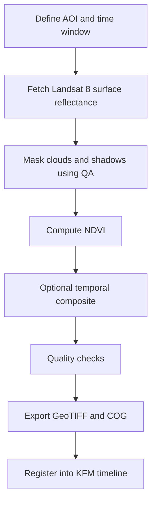

# 🛰️ NDVI • Landsat 8 — Notebooks Lab

> **Experiment ID:** `2026-01-02__ndvi__landsat8`  
> **You are here:** `data/work/experiments/2026-01-02__ndvi__landsat8/notebooks/README.md` 📍  
> **Notebook intent:** exploratory analysis + prototype workflows that can later be promoted into repeatable scripts/pipelines.:contentReference[oaicite:0]{index=0}

---

## 🧭 What this experiment is for

KFM’s remote sensing layer integrates optical satellite imagery (e.g., Landsat) and derived vegetation indices (e.g., NDVI) to help monitor vegetation health and seasonal change (crop growth, poor-vegetation detection, and seasonal patterns).:contentReference[oaicite:1]{index=1}

This notebook folder focuses on **Landsat 8 → NDVI** so we can:
- 🌿 Generate NDVI rasters/composites for a target Area of Interest (AOI)
- ✅ Validate masks + ranges + spatial sanity
- 📦 Export “map-ready” outputs (GeoTIFF/COG + tiles/metadata) for downstream KFM ingestion/visualization:contentReference[oaicite:2]{index=2}

---

## 🗺️ Workflow at a glance



**Why compositing?** Landsat acquisitions can overlap within a period and composites are often built by selecting the “best available” pixel observation within a window (commonly 16-day windows in Landsat-derived workflows).:contentReference[oaicite:3]{index=3}

---

## 🌿 NDVI essentials (definition + Landsat 8 bands)

NDVI is defined as:

\[
NDVI = \frac{\rho_{NIR} - \rho_{RED}}{\rho_{NIR} + \rho_{RED}}
\]

For **Landsat 8**, the common band mapping is:
- **RED** = band **4**
- **NIR** = band **5**:contentReference[oaicite:4]{index=4}

> [!NOTE]
> If you ever mix sensors (e.g., Landsat 5/7 vs 8), you may need a cross-sensor adjustment (some workflows apply a linear transform).:contentReference[oaicite:5]{index=5}

---

## 🧰 Data inputs + preprocessing expectations

### 1) Prefer surface reflectance (SR) products
Landsat **surface reflectance** products are designed to correct for atmospheric + illumination/viewing geometry effects (compared to raw digital numbers).:contentReference[oaicite:6]{index=6}

### 2) Cloud/shadow/water masking via QA flags
Landsat SR commonly includes a **pixel quality flag** (e.g., from CFMask) indicating conditions like clear land, water, snow, cloud, or shadow, which can be used for masking and/or selecting best pixels for composites.:contentReference[oaicite:7]{index=7}

### 3) Typical remote-sensing processing steps (KFM-aligned)
KFM’s processing notes explicitly call out steps such as:
- converting raw imagery to reflectance (calibration / atmospheric correction)
- cloud masking
- mosaicking and compositing (often median across cloud-free observations)
- leveraging cloud-scale compute (e.g., Earth Engine) where appropriate:contentReference[oaicite:8]{index=8}

---

## 🧪 Notebook standards (reproducibility + QA)

These notebooks are allowed to be exploratory — but they must remain **auditable** and **re-runnable**.

Minimum standards (pulled from the project’s protocol guidance):
- ✅ **Automated tests + CI** where applicable, and **manual sanity checks** documented for research/analysis work:contentReference[oaicite:9]{index=9}
- 🎲 **Deterministic outputs** when possible (set seeds; record them):contentReference[oaicite:10]{index=10}
- 🧾 **Logging**: store parameters used + timings + key counts (masked pixels, valid pixels, etc.):contentReference[oaicite:11]{index=11}
- 📓 Notebook hygiene: run cells top-to-bottom, avoid hidden state, and keep a consistent structure (purpose → method → outputs → summary).:contentReference[oaicite:12]{index=12}

Also remember the project’s stance on communication:
> Don’t present a false sense of precision — keep users aware of assumptions and uncertainties.:contentReference[oaicite:13]{index=13}

---

## 🧭 Recommended notebook sequence

> [!TIP]
> If your filenames differ, **keep the order** and update this table so it matches reality.

| Step | Notebook (suggested name) | Goal 🎯 | Key outputs 📦 |
|---:|---|---|---|
| 00 | `00__context__config.ipynb` | AOI, dates, resolution, dataset IDs, export targets | `run_manifest.json` (draft) |
| 01 | `01__aoi__bounds_and_masks.ipynb` | Define AOI + visualize basemap/extent | AOI GeoJSON/SHAPE (optional) |
| 02 | `02__landsat8__fetch_sr.ipynb` | Pull SR imagery, inspect QA bands | sample mosaics, QA previews |
| 03 | `03__ndvi__compute.ipynb` | Compute NDVI + apply mask | NDVI raster (in-memory / preview) |
| 04 | `04__ndvi__composite_and_stats.ipynb` | Composite (optional) + zonal stats | CSV stats + QA plots |
| 05 | `05__export__cog_tiles.ipynb` | Export rasters to “map-ready” formats | COG GeoTIFF + tiles + metadata |

---

## 📦 Outputs (expected locations + naming)

Even if you iterate quickly, keep outputs tidy and predictable.

### Suggested experiment layout (relative to this folder)
```text
🧪 data/work/experiments/2026-01-02__ndvi__landsat8/
├─ 📓 notebooks/
│  └─ README.md  ✅
├─ 📦 outputs/
│  ├─ 🗺️ rasters/        # GeoTIFF/COG
│  ├─ 🧱 tiles/          # XYZ tiles (if produced)
│  ├─ 📊 tables/         # stats CSV/Parquet
│  └─ 🧾 metadata/       # run manifests + provenance
└─ 🧰 scripts/ (optional) # when a workflow graduates from notebook to pipeline
```

### Run manifest (minimum fields)
Create a machine-readable manifest per export (JSON/YAML) containing:
- `experiment_id` (`2026-01-02__ndvi__landsat8`)
- `aoi_name` + `aoi_geometry_source`
- `date_start`, `date_end`
- `source_collection` (exact dataset/collection ID)
- `mask_strategy` (QA bits/classes used)
- `ndvi_formula` + band mapping (RED/NIR)
- `composite_method` (median/best-pixel/etc.)
- `export_projection`, `pixel_size`, `nodata`
- output file list + hashes (optional but ideal)

---

## ✅ QC checklist (don’t skip)

### Quick numeric checks
- NDVI range sanity: values should usually be within **[-1, 1]**.
- `count_valid_pixels` vs `count_masked_pixels` is recorded (and compared across runs).
- Histogram sanity: vegetation-dominant AOIs should show a meaningful positive NDVI mode.

### Visual checks
- Overlay NDVI on true-color or basemap to ensure alignment.
- Spot-check that clouds/shadows are being masked as intended (QA preview layer).:contentReference[oaicite:14]{index=14}

### Optional cross-check
If you aggregate to coarser resolution/time windows, compare against a known 16‑day NDVI product (e.g., MODIS 16‑day composites) as a directional check (not as “ground truth”).:contentReference[oaicite:15]{index=15}

---

## 🧩 KFM integration notes (timeline + tiles)

KFM’s UI expects temporal layers to work with a timeline control where the map view updates as the selected time changes (e.g., swapping layers or using time-enabled services).:contentReference[oaicite:16]{index=16}

For large rasters, the documentation points toward:
- exporting GeoTIFF/COG for storage/analysis
- generating tile pyramids (XYZ) for efficient web delivery:contentReference[oaicite:17]{index=17}

> [!WARNING]
> When publishing an NDVI layer into the timeline, include metadata that clearly states:
> - the compositing window
> - masking rules
> - known limitations (cloud contamination, seasonal effects, sensor gaps)  
> This aligns with the project goal of avoiding false precision and making assumptions visible.:contentReference[oaicite:18]{index=18}

---

## 🧾 Appendix: minimal NDVI snippets (copy/paste)

<details>
<summary><strong>🟨 Earth Engine-style NDVI (pseudo-code)</strong></summary>

```js
// PSEUDO-CODE: adjust collection ID and band names for your chosen Landsat 8 SR dataset
var ndvi = image.expression(
  '(NIR - RED) / (NIR + RED)',
  { NIR: image.select('NIR_BAND'), RED: image.select('RED_BAND') }
);
```

**Band mapping reminder (Landsat 8):** RED=4, NIR=5.:contentReference[oaicite:19]{index=19}
</details>

<details>
<summary><strong>🟦 Python NDVI (array math)</strong></summary>

```python
# PSEUDO-CODE: assumes red, nir are float arrays (already scaled reflectance)
import numpy as np

ndvi = (nir - red) / (nir + red)
ndvi = np.clip(ndvi, -1.0, 1.0)
```
</details>

---

## 📚 Project references (source docs)

- 📘 **Kansas Frontier Matrix (KFM) – Comprehensive Technical Documentation** :contentReference[oaicite:20]{index=20}  
- 🛰️ **Google Earth Engine Applications** :contentReference[oaicite:21]{index=21}  
- 🗺️ **Kansas-Frontier-Matrix — Open-Source Geospatial Historical Mapping Hub Design** :contentReference[oaicite:22]{index=22}  
- 🧪 **Scientific Method / Research / Master Coder Protocol Documentation** :contentReference[oaicite:23]{index=23}  

---

## 🧾 Changelog

- `2026-01-02` 🧪 Experiment folder created (NDVI × Landsat 8)
- `YYYY-MM-DD` ✍️ Update this README when notebooks/exports stabilize

