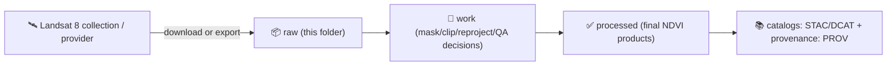

# 🛰️ Raw Inputs — NDVI (Landsat 8) 🌿


> [!IMPORTANT]
> **This folder is a snapshot of the experiment’s “as-acquired” inputs.**  
> Treat everything in `raw/` as **immutable**: don’t “fix”, resample, clip, or rewrite files in-place.  
> If something needs to change, create a **new experiment folder** (new run ID) and link it upstream.

---

## 🔎 What this `raw/` folder is for

This directory contains the **unmodified** (or “first-export”) data artifacts used to compute NDVI from **Landsat 8** for the experiment:

- **Experiment ID:** `2026-01-02__ndvi__landsat8`
- **Index:** NDVI (Normalized Difference Vegetation Index) 🌿
- **Sensor:** Landsat 8 (OLI/TIRS)
- **Role of this folder:** preserve **provenance**, **reproducibility**, and **auditability** of the inputs.

> [!NOTE]
> NDVI is *derived*, but you may still store a **raw export** of NDVI here *if and only if* it is the **direct export artifact** (e.g., from Google Earth Engine) and **has not been locally transformed**.

---

## 🧭 Where this fits in the pipeline



---

## 📦 Expected contents

Use this as a **contract** for what “complete raw inputs” means.

### ✅ Required
- `manifest.json` (or `manifest.yaml`) — **single source of truth** for what was pulled/exported and why  
- `SHA256SUMS` — checksums for all binary assets
- `inventory.csv` (or `inventory.parquet`) — row-per-asset or row-per-scene inventory
- AOI boundary used for export/query (e.g., `aoi.geojson`)  
- Export / download logs (even basic) so we can reconstruct intent

### ➕ Optional but strongly recommended
- A “frozen query” file: `query.json` (date range, cloud filter, dataset ID, bands, etc.)
- A copy of the script/notebook used for export (or a commit hash + path)
- Provider metadata (e.g., Landsat MTL, QA docs) stored alongside the assets

---

## 🗂️ Suggested folder layout (template)

```text
📁 raw/
├── 📄 README.md                       # you are here ✅
├── 📄 manifest.json                   # required ✅
├── 📄 query.json                      # recommended ⭐
├── 📄 inventory.csv                   # required ✅
├── 📄 SHA256SUMS                      # required ✅
├── 📁 aoi/                            # AOI boundary + notes
│   └── 🗺️ aoi.geojson
├── 📁 assets/                         # raw binaries (provider files or first-export)
│   ├── 🛰️ <scene_or_export_id>__SR_B4.tif
│   ├── 🛰️ <scene_or_export_id>__SR_B5.tif
│   ├── 🛰️ <scene_or_export_id>__QA_PIXEL.tif
│   └── 🛰️ <scene_or_export_id>__NDVI.tif   # only if it is a direct export artifact
└── 📁 logs/
    └── 📄 export.log
```

> [!TIP]
> If you must rename provider files for consistency, keep a mapping file:
> `name_map.csv` (provider_name → repo_name) so we never lose provenance.

---

## 🧾 Manifest contract (minimum fields)

Create (or update) `manifest.json` so that anyone can reproduce *exactly* what is in `raw/`.

```json
{
  "experiment_id": "2026-01-02__ndvi__landsat8",
  "stage": "raw",
  "created_utc": "2026-01-02T00:00:00Z",
  "aoi": {
    "file": "aoi/aoi.geojson",
    "crs": "EPSG:4326"
  },
  "source": {
    "platform": "google_earth_engine | usgs | other",
    "collection_id": "LANDSAT/LC08/C02/T1_L2",
    "processing_level": "L2 (SR) | TOA",
    "notes": "Record the exact dataset/collection + any provider-side processing."
  },
  "filters": {
    "date_start": "YYYY-MM-DD",
    "date_end": "YYYY-MM-DD",
    "max_cloud_cover_pct": 20
  },
  "bands": ["SR_B4", "SR_B5", "QA_PIXEL"],
  "derivatives_in_raw": {
    "allow_first_export_only": true,
    "notes": "If NDVI GeoTIFF is stored here, it must be the direct export (no local transforms)."
  },
  "integrity": {
    "checksum_file": "SHA256SUMS",
    "checksum_algo": "sha256"
  }
}
```

---

## 🌿 NDVI definition (so we never drift)

**NDVI = (NIR − Red) / (NIR + Red)**

For Landsat 8 (OLI):
- **Red** band is **B4** (or `SR_B4` for surface reflectance)
- **NIR** band is **B5** (or `SR_B5` for surface reflectance)

> [!WARNING]
> If you see NDVI values wildly outside **[-1, 1]**, that usually means:
> - reflectance scaling wasn’t applied (common with some SR products), or
> - you exported integer DN bands without converting to reflectance, or
> - NoData/Fill wasn’t masked correctly.

---

## ☁️ QA / cloud masking notes (record what you did)

If you are using **Landsat Collection 2 Level 2 SR**, the `QA_PIXEL` band is commonly used to mask:
- Fill
- Dilated Cloud
- Cirrus
- Cloud
- Cloud Shadow
- Snow

> [!NOTE]
> The exact bit layout and your masking decisions must be documented in either:
> - `query.json` (preferred), or
> - `manifest.json` under a `qa_mask` section, or
> - `logs/export.log` (minimum)

### (Optional) Store the mask decision directly
Add something like this to `manifest.json`:

```json
{
  "qa_mask": {
    "qa_band": "QA_PIXEL",
    "masked_conditions": ["fill", "dilated_cloud", "cirrus", "cloud", "cloud_shadow", "snow"],
    "notes": "Document exact bit logic if using bitwise operations."
  }
}
```

---

## 🧪 Integrity checks

### 1) Verify checksums
From this directory:

```bash
sha256sum -c SHA256SUMS
```

### 2) Spot-check asset sanity
- Confirm expected band files exist for each scene/export ID
- Confirm CRS + pixel size match expectations (record expected in manifest)
- Confirm NoData is consistent (and not silently changing between runs)

---

## 🚫 What does *not* belong in `raw/`

Keep `raw/` clean and auditable:

- ❌ clipped/reprojected rasters
- ❌ mosaics/composites that were assembled locally
- ❌ cloud masks created locally (unless they are stored as *additional artifacts* and clearly labeled)
- ❌ “fixed” versions of raw assets (those go in `work/` with a clear process trail)

---

## 🔁 How to reproduce this raw snapshot (fill this in)

> [!TIP]
> Add the **exact** command(s), script path(s), and commit hash(es) used to produce the contents of `raw/`.

```text
SOURCE PLATFORM:
  - e.g., Google Earth Engine

DATASET / COLLECTION:
  - e.g., LANDSAT/LC08/C02/T1_L2

DATE RANGE:
  - YYYY-MM-DD → YYYY-MM-DD

AOI:
  - aoi/aoi.geojson

EXPORT SETTINGS:
  - scale: <meters>
  - crs: <EPSG:XXXX>
  - file format: GeoTIFF
  - nodata: <value>

CODE REFERENCE:
  - repo path: src/pipelines/<...>
  - git commit: <hash>
```

---

## 📚 Related docs (repo-level)

- `docs/MASTER_GUIDE_v13.md` — canonical structure + conventions
- `docs/standards/` — repo + data governance standards (STAC/DCAT/PROV profiles)
- `mcp/experiments/` — experiment notebooks / model cards / run records (if used)

---

## 🧷 Changelog (raw-only)

Because `raw/` should be immutable, this changelog should only record **additions** (or corrections via new experiment IDs).

- 2026-01-02: Initial raw snapshot created for `2026-01-02__ndvi__landsat8`

