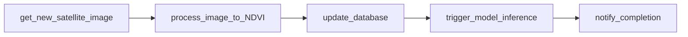

# 🌿 NDVI Results (Landsat 8) — `2026-01-02`


-1f6feb)


> 📌 **Purpose:** This folder contains the **outputs** (rasters + summaries + QC) produced by the run `2026-01-02__ndvi__landsat8`.  
> 🧾 **Contract:** If you add/rename outputs, update the **Manifest** + **Run metadata** below.

---

## 🧭 Quick links
- ⬆️ **Experiment root:** `../`
- 📜 **Protocol (if present):** `../protocol.md`
- 🧰 **Code (if present):** `../src/`
- 🗃️ **Inputs (if present):** `../data/`

---

## 🧾 Run metadata (fill in ✅)
| Key | Value |
|---|---|
| Experiment ID | `2026-01-02__ndvi__landsat8` |
| Run date | `2026-01-02` |
| Sensor | Landsat 8 (OLI) 🛰️ |
| Index | NDVI 🌿 |
| Spatial resolution | ~30 m 🧩 |
| Area of interest (AOI) | **TODO** |
| Source collection/product | **TODO** (e.g., `LANDSAT/LC08/C02/T1_L2`) |
| Temporal window | **TODO** (single day vs multi-day composite) |
| Composite method | **TODO** (`first` / `mosaic` / `median` / etc.) |
| Cloud / QA masking | **TODO** |
| Output CRS | **TODO** (e.g., `EPSG:4326` / `EPSG:3857`) |
| NoData value | **TODO** |
| Run ID / Job ID | **TODO** (Airflow run id, CLI run id, etc.) |
| Code reference | **TODO** (git commit / tag) |

---

## 📦 Artifacts (Manifest)
> ✅ Check items that exist. Add rows for additional artifacts.

### Core outputs
- [ ] `2026-01-02__ndvi__landsat8__ndvi.tif` — NDVI raster (GeoTIFF)
- [ ] `2026-01-02__ndvi__landsat8__ndvi.cog.tif` — NDVI raster (COG recommended for web/streaming)
- [ ] `2026-01-02__ndvi__landsat8__metadata.json` — lineage + parameters + provenance
- [ ] `2026-01-02__ndvi__landsat8__zonal_stats.csv` — per-field / per-zone summaries (optional)

### QA / visualization
- [ ] `2026-01-02__ndvi__landsat8__quicklook.png` — quick visual sanity-check
- [ ] `2026-01-02__ndvi__landsat8__hist.png` — NDVI distribution plot
- [ ] `2026-01-02__ndvi__landsat8__qc.md` — anomalies, decisions, known issues

### Optional web-serving artifacts
- [ ] `tiles/` — XYZ/WMTS tile pyramid (if generated)
- [ ] `legend.json` / `style.json` — symbology hints for frontends

---

## 🗂️ Folder snapshot (example)
```text
🧪📦 results/                                                # experiment outputs (rasters + tables + QA)
├── 🧾📘 README.md                                           # you are here ✅ — results index + run notes
├── 🗺️🌿 2026-01-02__ndvi__landsat8__ndvi.cog.tif            # NDVI raster (Cloud-Optimized GeoTIFF, ~30m)
├── 🧬🧾 2026-01-02__ndvi__landsat8__metadata.json            # provenance + parameters + lineage (inputs/processing)
├── 📊🧮 2026-01-02__ndvi__landsat8__zonal_stats.csv          # per-zone/field NDVI summaries (mean/pXX/count, etc.)
├── 🖼️🔎 2026-01-02__ndvi__landsat8__quicklook.png            # quick visual sanity-check (preview/thumbnail)
└── 🧪✅ qc/                                                  # quality control evidence + decisions
    └── 🧠📝 2026-01-02__ndvi__landsat8__qc.md                 # QC checklist + anomalies + acceptance notes
```

---

## 🧮 NDVI definition (what we computed)
NDVI is defined as:

`NDVI = (NIR - Red) / (NIR + Red)`

**Band mapping (Landsat 8):**
- 🔴 **Red:** Band 4  
- 🟣 **NIR:** Band 5

> ⚠️ If you used a *Surface Reflectance* product in Earth Engine, the band names are often `SR_B4` (red) and `SR_B5` (NIR).  
> ✅ Always record the exact band names used in `__metadata.json`.

---

## 🧼 Preprocessing assumptions (document what you did)
Fill these in (or link to `../protocol.md`):

- ☁️ **Cloud mask method:** TODO (QA band / Fmask / simpleCloudScore / etc.)
- 🌫️ **Atmospheric correction:** TODO (provider ARD vs custom)
- 🧩 **Composite:** TODO (single scene vs median composite, etc.)
- 🌊 **Water masking:** TODO (applied? how?)
- 🧮 **Scaling:** TODO (reflectance scaling applied? where?)

---

## ✅ QC checklist (fast sanity checks)
- [ ] NDVI values are within **[-1, 1]**
- [ ] No obvious seams/striping from mosaicking
- [ ] Clouds/shadows aren’t showing up as high-NDVI vegetation
- [ ] NoData is set consistently (and not plotted as valid NDVI)
- [ ] Quicklook aligns with AOI + seasonality expectations
- [ ] Zonal stats have stable join keys (e.g., `field_id`) and correct units

---

## 🔎 Quick inspection commands
### Raster stats (GDAL)
```bash
gdalinfo -stats 2026-01-02__ndvi__landsat8__ndvi.cog.tif
```

### Python quick check (min/max)
```python
import rasterio

path = "2026-01-02__ndvi__landsat8__ndvi.cog.tif"

with rasterio.open(path) as src:
    ndvi = src.read(1, masked=True)

print("min:", float(ndvi.min()))
print("max:", float(ndvi.max()))
print("nodata:", src.nodata)
print("crs:", src.crs)
print("shape:", ndvi.shape)
```

---

## 🧾 Data lineage template (copy into `__metadata.json`)
```yaml
experiment_id: 2026-01-02__ndvi__landsat8
run_timestamp_utc: "TODO"
operator: "TODO"              # user / scheduler / CI
code_ref:
  git_commit: "TODO"
  pipeline_version: "TODO"
inputs:
  collection: "TODO"          # e.g., LANDSAT/LC08/C02/T1_L2
  scene_ids: ["TODO"]
  date_range: ["2026-01-02", "2026-01-02"]
  aoi: "TODO"                 # name + WKT/GeoJSON ref if available
processing:
  index: NDVI
  bands:
    red: "TODO"               # B4 or SR_B4
    nir: "TODO"               # B5 or SR_B5
  composite: "TODO"
  cloud_mask: "TODO"
  scale_m: 30
outputs:
  raster: "2026-01-02__ndvi__landsat8__ndvi.cog.tif"
  zonal_stats: "2026-01-02__ndvi__landsat8__zonal_stats.csv"
  nodata: "TODO"
notes:
  known_issues: []
```

---

## 🧩 Pipeline context (typical)
<details>
<summary>🛠️ Typical ingest flow (for KFM-style pipelines)</summary>



**Where this run’s outputs commonly end up:**
- 📈 time-series tables (per field / per region)
- 🗺️ map tile services (for timeline-enabled frontends)
- 🤖 downstream inference pipelines (optional)

</details>

---

## 🧪 Repro snippets (optional but handy)
<details>
<summary>🌍 Earth Engine sketch (NDVI via normalizedDifference)</summary>

> This is a **template**. Replace `aoi` + date filters + masking/composite to match the run.

```javascript
// Example only — keep the exact code used in ../src or ../protocol.md
var aoi = /* TODO: geometry */;
var ndvi = ee.ImageCollection('LANDSAT/LC08/C02/T1_L2')
  .filterBounds(aoi)
  .filterDate('2026-01-02', '2026-01-03')
  .median()
  .normalizedDifference(['SR_B5', 'SR_B4'])
  .rename('NDVI')
  .clip(aoi);

// Map.addLayer(ndvi, {min: -1, max: 1}, 'NDVI');
```

</details>

<details>
<summary>🗺️ Raster packaging tips (COG + overviews)</summary>

If you’re serving this raster in a web map, consider:
- ✅ tiling + internal overviews (pyramids)
- ✅ consistent NoData
- ✅ cloud-optimized layout (COG)

```bash
# Example overview build (adjust levels as needed)
gdaladdo -r average 2026-01-02__ndvi__landsat8__ndvi.cog.tif 2 4 8 16 32
```

</details>

---

## 📝 Change log
- **2026-01-02** — initial results created.

