<!-- File: data/work/experiments/2026-01-02__ndvi__landsat8/src/README.md -->

# 🌿 NDVI — Landsat 8 (Experiment: `2026-01-02__ndvi__landsat8`)


> [!NOTE]
> This README lives in `src/` 🧩 and focuses on **implementation details + run instructions**.  
> Keep higher-level experiment context (hypothesis, results, write-up) in the experiment folder root (`../README.md`) if/when it exists.

---

## 🎯 What this experiment does

Compute **NDVI (Normalized Difference Vegetation Index)** from **Landsat 8** imagery for a chosen ROI (region of interest) and export the results (typically as GeoTIFF). NDVI is a standard vegetation “greenness/health” proxy and is commonly produced at scale using **Google Earth Engine (GEE)** workflows. :contentReference[oaicite:0]{index=0}:contentReference[oaicite:1]{index=1}

---

## 🧾 Experiment card

| Field | Value |
|---|---|
| 🆔 Experiment ID | `2026-01-02__ndvi__landsat8` |
| 🗓️ Run date | `2026-01-02` |
| 🛰️ Sensor | Landsat 8 (30 m, ~16-day revisit):contentReference[oaicite:2]{index=2} |
| 🧠 Index | NDVI (range ≈ -1 … 1):contentReference[oaicite:3]{index=3} |
| ☁️ Compute | Google Earth Engine (recommended):contentReference[oaicite:4]{index=4} |
| 🧱 Output type | Raster NDVI + optional zonal stats |

---

## 🧠 NDVI refresher (so we’re consistent)

NDVI is a normalized difference between near-infrared and red reflectance:

\[
\text{NDVI} = \frac{NIR - RED}{NIR + RED}
\]

Typical interpretation:
- ✅ Dense green vegetation often trends high (≈ **0.8–0.9**)  
- 🟦 Water often trends low (near **-1**)  
- 🟫 Bare ground tends toward **~0** (context-dependent):contentReference[oaicite:5]{index=5}

---

## 🧱 Data source (GEE)

**Primary collection (Landsat 8 Level-2):**
- `LANDSAT/LC08/C02/T1_L2`:contentReference[oaicite:6]{index=6}

**Core bands (conceptual):**
- `RED` and `NIR` (often renamed to human-friendly band names in workflows):contentReference[oaicite:7]{index=7}

**Cloud/quality masking:**
- Use the `QA_PIXEL` bitmask (bit-based flags). The “clear” concept is derived from QA bits; a common pattern is checking the **clear** bit and masking out anything non-clear.:contentReference[oaicite:8]{index=8}:contentReference[oaicite:9]{index=9}

---

## 🧪 Pipeline overview

```mermaid
flowchart LR
  A["🗺 ROI + 📆 Date Range"] --> B["🛰 Load Landsat 8 L2 (GEE)"]
  B --> C["☁ Mask QA_PIXEL (clear pixels)"]
  C --> D["🌿 Compute NDVI (NIR, RED)"]
  D --> E["🧩 Composite (median/max NDVI)"]
  E --> F["📦 Export GeoTIFF + COG"]
  E --> G["📊 Optional: Zonal stats"]
  F --> H["📁 ../results (artifacts)"]
  G --> H
```



---

## 📁 `src/` layout (recommended)

Keep this folder “code-only” 🧰 and treat data/results as sibling folders (no giant rasters checked into `src/`).

```text
📦 2026-01-02__ndvi__landsat8/
├─ 📂 src/
│  ├─ 📄 README.md  👈 you are here
│  ├─ 🧪 ndvi_l8_gee.js         # (optional) Earth Engine Code Editor script
│  ├─ 🐍 ndvi_l8_export.py      # (optional) Python wrapper for ee export jobs
│  ├─ ⚙️ params.yaml            # run config (ROI, dates, export settings)
│  └─ 🧾 runbook.md             # operator notes / troubleshooting
├─ 📂 data/                     # raw inputs / ROI files (shp/geojson), if applicable
└─ 📂 results/                  # GeoTIFF exports, stats CSVs, thumbnails, metadata
```

This “experiment capsule” structure aligns with the project’s experiment tracking guidance (README + src + results), making it easy to reproduce and audit later.:contentReference[oaicite:10]{index=10}

---

## 🚀 How to run (two supported modes)

### Mode A — Earth Engine Code Editor (fastest 🏎️)

1) Create `src/ndvi_l8_gee.js`
2) Define:
   - ROI (polygon or uploaded shape)
   - Date range around the experiment date
3) Mask clouds using `QA_PIXEL`
4) Compute NDVI using either:
   - **band math**, or
   - `normalizedDifference([NIR, RED])` (order matters!):contentReference[oaicite:11]{index=11}
5) Export as GeoTIFF

> [!TIP]
> ROI is commonly defined as an uploaded shapefile or drawn polygon, and exports are often produced as GeoTIFF on demand in GEE-based NDVI workflows.:contentReference[oaicite:12]{index=12}

**Minimal NDVI pattern (pseudo-code; adapt to your band naming):**
```js
// 1) load collection
var l8 = ee.ImageCollection('LANDSAT/LC08/C02/T1_L2');

// 2) filter by ROI/time
var coll = l8.filterBounds(roi).filterDate(start, end);

// 3) cloud mask (QA_PIXEL "clear" concept)
function maskClear(img) {
  var clear = img.select('QA_PIXEL').bitwiseAnd(1 << 6).neq(0); // bit 6 (clear)
  return img.updateMask(clear);
}

// 4) NDVI
function addNdvi(img) {
  var ndvi = img.normalizedDifference(['NIR', 'RED']).rename('NDVI');
  return img.addBands(ndvi);
}

var ndviComp = coll
  .map(maskClear)
  .map(addNdvi)
  .select('NDVI')
  .median()
  .clip(roi);

// 5) export
Export.image.toDrive({
  image: ndviComp,
  description: 'ndvi__landsat8__2026-01-02',
  region: roi,
  scale: 30,
  fileFormat: 'GeoTIFF'
});
```

---

### Mode B — Python wrapper (automation-friendly 🤖)

Use this when you want:
- parameterized runs (`params.yaml`)
- consistent output naming
- repeatable batch jobs

**What to log each run (minimum):**
- ROI identifier + geometry source
- date range
- cloud mask strategy
- compositing strategy
- export settings (scale, CRS, region, maxPixels/bestEffort decisions)
- code version (git commit) + environment info

Snapshotting configs and environment details is explicitly recommended so future readers can recover the exact state of an experiment run.:contentReference[oaicite:13]{index=13}

---

## 📦 Outputs (recommended naming)

Place outputs in `../results/` (not in `src/`):

- `results/ndvi__landsat8__2026-01-02__<roi_slug>.tif`
- `results/ndvi__landsat8__2026-01-02__<roi_slug>__stats.csv` (optional)
- `results/ndvi__landsat8__2026-01-02__run.json` (parameters + provenance)

---

## ✅ QA / sanity checks

Use quick checks before calling results “done”:

- 🔍 **Pixel inspection**: sample known vegetation vs non-vegetation areas; NDVI should reflect expectations (veg higher, water lower).:contentReference[oaicite:14]{index=14}
- 🧪 **Band order**: if results look inverted, confirm `normalizedDifference([NIR, RED])` order.:contentReference[oaicite:15]{index=15}
- ☁️ **Mask quality**: verify clouds/shadows are not leaking through (QA masking).:contentReference[oaicite:16]{index=16}
- 🗺️ **Spatial alignment**: ROI boundary matches the exported raster footprint.

> [!WARNING]
> If you run reductions/statistics over large regions and hit “Too many pixels”, adjust `maxPixels`, increase `scale`, set `bestEffort: true`, or reduce region size (common in GEE).:contentReference[oaicite:17]{index=17}

---

## 🧩 How this fits KFM (architecture-friendly)

In KFM terms, treat:
- **NDVI math + compositing rules** as “use case / application logic”
- **Earth Engine calls + exports** as “infrastructure/adapters”

This matches the project’s layered separation guidance (“talk outwards through interfaces”, keep external details swappable).:contentReference[oaicite:18]{index=18}

---

## 🧷 TODO checklist (finish this experiment cleanly)

- [ ] Add `params.yaml` (ROI, dates, export naming)
- [ ] Implement `ndvi_l8_gee.js` and/or `ndvi_l8_export.py`
- [ ] Export NDVI GeoTIFF to `../results/`
- [ ] Add `run.json` provenance snapshot (code hash, params, timestamp)
- [ ] Add quicklook PNG(s) for sanity review
- [ ] Document any deviations (e.g., different mask rules, compositing window)

---

## 📚 Sources used (project files)

> [!NOTE]
> The following are **project references** used to align this README with established KFM + GEE practices.

- 📘 Cloud-Based Remote Sensing with Google Earth Engine — Fundamentals and Applications :contentReference[oaicite:19]{index=19}  
  - NDVI definition, range, and the normalized difference pattern:contentReference[oaicite:20]{index=20}  
  - `normalizedDifference` usage + order sensitivity:contentReference[oaicite:21]{index=21}  
  - Landsat 8 L2 collection ID + QA_PIXEL masking bits:contentReference[oaicite:22]{index=22}:contentReference[oaicite:23]{index=23}:contentReference[oaicite:24]{index=24}

- 📗 Google Earth Engine Applications :contentReference[oaicite:25]{index=25}  
  - ROI definition options and GeoTIFF-style NDVI composite production via GEE workflows:contentReference[oaicite:26]{index=26}  
  - NDVI context and Landsat-scale NDVI product framing:contentReference[oaicite:27]{index=27}

- 📙 Kansas Frontier Matrix (KFM) – Comprehensive Technical Documentation :contentReference[oaicite:28]{index=28}  
  - Remote sensing sources (Landsat ~30 m, ~16-day) and NDVI use case framing:contentReference[oaicite:29]{index=29}  
  - Architecture separation + interface-driven edges:contentReference[oaicite:30]{index=30}

- 📓 Scientific Method _ Research _ Master Coder Protocol Documentation :contentReference[oaicite:31]{index=31}  
  - Experiment folder encapsulation pattern (README + src + results):contentReference[oaicite:32]{index=32}  
  - Configuration + snapshotting guidance for reproducibility:contentReference[oaicite:33]{index=33}

