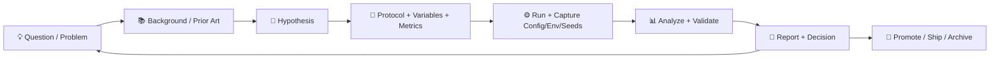

# 🧪 Experiments Lab — `data/work/experiments`


> [!NOTE]
> This folder is the **electronic lab notebook + artifact vault** for *working* experiments: geospatial pipelines, ML training runs, statistical studies, simulations, and prototypes.  
> The goal is simple: **anyone can rerun (or audit) any result** with minimal guessing.

---

## 🧭 What belongs here?

✅ **YES (belongs in `data/work/experiments`)**
- 🧪 Experiment folders (protocol + code + configs + outputs + report)
- 📊 EDA notebooks with clear narrative + conclusions
- 🧱 Pipeline trials (new ETL stages, new feature engineering, new raster/vector processing)
- 🤖 Model training/evaluation runs (with parameters + metrics + seeds + environment snapshot)
- 🌎 GIS/remote sensing processing trials (COG/GeoJSON/tile generation, validation checks)
- 🛰️ Simulation runs + calibration/validation attempts + uncertainty notes

🚫 **NO (belongs elsewhere)**
- 🔒 **Raw source downloads** that should be immutable (prefer `data/raw/` or an external store + pointer)
- 🧾 Long-term “final” documentation (prefer `/docs/` or `/mcp/` if your repo uses it)
- 🧨 Secrets, API keys, private credentials (never commit—use env vars/secrets managers)
- 🐘 Massive artifacts committed directly to Git (use DVC / LFS / object storage)

> [!TIP]
> If a file is too big to comfortably diff, it’s probably too big for Git. Track it (or its hash + location) instead.

---

## 🧷 Quick Start (new experiment in 5 minutes)

1) **Create a new experiment folder** using the naming convention below  
2) **Write the protocol first** (question → hypothesis → method)  
3) **Run it** (capture config + environment + seeds)  
4) **Write a short report** (what happened + why it matters)  
5) **Update the registry** (so we can find it later)

---

## 🏷️ Naming & ID conventions

### Experiment IDs
Use a predictable, sortable ID:

- `EXP-YYYY-MM-DD_<short-slug>`  
  Example: `EXP-2026-01-04_drought-nowcast-baseline`

Optional domain prefixes (helpful for filtering):
- `EXP-GIS-...` 🌎
- `EXP-ML-...` 🤖
- `EXP-SIM-...` 🛰️
- `EXP-STAT-...` 📈

### Run IDs (inside an experiment)
Use timestamped run folders to avoid collisions:

- `runs/run-YYYYMMDD-HHMMSSZ`  
  Example: `runs/run-20260104-214233Z`

---

## 🗂️ Recommended directory layout

```text
data/work/experiments/
├─ 🧪📦 experiments/                             # experiment workspace root (you are here)
├─ 🧰🧾 templates/                               # copy/paste scaffolds for consistent runs
│  ├─ 🧾🧪 experiment_report_template.md          # report.md starter: goal → method → results → decision
│  ├─ 🧷📋 run_manifest_template.json             # run “flight recorder” (inputs/params/env/hashes)
│  └─ 🎛️🧬 params_template.yaml                  # params/hyperparams/CLI snapshot template
├─ 🗂️🧾 registry/                                # indexes so experiments are discoverable
│  ├─ 🧭🗒️ experiments_index.md                  # human-friendly index (browse + links)
│  └─ 📊🧾 experiments_registry.csv              # machine-friendly registry (filters/sorts/ingest)
└─ 🧪🧷 EXP-YYYY-MM-DD_<slug>/                    # one experiment = protocol + runs + report
   ├─ 📄✨ README.md                              # tl;dr + links to protocol/report/runs/artifacts
   ├─ 🧾🧠 protocol.md                            # written BEFORE running (hypothesis + metrics)
   ├─ 📝📊 report.md                              # written AFTER running (results + decision)
   ├─ 🎛️🧬 params/                                # configs, hyperparams, CLI args snapshots
   │  └─ 🎛️📄 params.yaml                         # pinned params for reproducibility
   ├─ 🧩🧠 src/                                   # scripts or small runnable modules
   ├─ 📓🔬 notebooks/                             # EDA / prototypes (narrative required)
   ├─ 🗃️🧪 data/                                  # pointers, small samples, or DVC-tracked artifacts
   ├─ 🏃‍♂️📦 runs/                                 # execution history (immutable-ish)
   │  └─ 🕒🏃 run-YYYYMMDD-HHMMSSZ/                # a single run instance
   │     ├─ 🧷🧾 manifest.json                     # provenance + env + inputs + outputs (hashes)
   │     ├─ 📟📄 stdout.log                        # console output / progress
   │     ├─ 📈🧾 metrics.json                      # metrics + eval summaries
   │     └─ 🧰🖼️ artifacts/                        # plots, tiles, model weights (track smartly)
   └─ 🗒️🧭 notes/                                 # scratch notes, review comments, decisions
```

> [!IMPORTANT]
> Every experiment must have **protocol.md** + **report.md**. If it’s not written down, it didn’t happen. 🧾

---

## 🔁 Experiment lifecycle



---

## ✅ Minimum “Experiment Record” (Definition of Done)

Use this checklist before calling an experiment “done”:

- [ ] **Question** is explicit (what decision will this inform?)
- [ ] **Hypothesis** is testable (expected direction or outcome)
- [ ] **Method** is reproducible (steps, variables, controls/baselines)
- [ ] **Data provenance** is recorded (source, version/hash, transformations)
- [ ] **Code version** is pinned (git commit hash or tag)
- [ ] **Environment** is captured (requirements/conda/Docker + hardware notes)
- [ ] **Seeds** are recorded (and set for deterministic runs where possible)
- [ ] **Metrics** are defined *before* running (what counts as “better”?)
- [ ] **Results** include uncertainty where relevant (CI, error bars, UQ notes)
- [ ] **Validation** includes at least one sanity check or replication attempt
- [ ] **Report** states conclusion + limitations + next steps

---

## 🧾 Protocol-first rule (what “protocol.md” must contain)

A protocol is a **pre-registered plan** for what you are about to do.

### Required sections
- 🎯 Objective / Decision it supports
- 🔍 Background & assumptions
- 🧠 Hypothesis (or expected outcome)
- 🧰 Materials/tools (datasets, libraries, services)
- 🧪 Method (steps + variables + controls/baselines)
- 📏 Metrics (primary + secondary)
- 🧯 Risks & failure modes (including data quality concerns)
- 🧷 Repro notes (seed plan, compute plan, environment plan)

---

## 🧷 Run manifest (what “manifest.json” must capture)

Every `runs/<run-id>/manifest.json` should include:

- `experiment_id`, `run_id`
- `timestamp_utc`
- `git_commit`
- `data_inputs` (dataset IDs/paths + hashes or DVC refs)
- `params` (inline or linked)
- `environment` (python version, libs, container image hash, GPU/CPU)
- `seeds`
- `outputs` (paths + hashes)
- `notes` (what was different / why this run exists)

> [!TIP]
> Treat `manifest.json` like a **flight recorder** ✈️ — it’s what you’ll need when something breaks or a result gets questioned.

---

## 📊 Statistical hygiene (avoid fooling ourselves)

> [!WARNING]
> “Too perfect” results are a smell. Optional stopping, selective reporting, and uncontrolled multiple comparisons can make noise look like signal.

Basic rules:
- ✅ Decide metrics and stopping rules **before** running
- ✅ Prefer effect sizes + confidence intervals, not just p-values
- ✅ Correct for multiple comparisons when exploring many hypotheses
- ✅ Record *all* runs (including “failed” / negative results)
- ✅ If power/sample-size matters, estimate it early
- ✅ If it’s observational, explicitly address confounders (stratify/regress/match)

---

## 🌎 GIS / Remote Sensing experiment notes

For geospatial processing experiments (COGs, GeoJSON, tiles, time layers):
- Always record: CRS, resolution, bounding boxes, temporal coverage
- Store a **catalog/metadata** entry (source URL/archive ref + processing steps)
- Validate alignment (spot check control points / overlay checks)
- Keep conversions scripted (not “click ops only”)

Artifacts may include:
- 🗺️ COGs, vector layers, generated tiles, KML/KMZ exports
- 📌 Validation screenshots or checksums + “looks-right” notes

---

## 🤖 ML experiment notes

For training runs:
- Log: dataset split strategy, leakage checks, features, hyperparameters
- Keep baseline models (so we know what “better” means)
- Save metrics per epoch/step if relevant, but summarize key outcomes
- Create **model cards** for models that might be promoted/deployed

Suggested run artifacts:
- `metrics.json`, `confusion_matrix.png`, `roc.png`
- `model.pkl` / `model.pt` / `onnx/` (track with DVC/LFS as needed)

---

## 🛰️ Simulation experiment notes

For simulation & modeling:
- Record physical assumptions, parameter ranges, and calibration steps
- Include verification/validation notes (what did we compare against?)
- Track uncertainty (inputs → outputs), especially where decisions depend on risk
- When hardware/software changes: do a **back-to-back** comparison run if feasible

---

## 🧑‍🤝‍🧑 Ethics & human-centered guardrails

Experiments should preserve:
- 🧭 Human agency & oversight (humans remain decision-makers)
- 🔎 Transparency (assumptions + uncertainty are visible)
- ⚖️ Fairness / non-discrimination where models touch people
- 🔐 Privacy & data governance for sensitive layers

> [!NOTE]
> If your experiment touches sensitive or person-adjacent data, add a short “Ethics & Risk” section to the report with mitigations.

---

## 🧰 Handy command-line snippets (safe + useful)

```bash
# Find experiments
ls -1 data/work/experiments | grep "^EXP-"

# Search for an experiment id across reports
grep -R "EXP-" -n data/work/experiments 2>/dev/null | head

# List biggest folders (helps avoid committing huge artifacts)
du -h -d 2 data/work/experiments | sort -h | tail -n 20

# Find manifests and quickly inspect them (requires jq)
find data/work/experiments -name manifest.json -print
# jq '.experiment_id, .run_id, .git_commit' path/to/manifest.json
```

---

## 🧾 Templates

### 1) Experiment report template (`templates/experiment_report_template.md`)

Copy/paste into `report.md`:

```markdown
---
doc_kind: experiment-report
experiment_id: EXP-YYYY-MM-DD_slug
status: draft
owners: [ "TBD" ]
created: YYYY-MM-DD
updated: YYYY-MM-DD
git_commit: "TBD"
data:
  inputs:
    - dataset_id: "TBD"
      version: "TBD"
      location: "TBD"
  outputs:
    - artifact: "TBD"
      location: "TBD"
repro:
  seeds: [1337]
  env:
    method: "conda|pip|docker"
    lockfile: "TBD"
ethics:
  sensitive_data: false
  care_label: "TBD"
---

# 🧪 EXP-YYYY-MM-DD_slug — Report

## 📘 Overview
- **Goal:**  
- **Decision this informs:**  
- **Primary metric:**  
- **Baseline:**  

## ❓ Question
## 🧠 Hypothesis
## 🧰 Method
## 📊 Results
## ✅ Validation & Sanity Checks
## 🧩 Interpretation (What it means)
## ⚠️ Limitations / Risks
## 🔁 Next Steps
## 🔗 Links
- Runs:
- Notebooks:
- Artifacts:
```

### 2) Run manifest template (`templates/run_manifest_template.json`)

```json
{
  "experiment_id": "EXP-YYYY-MM-DD_slug",
  "run_id": "run-YYYYMMDD-HHMMSSZ",
  "timestamp_utc": "YYYY-MM-DDTHH:MM:SSZ",
  "git_commit": "TBD",
  "data_inputs": [
    { "dataset_id": "TBD", "version": "TBD", "path": "TBD", "hash": "TBD" }
  ],
  "params_path": "params/params.yaml",
  "environment": {
    "python": "TBD",
    "os": "TBD",
    "container_image": "TBD",
    "cpu": "TBD",
    "gpu": "TBD"
  },
  "seeds": [1337],
  "outputs": [
    { "path": "runs/<run-id>/artifacts", "hash": "TBD" }
  ],
  "notes": "What changed / why this run exists"
}
```

---

## 📚 Reference shelf (project docs that inspired this folder)

- 📘 Master protocol for scientific method + documentation rigor  
- 🧠 KFM technical reference (architecture, ML, GIS, validation, ethics)  
- 🛰️ Scientific modeling & simulation rigor (validation, UQ, workflow discipline)  
- 📉 Statistical “gotchas” (publication bias / optional stopping / multiple comparisons)  
- 🧑‍⚖️ Digital humanism & human-centered AI guardrails  

---

## 🧹 Housekeeping rules (keep the lab usable)

- Keep each experiment folder readable (a new person should understand it in <10 minutes)
- Prefer small scripts + automatable pipelines over “mystery notebooks”
- If an experiment becomes a feature, **promote it** into the main system (and leave a link)
- Periodically archive/purge stale runs (but never lose the report + manifest trail)

---

### ✅ If you only remember 3 things…

1) **Protocol first** 🧾  
2) **Manifests always** 🧷  
3) **Repro or it didn’t happen** 🔁

