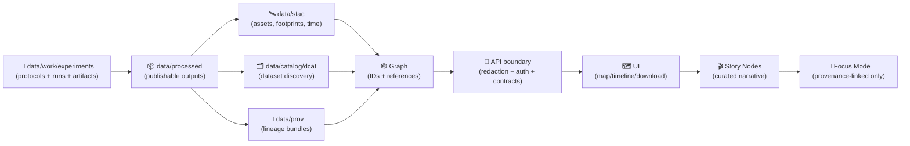

<div align="center">

# 🧪 Experiments Lab — `data/work/experiments/`


**Electronic lab notebook + artifact vault** for KFM experiments: GIS/remote sensing, statistics & ML, simulations, graph/ontology trials, and UI prototypes.  
Goal: **any result can be rerun (or audited) with minimal guessing** 🔁🧾

</div>

---

## 🚀 Quick links

- 🧰 Workbench root → [`../README.md`](../README.md)
- 🗂️ Registry → [`./_registry/`](./_registry/)
- 🧾 Templates → [`./_templates/`](./_templates/)
- 📦 Promotion targets:
  - `data/processed/` → [`../../processed/`](../../processed/)
  - STAC → [`../../stac/`](../../stac/)
  - DCAT → [`../../catalog/dcat/`](../../catalog/dcat/)
  - PROV → [`../../prov/`](../../prov/)
- 🔐 Governance:
  - Root governance → [`../../../docs/governance/ROOT_GOVERNANCE.md`](../../../docs/governance/ROOT_GOVERNANCE.md)
  - Ethics → [`../../../docs/governance/ETHICS.md`](../../../docs/governance/ETHICS.md)
  - Sovereignty → [`../../../docs/governance/SOVEREIGNTY.md`](../../../docs/governance/SOVEREIGNTY.md)
- 🔐 Security policy → [`../../../SECURITY.md`](../../../SECURITY.md) *(or `.github/SECURITY.md` depending on repo convention)*

> [!IMPORTANT]
> Experiments are allowed to be **messy** 🧪  
> Experiments are **not** allowed to be **mysterious** 🕵️‍♀️  
> If it can’t be rerun, it doesn’t count.

---

<details>
<summary><strong>📌 Table of contents</strong></summary>

- [🎯 What belongs here (and what does not)](#-what-belongs-here-and-what-does-not)
- [🧭 KFM invariants (non-negotiable)](#-kfm-invariants-non-negotiable)
- [🏷️ IDs & naming (experiments, runs, promotion dataset IDs)](#️-ids--naming-experiments-runs-promotion-dataset-ids)
- [🗂️ Standard folder layout (recommended)](#️-standard-folder-layout-recommended)
- [🗃️ Registry (so we can find things later)](#️-registry-so-we-can-find-things-later)
- [🧾 Protocol-first + report-after](#-protocol-first--report-after)
- [🧷 Run manifests (flight recorder)](#-run-manifests-flight-recorder)
- [🧬 Reproducibility & provenance](#-reproducibility--provenance)
- [✅ Validation & CI gates (when experiments “start to matter”)](#-validation--ci-gates-when-experiments-start-to-matter)
- [🚀 Promotion path (work → processed → catalogs)](#-promotion-path-work--processed--catalogs)
- [🧪 Experiment type playbooks](#-experiment-type-playbooks)
- [🔐 Governance & “don’t be creepy” rules](#-governance--dont-be-creepy-rules)
- [🧹 Housekeeping (keep the lab usable)](#-housekeeping-keep-the-lab-usable)
- [🧩 Templates (copy/paste)](#-templates-copypaste)
- [📚 Reference shelf (project library)](#-reference-shelf-project-library)

</details>

---

## 🎯 What belongs here (and what does not)

### ✅ YES (belongs in `data/work/experiments/`)
- 🧪 Experiment folders with **protocol + code + params + runs + report**
- 📓 EDA notebooks with narrative (what you did + what you learned)
- 🛰️ GIS/remote sensing processing trials (COGs/GeoJSON/tiles, QA snapshots)
- 🤖 Model training/evaluation runs (with seeds, splits, metrics, environment)
- 🛰️ Simulation runs + calibration + V&V + uncertainty notes
- 🕸️ Graph/ontology trials (entity extraction experiments, linking heuristics)
- 🌐 UI prototype experiments (map layers, WebGL demos, interaction studies)

### 🚫 NO (belongs elsewhere)
- 📥 **Raw source dumps** that should be immutable (use `data/raw/` or external store + pointer)
- 📦 Final “ship” artifacts used by Graph/API/UI/Story/Focus (promote to `data/processed/` + catalogs)
- 🔒 Secrets / tokens / credentials (never commit)
- 🧍 PII or sensitive coordinates without explicit classification + governance review
- 🐘 Unbounded binaries in Git (use DVC/LFS/object storage + hashes/pointers)

> [!TIP]
> **Keep raw raw.** If you changed bytes, it’s not raw anymore → it belongs in `data/work/` (intermediate) or `data/processed/` (publishable).

---

## 🧭 KFM invariants (non-negotiable)

These constraints keep KFM stable and governable:

1) **Canonical ordering (do not skip stages)**  
   **ETL → STAC/DCAT/PROV → Graph → API → UI → Story Nodes → Focus Mode**

2) **API boundary is real** 🔌  
   UI must not “sneak-read” from Neo4j or file paths that bypass access controls/redaction.

3) **Evidence-first narrative** 🧾  
   If an experiment result is referenced in Story Nodes / Focus Mode, it must be:
   - promoted to a canonical artifact, and
   - provenance-linked (STAC/DCAT/PROV as appropriate).

4) **Metadata is code** 🧬  
   Manifests, params, and validation outputs are part of the deliverable.

5) **Sensitive-data awareness** 🔐  
   No leaking precise sensitive locations in docs, plots, or “helpful” screenshots.

---

## 🏷️ IDs & naming (experiments, runs, promotion dataset IDs)

### 🧪 Experiment folder name (recommended)

Use an MCP-friendly ID + WPS-style structure:

```text
EXP-YYYY-MM-DD__<domain>__<short_slug>__vNN
# examples:
EXP-2026-01-04__stats__soil_moisture_regression__v02
EXP-2026-01-10__viz__webgl_tileset_prototype__v01
EXP-2026-01-12__remote_sensing__landsat_ndvi_pipeline__v01
```

### 🏃 Run IDs (inside an experiment)

Keep runs collision-free + sortable:

```text
runs/run-YYYYMMDD-HHMMSSZ__<gitshort>__seed<NNN>/
# example:
runs/run-20260104-214233Z__a1b2c3d__seed1337/
```

### 📦 Promotion dataset IDs (when it becomes “real”)

When an experiment output becomes a publishable dataset, use the **KFM dataset ID** pattern:

```text
kfm.<state|region>.<domain_or_theme>.<product>.<time_or_range>.v<version>
# example:
kfm.ks.hydrology.flood_extent.1993.v1
kfm.ks.agriculture.ndvi.2017_2025.v1
```

> [!NOTE]
> Your experiment ID is not your dataset ID.  
> Experiments are **how you get to** a dataset; dataset IDs are **how KFM federates + cites** it.

---

## 🗂️ Standard folder layout (recommended)

### Workspace root

```text
data/work/experiments/
├─ 📁 _templates/                 ✅ copy/paste scaffolds (protocol, report, manifests)
├─ 📁 _registry/                  🗂️ index so experiments are discoverable
│  ├─ 📄 experiments_index.md
│  └─ 📄 experiments_registry.csv
├─ 📁 _scratch/                   ⚠️ throwaway (keep empty in PRs)
└─ 📁 EXP-YYYY-MM-DD__...__vNN/    🧪 one experiment (protocol + runs + report)
```

### Inside one experiment

```text
EXP-YYYY-MM-DD__domain__slug__vNN/
├─ 📄 README.md                   ✨ tl;dr, links, decision summary
├─ 📄 protocol.md                 🧾 written BEFORE running
├─ 📄 report.md                   📊 written AFTER running
├─ 📁 params/                     🎛️ pinned configs / CLI snapshots
├─ 📁 src/                        🧩 scripts/modules (prefer runnable over “magic notebooks”)
├─ 📁 notebooks/                  📓 narrative EDA (ok, but document assumptions!)
├─ 📁 data/                       🗃️ pointers or small fixtures (NOT raw dumps)
├─ 📁 runs/                       🏃 execution history
│  └─ 📁 run-YYYYMMDD-HHMMSSZ__.../
│     ├─ 📄 manifest.json         🧷 run “flight recorder”
│     ├─ 📄 stdout.log            📟 console output
│     ├─ 📄 metrics.json          📈 metrics summary
│     └─ 📁 artifacts/            🖼️ plots, tiles, model weights (track smartly)
├─ 📁 viz/                        🗺️ maps/screenshots (safe + redacted)
├─ 📁 exports/                    📦 OPTIONAL: promotion candidate bundle
└─ 📄 checksums.sha256            🔐 OPTIONAL: integrity list (recommended)
```

---

## 🗃️ Registry (so we can find things later)

### `experiments_registry.csv` (machine-friendly)

Recommended columns:

| Column | Example | Why |
|---|---|---|
| `experiment_id` | `EXP-2026-01-04__stats__soil_moisture_regression__v02` | join key |
| `domain` | `stats` | filtering |
| `title` | `Soil moisture regression baseline` | human readable |
| `status` | `wip \| review \| archived \| promoted` | lifecycle |
| `owners` | `@handle1;@handle2` | accountability |
| `created` / `updated` | `2026-01-04` | ordering |
| `inputs` | `kfm.ks.agriculture.ndvi.2017_2025.v1` | provenance pointers |
| `outputs` | `exports/kfm.ks.hydrology...` | promotion breadcrumbs |
| `classification` | `open \| internal \| confidential \| restricted` | governance |
| `links` | `report.md;protocol.md` | navigation |

### `experiments_index.md` (human-friendly)

Keep it browsable:
- grouped by domain (GIS / stats / ML / sim / viz / graph)
- newest first
- link directly to `README.md` and `report.md`

---

## 🧾 Protocol-first + report-after

> [!IMPORTANT]
> **Protocol first** prevents accidental p-hacking and “oops, we changed the metric.”  
> **Report after** makes the outcome reviewable.

### `protocol.md` must answer (minimum)
- 🎯 Objective / decision this supports
- 🔍 Background & assumptions
- 🧠 Hypothesis (or expected outcome)
- 🧰 Materials/tools (datasets, libraries, services)
- 🧪 Method (steps + variables + controls/baselines)
- 📏 Metrics (primary + secondary) — defined **before** running
- 🧯 Risks & failure modes (data quality, leakage, bias, compute limits)
- 🔁 Repro plan (seeds, environment, pinned inputs)

### `report.md` must answer (minimum)
- 📊 Results (include uncertainty where relevant)
- ✅ Validation & sanity checks (at least one)
- 🧩 Interpretation (what it means + what it does *not* mean)
- ⚠️ Limitations / threats to validity
- 🚀 Decision: promote / iterate / stop
- 🔗 Links: runs, notebooks, artifacts, candidate promotion bundle

---

## 🧷 Run manifests (flight recorder)

Each `runs/<run-id>/manifest.json` should capture:

- `experiment_id`, `run_id`, `timestamp_utc`
- `git_commit` (and dirty state)
- `data_inputs` (dataset IDs/paths + hashes or DVC refs)
- `params` (inline or link to `params/params.yaml`)
- `environment` (python/node/R versions, OS, container image, CPU/GPU)
- `seeds` (and randomness controls)
- `outputs` (paths + hashes)
- `classification` (fail closed)
- `notes` (what changed, why this run exists)

> [!TIP]
> If your run can’t be explained from `manifest.json`, it’s not reproducible yet.

---

## 🧬 Reproducibility & provenance

### ✅ Minimal reproducibility checklist
- [ ] Inputs are immutable (or pinned to version/hash)
- [ ] Parameters are recorded (AOI, date range, filters, thresholds)
- [ ] Environment is pinned (lockfiles or container digest)
- [ ] Randomness controlled (seeds logged; deterministic flags noted)
- [ ] Outputs include metadata (CRS, units, schema, nodata, timestamps)
- [ ] A “rerun me” command exists (`make run`, `task run`, script, or notebook cell)

### 🧬 PROV readiness (lightweight but real)
You don’t have to emit full PROV in `data/work/`, but you must be **PROV-ready**:
- keep stable IDs
- keep input receipts (hashes, retrieval notes)
- keep a clear mapping from inputs → process → outputs

Recommended: add `PROV_HINT.md` per experiment (tiny file) mapping:
- intended `prov:Activity` (`run-id`)
- inputs (`prov:used`)
- outputs (`prov:generated`)
- agents/software (`prov:wasAssociatedWith`)

---

## ✅ Validation & CI gates (when experiments “start to matter”)

### Local quick checks (muscle memory)
```bash
# 1) lint + parse checks
python -m json.tool runs/<run-id>/manifest.json > /dev/null

# 2) basic size sanity (avoid huge PRs)
du -h -d 2 . | sort -h | tail -n 20

# 3) secret scan (choose your tool)
# gitleaks detect --source .
```

### PR gates (recommended, especially if promotion-intended)
- ✅ Markdown front-matter presence (governed docs)
- ✅ manifest schema validation (JSON/YAML)
- ✅ link integrity (no dead relative links)
- ✅ classification consistency (fail closed)
- ✅ sensitive-location checks (no accidental leakage in screenshots/tiles)
- ✅ secret scanning (tokens/credentials)
- ✅ “promotion bundle” checks if `exports/` present:
  - STAC/DCAT/PROV can be generated (or referenced)
  - dataset ID matches conventions

### “Detect → Validate → Promote” (advanced but powerful)
When an experiment output is going to ship, treat it like a release:
- **Detect** changes (checksums/ETags, input drift receipts)
- **Validate** with a policy pack (schema + governance rules)
- **Promote** by emitting canonical artifacts (processed + catalogs + lineage)

> [!NOTE]
> Bonus (future-ready): emit OpenLineage-style run events and/or sign promotion bundles (attestations).  
> Keep it optional for the lab; make it mandatory for releases.

---

## 🚀 Promotion path (work → processed → catalogs)

### When do we promote?
Promote when **any** becomes true:
- referenced by Graph/API/UI/Story/Focus
- reused across multiple experiments
- decision-facing results
- meant to be shared, cited, or audited

### Promotion “definition of done” ✅
- [ ] Output moved (or regenerated) into `data/processed/<domain>/...`
- [ ] Boundary artifacts produced: **STAC + DCAT + PROV** (as applicable)
- [ ] QA evidence captured (checksums, validators, smoke tests)
- [ ] Sensitivity/classification reviewed (no “downgrade by accident”)
- [ ] Experiment leaves a pointer README (links + dataset ID + commit)



---

## 🧪 Experiment type playbooks

### 🗺️ GIS / Remote sensing (COG, tiles, STAC-ready)
Checklist:
- [ ] CRS recorded (and any reprojection noted)
- [ ] resolution, AOI, temporal window recorded
- [ ] nodata preserved, overviews built for browseable rasters
- [ ] spot-check overlays (control points / sanity screenshots)
- [ ] conversions scripted (avoid “click ops only”)

Helpful refs 📚 (library):
- `Cloud-Based Remote Sensing with Google Earth Engine-Fundamentals and Applications.pdf`
- `python-geospatial-analysis-cookbook.pdf`
- `making-maps-a-visual-guide-to-map-design-for-gis.pdf`
- `Mobile Mapping_ Space, Cartography and the Digital - 9789048535217.pdf`
- `compressed-image-file-formats-jpeg-png-gif-xbm-bmp.pdf`

### 📈 Statistics / inference (don’t fool yourself)
Checklist:
- [ ] label: exploration vs confirmation
- [ ] assumptions checked (residuals, heteroskedasticity, independence)
- [ ] leakage avoided (splits + time boundaries explicit)
- [ ] effect sizes + uncertainty reported (not just p-values)
- [ ] multiple comparisons risk acknowledged (if applicable)

Helpful refs 📚:
- `Understanding Statistics & Experimental Design.pdf`
- `regression-analysis-with-python.pdf`
- `Regression analysis using Python - slides-linear-regression.pdf`
- `graphical-data-analysis-with-r.pdf`
- `think-bayes-bayesian-statistics-in-python.pdf`

### 🤖 ML training/eval (ship-safe)
Checklist:
- [ ] baseline model included
- [ ] data splits logged + stratification rationale
- [ ] hyperparameters + seeds captured
- [ ] model card created if promotion-intended
- [ ] failure cases documented (not just best run)

Helpful refs 📚:
- `think-bayes-bayesian-statistics-in-python.pdf`
- `Deep.Learning.for.Coders.with.fastai.and.PyTorchpdf` *(if present / accessible)*
- `Scalable Data Management for Future Hardware.pdf` *(performance + large-scale analytics mindset)*

### 🛰️ Simulation & modeling (V&V + UQ)
Checklist:
- [ ] inputs/initial conditions captured
- [ ] verification/validation plan stated (what would falsify the model?)
- [ ] sensitivity sweep documented (even minimal)
- [ ] units + coordinate frames explicit
- [ ] uncertainty tracked where decisions depend on risk

Helpful refs 📚:
- `Scientific Modeling and Simulation_ A Comprehensive NASA-Grade Guide.pdf`
- `Generalized Topology Optimization for Structural Design.pdf`
- `Spectral Geometry of Graphs.pdf`

### 🌐 Viz / UI prototypes (Web + WebGL)
Checklist:
- [ ] save screenshots + “what this proves” note
- [ ] minimal entry point exists (`index.html` or `README.md`)
- [ ] mobile-first constraints considered early
- [ ] treat external assets/parsers as untrusted inputs (security boundary)

Helpful refs 📚:
- `responsive-web-design-with-html5-and-css3.pdf`
- `webgl-programming-guide-interactive-3d-graphics-programming-with-webgl.pdf`

### 🕸️ Graph / ontology experiments (link integrity)
Checklist:
- [ ] stable IDs used (no ad-hoc naming drift)
- [ ] provenance pointers kept (where did the claim come from?)
- [ ] avoid writing narrative facts without citations/IDs
- [ ] export fixtures are small and reviewable

Helpful refs 📚:
- `Spectral Geometry of Graphs.pdf` *(analysis intuition)*
- KFM technical documentation (graph + ontology alignment)

---

## 🔐 Governance & “don’t be creepy” rules

### Non-negotiables
- ❌ No secrets or credentials in commits (including notebooks)
- ❌ No publishing precise sensitive locations without explicit review
- ✅ Always document provenance + licensing constraints
- ✅ Treat derived outputs as potentially sensitive (inference risk is real)

### AI usage guardrails
- AI can help summarize/structure, but:
  - it must not infer sensitive locations from partial hints
  - it must not “invent” provenance
  - any AI-generated narrative must stay evidence-linked if it’s promoted

### Interoperability mindset (Data Spaces / federation)
Design experiments so successful outputs can later federate:
- use stable dataset IDs
- use standard metadata fields
- keep access methods explicit (API vs download)
- avoid embedding storage URLs that bypass governance

---

## 🧹 Housekeeping (keep the lab usable)

- Keep each experiment understandable in **< 10 minutes** (README + protocol + report)
- Prefer runnable scripts over mystery notebooks
- Archive stale runs, but keep:
  - protocol + report
  - manifests
  - checksums/pointers

### Cleanup rule of thumb 🧠
If you can’t answer **“where did this come from?”** in 10 seconds…  
it’s not ready to influence anything downstream yet. 🌾

---

## 🧩 Templates (copy/paste)

### 1) `protocol.md` starter

```markdown
---
doc_kind: experiment-protocol
experiment_id: EXP-YYYY-MM-DD__domain__slug__vNN
status: draft
owners: ["TBD"]
created: YYYY-MM-DD
updated: YYYY-MM-DD
classification: open  # open | internal | confidential | restricted
---

# 🧾 Protocol — EXP-YYYY-MM-DD__domain__slug__vNN

## 🎯 Objective / Decision
## 🔍 Background & Assumptions
## 🧠 Hypothesis / Expected Outcome
## 🧰 Materials & Tools
## 🧪 Method
## 📏 Metrics (pre-registered)
## 🧯 Risks & Failure Modes
## 🔁 Repro Plan (env + seeds + pinned inputs)
```

### 2) `report.md` starter

```markdown
---
doc_kind: experiment-report
experiment_id: EXP-YYYY-MM-DD__domain__slug__vNN
status: draft
owners: ["TBD"]
created: YYYY-MM-DD
updated: YYYY-MM-DD
git_commit: "TBD"
classification: open
---

# 📊 Report — EXP-YYYY-MM-DD__domain__slug__vNN

## 📘 TL;DR
## ✅ What ran (runs + parameters)
## 📊 Results (with uncertainty where relevant)
## ✅ Validation & Sanity Checks
## 🧩 Interpretation
## ⚠️ Limitations / Threats to Validity
## 🚀 Decision (promote / iterate / stop)
## 🔗 Links (runs, notebooks, artifacts)
```

### 3) `runs/<run-id>/manifest.json` starter

```json
{
  "experiment_id": "EXP-YYYY-MM-DD__domain__slug__vNN",
  "run_id": "run-YYYYMMDD-HHMMSSZ__gitshort__seed1337",
  "timestamp_utc": "YYYY-MM-DDTHH:MM:SSZ",
  "git_commit": "TBD",
  "dirty": false,
  "classification": "open",
  "data_inputs": [
    { "dataset_id": "TBD", "version": "TBD", "path": "TBD", "hash": "sha256:TBD" }
  ],
  "params_path": "params/params.yaml",
  "environment": {
    "python": "TBD",
    "node": "TBD",
    "r": "TBD",
    "os": "TBD",
    "container_image": "TBD",
    "cpu": "TBD",
    "gpu": "TBD"
  },
  "seeds": [1337],
  "outputs": [
    { "path": "runs/<run-id>/artifacts", "hash": "sha256:TBD" }
  ],
  "notes": "What changed / why this run exists"
}
```

### 4) `experiments_registry.csv` header starter

```csv
experiment_id,domain,title,status,owners,created,updated,inputs,outputs,classification,links,notes
```

---

## 📚 Reference shelf (project library)

> [!NOTE]
> These references influence standards, rigor, and safety practices. They may have licenses different from this repo’s code/data.

<details>
<summary><strong>🧭 KFM system + governance + documentation</strong></summary>

- `Kansas Frontier Matrix (KFM) – Comprehensive Technical Documentation.docx`
- `🌟 Kansas Frontier Matrix – Latest Ideas & Future Proposals.docx`
- `MARKDOWN_GUIDE_v13.md.gdoc`
- `Comprehensive Markdown Guide_ Syntax, Extensions, and Best Practices.docx`
- `Kansas-Frontier-Matrix Design Audit – Gaps and Enhancement Opportunities.pdf`
- `Scientific Method _ Research _ Master Coder Protocol Documentation.pdf`

</details>

<details>
<summary><strong>🛰️ Remote sensing + GIS + cartography</strong></summary>

- `Cloud-Based Remote Sensing with Google Earth Engine-Fundamentals and Applications.pdf`
- `python-geospatial-analysis-cookbook.pdf`
- `making-maps-a-visual-guide-to-map-design-for-gis.pdf`
- `Mobile Mapping_ Space, Cartography and the Digital - 9789048535217.pdf`
- `compressed-image-file-formats-jpeg-png-gif-xbm-bmp.pdf`
- `PostgreSQL Notes for Professionals - PostgreSQLNotesForProfessionals.pdf`

</details>

<details>
<summary><strong>📈 Statistics + inference + EDA</strong></summary>

- `Understanding Statistics & Experimental Design.pdf`
- `regression-analysis-with-python.pdf`
- `Regression analysis using Python - slides-linear-regression.pdf`
- `graphical-data-analysis-with-r.pdf`
- `think-bayes-bayesian-statistics-in-python.pdf`

</details>

<details>
<summary><strong>🧪 Simulation + modeling + optimization + graphs</strong></summary>

- `Scientific Modeling and Simulation_ A Comprehensive NASA-Grade Guide.pdf`
- `Generalized Topology Optimization for Structural Design.pdf`
- `Spectral Geometry of Graphs.pdf`

</details>

<details>
<summary><strong>⚙️ Systems + scalability + interoperability</strong></summary>

- `Scalable Data Management for Future Hardware.pdf`
- `Data Spaces.pdf`
- `concurrent-real-time-and-distributed-programming-in-java-threads-rtsj-and-rmi.pdf`

</details>

<details>
<summary><strong>🌐 Web + visualization + graphics</strong></summary>

- `responsive-web-design-with-html5-and-css3.pdf`
- `webgl-programming-guide-interactive-3d-graphics-programming-with-webgl.pdf`

</details>

<details>
<summary><strong>❤️ Ethics + autonomy + AI law/policy context</strong></summary>

- `Introduction to Digital Humanism.pdf`
- `Principles of Biological Autonomy - book_9780262381833.pdf`
- `On the path to AI Law’s prophecies and the conceptual foundations of the machine learning age.pdf`

</details>

<details>
<summary><strong>🛡️ Security (defensive mindset only)</strong></summary>

- `ethical-hacking-and-countermeasures-secure-network-infrastructures.pdf`
- `Gray Hat Python - Python Programming for Hackers and Reverse Engineers (2009).pdf`

> Used to inform threat modeling, secure coding, and defensive controls.  
> Not a request for offensive tooling contributions.

</details>

<details>
<summary><strong>🧰 General programming shelf (bundles)</strong></summary>

- `A programming Books.pdf`
- `B-C programming Books.pdf`
- `D-E programming Books.pdf`
- `F-H programming Books.pdf`
- `I-L programming Books.pdf`
- `M-N programming Books.pdf`
- `O-R programming Books.pdf`
- `S-T programming Books.pdf`
- `U-X programming Books.pdf`

</details>

---

<p align="right"><a href="#-experiments-lab--dataworkexperiments">⬆️ Back to top</a></p>
