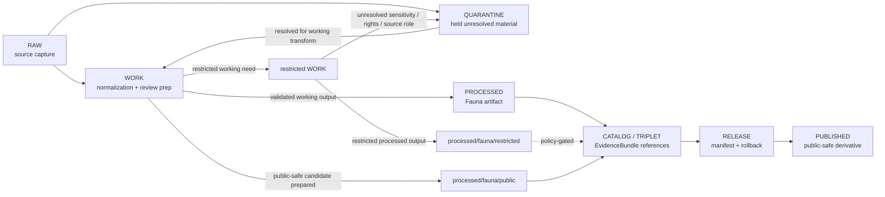

<!-- [KFM_META_BLOCK_V2]
doc_id: kfm://data/work/fauna/readme
title: Fauna WORK README
type: data-work-domain-index-readme
version: v0.1.0
status: draft
owners:
  - <fauna-domain-steward>
  - <fauna-data-steward>
  - <fauna-source-steward>
  - <sensitivity-reviewer>
  - <geoprivacy-steward>
  - <rights-holder-representative>
  - <pipeline-steward>
  - <release-steward>
created: 2026-06-29
updated: 2026-06-29
policy_label: restricted-review
truth_posture: cite-or-abstain
lifecycle_phase: work
responsibility_root: data/
domain: fauna
artifact_family: fauna-working-normalization-lane
sensitivity_posture: deny-by-default; no-public-path; source-role-preserving; geoprivacy-required; release-blocked
related:
  - restricted/README.md
  - ../README.md
  - ../../README.md
  - ../../raw/fauna/README.md
  - ../../raw/fauna/ebird/README.md
  - ../../raw/fauna/eddmaps/README.md
  - ../../raw/fauna/gbif/README.md
  - ../../raw/fauna/inaturalist/README.md
  - ../../raw/fauna/natureserve/README.md
  - ../../raw/fauna/usfws_ecos/README.md
  - ../../quarantine/fauna/README.md
  - ../../processed/fauna/README.md
  - ../../processed/fauna/restricted/README.md
  - ../../catalog/domain/fauna/public/README.md
  - ../../catalog/domain/fauna/restricted/README.md
  - ../../published/layers/fauna/README.md
  - ../../proofs/README.md
  - ../../receipts/README.md
  - ../../registry/sources/README.md
  - ../../../docs/domains/fauna/README.md
  - ../../../docs/domains/fauna/SENSITIVITY.md
  - ../../../docs/domains/fauna/POLICY.md
  - ../../../docs/domains/fauna/DATA_LIFECYCLE.md
  - ../../../docs/domains/fauna/CANONICAL_PATHS.md
  - ../../../docs/runbooks/fauna/SOURCE_REFRESH_RUNBOOK.md
  - ../../../release/manifests/README.md
tags:
  - kfm
  - data
  - work
  - fauna
  - biodiversity
  - occurrence
  - taxonomy
  - sensitive-geometry
  - sensitive-sites
  - telemetry
  - geoprivacy
  - redaction
  - source-role
  - deny-by-default
  - no-public-path
  - evidence-first
notes:
  - "This README replaces the greenfield stub at `data/work/fauna/README.md`."
  - "WORK is a governed intermediate lifecycle lane between RAW/QUARANTINE and PROCESSED; it is not proof, catalog, registry, policy, release, public API/UI output, public map/tile output, operational wildlife guidance, or generated-answer authority."
  - "The `restricted/` child README is confirmed and documents non-public restricted working material for geoprivacy, redaction, source-role reconciliation, sensitivity review preparation, and correction planning."
  - "Fauna WORK must preserve source role, rights, sensitivity tier/rank, taxon identity, geometry/support, geoprivacy state, review state, evidence linkage, and rollback context before any downstream move."
  - "README/path presence confirms documentation or path evidence only; it does not prove payloads, schemas, validators, receipts, access controls, CI enforcement, source descriptors, connector activation, or release readiness."
[/KFM_META_BLOCK_V2] -->

<a id="top"></a>

# Fauna WORK

Governed working lane for Fauna normalization, source-role reconciliation, taxonomy review, geoprivacy preparation, redaction/generalization work, validation preparation, and downstream-ready shaping before processed artifacts, catalog records, triplets, releases, or public-safe derivatives exist.

<p>
  
  
  
  
  
  
</p>

**Quick links:** [Scope](#scope) · [Repo fit](#repo-fit) · [Lifecycle boundary](#lifecycle-boundary) · [Confirmed child lanes](#confirmed-child-lanes) · [Accepted inputs](#accepted-inputs) · [Exclusions](#exclusions) · [Fauna working rules](#fauna-working-rules) · [Directory map](#directory-map) · [Exit gates](#exit-gates) · [Forbidden shortcuts](#forbidden-shortcuts) · [Required checks](#required-checks-before-use) · [Status notes](#status-notes)

> [!CAUTION]
> `data/work/fauna/` is a no-public-path working lane. It is not public, not processed truth, not catalog truth, not proof, not receipt authority, not source registry authority, not sensitivity policy authority, not release authority, not occurrence truth, not range truth, not sensitive-site truth, not exact public occurrence authority, not public map/API/UI output, and not an AI-answer source. Public clients, normal UI surfaces, map layers, PMTiles, reports, stories, graph/vector indexes, search indexes, and generated answers must not read this lane directly.

---

## Scope

`data/work/fauna/` holds in-progress Fauna material after RAW source admission or quarantine return, while stewards and pipelines prepare it for normalization, validation, taxonomy alignment, source-role reconciliation, geometry/support review, geoprivacy, redaction/generalization, aggregation, correction, catalog readiness, or processed-stage promotion.

WORK exists for **controlled transformation and review preparation**. It may contain intermediate tables, spatial/temporal joins, taxonomy crosswalk drafts, occurrence reconciliation outputs, range-alignment drafts, telemetry simplification drafts, source-quality notes, redaction/generalization trials, QA outputs, and run-local sidecars when those artifacts are not yet validated processed objects, catalog records, proofs, receipts, release decisions, published products, or public-safe claims.

Fauna is a deny-by-default sensitivity lane where exact sensitive occurrences, sensitive sites, restricted telemetry, steward-controlled records, private/landowner-linked records, observer/user-like fields, and risky joins require geoprivacy, redaction, aggregation, access review, and release controls before any public-safe representation.

---

## Repo fit

| Field | Value |
|---|---|
| Path | `data/work/fauna/` |
| Responsibility root | `data/` |
| Lifecycle phase | `work/` |
| Domain lane | `fauna` |
| Artifact role | Working normalization, taxonomy/source-role reconciliation, QA, geoprivacy, redaction preparation, and validation-preparation lane |
| Public access posture | No public path; no normal UI; no governed-public API exposure |
| Upstream | `data/raw/fauna/` after source admission, or `data/quarantine/fauna/` after governed hold resolution |
| Downstream | `data/quarantine/fauna/` for unresolved holds, `data/processed/fauna/` after work-stage gates close, or `data/processed/fauna/restricted/` for restricted processed artifacts |
| Restricted child lane | `restricted/` for restricted working material requiring fail-closed geoprivacy, access, sensitivity, or redaction controls |
| Release authority | `release/`, not this directory |
| Proof authority | `data/proofs/`, not this directory |
| Receipt authority | `data/receipts/`, not this directory |
| Registry authority | `data/registry/`, not this directory |
| Policy authority | `policy/`, not this directory |
| Default failure posture | `HOLD`, `QUARANTINE`, `DENY`, `RESTRICT`, or `ABSTAIN` when source role, rights, sensitivity, taxon identity, geometry/support, geoprivacy, redaction, evidence, review, correction, rollback, access basis, or release support is insufficient |

---

## Lifecycle boundary

```text
RAW -> WORK / QUARANTINE -> PROCESSED -> CATALOG / TRIPLET -> PUBLISHED
```



WORK may support later processing, restricted review, public-candidate derivative preparation, and evidence assembly, but it does not bypass quarantine, processed validation, proof construction, policy review, geoprivacy review, release, correction, or rollback requirements.

---

## Confirmed child lanes

The child lanes below are README paths confirmed by current-session GitHub fetches or edits. This table confirms README/path evidence only; it does **not** prove payloads, source descriptors, validators, fixtures, receipts, access controls, CI checks, review completion, or release readiness.

| Child lane | Status | Boundary summary |
|---|---|---|
| [`restricted/`](restricted/README.md) | **CONFIRMED README** | Restricted working material for geoprivacy, redaction, source-role reconciliation, sensitivity review preparation, access review preparation, and correction planning; no public path and no direct AI/map/API use. |

> [!NOTE]
> Add additional Fauna WORK child lanes only after confirming the workstream role, sensitivity posture, source-role burden, geoprivacy requirement, receipt expectations, reviewer roles, correction path, rollback target, and Directory Rules placement basis.

---

## Accepted inputs

Accepted material is limited to intermediate, non-public working artifacts such as:

- source-normalization drafts derived from admitted Fauna RAW captures;
- working tables, vectors, rasters, geometry drafts, occurrence joins, range drafts, telemetry simplification outputs, monitoring summaries, invasive-species reconciliation outputs, and QA artifacts;
- taxonomy reconciliation drafts, synonym/crosswalk review notes, source identifier joins, source-role review notes, and candidate identity decisions that are not final authority records;
- geoprivacy, redaction, generalization, aggregation, withholding, embargo, suppression, and delayed-publication preparation artifacts that still need receipts and review before downstream use;
- candidate occurrence, range, monitoring, invasive-species, sensitive-site, telemetry, or habitat-association working artifacts that remain clearly labeled as working/candidate class;
- source-role, rights, sensitivity, taxon identity, geometry/support, observation time, uncertainty, citation, attribution, review, and validation notes used to decide whether material returns to quarantine or proceeds to processed;
- run-local manifests, logs, checksums, and sidecars used to understand a working transform when they are not authoritative receipts, proofs, registries, schemas, or release records;
- README or index sidecars that explain local work state without becoming public, proof, catalog, registry, policy, access authority, release authority, or generated-answer authority.

> [!IMPORTANT]
> Working artifacts must keep source role visible. Observed, regulatory, authority, aggregate, administrative, candidate, modeled, context, synthetic, generated, telemetry, and steward-controlled material must not be flattened into the same authority class for convenience.

---

## Exclusions

| Do not place here | Correct authority home |
|---|---|
| Immutable Fauna source capture, source-native files, source media, source logs, and source exports | `data/raw/fauna/` |
| Source-role-unclear, rights-unclear, sensitivity-unclear, malformed, disputed, unsafe, or not-yet-reviewed material | `data/quarantine/fauna/` |
| Restricted work requiring fail-closed handling | `data/work/fauna/restricted/` |
| Validated normalized Fauna outputs | `data/processed/fauna/` |
| Validated restricted processed Fauna outputs | `data/processed/fauna/restricted/` |
| Public-candidate generalized or aggregated processed artifacts | `data/processed/fauna/public/` until release |
| Published public-safe layers, PMTiles, reports, stories, API payloads, downloads, or public artifacts | `data/published/` only after release gates close |
| Catalog records, STAC/DCAT/PROV records, triplets, graph records, or EvidenceBundle state | `data/catalog/`, `data/triplets/`, or proof lanes |
| EvidenceBundle, ProofPack, validation report, or claim-proof authority | `data/proofs/` |
| Final `RunReceipt`, `TransformReceipt`, `ValidationReceipt`, `RedactionReceipt`, `AggregationReceipt`, `ReviewRecord`, `PolicyDecision`, access receipt, correction receipt, or release receipt records | `data/receipts/` or accepted review/receipt lanes |
| SourceDescriptor, source activation, source registry, rights registry, sensitivity registry, or access registry records | `data/registry/` or accepted registry lanes |
| Release manifests, correction notices, withdrawal notices, signatures, rollback cards, release decisions, or release candidates | `release/` |
| Schemas, contracts, validators, tests, packages, pipelines, app/UI/API code, or policy rules | `schemas/`, `contracts/`, `tools/`, `tests/`, `pipelines/`, `apps/`, `policy/` |
| Public API/UI/tile payloads, direct downloads, Focus Mode answers, public map layers, enforcement aids, landowner/parcel targeting aids, hunting/fishing/legal advice, operational wildlife guidance, emergency alerts, or life-safety guidance | Governed public/release/authority surfaces only; otherwise abstain or deny |
| Secrets, credentials, access tokens, private agreement terms, exact transform seeds, fuzzing offsets, or redaction parameters that could aid exposure | Do not store in this README or ordinary working Markdown |

---

## Fauna working rules

| Rule | Handling |
|---|---|
| Keep WORK non-public | Nothing here is a public surface, public-candidate artifact, or normal UI/API source. |
| Preserve source role | Observed, regulatory, authority, aggregate, administrative, candidate, modeled, context, synthetic, generated, telemetry, and steward-controlled records stay distinct. |
| Preserve sensitivity posture | Sensitive taxon, sensitive occurrence, sensitive site, telemetry, steward-controlled, private, and restricted-use flags travel with every working artifact. |
| Preserve taxonomy uncertainty | Taxon identity, synonym/crosswalk posture, source taxonomy, accepted taxonomy, and review state remain explicit. |
| Preserve geometry uncertainty | Coordinate uncertainty, spatial support, generalization level, grid/cell support, and withheld geometry posture must not collapse. |
| Keep risky joins visible | Joins with habitat, land, infrastructure, ownership, time, observer/user-like fields, rare taxa, or small cells are risk-amplifying until reviewed. |
| Do not launder quarantine | Material cannot leave quarantine through WORK unless the hold reason is explicitly resolved and recorded. |
| Do not launder into public | WORK cannot become public-candidate or published material without governed redaction/generalization/aggregation, review, policy, receipts, release, correction, and rollback support. |
| Separate review from transformation | A geoprivacy draft or redaction trial does not equal reviewer approval, policy decision, receipt closure, release approval, or public permission. |
| Preserve rollback context | Working outputs intended for downstream use should keep enough run and source context to support correction, withdrawal, and rollback later. |

---

## Directory map

```text
data/work/fauna/
├── README.md
├── restricted/
│   └── README.md
├── <future-workstream-or-source-family>/
│   └── <run_id_or_batch_id>/
│       ├── work_manifest.json
│       ├── input_refs.json
│       ├── transform_notes.md
│       ├── qa_notes.md
│       ├── checksums.sha256
│       └── README.md
└── index.local.json
```

`index.local.json` is optional and must remain WORK-local. It is not a public index, catalog record, release manifest, source registry, review record, graph edge source, layer/story/report pointer, search index, vector index, map source, occurrence-truth index, sensitive-site authority, rights authority, geoprivacy authority, access registry, or retrieval source for generated answers.

> [!NOTE]
> The directory map confirms the parent README and `restricted/README.md` path only. Future workstream folders are proposed patterns and do not prove payloads, schemas, validators, fixtures, workflows, receipts, access controls, or CI checks exist.

---

## Exit gates

| Exit route | Minimum requirement |
|---|---|
| Stay WORK | Normalization, QA, taxonomy, source-role reconciliation, geoprivacy, redaction preparation, validation preparation, or correction planning remains incomplete. |
| Move to restricted WORK | Material needs restricted handling for exact geometry, sensitive taxa, telemetry, sensitive sites, steward control, rights limits, private fields, re-identifying joins, or access-review preparation. |
| Quarantine | Source role, rights, sensitivity, taxon identity, geometry/support, observer/user-like fields, private parcel/landowner risk, telemetry risk, citation, digest, policy, review, correction, or rollback state is unresolved enough that work should stop. |
| Reject / return | Steward review says the material is misfiled, unsupported, not retainable, or outside the Fauna work lane. |
| Promote to PROCESSED | Working artifact has sufficient lineage, sensitivity posture, source-role preservation, validation support, rights posture, review state where required, correction path, rollback context, and downstream-ready metadata. |
| Prepare public-candidate derivative | Only a transformed derivative, not restricted source material, may move toward a public-candidate processed lane after redaction/generalization/aggregation, review, policy, receipt, correction, and rollback requirements are satisfied. |
| Support catalog/release later | Only after later PROCESSED, CATALOG/TRIPLET, proof, receipt, review, policy, release, correction, and rollback gates close. |

A more public tier requires the required redaction/generalization/aggregation receipt, evidence support, review record, policy decision, release manifest, correction path, and rollback target. A more restrictive correction can happen immediately when risk is discovered.

---

## Forbidden shortcuts

```text
data/work/fauna/
→ data/catalog/
→ data/published/
→ public API / MapLibre / PMTiles / report / story / graph / vector index / generated answer
```

is forbidden unless the appropriate governed lifecycle transitions have actually happened and left inspectable evidence.

```text
data/work/fauna/
→ data/processed/fauna/public/
```

is also forbidden for restricted source artifacts, sensitive exact geometry, telemetry, sensitive sites, and unresolved rights/sensitivity/source-role material. Only reviewed, transformed, public-candidate derivatives may move toward public-candidate processed lanes, and only after required receipts, review state, policy posture, correction path, and rollback target exist.

---

## Required checks before use

- [ ] Confirm the material belongs to the Fauna domain lane.
- [ ] Confirm the material belongs in WORK rather than RAW, QUARANTINE, PROCESSED, CATALOG, PROOF, RECEIPT, REGISTRY, RELEASE, PUBLISHED, SCHEMA, POLICY, CODE, or TEST roots.
- [ ] Confirm whether the material belongs in `restricted/` because of sensitivity, rights, geoprivacy, exact geometry, telemetry, steward control, or re-identification risk.
- [ ] Confirm source reference, source family, source role, citation, rights posture, retrieval/admission context, version/vintage, and digest where material.
- [ ] Confirm taxon identity, observation time, geometry/support, coordinate uncertainty, source quality, source caveats, and source-role support.
- [ ] Confirm observed, regulatory, authority, aggregate, administrative, candidate, modeled, context, synthetic, generated, telemetry, and steward-controlled records are not collapsed into one authority class.
- [ ] Confirm whether the material contains sensitive taxa, exact occurrence geometry, nests, dens, roosts, hibernacula, spawning sites, breeding sites, aggregation sites, telemetry, steward-controlled records, restricted-use records, observer/user-like fields, landowner/private-parcel risk, or re-identifying joins.
- [ ] Confirm sensitivity class, geoprivacy posture, redaction/generalization/aggregation requirement, access basis, and review state.
- [ ] Confirm no quarantined material is being laundered through WORK without an exit decision.
- [ ] Confirm prompt-like text inside source payloads or notes is treated as data, not instructions.
- [ ] Confirm no exact transform offsets, fuzzing seeds, redaction bypass details, access credentials, secrets, private agreement terms, or exposure-enabling details are written into this README.
- [ ] Confirm required downstream receipts are present or explicitly marked missing before anything leaves WORK.
- [ ] Confirm no public layer, PMTiles, report, story, API payload, graph edge, search index, vector index, or generated answer uses WORK material directly.
- [ ] Confirm correction path and rollback target are known before downstream promotion.

---

## Status notes

| Claim | Status |
|---|---|
| This README replaces the greenfield stub at `data/work/fauna/README.md`. | **CONFIRMED authored** |
| The target path existed in the live repository as a greenfield stub before this edit. | **CONFIRMED by GitHub contents API during this edit** |
| `restricted/README.md` exists as a Fauna restricted WORK child-lane README. | **CONFIRMED by GitHub contents API during this edit** |
| `data/raw/fauna/README.md` documents upstream Fauna RAW source capture, no-public-path posture, source-family lanes, and sensitive-geometry fail-closed posture. | **CONFIRMED by GitHub contents API during this edit** |
| `data/quarantine/fauna/README.md` documents Fauna quarantine as a deny-by-default no-public-path hold lane for unresolved source-role, rights, sensitivity, geoprivacy, redaction, taxonomy, evidence, and policy questions. | **CONFIRMED by GitHub contents API during this edit** |
| `data/processed/fauna/README.md` documents the downstream Fauna processed lane and public-use restrictions. | **CONFIRMED by GitHub contents API during this edit** |
| Actual WORK payloads exist under child lanes in `data/work/fauna/`. | **UNKNOWN** |
| Fauna WORK schemas, validators, fixtures, CI checks, receipts, access controls, review workflow, and release linkage are fully implemented. | **NEEDS VERIFICATION** |
| This README is proof, release, catalog, registry, policy, occurrence truth, sensitive-site truth, range truth, telemetry truth, public artifact authority, or AI authority. | **DENY** |

---

## Related files

- [`restricted/README.md`](restricted/README.md)
- [`../README.md`](../README.md)
- [`../../README.md`](../../README.md)
- [`../../raw/fauna/README.md`](../../raw/fauna/README.md)
- [`../../raw/fauna/ebird/README.md`](../../raw/fauna/ebird/README.md)
- [`../../raw/fauna/eddmaps/README.md`](../../raw/fauna/eddmaps/README.md)
- [`../../raw/fauna/gbif/README.md`](../../raw/fauna/gbif/README.md)
- [`../../raw/fauna/inaturalist/README.md`](../../raw/fauna/inaturalist/README.md)
- [`../../raw/fauna/natureserve/README.md`](../../raw/fauna/natureserve/README.md)
- [`../../raw/fauna/usfws_ecos/README.md`](../../raw/fauna/usfws_ecos/README.md)
- [`../../quarantine/fauna/README.md`](../../quarantine/fauna/README.md)
- [`../../processed/fauna/README.md`](../../processed/fauna/README.md)
- [`../../processed/fauna/restricted/README.md`](../../processed/fauna/restricted/README.md)
- [`../../catalog/domain/fauna/public/README.md`](../../catalog/domain/fauna/public/README.md)
- [`../../catalog/domain/fauna/restricted/README.md`](../../catalog/domain/fauna/restricted/README.md)
- [`../../published/layers/fauna/README.md`](../../published/layers/fauna/README.md)
- [`../../proofs/README.md`](../../proofs/README.md)
- [`../../receipts/README.md`](../../receipts/README.md)
- [`../../registry/sources/README.md`](../../registry/sources/README.md)
- [`../../../docs/domains/fauna/README.md`](../../../docs/domains/fauna/README.md)
- [`../../../docs/domains/fauna/SENSITIVITY.md`](../../../docs/domains/fauna/SENSITIVITY.md)
- [`../../../docs/domains/fauna/POLICY.md`](../../../docs/domains/fauna/POLICY.md)
- [`../../../docs/domains/fauna/DATA_LIFECYCLE.md`](../../../docs/domains/fauna/DATA_LIFECYCLE.md)
- [`../../../docs/domains/fauna/CANONICAL_PATHS.md`](../../../docs/domains/fauna/CANONICAL_PATHS.md)
- [`../../../release/manifests/README.md`](../../../release/manifests/README.md)

---

## Maintenance checklist

- [ ] Replace placeholder owners with confirmed steward roles.
- [ ] Confirm whether additional Fauna WORK child lanes exist and add them to the directory map only after verification.
- [ ] Confirm Fauna WORK schemas, validators, and fixture expectations.
- [ ] Confirm required receipt family names and storage homes for WORK-to-PROCESSED promotion.
- [ ] Confirm source-role review, geoprivacy, redaction/generalization, aggregation, taxonomy review, sensitivity review, access review, and validation linkage.
- [ ] Confirm `restricted/README.md` remains synchronized with this parent lane.
- [ ] Confirm all relative links after adjacent docs stabilize.
- [ ] Confirm rollback target for this README expansion in the commit or release notes.

[Back to top](#top)
